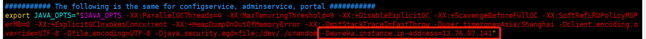

# Apollo 介绍与docker部署

#### 参考文档：

·    [Apollo 配置中心介绍 (Github)](https://github.com/ctripcorp/apollo)

·    [Apollo 分布式部署指南 (Github)](https://github.com/ctripcorp/apollo/wiki/分布式部署指南)

·    [Apollo配置中心Java客户端使用指南](https://github.com/ctripcorp/apollo/wiki/Java客户端使用指南#五本地开发模式)

·    [Apollo配置中心架构深度剖析](https://juejin.im/entry/5b19e718e51d45067a72941a)

### Apollo配置中心介绍

Apollo（阿波罗）是携程框架部门研发的分布式配置中心，能够集中化管理应用不同环境、不同集群的配置，配置修改后能够实时推送到应用端，并且具备规范的权限、流程治理等特性，**适用于微服务配置管理场景**。

### 为什么要引入配置中心(UCC)? 

随着业务的发展、微服务架构的升级，服务的数量、程序的配置日益增多（各种微服务、各种服务器地址、各种参数），传统的配置文件方式和数据库的方式已无法满足开发人员对配置管理的要求：

·    安全性：配置跟随源代码保存在代码库中，容易造成配置泄漏

·    时效性：修改配置，需要重启服务才能生效

·    局限性：无法支持动态调整：例如日志开关、功能开关

随着项目的功能越来越复杂，各种各样的配置也越来越多，渐渐的开始面临以下问题:

·    各种配置到处都是，没有集中管理

·    配置的存放方式也多种多样，如程序内部hard-code、配置文件中、数据库中等等

·    同一种配置，各处不统一

·    配置修改后不能实时生效

·    配置的修改没有完善的审核机制，想改就改等，出问题很难追溯

### Apollo配置维度

Apollo支持以下4个维度的配置管理

##### Application (应用)

应用就是我们的项目，Apollo 客户端在运行时需要知道应用的标识，从而可以根据这个标识去配置中心获取对应的配置。

应用的标识用 AppId 来指定，指定 AppId 的方式有多种，Spring Boot 项目中一般直接配置在 `*application.properties*` 中

##### Environment (环境)

环境就是常见的开发、测试、生产等，不同的环境对应的配置内容不一样。Apollo 客户端在运行时除了需要知道项目当前的身份标识，还需要知道当前项目对应的环境，从而可以根据环境去配置中心获取对应的配置。
 目前支持的环境有DEV（开发环境）、FAT（测试环境，未部署）、UAT（集成环境，未部署）、PRO（生产环境，未部署）。

#### Cluster (集群)（目前未使用）

在多机房的环境下，针对不同的机房，我们可以划分出不同的集群。不同集群可以拥有不同的配置 (如es服务器地址)

Apollo支持多种集群配置方式，我们一般在Spring Boot的 `*application.properties* `或 `*bootstrap.properties* `中指定 `apollo.cluster=SomeCluster`

#### Namespace (命名空间)

命名空间可以用来对配置做分类，不同类型的配置存放在不同的命名空间中，如数据库配置文件、消息队列配置、业务相关的配置等。

Apollo在创建项目的时候，都会默认创建一个“application”的Namespace。顾名思义，“application”是给应用自身使用的。Spring Boot项目都有一个默认配置文件application.yml。在这里application.yml就等同于“application”的Namespace。

**Namespace****类型有三种：**

·    私有类型 （private）

·    公共类型（public）

·    关联类型（inherited）

私有类型的Namespace具有private权限。例如上文提到的“application” Namespace就是私有类型。

公共类型的Namespace具有public权限。公共类型的Namespace相当于游离于应用之外的配置，且通过Namespace的名称去标识公共Namespace，所以公共的Namespace的名称必须全局唯一。 (多个项目之间共享的配置, 中间件客户端的配置)

关联类型又可称为继承类型，关联类型具有private权限。关联类型的Namespace继承于公共类型的Namespace，用于覆盖公共Namespace的某些配置。 

### 在微服务中使用Apollo

#### **添加Maven Dependency**

```
 <dependency>
    <groupId>com.ctrip.framework.apollo</groupId>
    <artifactId>apollo-client</artifactId>
    <version>1.5.1</version>
</dependency>
```

#### 添加@EnableApolloConfig 注解

```
//这个是最简单的配置形式，一般应用用这种形式就可以了，用来指示Apollo注入application namespace的配置到Spring环境中
@Configuration
@EnableApolloConfig
public class AppConfig {
  @Bean
  public TestJavaConfigBean javaConfigBean() {
    return new TestJavaConfigBean();
  }
}
```

#### **配置application.yml** 或application.properties **添加** AppId，Namespace和Apollo Meta Server配置 

```
app.id = boat-house
# Apollo Meta Server
apollo.meta = http://13.76.97.141:8080/ 
# 开启 bootstrap
apollo.bootstrap.enabled = true
# 在bootstrap阶段注入application，global-common名称空间
apollo.bootstrap.namespaces = application,global
# 在日志系统初始化之前将apollo初始化
apollo.bootstrap.eagerLoad.enabled=true
```

·    详细使用教程请参考链接：[Apollo使用指南](https://github.com/ctripcorp/apollo/wiki/Apollo使用指南)

### 安装步骤：

#### 1、 安装说明：

jenkins-server作为Apollo portal机器，docker-server作为Apollo configservice 和adminiservice机器。

#### 2、 环境要求：jdk1.8

在两台server机器上执行以下命令：

​	sudo apt-get install -y openjdk-8-jdk

#### 3、 安装MySQL的docker镜像

在两台server机器上执行以下命令：

注：默认两台机器已安装docker和docker-compose

​	sudo docker pull mysql:5.7

​	sudo docker run -p 6033:3306 --name mysql -e MYSQL_ROOT_PASSWORD=toor -d mysql:5.7 && sudo 	docker logs mysql

使用MySQL客户端创建Apollo连接账户和密码：

​	CREATE USER 'apollo' IDENTIFIED BY 'mima123';

​	GRANT SELECT,INSERT,UPDATE,DELETE ON *.* TO 'apollo'; 

​	GRANT ALL PRIVILEGES ON *.* TO 'apollo'; 

​	flush privileges;

jenkins-server导入Apollo portal库

​          https://github.com/ctripcorp/apollo/blob/master/scripts/sql/apolloportaldb.sql

docker -server导入Apollo config库

​          https://github.com/ctripcorp/apollo/blob/master/scripts/sql/apolloconfigdb.sql

#### 4、 资源准备：

Jenkins server:

​	sudo mkdir /opt/apollo /

​	sudo mkdir /opt/apollo/portal

​	cd /opt/apollo/portal

​	sudo wget https://github.com/ctripcorp/apollo/releases/download/v1.5.1/apollo-portal-1.5.1-github.zip

​	sudo vi dockerfile

​	内容请参考如下链接：

​	https://github.com/ctripcorp/apollo/blob/master/apollo-portal/src/main/docker/Dockerfile

docker server:

​	sudo mkdir /opt/apollo /configservice

​	cd /opt/apollo/configservice

​	sudo wget https://github.com/ctripcorp/apollo/releases/download/v1.5.1/apollo-configservice-1.5.1-github.zip

​	sudo vi dockerfile

​	内容请参考如下链接：

​	https://github.com/ctripcorp/apollo/blob/master/apollo-configservice/src/main/docker/Dockerfile

​	sudo mkdir /opt/apollo /adminservice

​	cd /opt/apollo/adminservice

​	sudo wget https://github.com/ctripcorp/apollo/releases/download/v1.5.0/apollo-adminservice-1.5.0-github.zip

​	sudo vi dockerfile

​	内容请参考如下链接：

​	https://github.com/ctripcorp/apollo/blob/master/apollo-configservice/src/main/docker/Dockerfile

#### 5、 修改configservice和adminservice的start.sh, 配置公网IP

Configservice:

​	unzip apollo- configservice -1.5.1-github.zip -d tmp/

​	vi tmp/scripts/startup.sh

​	-Deureka.instance.ip-address=13.76.97.141



​	zip -u apollo- configservice -1.5.1-github.zip tmp/scripts/startup.sh

Adminservice:

​	unzip apollo-adminservice-1.5.1-github.zip -d tmp/

​	vi tmp/scripts/startup.sh

​	-Deureka.instance.ip-address=13.76.97.141


​	zip -u apollo- adminservice -1.5.1-github.zip tmp/scripts/startup.sh

#### 6、 安装启动

docker server:

​	cd /opt/apollo/configservice

​	docker build -t apollo-configservice ./

​	docker run -p 8080:8080 -e DS_URL="jdbc:mysql://13.76.97.141:6033/ApolloConfigDB?characterEncoding=utf8" -e DS_USERNAME=apollo -e DS_PASSWORD=mima123 -d -v /tmp/logs:/opt/logs --name apollo-configservice apollo-configservice

​	cd /opt/apollo/adminservice

​	docker build -t apollo-adminservice ./

​	docker run -p 8090:8090 -e DS_URL="jdbc:mysql://13.76.97.141:6033/ApolloConfigDB?characterEncoding=utf8" -e DS_USERNAME=apollo -e DS_PASSWORD=mima123 -d -v /tmp/logs:/opt/logs --name apollo-adminservice apollo-adminservice

Jenkins server:

​	cd /opt/apollo/ portal

​	docker build -t apollo-portal ./

​	docker run -p 8070:8070 -e DS_URL="jdbc:mysql://52.187.110.104:6033/ApolloPortalDB?characterEncoding=utf8" -e DS_USERNAME=apollo -e DS_PASSWORD=mima123 -e DEV_META=http://13.76.97.141:8080 -d -v /tmp/logs:/opt/logs --name apollo-portal apollo-portal

#### 7、 访问Apollo portal页面

网页：http://52.187.110.104:8070/ 默认账户&密码：apollo & admin


 