**Boat-house**

**JMeter测试用例编写手册**

JMeter作为现在流行的接口测试工具，有着天然的优势，不仅操作简单、录制方便，而且有非常强的扩展性，可以测试多种类型的协议，方便第三方集成。

本次测试是基于船屋故事进行的系列测试。

1. 1、关于接口分析

船屋故事采用微服务框架实现的CRUD，并将特定的页面配置到主页的&quot;船屋故事&quot;页面中。

通过Swagger可以看到，CRUD的操作如下：

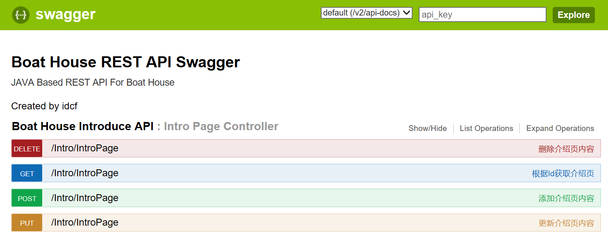
 
通过此组件可以进行相关接口的操作。

1. 2、关于采集组件

与JMeter配合较为密切的采集分析组件有2个：

1. 1)BadBody。是一款接口获取软件，通过操作可以知道被操作页面的所有操作。BadBody记录下的jmx脚本，能比较好的应用于JMeter中。
2. 2)JMeter本身的代理。可以通过代理，获取相关操作的接口。

此处我选择JMeter本身的代理进行action的采集。

1. 3、Action采集

3.1 启动JMeter，创建HTTP代理服务器，进行基本的配置，此处我修改了名称为【Action采集代理】。

3.2 配置代理端口，默认为8888

3.2 配置【Test Plan Creation】下的目标控制器。我配置了【Action采集代理】本身作为目标。表示：在采集到数据后，所有的采集信息都被放置到该目标下。

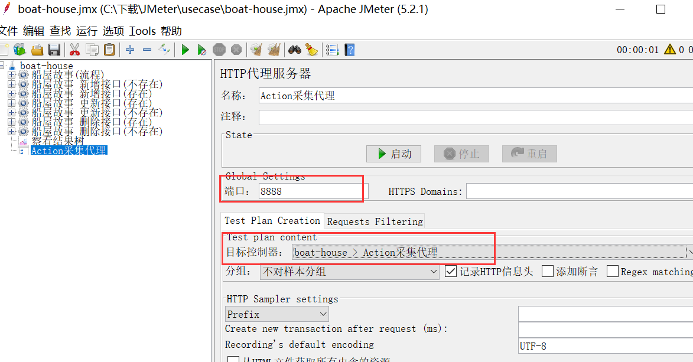

当然，为了减少采集的准确性，减少不需要的内容，可以配置过滤：

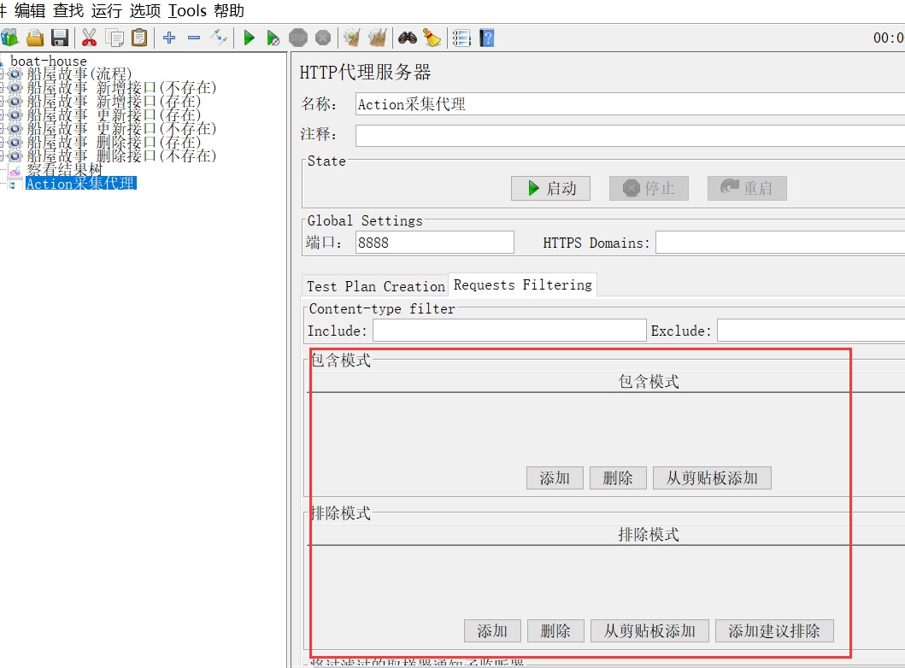

在完成后，点击启动按钮。

3.3 配置浏览器的代理。

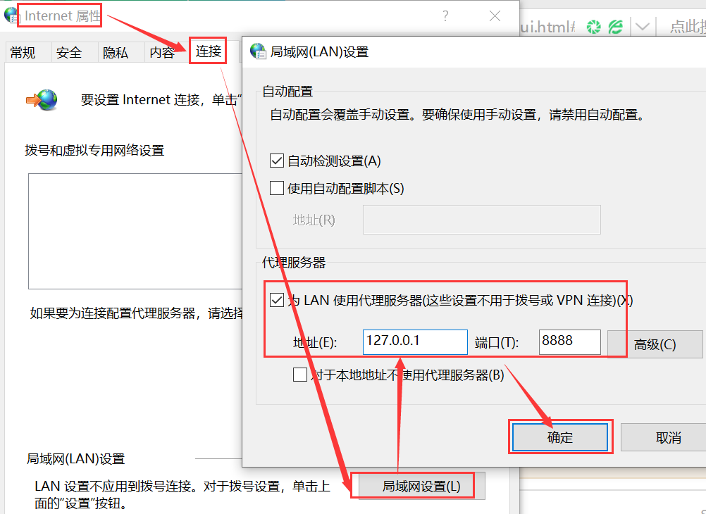

3.4 调用需要测试的接口

 
3.5 查看采集的结果

点击展开左侧导航的额【Action采集代理】，你可以看到很多HTTP的内容，你很容易找到需要的被测内容。

 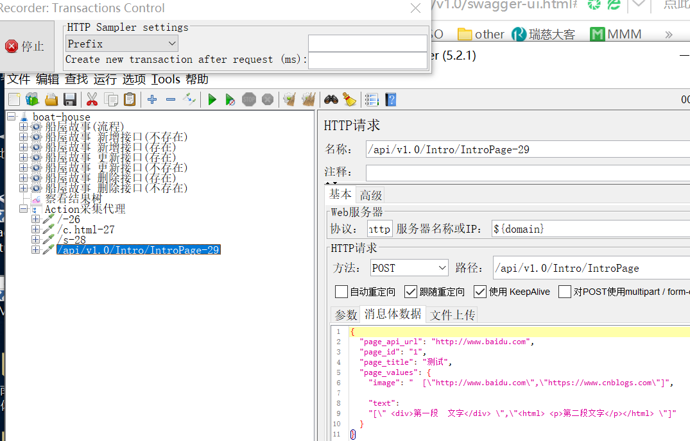
 
3.6 关于Web服务器的配置

 为什么配置是${domain}及${port}，这是由于配置了全局变量，JMeter自动识别到了该参数。详见下一节【设置全局变量】。

3.7 在所有的配置都做好后，你需要把该采集代理禁用，避免在测试执行时进行这个操作，影响执行效率。

1. 4、 **确定测试计划**

如下是我定义的测试用例：

| 序号 | 接口 | 说明 |
| --- | --- | --- |
| 1 | 总流程接口 | 对船屋故事的CRUD进行一次性的正常操作，保证其每一个都能得到正常运行。预期结果：正常。
 
 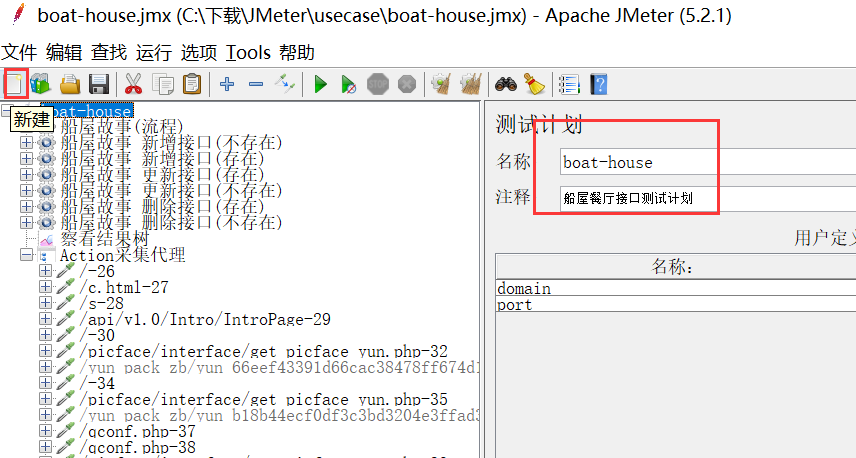

 |
| 2 | 新增不存在的接口 | 根据ID找到接口，如果存在，删除，然后再新增该ID的接口。预期结果：成果。 |
| 3 | 新增存在的接口 | 根据ID找到接口，如果不存在，先新增该ID的接口，然后再新增该ID的接口。预期结果：失败。 |
| 4 | 更新存在的接口 | 根据ID找到接口，如果存在，然后再更新该ID的接口。预期结果：成果。 |
| 5 | 更新不存在的接口 | 根据ID找到接口，如果不存在，先删除该ID的接口，然后再修改该ID的接口。预期结果：失败。 |
| 6 | 删除存在的接口 | 根据ID找到接口，如果存在，然后再删除该ID的接口。预期结果：成果。 |
| 7 | 删除不存在的接口 | 根据ID找到接口，如果存在，先删除该ID的接口，然后再删除该ID的接口。预期结果：失败。 |

1. 5、配置脚本

5.1 新增测试计划

 点击新建，创建一个新的测试计划，进行基本的配置和修改

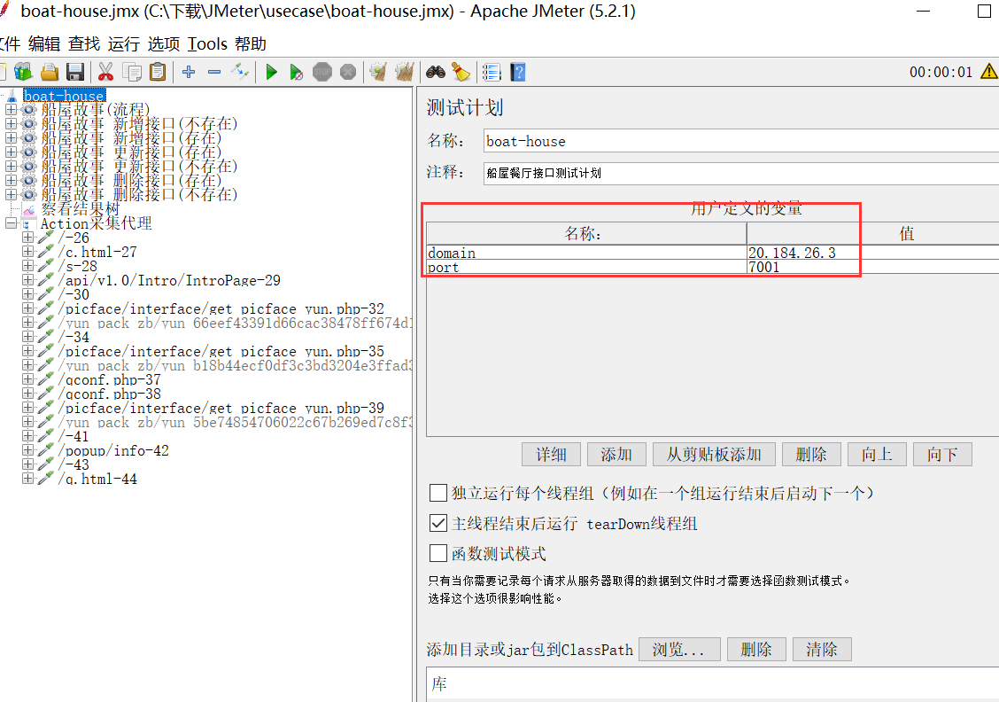

5.2 设置全局变量

你可以定义一些自己需要的全局变量，以便在后续使用的时候进行统一配置和管理。

如：此处我配置了【domain】、【port】2个全局变量，在后续进行配置的时候，只需要使用【${domain}】及【${port}】即可使用。如果该用例用于不同的环境中，只需要对该全局配置进行修改即可，不需要在配置的每一处都需要进行一次配置修改。

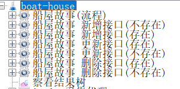
 
1. 6、 **根据计划创建线程组**

在boat-house根目录下创建设计的用例的线程组。

每个线程组代表一个用例，每个用例可以单独运行。

创建如下：

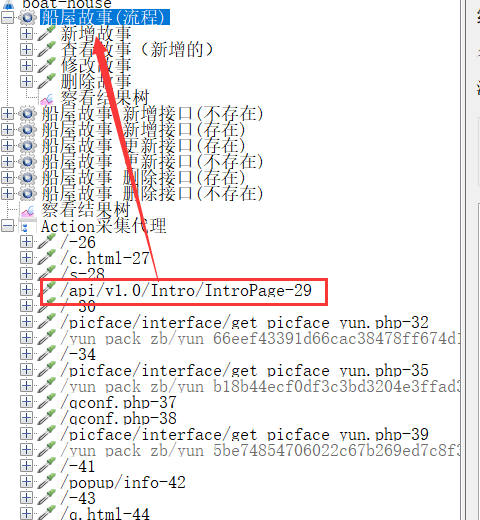

1. 7、 **配置HTTP请求及逻辑元件**

由于船屋故事比较简单，没有用到复杂的逻辑，故基本是由HTTP请求组装而成。

首先，找到采集的相对应的接口，拷贝到对应的线程组下，然后重命名。HTTP请求取样器下，可以配置对应的消息头配置、传递的文本格式等。

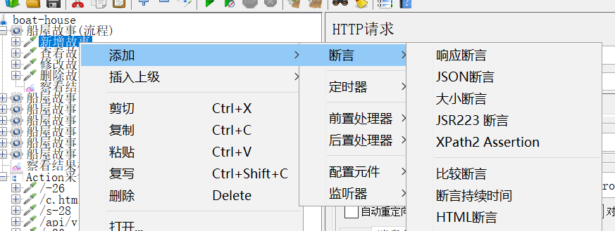

如果对应的接口有返回值，我们需要对其校验，则可以通过正则表达式、断言等进行。此处不详解释。

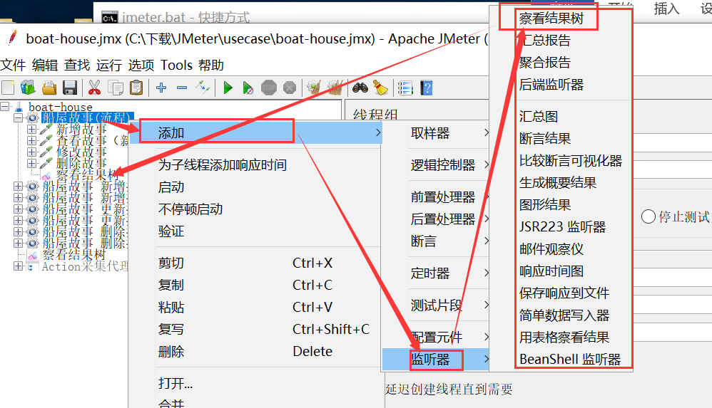
 
1. 8、 **添加测试报告组件**

在对应的线程组下，可以创建需要的测试报告。在执行后，查看报告则可以看到测试的结果。

1. 9、 **执行测试**

在配置完成后，可以对用例、甚至整个计划进行测试。

工具栏的表示对整个用例进行测试，对于线程组邮件调用出来的启动按钮，则是对用例进行的测试。

1. 10、 **查看报告**

执行完成后，可以查看相应的报告及响应。

1. 11、 **保存的执行计划**

记得在录制配置脚本时，要实时进行保存，避免没有保存带来的损失。

录制的脚本后缀为jmx，你可以拷贝到任何地方，进行重新执行。流水线部分也是需要调用它才能进行相关的测试。

 
