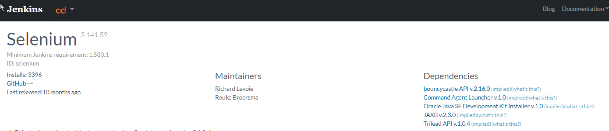
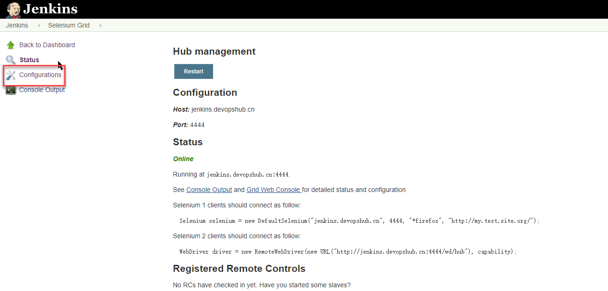

# Jenkins调度Selenium 

## 安装插件

插件要求安装java 8

[插件地址](https://plugins.jenkins.io/selenium/)

这个插件将您的Jenkins集群转换成一个Selenium3网格集群，这样您就可以利用您的异构Jenkins集群来执行Selenium测试。它现在有配置来真正指定每个节点的功能，这样当一个节点以不兼容的功能启动时，它不会使您的测试失败。

按需配置端口节点数，浏览器驱动版本驱动位置

## 连接浏览器节点

参考：[Selenium自动化UI测试](Selenium自动化UI测试.md)
