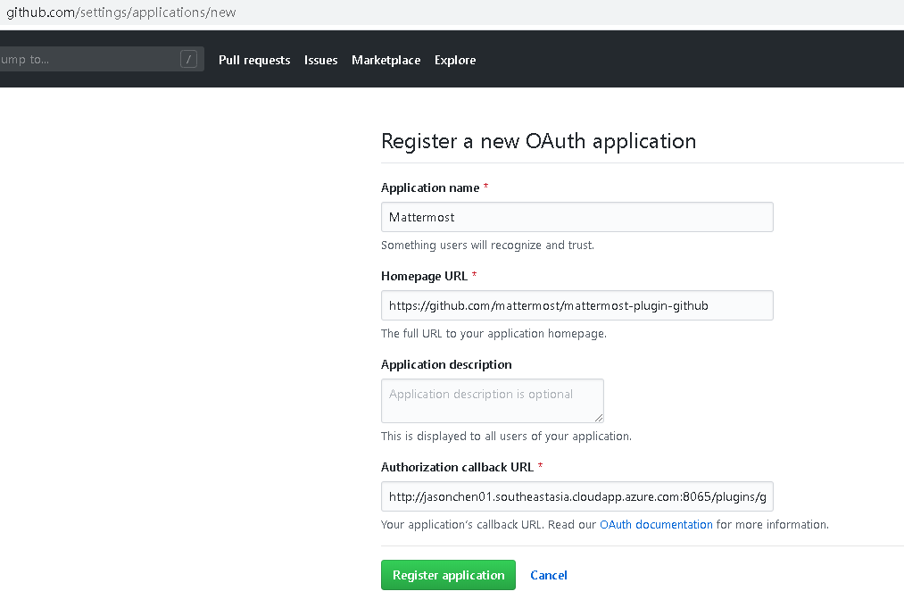
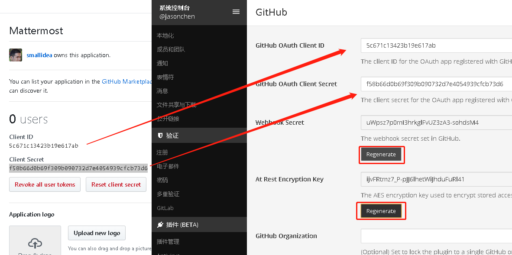
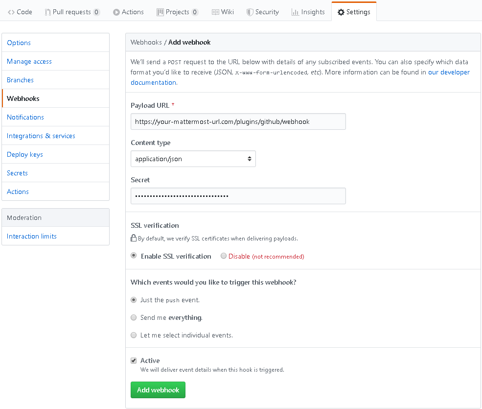
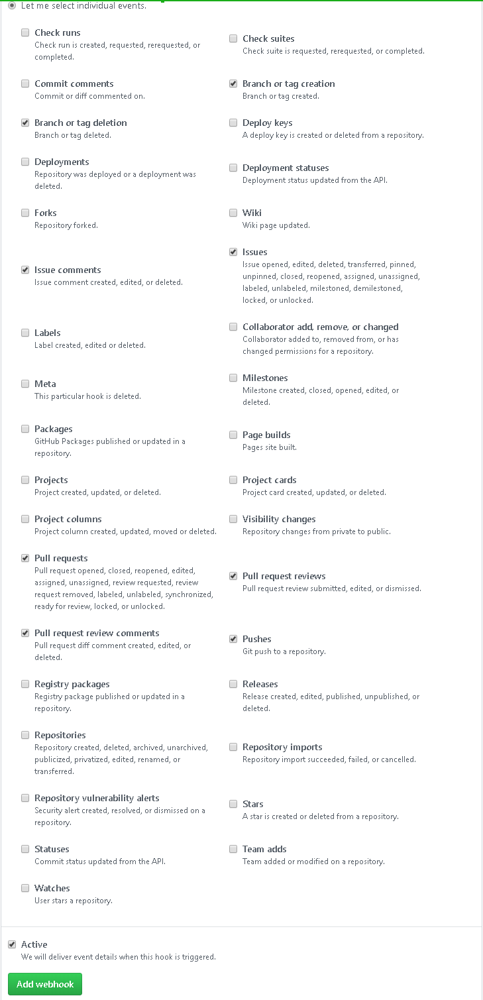
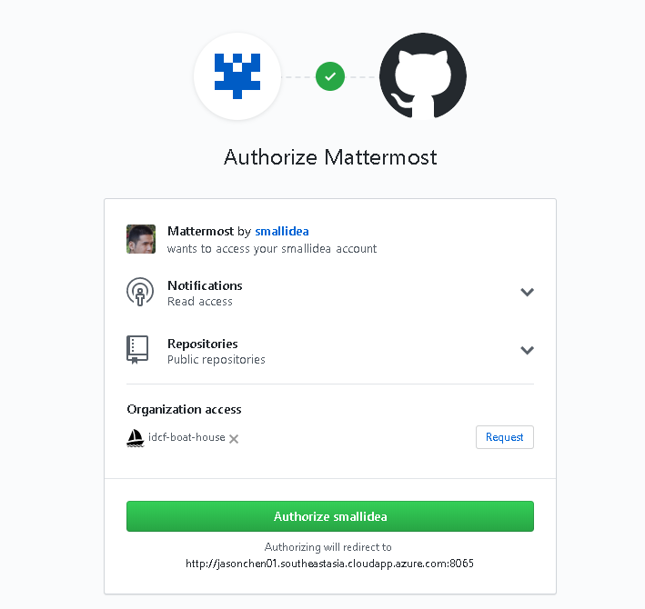

1. 访问 https://github.com/settings/applications/new，

    填写 
    Application name: mattermost

    Homepage URL: https://github.com/mattermost/mattermost-plugin-github

    Authorization callback URL：https://your-mattermost-url.com/plugins/github/oauth/complete
    

2. 复制对应的数据到对应的框中，“Save”
    
3. 进入你的rep，“settings” >> 点击"Add webhook" >> 填写 

     

    选择 Let me select individual events

    勾选

    Issues, Issue comments, Pull requests, Pull request reviews, Pull request review comments, Pushes, Branch or Tag creation, Branch or Tag deletion
     

4. 输入 /github connect，输入github账号和密码
     
    输入github 注册邮箱收到的Verification code
     
    

    点击 “Authorize ******”
    
    /github me 显示当前账号的信息
    /git todo 待完成工作列表
     

参考：https://github.com/mattermost/mattermost-plugin-github

