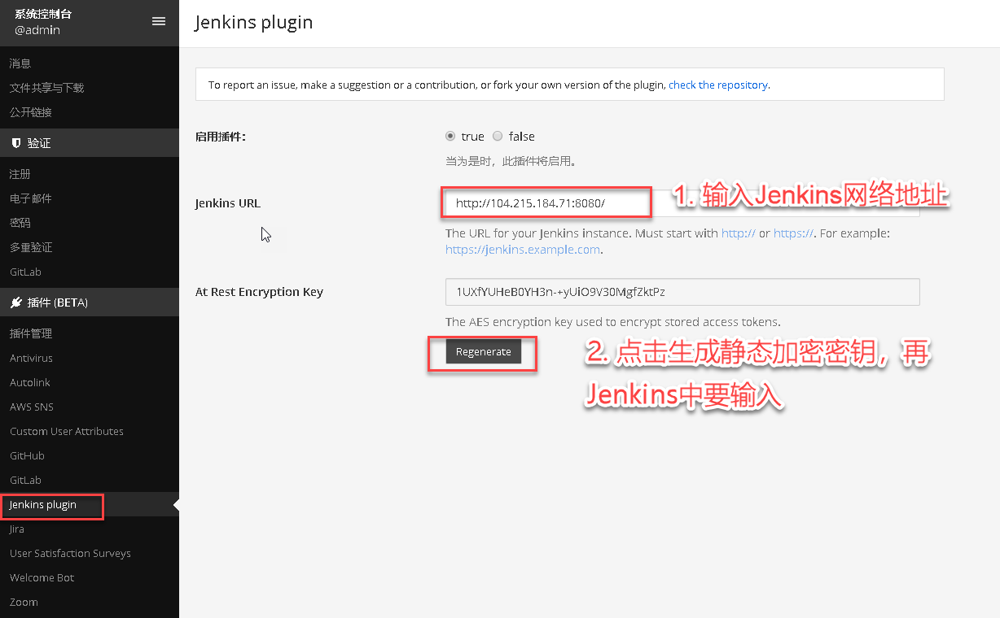
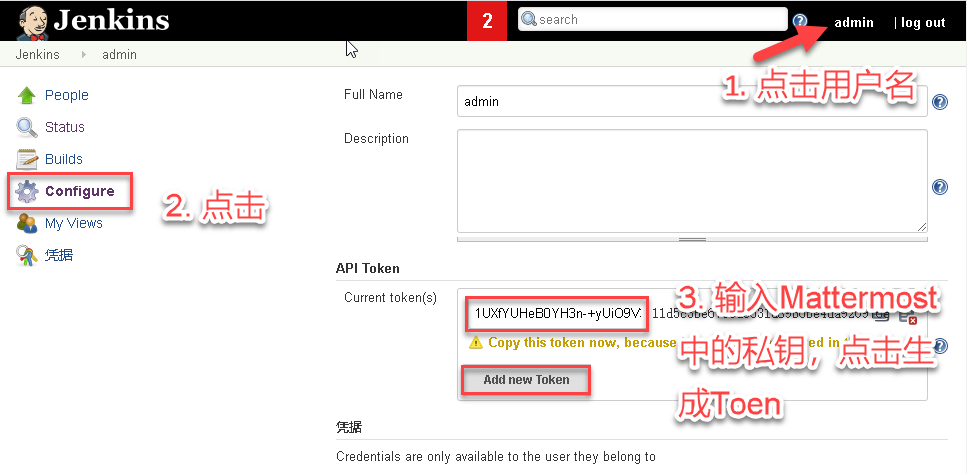

1. 在mattermost中进行配置
    

2. 在jenkins中进行配置

    安装mattermost插件，主菜单 >> Manage Jenkins >> 选择“Mange Plugins” >> Available >> 选择“Mattermost Notification Plugin” >> 点击“Install without restart”按钮
    

    点击用户名，进入后点击左侧菜单中的Configure，在Current token中输入Mattermost生成的私钥，点击“Add new token”生成token
    

3. 转到用户聊天界面，创建一个频道“Jenkins-CI-CD”
    输入 /jenkins connect <username> <token>

    

参考资料：https://github.com/mattermost/mattermost-plugin-jenkins