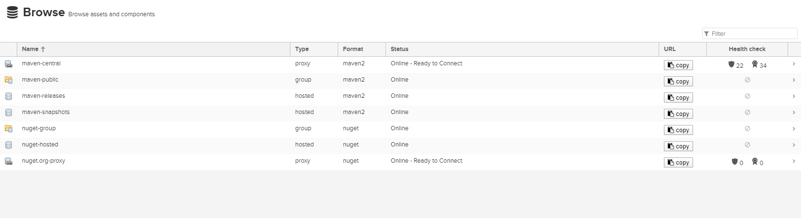
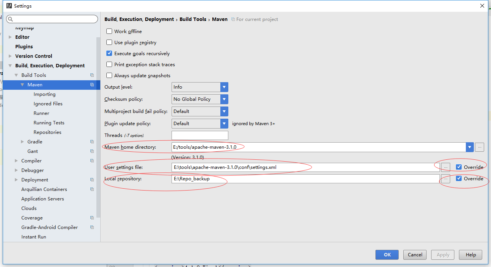

# Nexus使用指南

## 界面元素介绍


登录后，点击左侧Repositories，界面如上图所示。

右侧的列表中，可以看到nexus预设的几个仓库。
第一个public Repositories，类型为group，这个简单理解为仓库的集合，下面的仓库就是可以加入到这个集合的元素。

对外可以只提供一个单独的url，如上图显示为：http://tools.devopshub.cn:8081/nexus/content/groups/public/

大部分的终端用户，只需要配置上面这一个单独的聚合后的url，而不用单独配置多个仓库。用户也不需要知道某个jar包具体来源于maven 中央仓库，或者是Apache Snapshots，或者是我们自己添加的其他仓库。

这样的好处在于：如果我们要新增某个仓库（如开源中国、阿里云），客户端不需要做任何更改，只需要在nexus上将要新增的仓库加入到对外提供服务的仓库 group中就可以。

Releases和Snapshots一样，类型为hosted，意思是由nexus本机管理的仓库。该仓库用于商业化的，第三方提供的非开源的依赖仓库，如oracle jdbc driver。

Releases，用于存放开发团队内部用的正式版的依赖。

Snapshots，用于存放开发团队内部日常构建的频率更新较快的依赖包。

Central类型是proxy，意思是远端仓库的代理，为Maven中央仓库，我们平时maven默认就是连接该仓库。

 
## 使用本地maven客户端测试nexus是否成功部署

首先复制仓库集合的repository url，客户端配置需要用到。

配置maven客户端：
打开settings.xml，按照如下步骤修改：

```xml
  <mirrors>
    <mirror>
    <!--This sends everything else to /public -->
    <id>nexus</id>
    <mirrorOf>*</mirrorOf>
    <url>http://tools.devopshub.cn:8081/nexus/content/groups/public</url>
    </mirror>
</mirrors>

  <profiles>
    <profile>
      <id>nexus</id>
      <!--Enable snapshots for the built in central repo to direct -->
      <!--all requests to nexus via the mirror -->
      <repositories>
        <repository>
          <id>central</id>
          <url>http://central</url>
          <releases><enabled>true</enabled></releases>
          <snapshots><enabled>true</enabled></snapshots>
        </repository>
      </repositories>
      <pluginRepositories>
        <pluginRepository>
          <id>central</id>
          <url>http://central</url>
          <releases><enabled>true</enabled></releases>
          <snapshots><enabled>true</enabled></snapshots>
        </pluginRepository>
      </pluginRepositories>
    </profile>
  </profiles>
  <activeProfiles>
    <activeProfile>nexus</activeProfile>
  </activeProfiles>
```

 


接下来在ide中测试下

在idea中依次打开File--Settings--搜索Maven--出现如下界面：


保证上述几项指向正在用的maven目录和配置文件即可。点击ok，退出。
 
