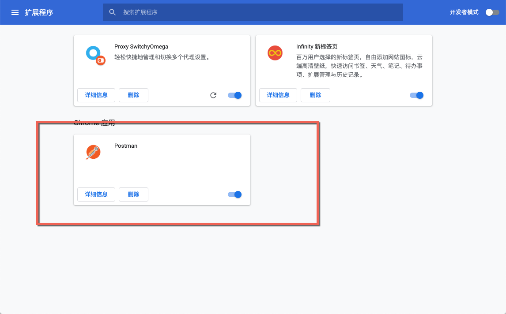
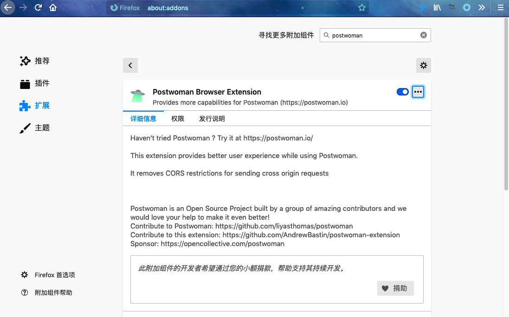
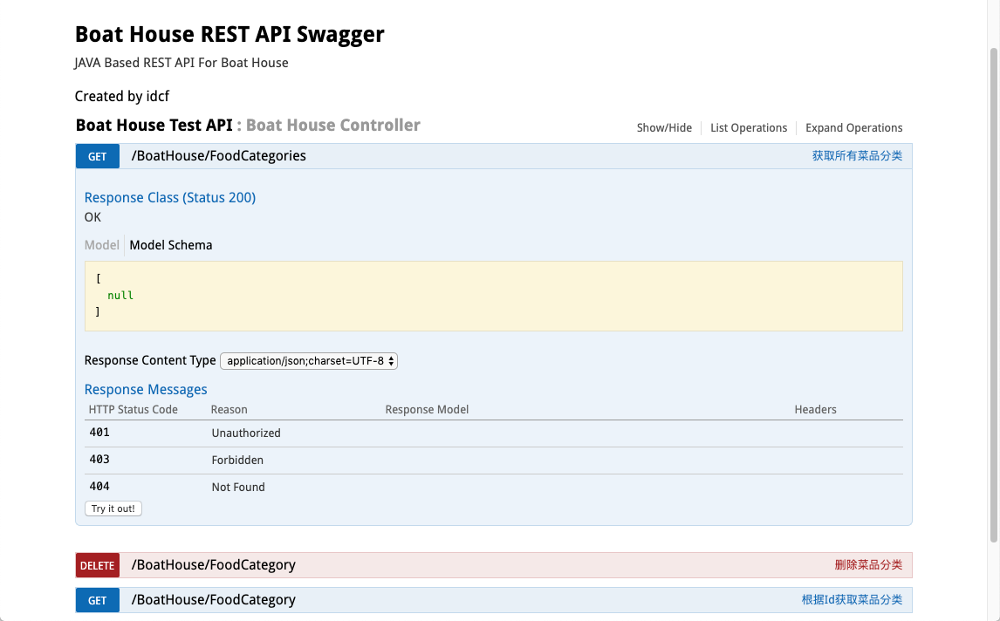
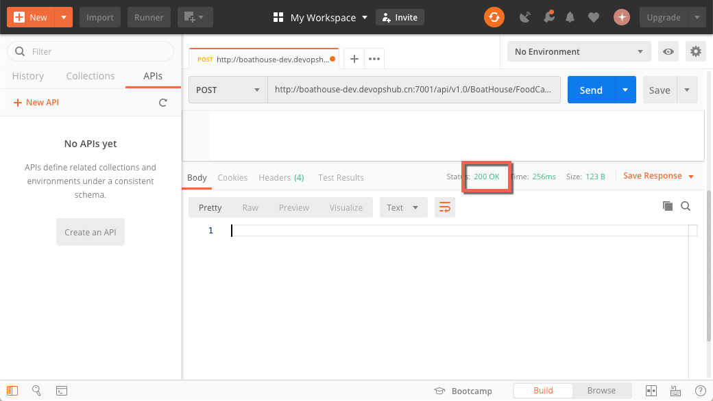
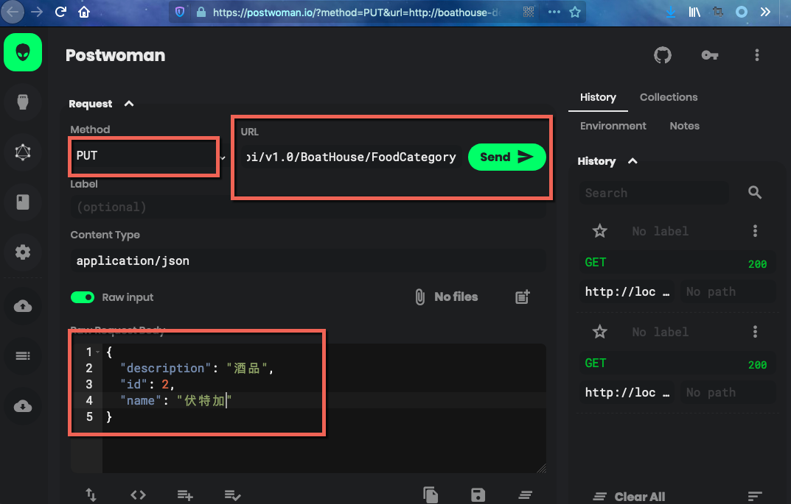
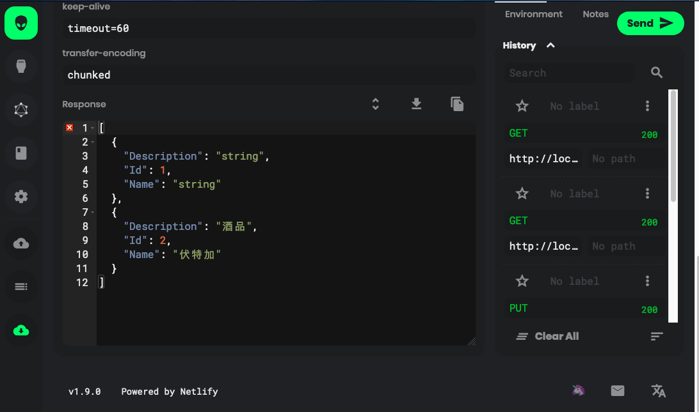
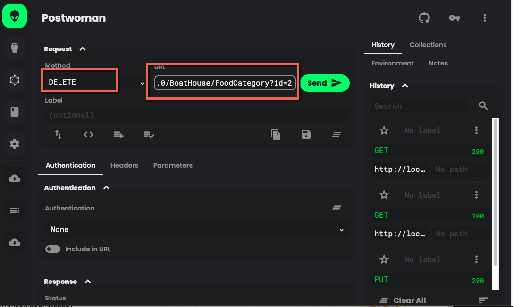

# Postman接口测试指南

### Postman安装

1. 应用程序
- 软件下载安装地址：
https://www.postman.com/
- 下载完毕后安装到PC:

2. 浏览器
- [Chrome应用市场安装Postman](https://chrome.google.com/webstore/detail/postman/fhbjgbiflinjbdggehcddcbncdddomop/related?hl=en)

- [Firefox应用市场安装Postwoman](https://addons.mozilla.org/zh-CN/firefox/addon/postwoman/?src=search)

### 接口示例

此指南将使用 Boat House Product-Service 中的菜品分类功能块来进行接口测试，包含 CRUD 四个方法，方法详情见如下swagger ui:

1. Create:

1. Get List:

1. Update:

1. Delete:

### 应用程序调用

1. 打开Postman应用，点击新建 Request 请求

1. 请求方法选择对应的，此处测试添加功能，因此选择POST，同时从swagger ui中找到url地址：

1. 选择Request Body，使用raw的方式填写，并选择数据类型为Json，填写 Request Body Json 字符串

1. 点击发送，查看 Response 结果：200代表请求成功

1. 新建一个Get Request，获取所有的当前添加的结果：

添加成功！

### 浏览器插件调用

以上我们已经使用Postman应用程序做了 Create/Get 请求的接口测试，接下来使用浏览器插件调用 Put/Delete 请求：

1. Put:

查看结果，修改成功：

2. Delete:

查看结果，删除成功：
