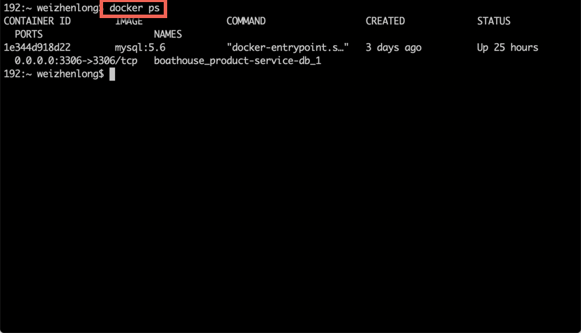
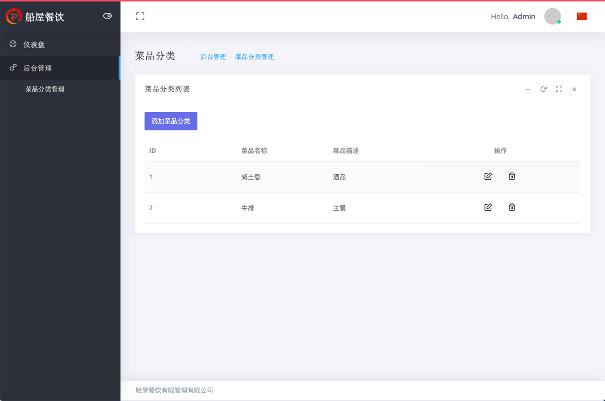
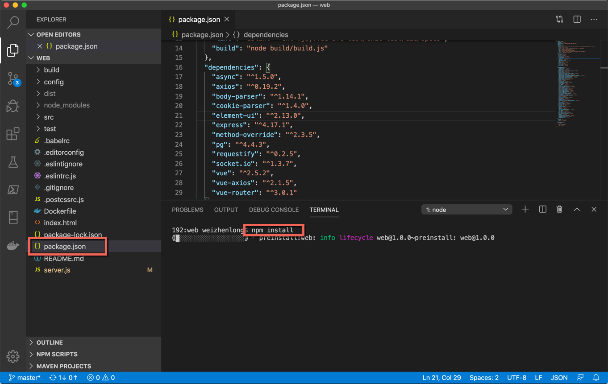
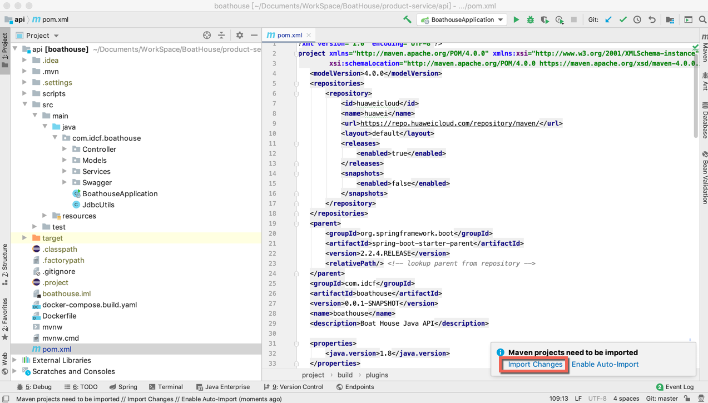
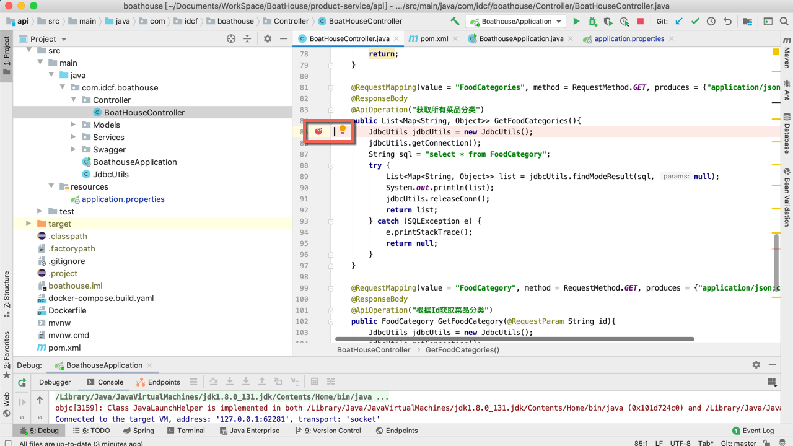

## IDCF Boat House 快速开发指南
### IDCF Boat House 项目架构：

### 指南概要
如上Boat House项目架构图所示:
* 基于 Spring Boot 框架开发的 **Product Service** 将为Boat House提供 REST API 数据支持；
* 基于Node Js + Vue 框架开发的后端管理平台 **Management Web** 将为Boat House提供后台数据管理功能。

本指南将以 Product Service 和 Boat House 后端管理平台 Management Web 为例在接下来的三个章节中介绍如何快速上手进行 管理网站 和 后台服务 的开发，以及跨技术栈/IDE情况下如何进行前后端到端的调试。

参考资料： 
  -  [boathouse架构图](resources/boathouse-arch-design.pptx) 
  -  [boathouse-本地调试结构图](resources/BoatHouse-dev-guide-design.pptx) 
  -  [Selenium结构图](resources/Selenium.pptx) 

## Product Service 快速上手指南

#### 简介

Boat House Product Service 是 ：
* Boat House 的产品后台数据服务
* 基于Spring Boot 框架开发的 RESTFUL API
* 向前对 Boat House 各网站提供产品数据接口，向后使用MySql数据库进行数据存储


#### 开发环境

* Windows/Mac OS
* [Itellij IDEA](https://www.jetbrains.com/idea/) IDE
* Docker for Windows/Mac
#### 快速开始

1. 安装 [Itellij IDEA](https://www.jetbrains.com/idea/)
1. 使用 IDEA 打开 Product Service Api 代码

1. 点击 pom.xml 查看外部引用项，并点击加载

1. Docker启动MySql本地数据库
    ```bash
    docker pull mysql
    docker run -p 3306:3306 --name mysql -e MYSQL_ROOT_PASSWORD=[Your Password] -d mysql
    docker ps
    ```
    
    
    
1. 修改 application.properties 文件数据库连接字符串

1. 运行 Product Service 站点

1. 浏览器打开 Swagger UI 地址（http://localhost:8080/api/v1.0/swagger-ui.html）


## Management Web 快速上手指南

#### 简介

Boat House Management Web 是：
* Boat House 的后台管理网站
* 基于 Node JS + Express + Vue 框架开发的网站应用
* 向前给 Boat House 管理者提供管理整个餐厅的功能，向后调用 REST API 使用 统计服务/产品服务/账户服务




#### 开发环境

* Windows/Mac OS
* [VS Code](https://code.visualstudio.com/) IDE
* [nodejs](https://nodejs.org/)

#### 快速开始
1. 安装 [VS Code](https://www.jetbrains.com/idea/), [nodejs](https://nodejs.org/)
1. 使用 VS Code 打开 Management Web 代码

1. 点击 package.json 查看外部引用项，并运行 npm install 加载

1. 修改 server.js 文件product service api 地址

1. 运行 npm run build 进行应用打包

1. 点击左侧 Debug 工具栏，启动 Debug

1. 浏览器打开网站地址（http://localhost:4000）


## Product Service & Management Web 跨技术栈/IDE连调指南
#### 整体架构图：


#### 具体步骤
* **Product Service ： IDEA Debugging Mode**
1. IDEA中打开Product Service api 项目目录

1. 加载 Pom 文件中所需要的外部引用包

1. 点击右上角 Debug 键

1. Debug 已启动，端口号（默认8080）如下

1. 打开 Swagger UI(http://localhost:8080/), 确认服务已经可以被访问

1. 在要调试的方法上打断点


* **Management Web 后端：VS Code Debugging Mode**
1. VS Code中选中项目中的 server.js 文件，修改 product service 地址为 http://localhost:8080

1. 点击左侧 Debug 工具栏，启动 Debug

1. Debug 已启动，端口号（默认4000）如下

1. 在 server.js 要调试的后台函数中打断点


* **Management Web 前端：用户浏览器（开发者模式）**
1. 打开 Boat House 后台管理网站

1. F12开启浏览器开发者模式，点击Source找到要调试的.vue文件，在要调试的 js 函数中打断点

1. 开始连调，浏览器页面触发JS方法，监控 Http Request/Response 流转过程


