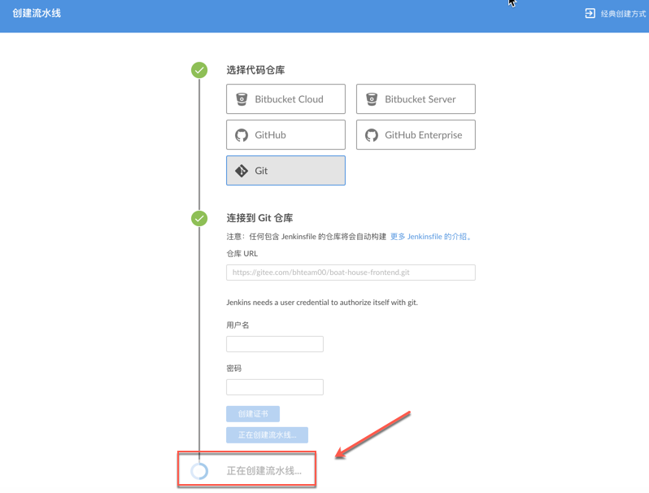
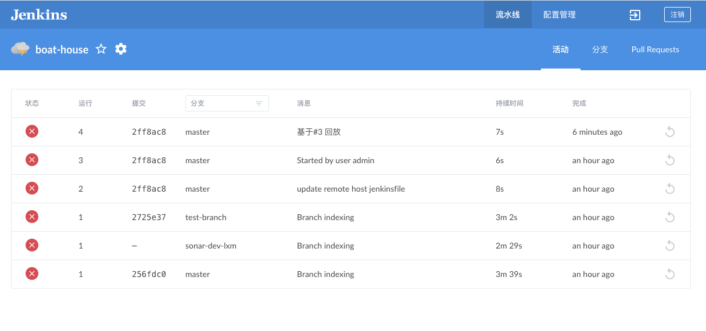
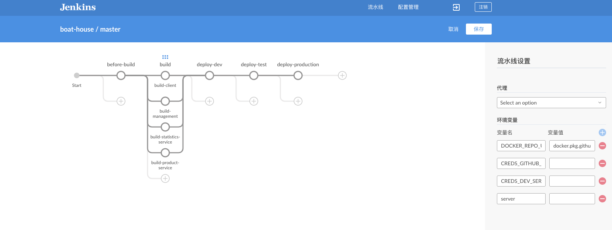

### Gitee集成Jenkins搭建流水线

#### 前置说明：

**配置Gitee之前，团队需要选定一个Gitee账号跟Jenkins环境集成

##### 添加全局变量

1. 进入Jenkins | 点击 Manage Jenkins | 点击Config System | 找到 Global properties | 选中 Environment variables | 点击 ADD

添加如下环境变量：

| 变量名称 | 值 | 说明  |
| ------------ | --------- | --------- |
| BOATHOUSE_CONTAINER_REGISTRY  | bhacr.azurecr.cn | 容器镜像仓库地址,可以是github pkg url 或 azure container reg url（acr），目前使用后者  |
| BOATHOUSE_DEV_HOST  | 请使用实际 | ev环境内部IP地址（jenkins通过内网IP部署dev环境）  |
| BOATHOUSE_ORG_NAME | idcf-boat-house  | 团队镜像仓库组织名称(即boathouse 在github上的组织名称) |
| DEPLOY_K8S_NAMESPACE_TEST | boathouse-test | k8s命名空间，即boathouse测试环境部署的命名空间 |
| DEPLOY_K8S_NAMESPACE_PROD | boathouse-prod | k8s命名空间，即boathouse生产环境部署的命名空间 |

添加完成后如下图所示：

##### Jenkins配置

1. 进入jenkins首页，点击进入左侧菜单栏中 **open blue ocean** 的菜单

1. 进入后，根据提示，点击下方的按钮，创建流水线

1. 仓库类型选择 git,如下图所示：

2. 输入仓库地址，并点击创建流水线，如下图所示：

3. 流水线创建中

4. 进入流水线主页，可以看到基于Repo中Jenkins File成功创建出流水线。

.5 点击当前流水线进入流水线活动页面

6. 点击分支 Tab，点击某个分支后的修改button可以查看流水线的具体设置及任务

