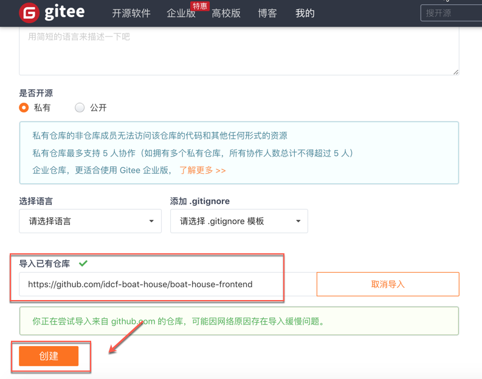
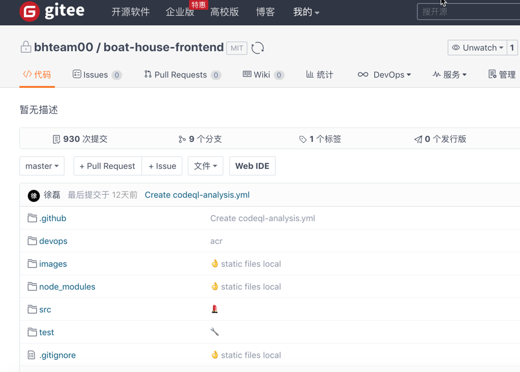
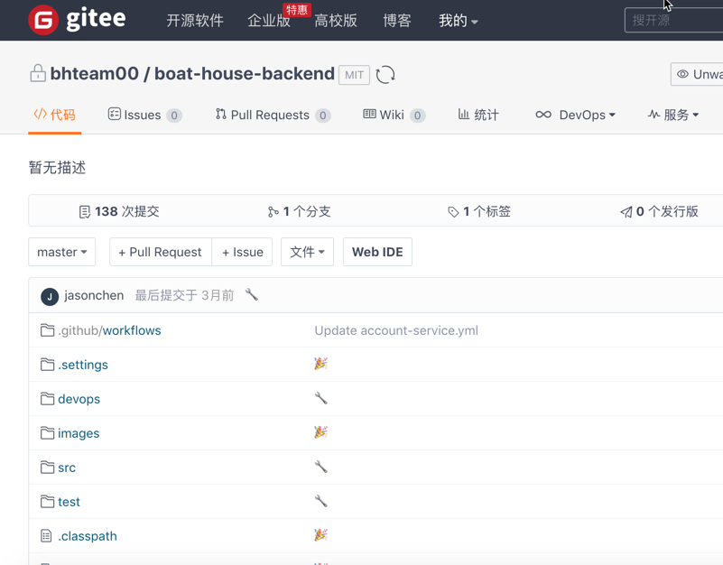

在本实验中我们使用Gitee作为代码托管以及管理的平台，所以我们需要申请Gitee账号，并将示例项目导入到Gitee平台中。

###### 1.1 注册Gitee账号

1. 打开Gitee站点：https://gitee.com/，点击注册Gitee

2. 输入自己的团队，账号以及密码，点击注册，如下图所示：

3. 注册完成后，如下图所示：

###### 1.2 导入Boathouse示例代码

1. 找到仓库，点击立即创建，如下图所示：

2. 拖动页面到最下面，选择导入已有仓库，如下图所示：

3. 粘贴BoatHouse前端代码仓库，地址如下：

https://github.com/idcf-boat-house/boat-house-frontend

4. 导入完成后如下图所示：

5. 按照同样的方式导入BoatHouse后端代码库：

https://github.com/idcf-boat-house/boat-house-backend

