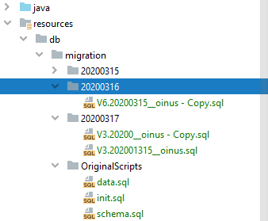
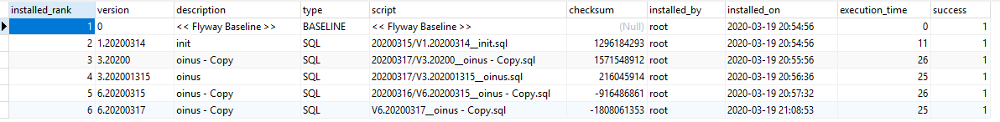

### Flyway的介绍

Flyway是一款数据库迁移（migration）工具。简单点说，就是在你部署应用的时候，帮你执行数据库脚本的工具，免去了DBA拿数据库升级脚本检查、备份、执行，以完成数据库升级的一步。Flyway支持SQL和Java两种类型的脚本，你可以将脚本打包到应用程序中，在应用程序启动时，由Flyway来管理这些脚本的执行，这些脚本被Flyway称之为migration。

Flyway最核心的就是用于记录所有版本演化和状态的MetaData表，Flyway首次启动会创建默认名为SCHEMA\_VERSION (flyway\_schema\_history) 的元素局表。 表中保存了版本，描述，要执行的sql脚本等；

Flyway自动引入的文件名有固定的格式要求：V+版本号 +双下划线+描述+结束符

### Flyway在项目里的引入

以下的引入步骤经过了BoatHouse项目的本地实战验证，基本上使用了Flyway的默认配置。

1. 在pom.xml文件里引入两个包

``` 
<dependency>

    <groupId>org.flywaydb</groupId>

    <artifactId>flyway-core</artifactId>

    <version>5.2.4</version>

</dependency> <plugin>

<groupId>org.flywaydb</groupId>

<artifactId>flyway-maven-plugin</artifactId>

<version>5.0.3</version>

</plugin>
```

1. 在application.properties引用flyway进行数据库链接

**spring.flyway.baseline-on-migrate** =**true
spring.flyway.baseline-version **=** 0**
**spring.flyway.url** = **jdbc:mysql://localhost:3307/boathouse?characterEncoding=utf-8**
**spring.flyway.user** = **root**
**spring.flyway.password** : **123456**

1. 在src/main/resources目录下创建必备文件夹db/migration。这个文件夹里可以再自由分组，比如以发布的版本为一个文件夹命名，或者以提交日期命名一个文件夹都可以。


 
### Flyway mysql元素局表的介绍

这个表长这个样子：


 
| **列名** | **描述** |
| --- | --- |
| Installed\_rank | 自动部署的顺序，升序insert |
| Version | 版本号，必须升序insert |
| Description | 文件名\_\_双下划线以后的字节 |
| Type | Sql |
| Script | 相对db/migration文件夹的相对路径 |
| Checksum |   |
| Installed\_by | 数据库账号 |
| Installed\_on | 脚本自动部署时间 |
| Execution\_time | 执行时间，毫秒 |
| Success | 正常为1.每次执行前请删除为0的结果 |


### Flyway文件命名规范

**V+版本号 +双下划线+描述+结束符**

1. 版本号除了第一个V，其余都必须为数字0-9或者字符.
2. 貌似文件一个版本只能有一个文件,字符.后面的0会被忽略
  1. 20200315\_\_Food.sql &amp; V1.20200315\_\_Story.sql不能并存
  2. 20200315\_\_Food.sql &amp; V1.020200315\_\_Food.sql
  3.  V1.20200315\_\_Food.sql &amp; V1.20200316\_\_Story.sql可以并存

### 疑难杂症的解决

1. Detected failed migration to version
  1. 请删除flyway\_schema\_history表中success = 0 的数据
2. Invalid version containing non-numeric characters. Only 0..9 and . are allowed
3. Detected resolved migration not applied to database
  1. 新文件的版本号比已经保存的版本号小，请修改

### 建议BoatHouse文件命名规范

V+迭代脚本.+YYMMDDHHSS\_\_英文描述.sql


