# 1.目标

利用windows10机器远程连接k8s集群，在k8s集群上搭建mysql集群。

# 2.环境及工具

（1）windows10机器（需要与k8s集群在同一个网段）。

（2）kubectl工具。

（3）k8s集群上的config文件。

（4）navicat工具

# 3.过程

## 3.1 在windows机器上安装kubectl，我的电脑为windows10。

（1）下载windows版的kubectl可执行文件，地址是：https://storage.googleapis.com/kubernetes-release/release/v1.7.0/bin/windows/amd64/kubectl.exe

（2）进入在当前windows用户的home目录，我用的账号是Administrator，所以进入目录C:\Users\Administrator，在里面创建文件夹.kube，（建议用命令行mkdir创建，因为名字中带点，在桌面上输入名字不会成功）创建之后如下图：

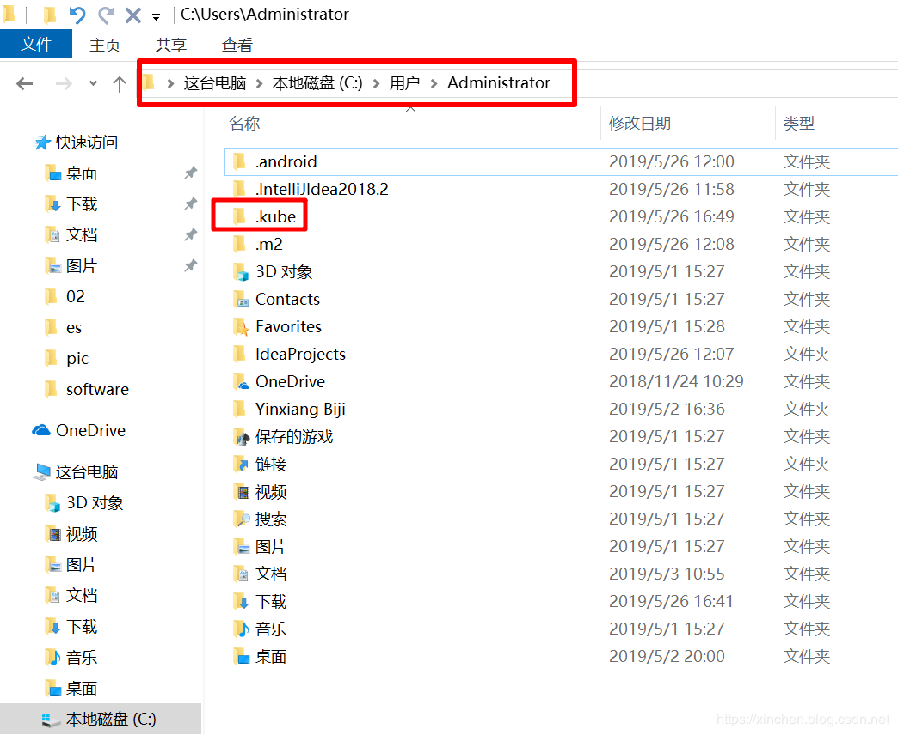
 
## 3.2. 远程登录k8s集群服务

（1）config文件配置：

去k8s所部署的linux机器目录~/.kube/,将里面的config文件下载下来，放到本地windows机器的上一步创建的.kube目录下（此处为C:\Users\Administrator\.kube）,如下图所示：

 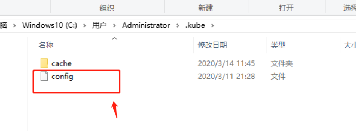
 
（2）远程连接k8s集群：

     在本地windows机器所安装的kubectl工具所在的目录，打开dos窗口，输入命令&quot;kubectl get node&quot;, 如果显示以下信息，则表示可以正常连接到k8s集群：

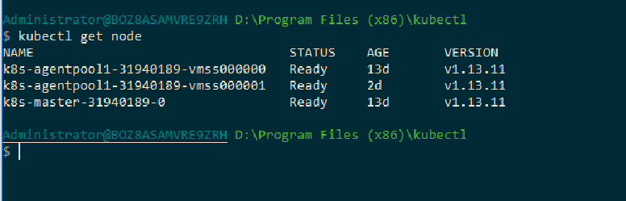
 
## 3.3 部署mysql集群

### 3.3.1 创建namespace

在本地windows机器所安装的kubectl工具所在的目录，创建名为&quot;mariadb&quot;的namespace，指令为：kubectl create namespace mariadb

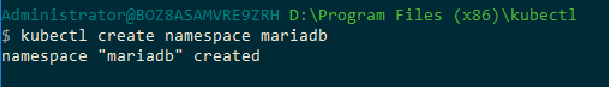
 
### 3.3.2 创建etcd-cluster

在本地windows机器所安装的kubectl工具所在的目录，创建etcd-cluster.yml文件（文件内容请参考附件），然后执行如下指令：

kubectl create -f etcd-cluster.yml -n mariadb

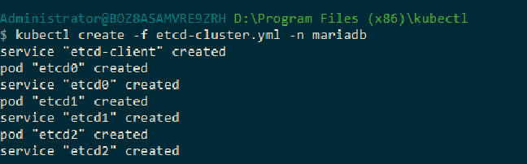

### 3.3.3 创建pv

在本地windows机器所安装的kubectl工具所在的目录，创建mariadb-pv.yml文件（文件内容请参考附件），然后执行如下指令：

kubectl create -f mariadb-pv.yml -n mariadb

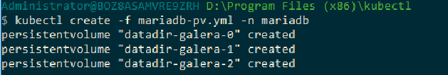
 
### 3.3.4 创建pvc

在本地windows机器所安装的kubectl工具所在的目录，创建mariadb-pvc.yml文件（文件内容请参考附件），然后执行如下指令：

kubectl create -f mariadb-pvc.yml -n mariadb

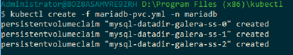
 
### 3.3.5 创建rs

在本地windows机器所安装的kubectl工具所在的目录，创建mariadb-rs.yml文件（文件内容请参考附件），然后执行如下指令：

kubectl create -f mariadb-rs.yml -n mariadb

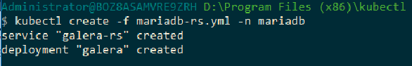

### 3.3.6 创建ss

在本地windows机器所安装的kubectl工具所在的目录，创建mariadb-ss.yml文件（文件内容请参考附件），然后执行如下指令：

kubectl create -f mariadb-ss.yml -n mariadb

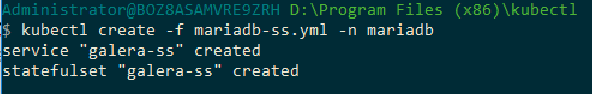
 
### 3.3.7 查看pod

以上步骤都执行完成之后，查看pod的数量，如果有以下的pod，则表示部署成功：

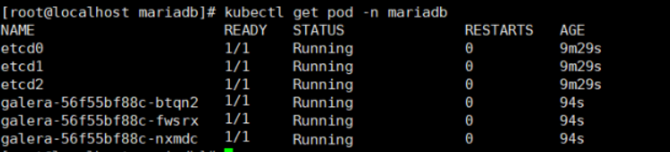

## 3.4 验证mysql是否安装成功

使用windows上的navicat工具，连接mysql服务，如果能连接成功则表示mysql部署成功。

（1）Ip：是k8s集群某个节点的ip即可。

（2）用户名：root

（3）密码：myrootpassword

 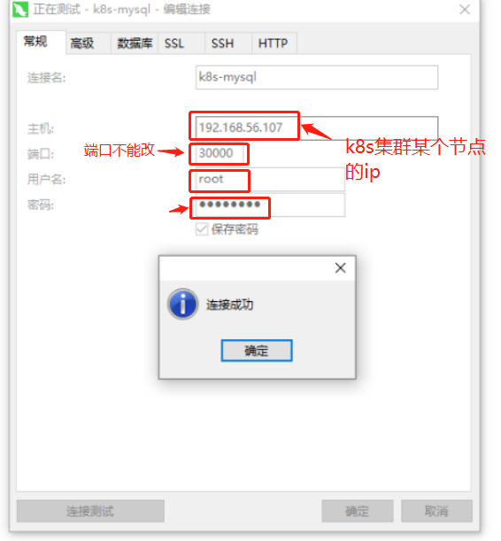
 
 
