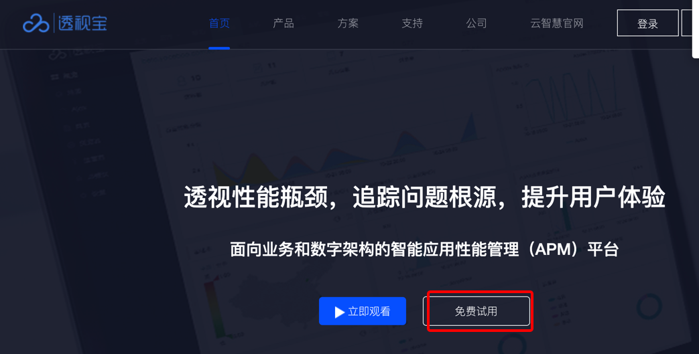
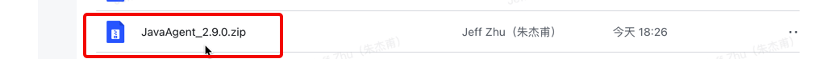
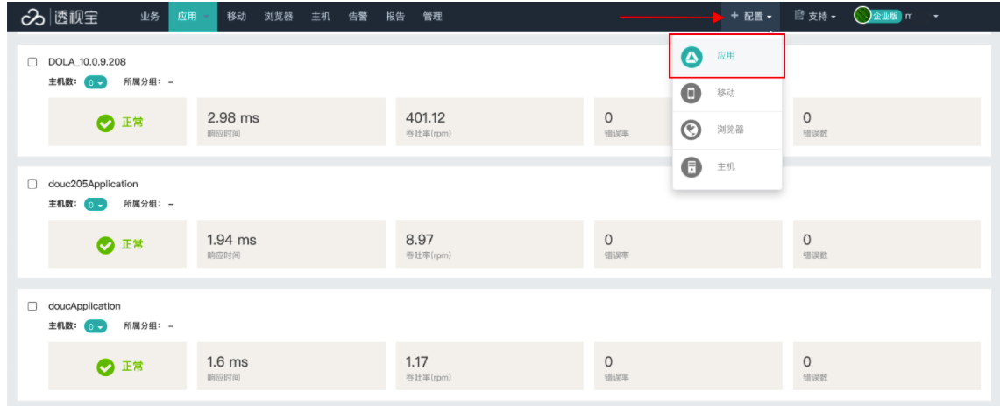
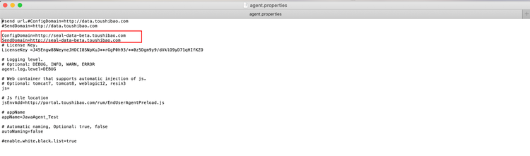
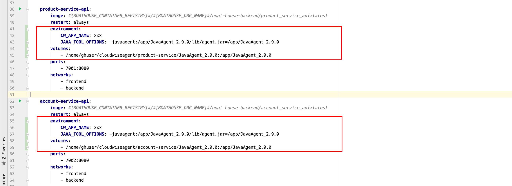
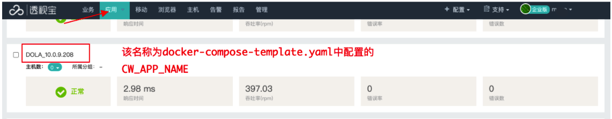

## Boathouse-Demo嵌入透视宝JavaAgent探针操作指南

### 1.javaagent 下载地址：

| https://www.toushibao.com/                                   | 官网地址                              |
| ------------------------------------------------------------ | ------------------------------------- |
|  | **注册后就可以下载试用TSB 各种Agent** |
| https://yunzhihui.feishu.cn/drive/folder/fldcnFyLmeEx6qACZLYoh2za3Se | Beta版                                |
|  | （**内部测试专用-公网无法使用用）**   |

上传JavaAgent_2.9.0.zip至单机环境任意位置，例如：/home/user/cloudwiseagent/JavaAgent_2.9.0.zip并解压。（**备注：上传至单机环境非K8S环境**）

### 2.修改配置文件

**a.进入JavaAgent_2.9.0/conf目录下的agent.properties，配置License Key以及ConfigDomain、SendDomain**。

**b.License Key可以从透视宝平台上获取（主页中 配置-> 应用）**如下图所示



**ConfigDomain和SendDomain均填写透视宝平台地址（透视宝部署环境）。*如下图所示（实际现场提供可用环境）



### 3.修改docker-compose-template.yaml文件

**在docker-compose-template.yaml中的product-service-api和account-service-api下方添加如下内容，该文件位于项目目录/boat-house-backend/src下：**

```
environment:
    CW_APP_NAME: xxx
    JAVA_TOOL_OPTIONS: -javaagent:JavaAent在容器中的路径/lib/agent.jar=JavaAent在容器中的路径
volumes:
    - Javaagent:JavaAgent在宿主机中的路径:JavaAent在容器中的路径
```

示例：



### 4.将代码修改提交到git仓库（实际学习现场代码仓库地址）

### 5.通过jenkins 执行pipline进行重新部署Demo后端服务

### 6.访问Demo，验证JavaAgent是否部署成功；

### 7.登录透视宝平台，查看应用情况（透视宝平台用户-在学习前提供）




