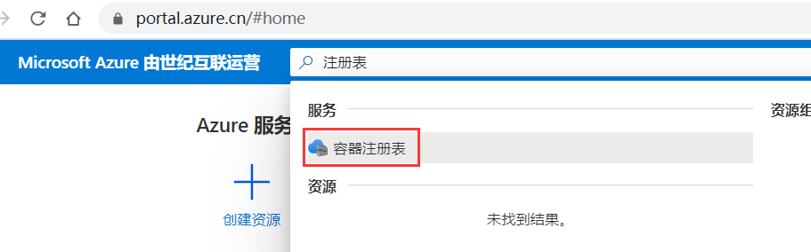
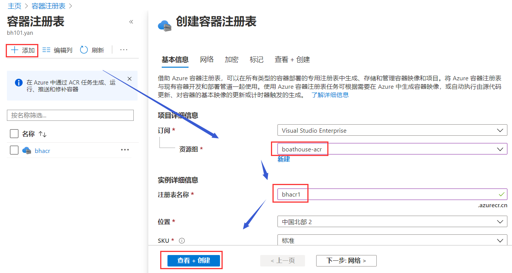
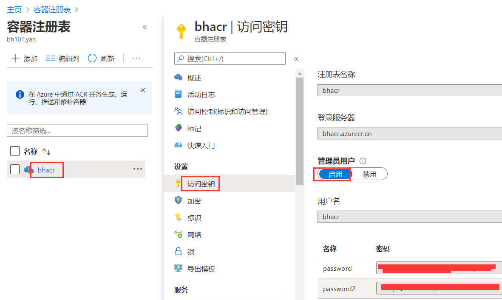
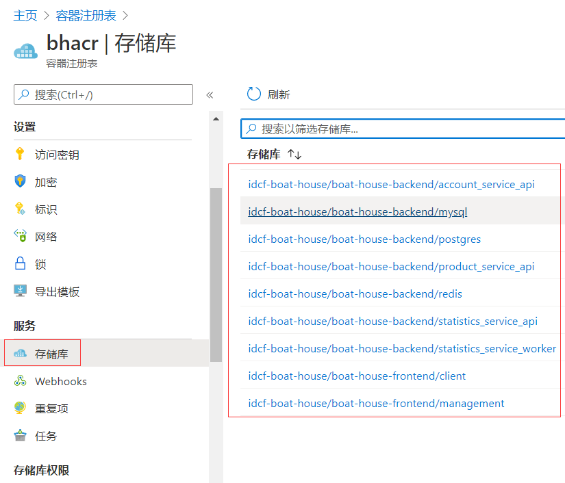
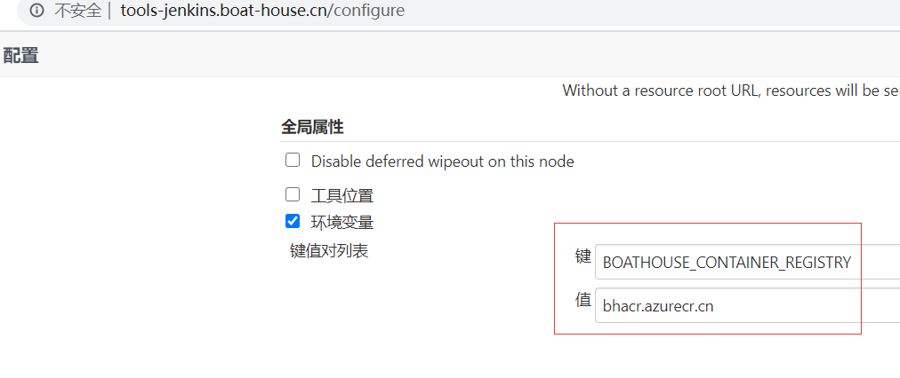
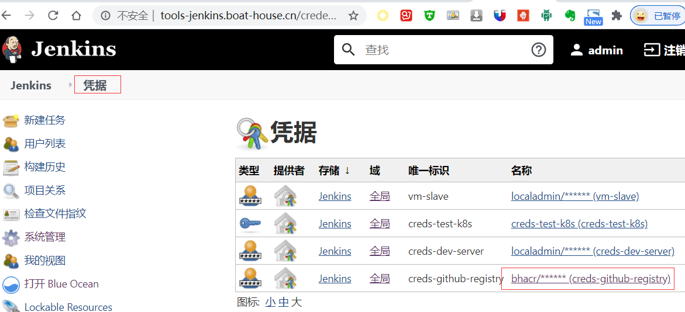
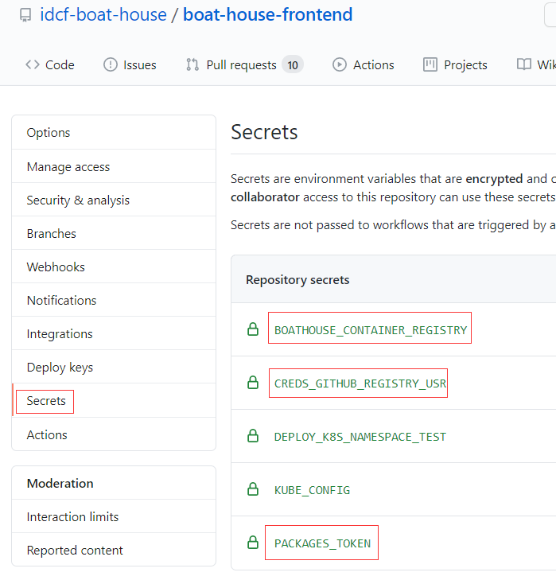

在Azure上创建容器注册表服务
---------------------------

1.  打开portal.azure.cn门户，并登陆至订阅。找到容器注册表服务(acr):

1.  创建acr服务

1.  获取访问url(bhacr.azurecr.cn)、帐号(bhacr)、密码(如下图中的位置)

1.  查看已push的docker image.

1. 测试acr
登陆到acr，维护团队请从这里获取帐号和密码。打开命令行，使用命令登陆：docker
login [acr url]，并根据提示输入帐号和密码。

1. 接下来需要调整理流水线yml配置文件和应用kompose yml文件，以使用acr 的镜像服务。此处不再介绍，请参考boathouse流水线配置文档。【此步可选】

1. 目前boathouse支持使用github package提供的容器镜像服务或是azure提供的容器镜像服务(acr),所有相关的理流水线yml配置文件和应用kompose yml已经调整好，容器镜像注册表url、帐号、密码已经变化化，分别存在在github的Secrect中和jenkins中（环境变量和全局凭据中）。默认采用acr的服务，如果需要将变量值调整成github package相关的值即可。

图 1 jenkins 环境变量

图 2 jenkins acr 访问凭据

图 3 github上的变量(用于github action流水线)
