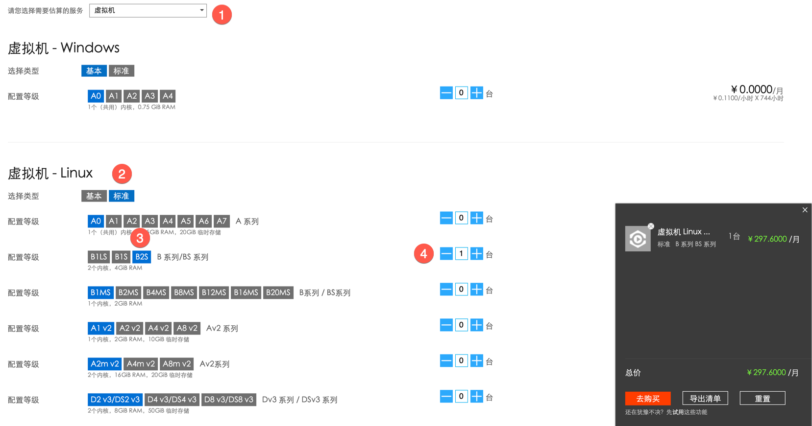

## 需求分析：
+ 每个订阅基础费用要控制在800/月以下，因为每个订阅费用为1000/月，且要保证20%的余量预防流量超标导致的费用增加，具体服务器选型可参考：https://docs.microsoft.com/zh-cn/azure/virtual-machines/linux/sizes；
+ 目前服务器我们均作为开发和测试用途，所以选择常规用途服务器即可;
+ 使用azure国内版（世纪互联），因为国际版的访问速度较慢，以下价格均参照 https://www.azure.cn/pricing/calculator/。

## 解决方案：
一共需要3个订阅

### 订阅1
> Dev环境		

//TODO 表格增加一列，标记名称。删掉Service type

| Service type | Description | Count | Estimated monthly cost | 
|---------|---------|---------|---------|
| Virtual Machines | B2s（linux、2 vCPU，4 GiB RAM，8 GiB 临时存储空间，最大磁盘数 4，IOPS 1280） | 1 | ¥297.00 |
| 	|| Total | 	¥297.6 | 

### 订阅2
> Jenkins服务器	
		
| Service type | Description | Count | Estimated monthly cost |
|---------|---------|---------|---------|
| Virtual Machines | D2s_v3（linux、2 vCPU，8 GiB RAM，16 GiB 临时存储空间，最大磁盘数 4，IOPS 3200）  | 1 || ¥534.94 |
| 	|| Total | 	¥534.94 | 

### 订阅3
> K8S	
		
| Service type | Description | Count | Estimated monthly cost |
|----|---------|---------|---------|
| Virtual Machines | B2s（linux、2 vCPU，4 GiB RAM，8 GiB 临时存储空间，最大磁盘数 4，IOPS 1280） |  2 | ¥297.6 |
| 	|| Total | 	¥595.2 | 

