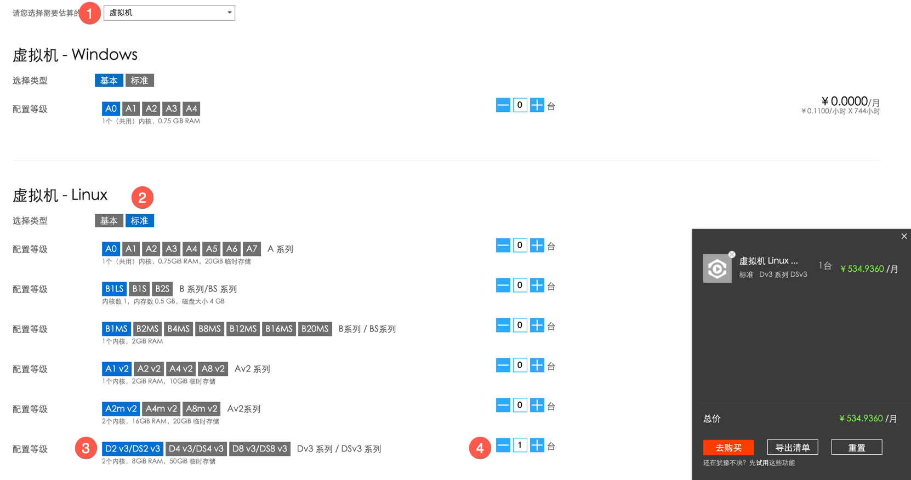
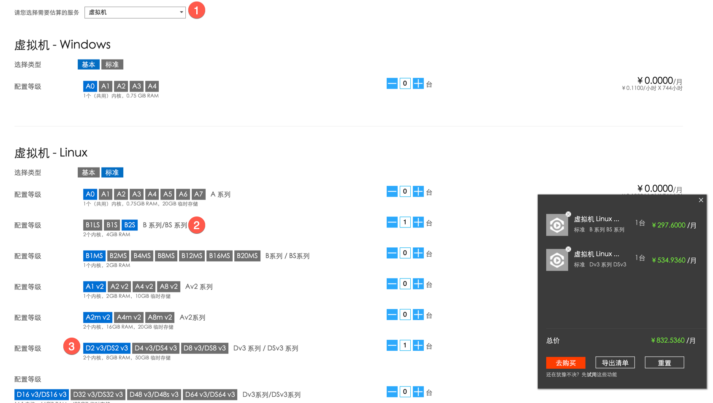
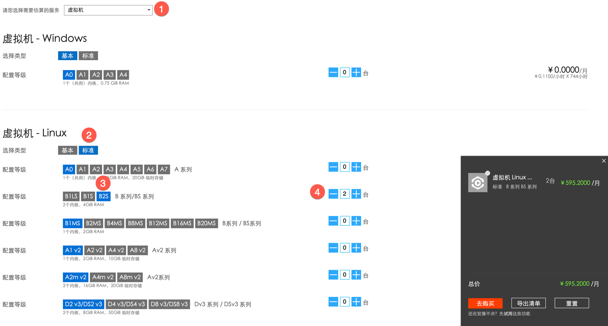
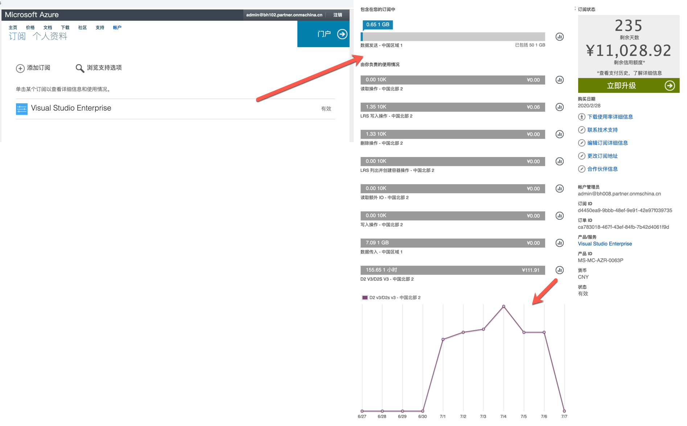

# Azure 云资源规划
> 本文以 azure国内版（世纪互联） 为规划对象。

## 需求分析：
+ 每个订阅基础费用尽量控制在800/月以下，因为每个订阅费用为1000/月，且要保证20%的余量预防流量超标导致的费用增加，具体服务器选型可参考：https://docs.microsoft.com/zh-cn/azure/virtual-machines/linux/sizes；
+ 目前服务器我们均作为开发和测试用途，所以选择常规用途服务器即可;
+ 使用azure国内版（世纪互联），因为国际版的访问速度较慢，以下价格均参照 https://www.azure.cn/pricing/calculator/。

## 解决方案：
一共需要3个订阅，Jenkins + Agent一个订阅，相关的工具，比如Jira、Sonar、Nexus 等在一个订阅，K8S一个订阅。

### 订阅1
> 工具服务器	

| Name | Description | Estimated monthly cost | 
|---------|---------|---------|
| 工具服务器（Jira、Sonar、Nexus 等） | B2s（linux、2 vCPU，4 GiB RAM，8 GiB 临时存储空间，最大磁盘数 4，IOPS 1280） | ¥297.00 * 1 |
| 	| Total | 	¥297.6 | 

### 订阅2
> Jenkins服务器	&& Dev环境服务器
		
| Name | Description | Estimated monthly cost |
|---------|---------|---------|
| Jenkins服务器（包含Agent） | D2s_v3（linux、2 vCPU，8 GiB RAM，16 GiB 临时存储空间，最大磁盘数 4，IOPS 3200） | ¥534.94 * 1 |
| Dev | B2s（linux、2 vCPU，4 GiB RAM，8 GiB 临时存储空间，最大磁盘数 4，IOPS 1280） | ¥297.00  * 1 |
| 	| Total | 	¥831.94 | 

### 订阅3
> K8S	
		
| Name | Description | Estimated monthly cost |
|----|---------|---------|
| K8S | B2s（linux、2 vCPU，4 GiB RAM，8 GiB 临时存储空间，最大磁盘数 4，IOPS 1280） |  ¥297.6  * 2 |
| 	| Total | 	¥595.2 | 

## 云资源消耗费用查看
### 世纪互联消耗费用查看
访问站点 https://account.windowsazure.cn/Home/Index 使用账号登录后，点击 订阅名称，进入后可以查看到截止到目前的消耗以及剩余费用

