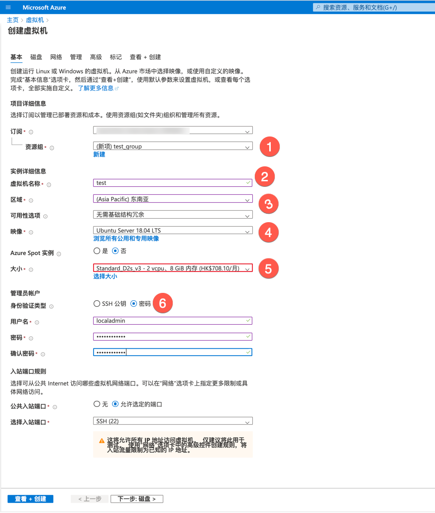
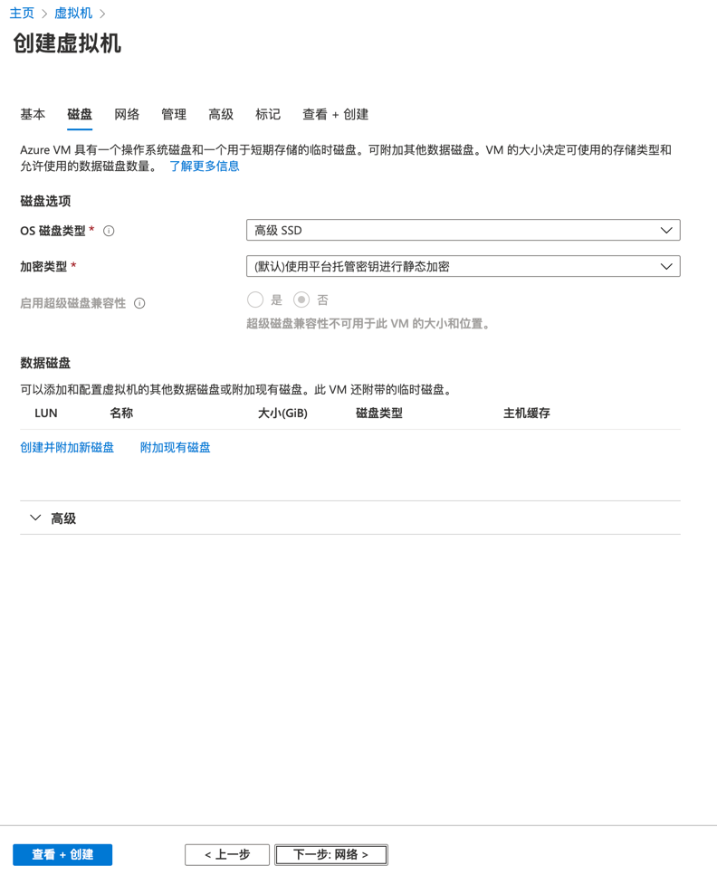
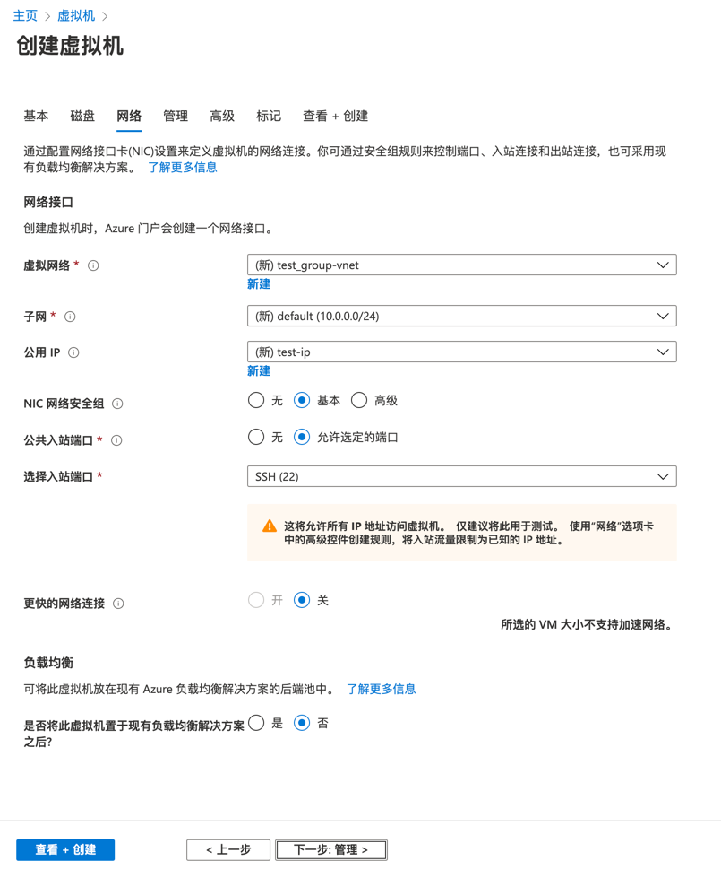
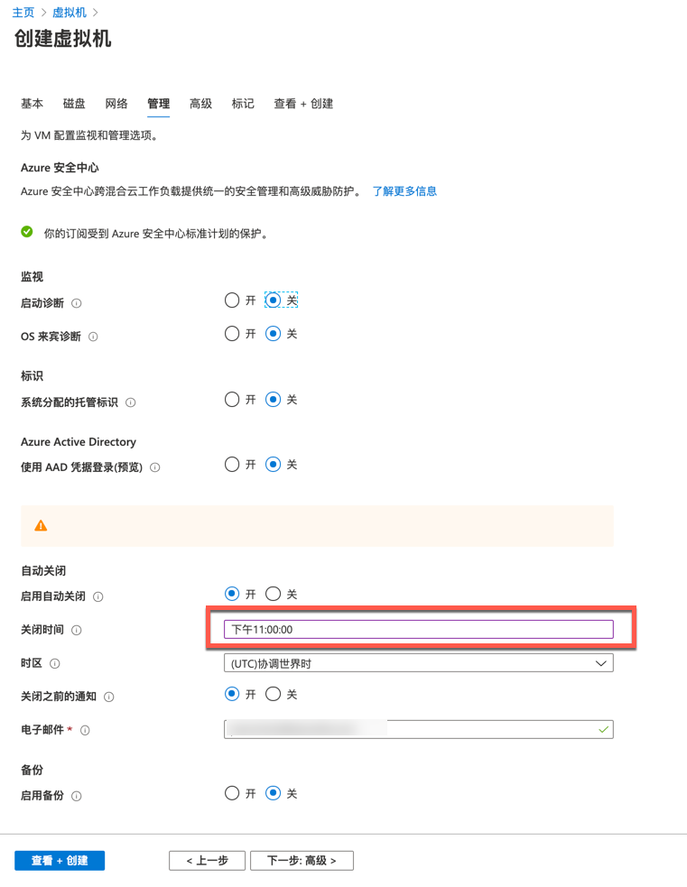
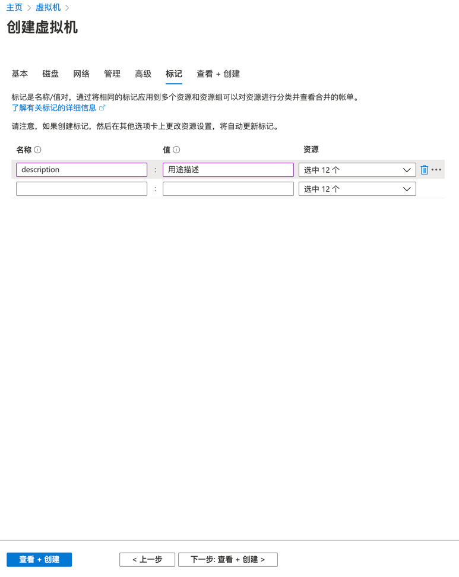
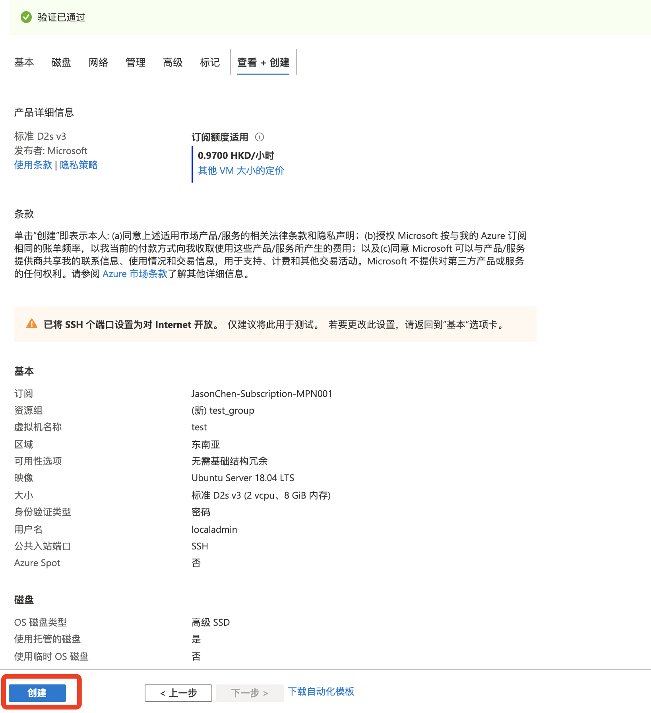
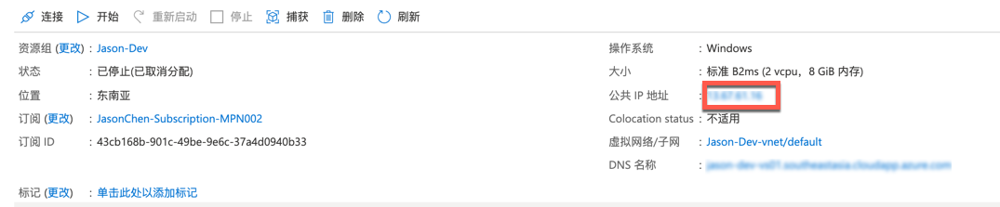
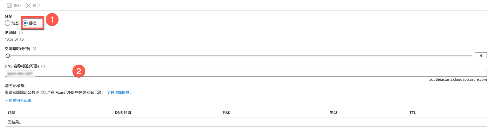

**Azure VM 创建说明**

# 创建订阅
https://my.visualstudio.com/

# 创建虚拟机
创建一个资源组；

输入虚拟机的名称；

选择区域为 东南亚；

镜像， 浏览所有公用和专用镜像，选择一个自己需要的镜像；

大小，点击 选择大小 ，此处需要注意月费用不要超出订阅的配额限制；

身份证类型，输入账号密码，注意root或者administrator是不能作为用户名。

磁盘
+ 磁盘类型不一样，价格也不一样
+ 尽量不要附加磁盘会增加费用

网络，如果不用组网，直接默认即可

管理，建议设定一个关机时间，可以减少订阅的使用费用

标记，建议写上VM的大致用途

预览自己的设置，点击 创建

# 设置网络
点击公共IP地址 中IP地址

设置为静态IP，并设置DNS名称

