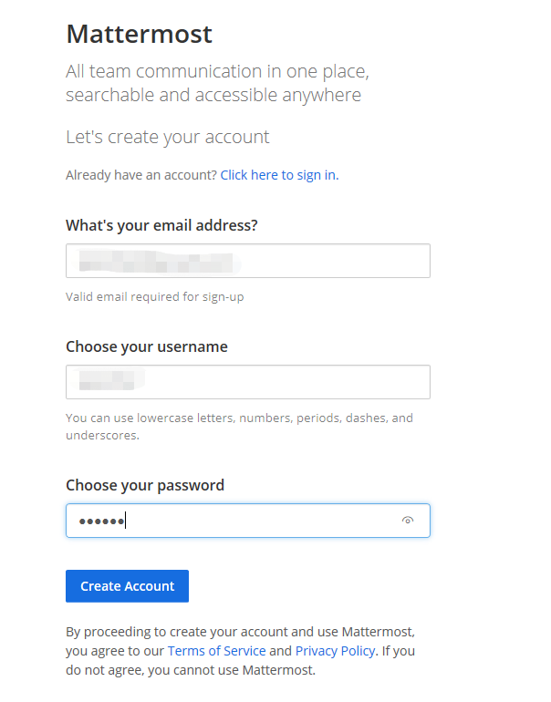
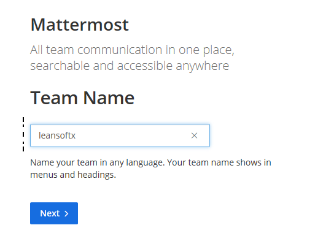
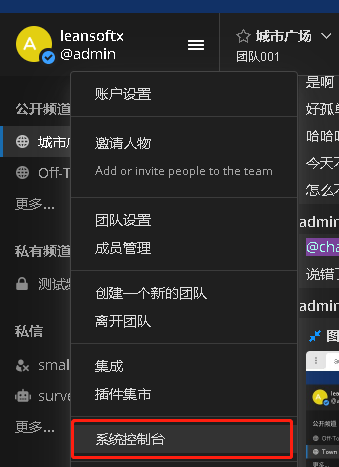
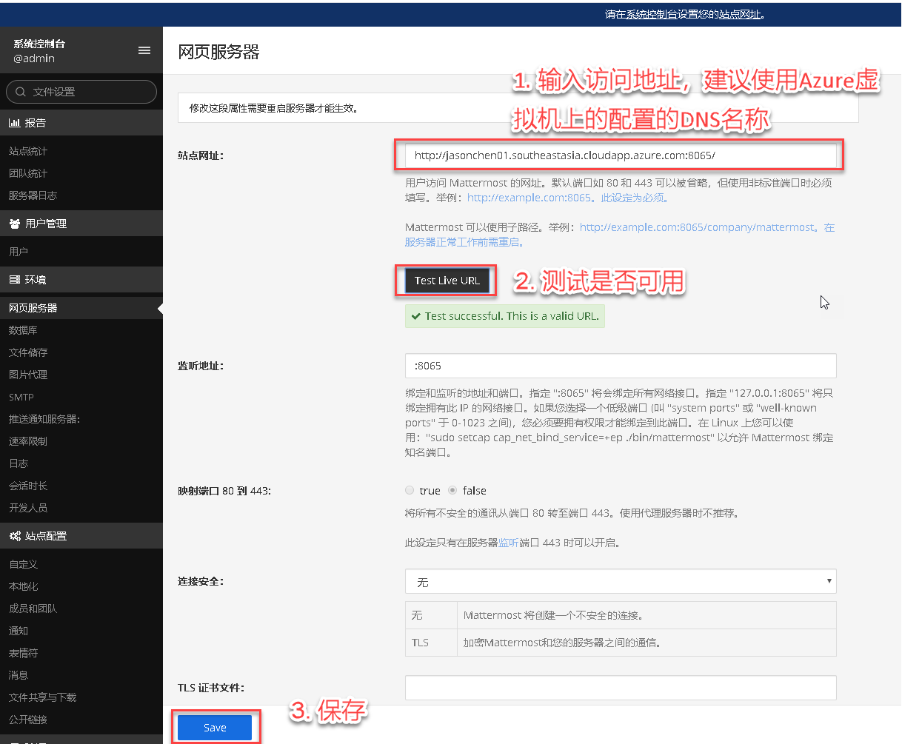
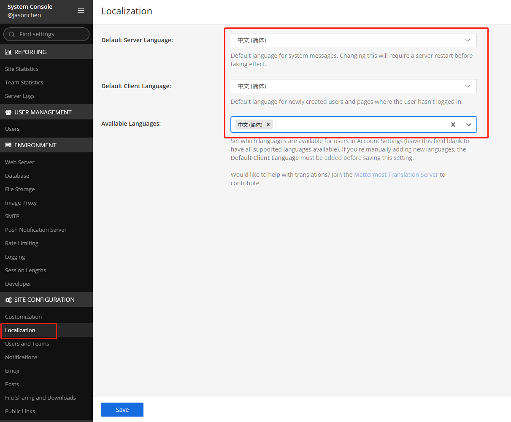
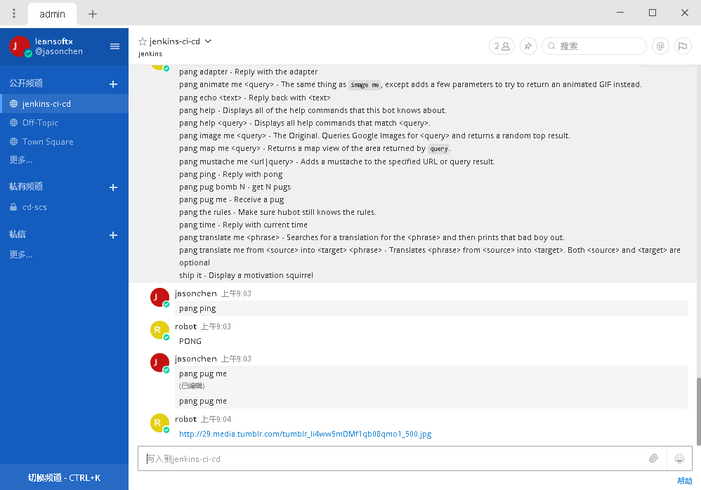
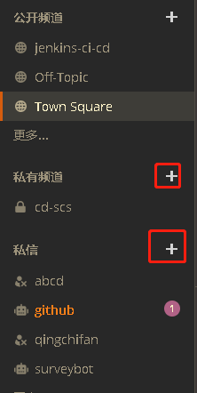

# Matter Most 上手指南

## 部署

使用docker快速部署

'docker run --name mattermost-preview -d --publish 8065:8065 mattermost/mattermost-preview'

## 配置
1.初始化 

输入邮箱地址，用户名，及登录密码，默认第一个用户的是系统管理员

选择“Create a new team” >> 输入team的名字

输入或者默认当前是后续team的链接地址，点击finish

2.本地配置

在左上角点击用户名旁边的三道杠，点击“Account Settings”，点击“Display”，点击“Language”，选择语言为“中文（简体）”，点击“save”

3.进入后台管理

点击头像旁边的“三道杠”，选择“系统控制台”

4.配置网址，把访问Mattermost的网址输入进去即可，如果是Azure虚拟机的话可以输入自己配置的DNS名称再加端口号

5.配置语言
默认的服务端语言、默认客户端语言、以及可选的语言（如果只选中文的话，客户端进入display配置时 将看不到language选项）

6.客户端

* PC

https://about.mattermost.com/downloads/

收到消息时提醒

* Android

https://about.mattermost.com/mattermost-android-app/

## 使用
1. 邀请新用户

2. 创建频道

可以在公共频道里面聊天，也可以自己创建私密的私聊频道

3. 聊天

* 回复单条留言信息

* 发送图片

截图到聊天窗口，ctrl+enter发送

## 扩展

+ [集成Jenkins](jenkins.md)
+ [集成GitHub](github.md)
