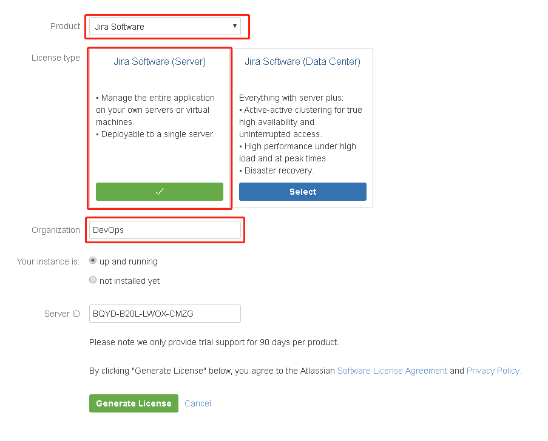
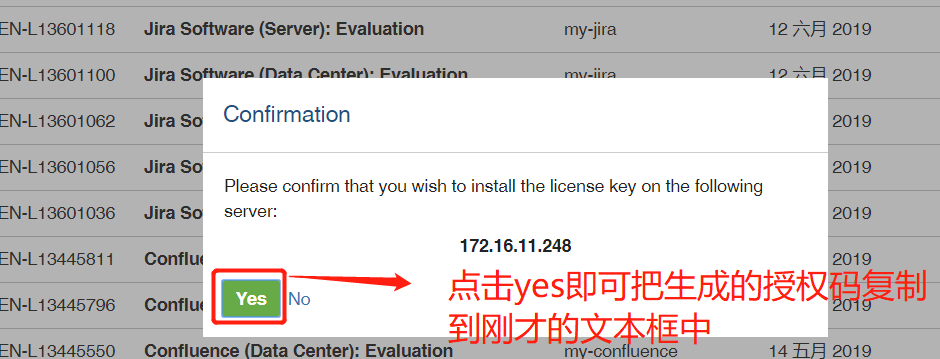
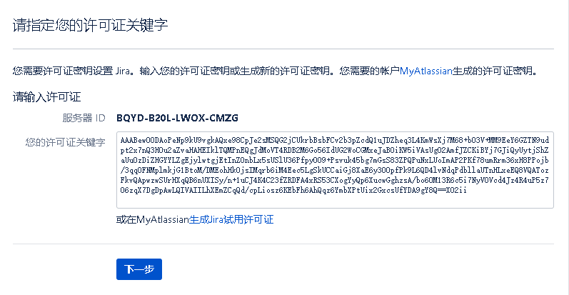
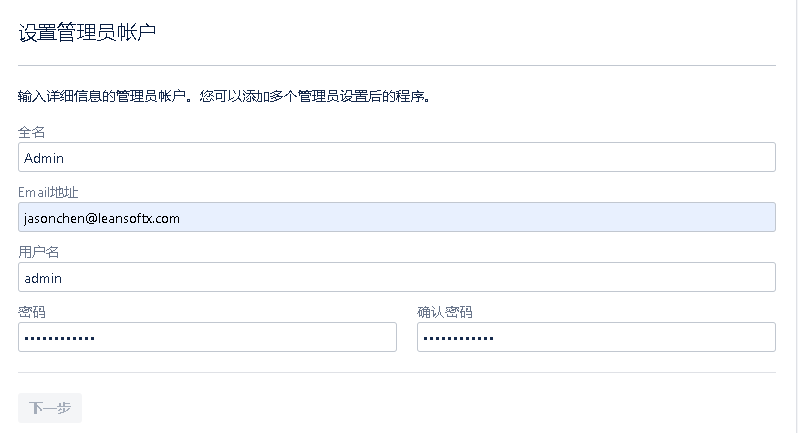
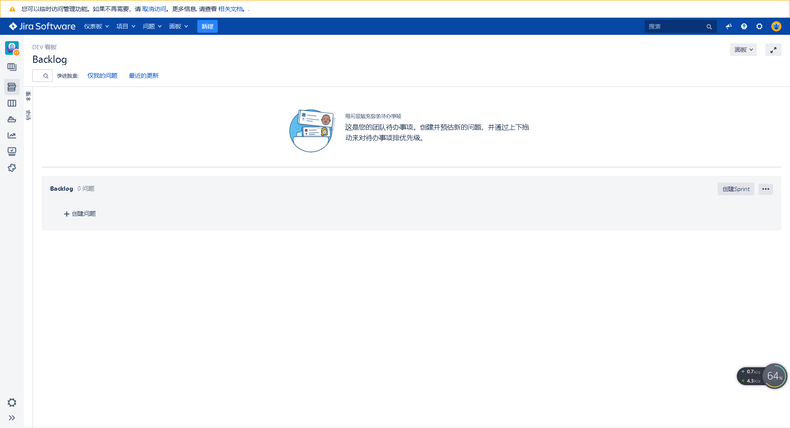

**Jira安装部署说明文档**

部署
docker 安装（如已安装，请跳过）
```
sudo apt-get update
sudo apt install docker.io
sudo usermod -a -G docker {localadmin}
sudo curl -L "https://github.com/docker/compose/releases/download/1.25.3/docker-compose-$(uname -s)-$(uname -m)" -o /usr/local/bin/docker-compose
sudo chmod +x /usr/local/bin/docker-compose
sudo systemctl daemon-reload
sudo systemctl restart docker 
```

docker 容器
```
docker run -d  -p 7081:8080 --name jira-software -v /etc/localtime:/etc/localtime:ro cptactionhank/atlassian-jira-software:8.1.0 
```
官方镜像地址：https://hub.docker.com/r/cptactionhank/atlassian-jira-software/tags

配置
1. 首页
点击 Language， 在弹窗中选择语言，点击“Save”保存

选择“我将设置它自己”，点击下一步


2. 数据库 ，选择内置（后续可以再迁移到mysql、oracle、sql server）


3. 应用程序的属性
输入程序的标题，模式选择 开放，基本URL默认即可


4. 注册
点击“生成Jira使用许可证”

在弹出的页面上选择“使用Microsoft继续”，跳转后登录Microsoft账号，后续一路按照提示操作即可

选择 Jira Software，选择 Jira Software（Server），输入机构名称，点击 Generate License 生成

点击 yes ，会自动把授权码复制到前面的文本框中

点击 下一步


5. 管理员
输入邮箱、用户名、密码，点击下一步


6. 电子邮件通知
建议后续配置，点击 完成


7. 创建项目（略）
项目创建后效果类似下图

