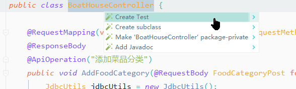

# Idea 快速创建Junit测试

## Junit 详解

JUnit是一个用于编写可复用测试集的简单框架，他是XUnit的一个子集。
Xunit是一套基于测试驱动开发的测试框架
- PythonUnit
- CppUnit
- Junit

## 创建测试
您可以使用意图操作为受支持的测试框架创建测试类。

1. 在编辑器中打开所需的类，然后将光标放在类名称上。
2. 按下Alt+Enter以调用可用action列表。
3. 选择创建测试。
	或者，您可以将光标放在类名上，然后选择“ 导航”。 从主菜单进行测试，或选择转到|。从快捷菜单中进行测试，然后点击创建新测试。
4. 在“ 创建测试”对话框中，配置所需的设置。您可以指定要使用的测试库，配置测试类名称及其位置，并选择要为其生成测试类的方法。

## 创建测试方法
要在JUnit测试类中创建存根测试方法，可以使用IntelliJ IDEA代码生成功能。
1. 在编辑器中打开相应的JUnit测试类。
2. 将光标放在要生成新测试方法的位置。
3. 按Alt+Insert并 从“ 生成”菜单中选择“ 测试方法 ” 。

## 为生成的测试类配置命名模式

默认情况下，IntelliJ IDEA Test在自动生成测试类时将后缀附加到源类名称。您可以更改测试类的命名模式。
	1. 在设置/首选项（中Ctrl+Alt+S，转到 编辑器|代码样式| Java，然后打开代码生成选项卡。
在选项卡的“ 命名”部分中，键入要用于将生成的测试类命名为相应字段的后缀或前缀（或两者）。