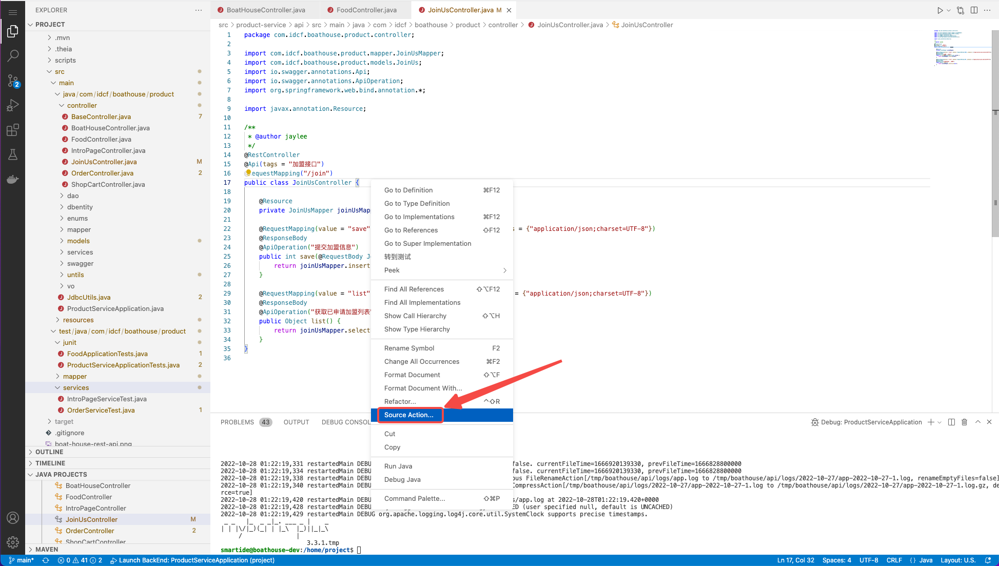
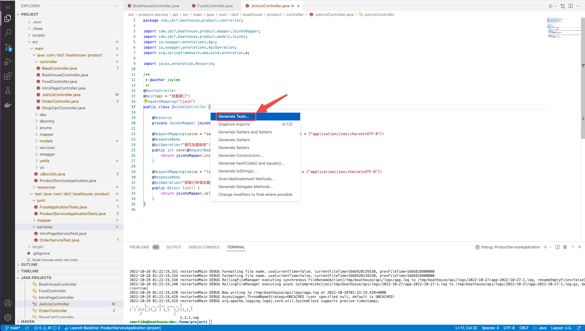
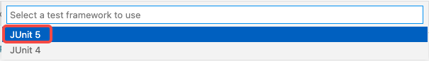
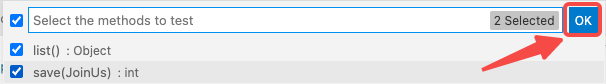
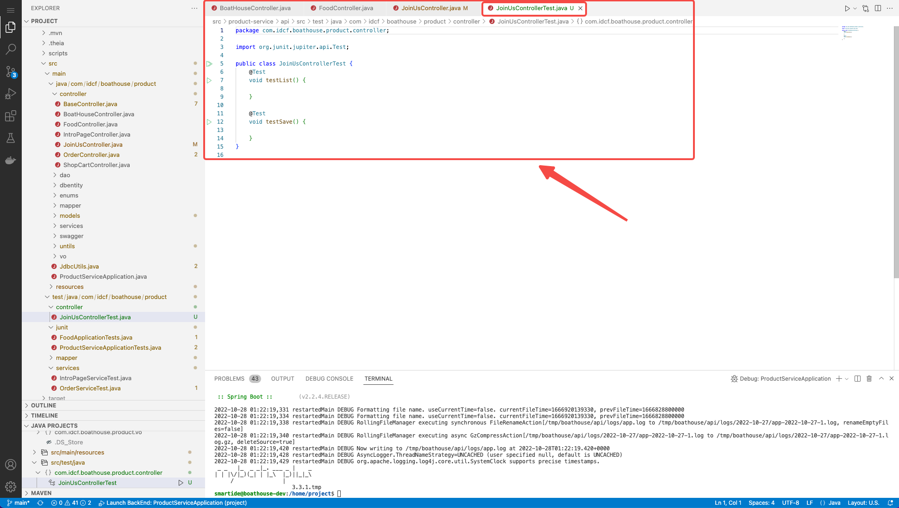
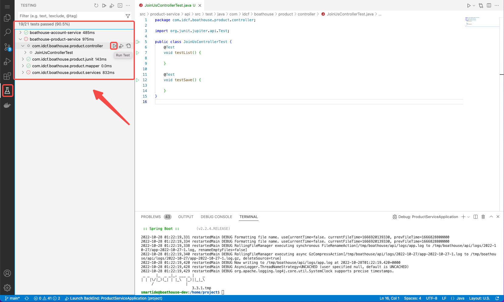
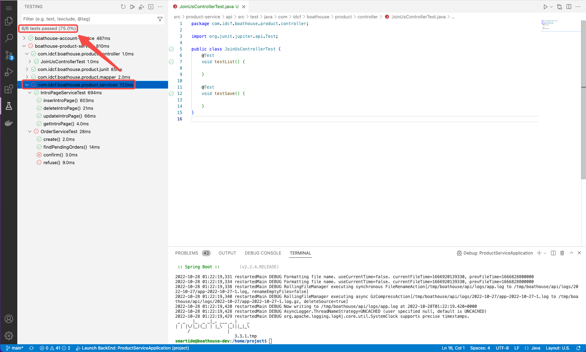

# 使用VSCode快速创建Junit测试

## Junit 详解

JUnit是一个用于编写可复用测试集的简单框架，他是XUnit的一个子集。
Xunit是一套基于测试驱动开发的测试框架，包括：
- PythonUnit
- CppUnit
- Junit

## 创建单元测试
1. 在编辑器中打开要增加单元测试的类，右键菜单中点击[Source Action]。

	

2. 在下一级菜单中，点击[Generate tests]。

	

3. 选择Junit单元测试版本。

	

4. 选择单元测试所对应被测试的类，回车。

	

5. 选择要生成单元测试的方法，点击OK。

	

6. 此时，生成了要测试类所对应的单元测试类。

	

7. 在生成的方法中，实现具体的单元测试逻辑。

## 使用VSCode工具管理单元测试

如上图所示，在Testing工具中，我们可以看到已经编写的所有测试用例，并能够运行单元测试。运行的范围可以为：
- 全部单元测试
- 项目级单元测试
- 单元测试类
- 单元测试或方法
并且，工具会为我们汇总，不同级别单元测试的运行后的通过率结果。

---
参考资料：
- [Testing Java with Visual Studio Code](https://code.visualstudio.com/docs/java/java-testing)