# Azure快速搭建K8s环境

### Azure订阅配置
此文档将指导大家使用 PowerShell 脚本在 Azure 中创建 K8s环境资源，因此首先我们需要创建能赋予PS脚本访问操作Azure服务权限的资源。

PS脚本将使用Azure Service Principal 授权的方式来访问 Azure 服务，有关 Service Principal 的具体详情可参考：

- [Application and service principal objects in Azure Active Directory](https://docs.microsoft.com/en-us/azure/active-directory/develop/app-objects-and-service-principals#service-principal-object)

- [How to: Use the portal to create an Azure AD application and service principal that can access resources](https://docs.microsoft.com/en-us/azure/active-directory/develop/howto-create-service-principal-portal)


#### 创建 Service Principal
1. 打开 [Azure China](https://portal.azure.cn/)，并使用给予大家的订阅账号登陆：

1. 登陆成功进入Portal界面：

1. 点击 AAD -> App registrations -> New registrations 来创建 Service Principal

1. 输入名称如‘k8s-sp’，其余项维持默认即可，点击 Register

1. 创建成功后，进入到详情页面，记录下Application ID的值，后续步骤会用到
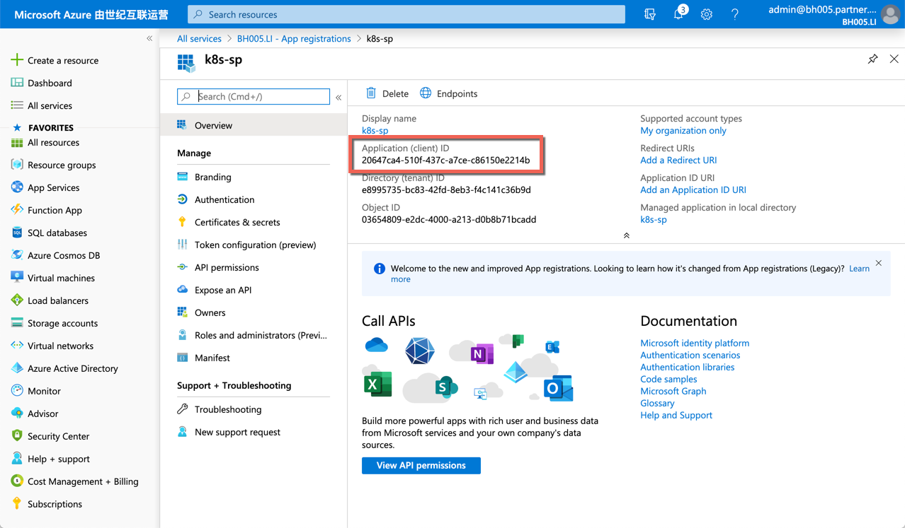
1. 点击 Certificates & secrets，选择创建一个客户端密钥，并输入密钥描述，点击创建

1. 密钥创建完毕，保存密钥的value值，后面会用得到
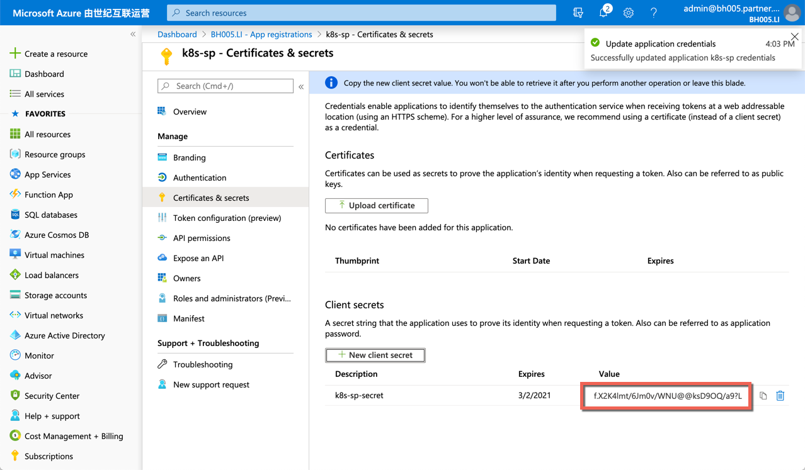

    >至此创建 Service Principal 完毕，我们已经拿到此 SP 的 Application ID 和密钥，接下来给此SP赋予权限以便在之后的步骤中能够根据 Application ID 和密钥调用对应权限的 Azure 服务.

#### 给 Service Principal 授权
1. 点击左侧菜单栏 'All Services'，选择 ‘Subscriptions’进入订阅列表界面
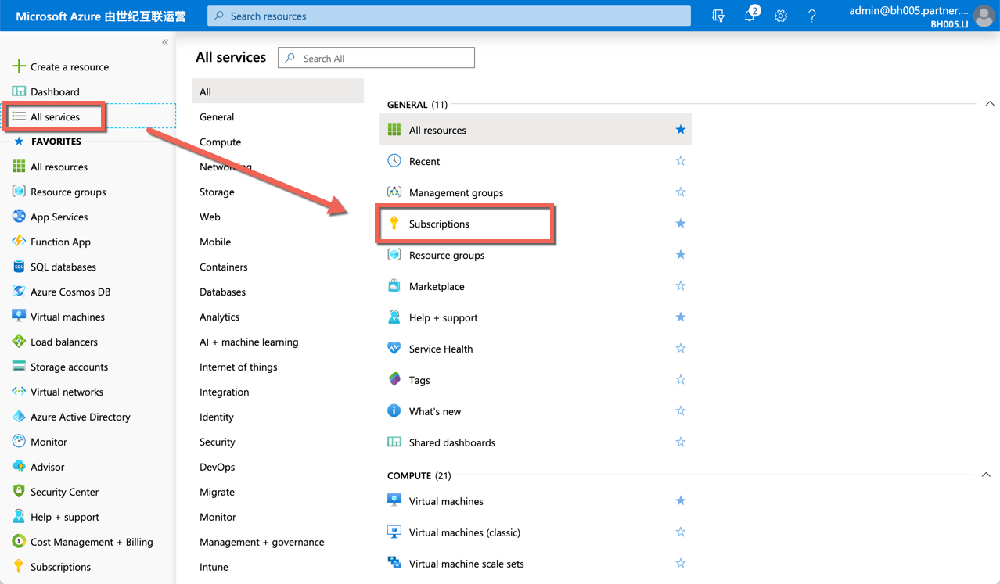
在主页中点击当前订阅，进入订阅详情页面
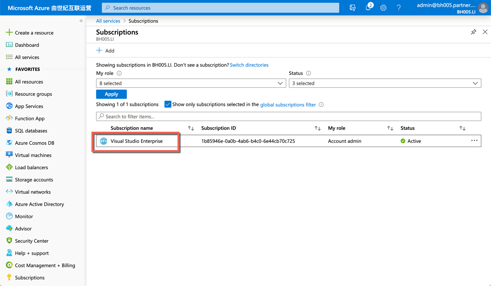
1. 在订阅详情页面点击‘Access control(IAM)’，并添加一个新的role assignment

1. 新建选项中选择'Owner'角色（最大权限），在赋予对象处填写之前创建的SP名称'k8s-sp'，搜索出结果后点击它，将其添加到已选择对象中，最后保存
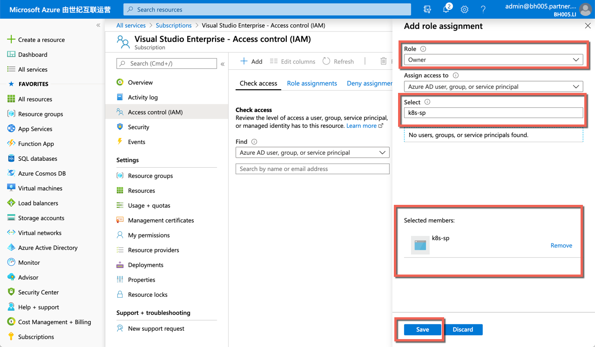
1. 保存完成后，点击Role Assignments列表，查看已经添加完毕
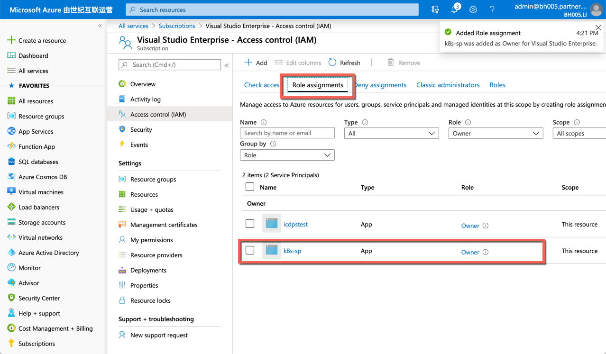

至此给 Service Principal 赋权已经完成，Azure 资源配置结束，接下来我们将使用以上创建的 Azure 资源作为环境变量来运行 Power Shell 脚本，创建出我们的 K8s 服务。

### 创建 K8s 服务

#### 下载部署源代码

我们将使用Power Shell脚本链接 Azure Service 部署 K8s 服务，需要提前下载脚本代码。

1. 打开idcf [boat-house 基础设施库](https://github.com/idcf-boat-house/boat-house-infrastructure) 项目，clone repo到本地
   
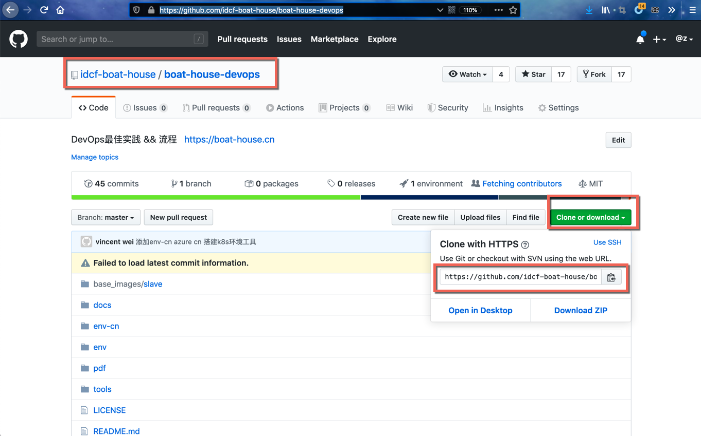
1. 下载完毕，源代码下'env-cn文'件夹中的'env-generator.ps1'即为部署脚本，使用编辑器打开'env-generator.ps1'文件后，我们可以看到脚本运行需要 5 个参数：

参数释义如下：
    |Parameter|Description|
    |----|----|
    | $AzureUserName|登陆 Azure 订阅的用户名|
    | $AzureUserPwd| 登陆 Azure 订阅的密码|
    | $SubscriptionName| Azure 订阅名称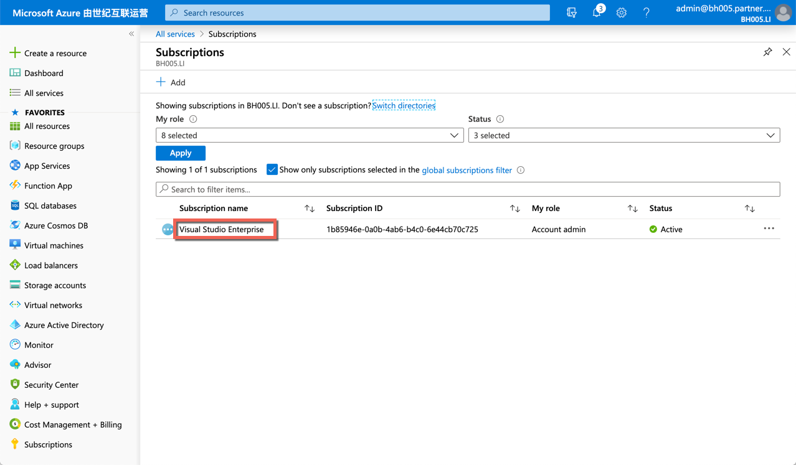|
    | $AzureSPApplicationId| 配置Azure 章节中记录的 Service Principal 的 Application ID|
    | $AzureSPApplicationKey| 配置Azure 章节中记录的 Service Principal 的密钥|
1. 在此具体介绍以下 Power Shell 脚本中代码的原理：
    - k8s文件夹下的 'aks-engine' 文件夹包含 Azure Kubernetes Services engine 工具，此工具可以基于特定格式的 Json 脚本文件生成部署Azure资源所使用的ARM 模版：
    
    关于AKS-Engine和ARM模版的具体细节，大家可以参考：
    [AKS-Engine](https://github.com/Azure/aks-engine)
    [ARM](https://docs.microsoft.com/en-us/azure/azure-resource-manager/management/overview)
    - k8s文件夹下的 'kubernetes.json' 是生成 K8s arm 模版的配置文件，即上面所说的‘AKS-Engine’使用的配置文件。
    此文件描述了所需要生成的K8s环境的详细信息：
    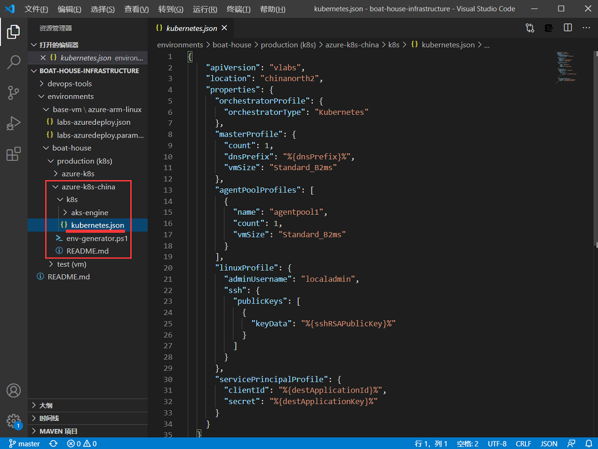
    - Power Shell 脚本运行时首先替换掉 'kubernetes.json' 文件中的以下四个环境变量
    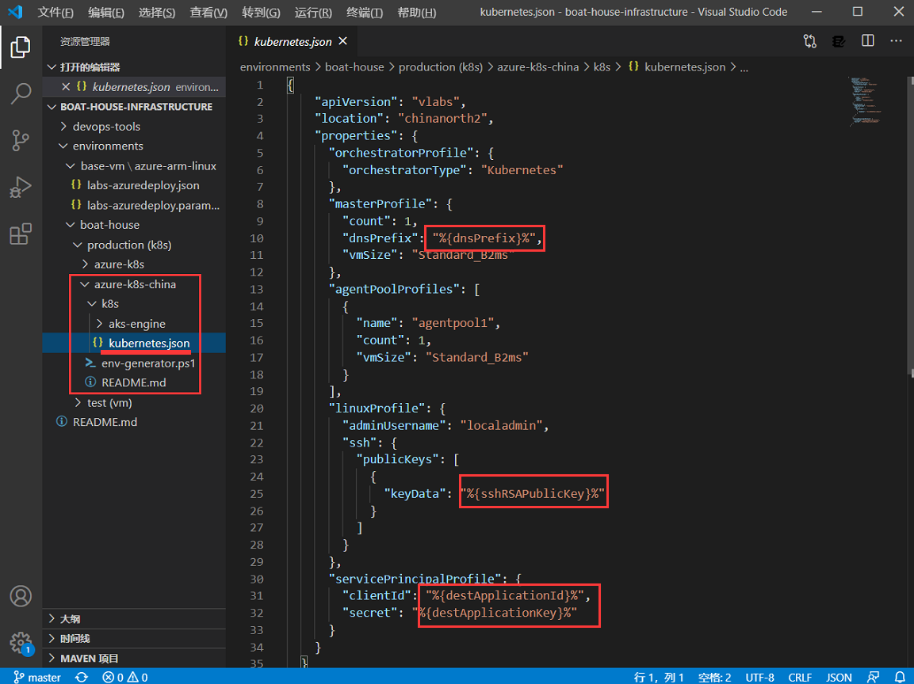
    其中 ssh 的密钥是通过 git 安装目录下的 ssh-keygen.exe 生成的一对公钥和私钥，**大家要注意保存好生成的私钥也就是 ’k8s/temp/ssh/id_rsa‘ 文件，k8s环境创建完毕后，需要使用此私钥链接结点**。
    - 然后使用 'AKS-Engine' 生成 K8s的 ARM模版. (Temp文件夹中的内容将会在运行PS脚本文件时生成)
    
    - 最后使用 'AZ CLI' 工具登陆 Azure China，并创建指定名称的Resource Group，在此 Resource Group 中基于 ARM 模版部署 K8s的集群环境。
    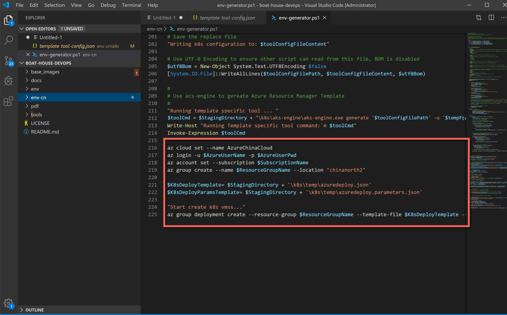

#### 部署前依赖安装
通过上一章节的介绍，我们知道运行部署脚本之前需要先安装脚本所需的依赖，依赖包括：
1. ssh-keygen.exe：用以生成ssh公钥私钥
    - 安装方式：[安装 git](https://git-scm.com/book/zh/v2/%E8%B5%B7%E6%AD%A5-%E5%AE%89%E8%A3%85-Git) 即可在路径'C:\Program Files\Git\usr\bin\ssh-keygen.exe'下找到此工具。
1. AZ CLI：用以连接 Azure China 并创建 Resource Group ，基于ARM模版部署 K8s 集群环境。
    - 安装方式：[安装 Azure CLI](https://docs.microsoft.com/zh-cn/cli/azure/install-azure-cli?view=azure-cli-latest)

#### 运行部署脚本 'env-generator.ps1'
1. 使用power shell 进入脚本所在文件夹：
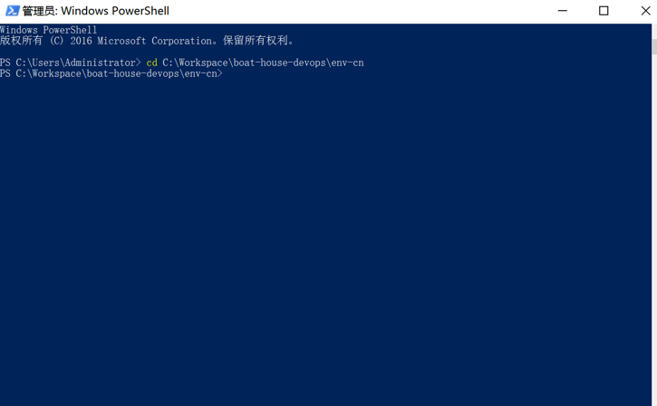
1. 运行以下命令来启动 ps1 脚本程序：
    ```
    .\env-generator.ps1 -AzureUserName <azure用户名> -AzureUserPwd <azure用户密码> -SubscriptionName <azure订阅名称> -AzureSPApplicationId <上面创建的Application Id> -AzureSPApplicationKey <上面创建的Application密钥>
    ```
    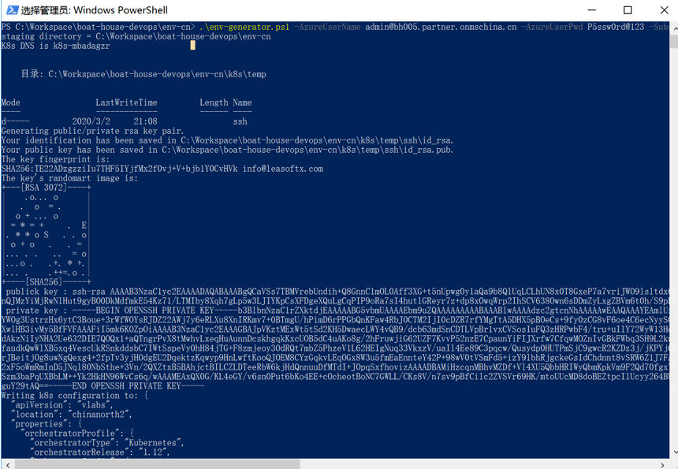
1. 执行完毕后，进入Azure China Portal 查看新创建的 Resource Group 以及部署在此 Resource Group 中的 K8s环境
   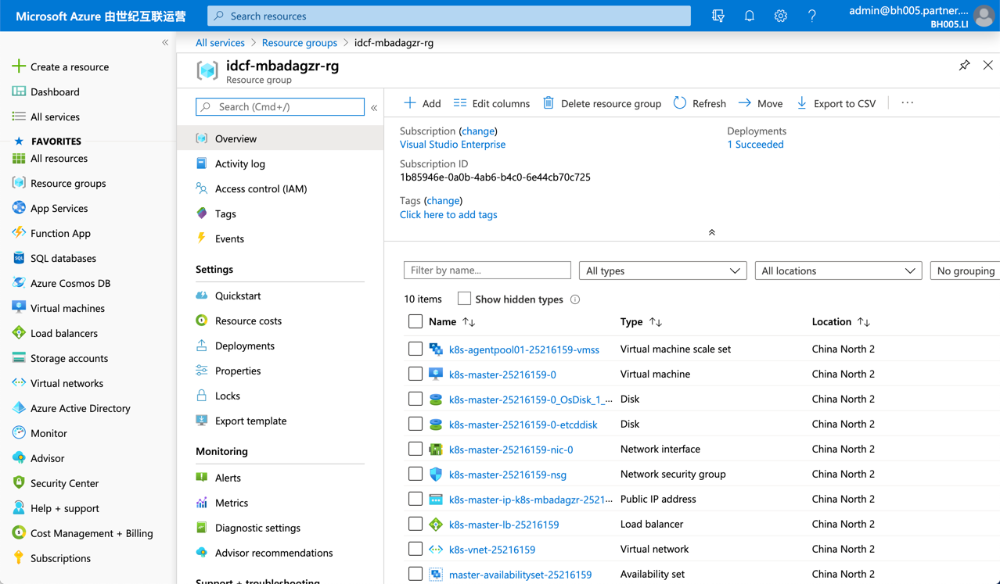

### 恭喜你，部署成功！
