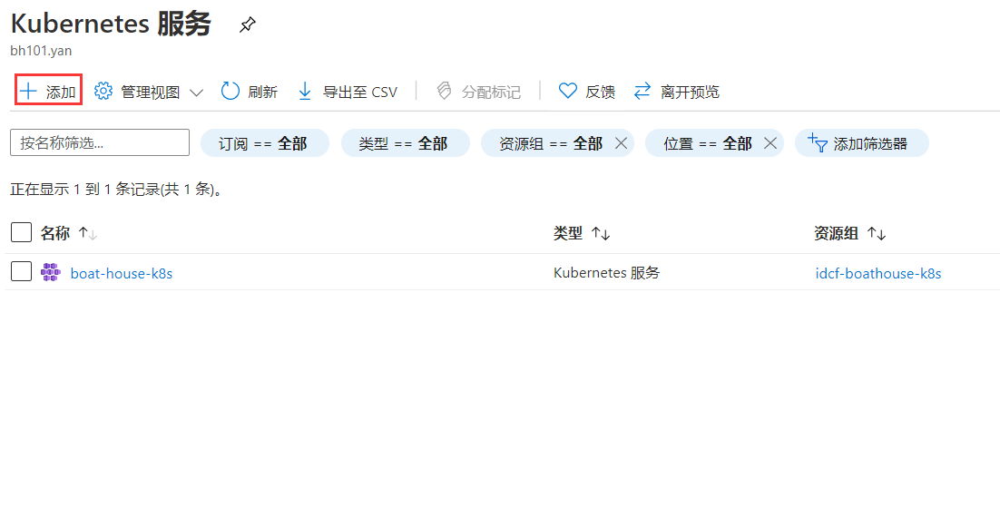
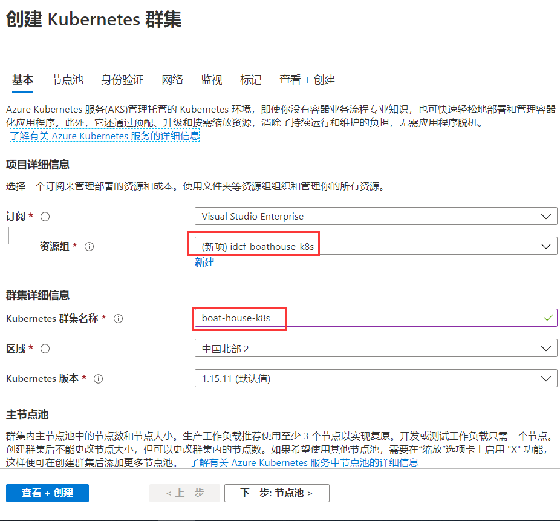
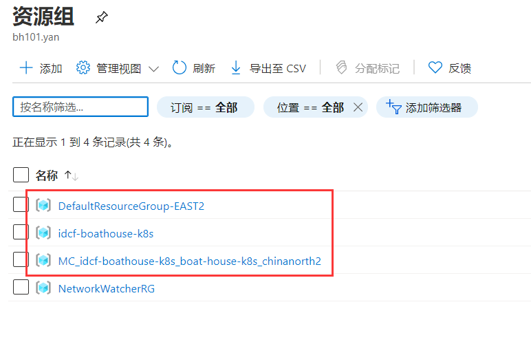

1.  打开并登陆azure 门户, 找到k8s服务，或直接打开*此链接*，点击添加。

1.  进入创建aks集群向导，其他选项都可按默认下一步，最后点击创建即可。

1.  等待创建成功，创建成功后可看到类似下图的资源 组：

1.  执行以下命令获取k8s kube配置文件：az aks get-credentials --resource-group
    idcf-boathouse-k8s --name boat-house-k8s 。执行前请登陆上一节提到的订阅。

2.  执行命令获取配置文件：cat .kube\\config，然后将config内容复制出来。

3.  将上一步复制的内容更新至(如果没有此变量则新建) jenkins的环境变更 中

4.  将上一步复制的内容更新至(如果没有此变量则新建) Github的Secret中

5.  f
