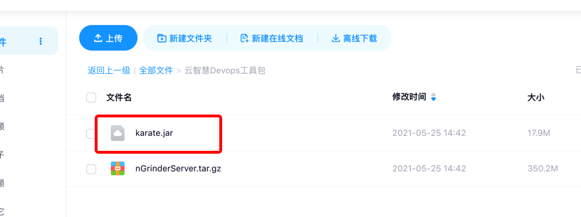
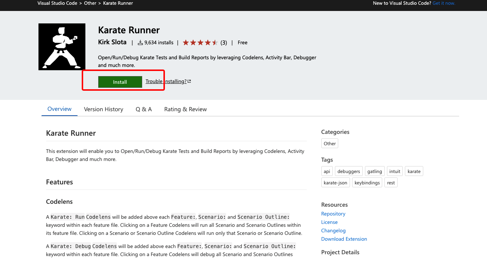
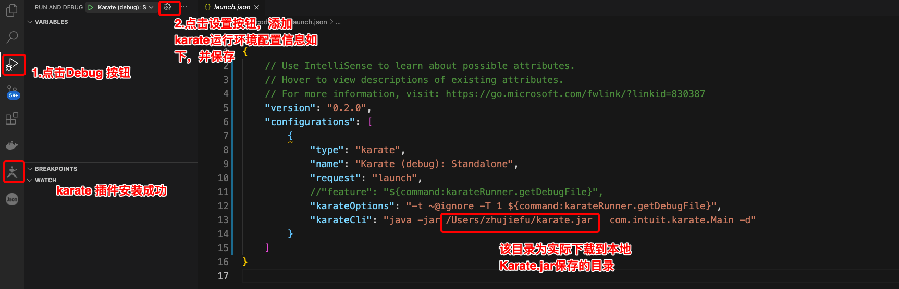
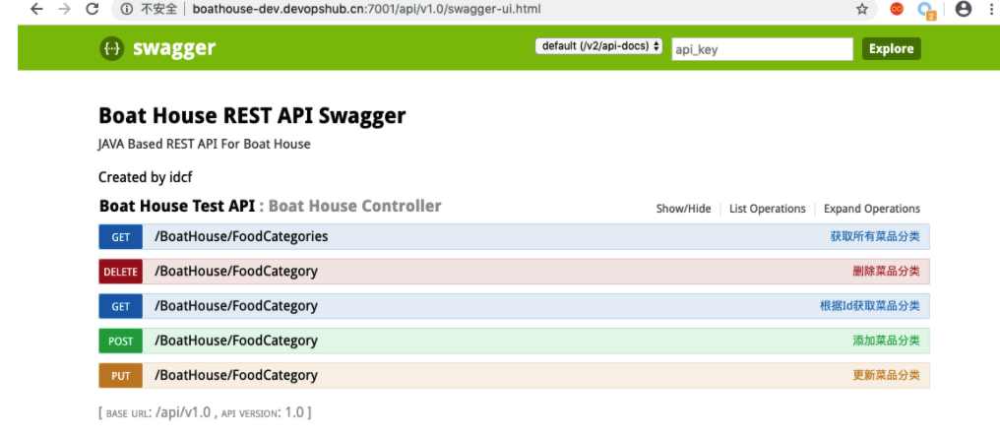
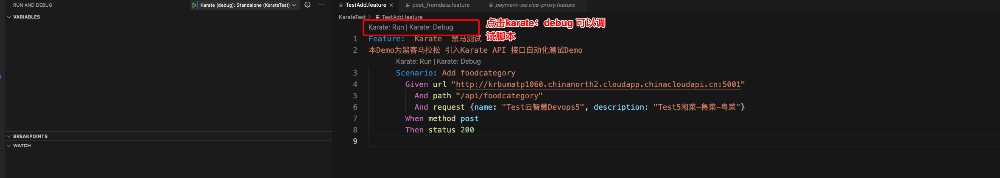
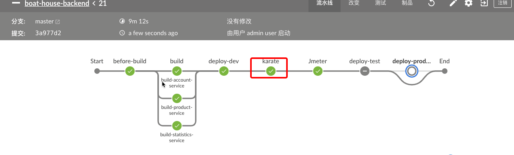
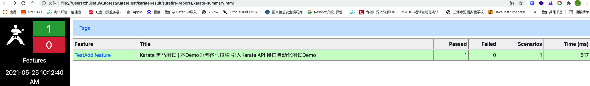
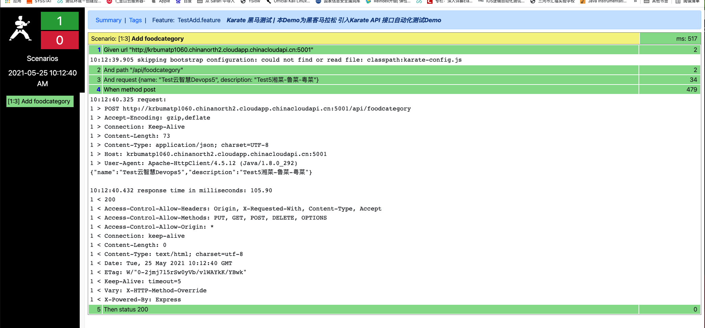

## **Karate接口自动化测试指南**

### **一.Karate-脚本开发环境准备**

####   **a.安装JDK1.8.152 以上版本（c.步骤中nGrinderServer 内包含JDK安装包）**

####   **b.安装IDE**   VSCODE https://code.visualstudio.com/Download


#### **c.下载Karate.jar**到自己电脑，放到指定目录下，如/Users/用户名目录，下载 地址：链接: https://pan.baidu.com/s/1Ip3kvju2nia1jXvtBDlTeA 提取码: jxxv ,后者扫二维码下载 "karate.jar"

|  |  |
| ----------------------------------------------------------- | ------------------------------------------------------ |

#### d.启动VSCODE后，安装karate -插件 https://marketplace.visualstudio.com/items?itemName=kirkslota.karate-runner




#### 安装Karate插件后，进行运行设置，具体如下图：



#### e.设置lanche.json（可以修改）

```json
{
    // Use IntelliSense to learn about possible attributes.
    // Hover to view descriptions of existing attributes.
    // For more information, visit: https://go.microsoft.com/fwlink/?linkid=830387
    "version": "0.2.0",
    "configurations": [
        {
            "type": "karate",
            "name": "Karate (debug): Standalone",
            "request": "launch",
            //"feature": "${command:karateRunner.getDebugFile}",
            "karateOptions": "-t ~@ignore -T 1 ${command:karateRunner.getDebugFile}",
            "karateCli": "java -jar /Users/zhujiefu/karate.jar   com.intuit.karate.Main -d"
        }
    ]
}
```


**备注：1.如果本地已经安装有Karate脚本编写环境可以跳过第一步**

​          **2.加粗字体根据c步骤下载Karate.jar 具体保存目录，进行替换，切记**


### **二.Karate-API脚本开发及Jenkins配置**

1.Demo API 接口信息



#### **2.以添加菜品接口为例，**在VSCODE中新建 addFoodcaeGory.feature ，脚本样例如下：

```gherkin
Feature:  Karate  黑马测试
本Demo为黑客马拉松 引入Karate API 接口自动化测试Demo
      Scenario: Add foodcategory
        Given url "http://krbumatp1060.chinanorth2.cloudapp.chinacloudapi.cn:5001"
          And path "/api/foodcategory"
          And request {name: "Test云智慧Devops5", description: "Test5湘菜-鲁菜-粤菜"}
        When method post
        Then status 200

```

**备注**：**url** :接口地址

​           **path**:接口路径

​          **request**  请求报文

​          **method**： 接口的请求方法（POST、GET、PUT、DELETE等根据实际接口情况进行变化，具体参考下面帮助文档）

​         **status**： 断言响应报文 (可以有深度断言具体参考：karate帮助文档：https://intuit.github.io/karate/)



#### **3.与Jenkins在流程中执行自动化测试：**

#####   **a. 将karate.jar 和自动化脚本" addFoodcaeGory.feature" 上传至  Jenkins服务器**，指定目录下，如： /home/ghuser 

##### **b.编写驱动自动化执行shell 脚本**，样例如下：RunKarate.sh


```shell
#!/bin/bash
#get current_path
current_path=$(cd "$(dirname "$0")"; pwd)
#检查报告目录是否存在
if [ ! -d "${current_path}/karateResult" ];
then
 mkdir -p "${current_path}/karateResult"
fi
#run AuotoTest feature
java -jar ${current_path}/karate.jar -o ./karateResult/  ${current_path}/TestAdd.feature & 
```

**备注：需要给脚本添加执行权限 chmod +x ./RunKarate.sh**

**c.在项目的Jenkinsfile文件中，添加KarateTest测试的stage，代码如下:**


##### **Jenkins配置样例代码如下：**

```groovy
// 基于dev环境进行karate测试
        stage('karate') {
          steps {
            script{
                echo "waitting for the sevice up...jeff"
                sh "/home/ghuser/RunKarate.sh"
                sh "pwd"
                publishHTML([allowMissing: false, alwaysLinkToLastBuild: false, keepAll: true, reportDir: '/home/ghuser/karateResult/surefire-reports', reportFiles: 'karate-summary.html', reportName: 'karate Report', reportTitles: ''])
            }
          }
        }
```


##### **f.正常执行pipeline（参考Jenkins流水线文档）**部署成功后如下下图；




**g.Karate 测试报告如下图：**



报告详细结果：



