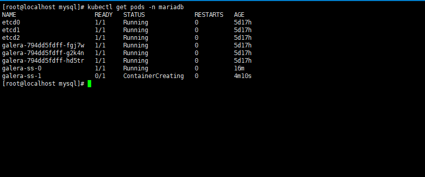
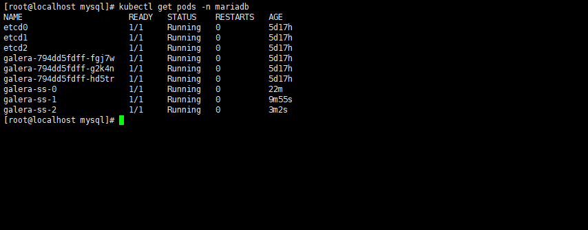

## 3.3 部署mysql集群

### 3.3.1 创建namespace

在本地windows机器所安装的kubectl工具所在的目录，创建名为"mariadb"的namespace，指令为：kubectl create namespace mariadb


### 3.3.2 创建etcd-cluster

创建mysql集群中的集群网络环境，用于主从节点之间的通信。

在本地windows机器所安装的kubectl工具所在的目录，创建etcd-cluster.yml文件，然后执行如下指令：

kubectl create -f etcd-cluster.yml -n mariadb

```
apiVersion: v1
kind: Service
metadata:
  name: etcd-client
spec:
  ports:
  - name: etcd-client-port
    port: 2379
    protocol: TCP
    targetPort: 2379
  selector:
    app: etcd

---

apiVersion: v1
kind: Pod
metadata:
  labels:
    app: etcd
    etcd_node: etcd0
  name: etcd0
spec:
  containers:
  - command:
    - /usr/local/bin/etcd
    - --name
    - etcd0
    - --initial-advertise-peer-urls
    - http://etcd0:2380
    - --listen-peer-urls
    - http://0.0.0.0:2380
    - --listen-client-urls
    - http://0.0.0.0:2379
    - --advertise-client-urls
    - http://etcd0:2379
    - --initial-cluster
    - etcd0=http://etcd0:2380,etcd1=http://etcd1:2380,etcd2=http://etcd2:2380
    - --initial-cluster-state
    - new
    image: quay.io/coreos/etcd:latest
    name: etcd0
    ports:
    - containerPort: 2379
      name: client
      protocol: TCP
    - containerPort: 2380
      name: server
      protocol: TCP
  restartPolicy: Never

---

apiVersion: v1
kind: Service
metadata:
  labels:
    etcd_node: etcd0
  name: etcd0
spec:
  ports:
  - name: client
    port: 2379
    protocol: TCP
    targetPort: 2379
  - name: server
    port: 2380
    protocol: TCP
    targetPort: 2380
  selector:
    etcd_node: etcd0

---

apiVersion: v1
kind: Pod
metadata:
  labels:
    app: etcd
    etcd_node: etcd1
  name: etcd1
spec:
  containers:
  - command:
    - /usr/local/bin/etcd
    - --name
    - etcd1
    - --initial-advertise-peer-urls
    - http://etcd1:2380
    - --listen-peer-urls
    - http://0.0.0.0:2380
    - --listen-client-urls
    - http://0.0.0.0:2379
    - --advertise-client-urls
    - http://etcd1:2379
    - --initial-cluster
    - etcd0=http://etcd0:2380,etcd1=http://etcd1:2380,etcd2=http://etcd2:2380
    - --initial-cluster-state
    - new
    image: quay.io/coreos/etcd:latest
    name: etcd1
    ports:
    - containerPort: 2379
      name: client
      protocol: TCP
    - containerPort: 2380
      name: server
      protocol: TCP
  restartPolicy: Never

---

apiVersion: v1
kind: Service
metadata:
  labels:
    etcd_node: etcd1
  name: etcd1
spec:
  ports:
  - name: client
    port: 2379
    protocol: TCP
    targetPort: 2379
  - name: server
    port: 2380
    protocol: TCP
    targetPort: 2380
  selector:
    etcd_node: etcd1

---

apiVersion: v1
kind: Pod
metadata:
  labels:
    app: etcd
    etcd_node: etcd2
  name: etcd2
spec:
  containers:
  - command:
    - /usr/local/bin/etcd
    - --name
    - etcd2
    - --initial-advertise-peer-urls
    - http://etcd2:2380
    - --listen-peer-urls
    - http://0.0.0.0:2380
    - --listen-client-urls
    - http://0.0.0.0:2379
    - --advertise-client-urls
    - http://etcd2:2379
    - --initial-cluster
    - etcd0=http://etcd0:2380,etcd1=http://etcd1:2380,etcd2=http://etcd2:2380
    - --initial-cluster-state
    - new
    image: quay.io/coreos/etcd:latest
    name: etcd2
    ports:
    - containerPort: 2379
      name: client
      protocol: TCP
    - containerPort: 2380
      name: server
      protocol: TCP
  restartPolicy: Never

---

apiVersion: v1
kind: Service
metadata:
  labels:
    etcd_node: etcd2
  name: etcd2
spec:
  ports:
  - name: client
    port: 2379
    protocol: TCP
    targetPort: 2379
  - name: server
    port: 2380
    protocol: TCP
    targetPort: 2380
  selector:
    etcd_node: etcd2

```

查看创建结果：


### 3.3.3 创建pvc

用于存储mysql的数据文件，因为有三套主从节点，因此创建三个pvc。

在本地windows机器所安装的kubectl工具所在的目录，创建mariadb-pvc.yml文件，然后执行如下指令：

kubectl create -f mariadb-pvc.yml -n mariadb

```
apiVersion: v1
kind: PersistentVolumeClaim
metadata:
  name: mysql-datadir-galera-ss-0
spec:
  accessModes:
  - ReadWriteOnce
  storageClassName: managed-premium
  resources:
    requests:
      storage: 5Gi

---

apiVersion: v1
kind: PersistentVolumeClaim
metadata:
  name: mysql-datadir-galera-ss-1
spec:
  accessModes:
  - ReadWriteOnce
  storageClassName: managed-premium
  resources:
    requests:
      storage: 5Gi

---

apiVersion: v1
kind: PersistentVolumeClaim
metadata:
  name: mysql-datadir-galera-ss-2
spec:
  accessModes:
  - ReadWriteOnce
  storageClassName: managed-premium
  resources:
    requests:
      storage: 5Gi
```

查看创建结果：


### 3.3.4 创建rs

创建主节点，提供对外访问的endpoint。

在本地windows机器所安装的kubectl工具所在的目录，创建mariadb-rs.yml文件，然后执行如下指令：

kubectl create -f mariadb-rs.yml -n mariadb

```
apiVersion: v1
kind: Service
metadata:
  name: galera-rs
  labels:
    app: galera-rs
spec:
  type: NodePort
  ports:
    - nodePort: 30000
      port: 3306
  selector:
    app: galera

---

apiVersion: extensions/v1beta1
kind: Deployment
metadata:
  name: galera
  labels:
    app: galera
spec:
  replicas: 3
  strategy:
    type: Recreate
  template:
    metadata:
      labels:
        app: galera
    spec:
      containers:
      - name: galera
        image: severalnines/mariadb:10.1
        env:
        # kubectl create secret generic mysql-pass --from-file=password.txt
        - name: MYSQL_ROOT_PASSWORD
          value: myrootpassword
        - name: DISCOVERY_SERVICE
          value: etcd-client:2379
        - name: XTRABACKUP_PASSWORD
          value: password
        - name: CLUSTER_NAME
          value: mariadb_galera
        - name: MYSQL_DATABASE
          value: mydatabase
        - name: MYSQL_USER
          value: myuser
        - name: MYSQL_PASSWORD
          value: myuserpassword
        ports:
        - name: mysql
          containerPort: 3306
        readinessProbe:
          exec:
            command:
            - /healthcheck.sh
            - --readiness
          initialDelaySeconds: 120
          periodSeconds: 1
        livenessProbe:
          exec:
            command:
            - /healthcheck.sh
            - --liveness
          initialDelaySeconds: 120
          periodSeconds: 1

```

查看创建结果，会有三个pod：


### 3.3.5 创建ss

创建从节点，从节点会去连接之前创建好的主节点。

在本地windows机器所安装的kubectl工具所在的目录，创建mariadb-ss.yml文件（文件内容请参考附件），然后执行如下指令：

kubectl create -f mariadb-ss.yml -n mariadb

```
apiVersion: v1
kind: Service
metadata:
  name: galera-ss
  labels:
    app: galera-ss
spec:
  ports:
  - port: 3306
    name: mysql
  clusterIP: None
  selector:
    app: galera-ss

---

apiVersion: apps/v1beta1
kind: StatefulSet
metadata:
  name: galera-ss
spec:
  serviceName: "galera-ss"
  replicas: 3
  template:
    metadata:
      labels:
        app: galera-ss
    spec:
      containers:
      - name: galera
        image: jijeesh/mariadb:10.1
        ports:
        - name: mysql
          containerPort: 3306
        env:
        # kubectl create secret generic mysql-pass --from-file=password.txt
        - name: MYSQL_ROOT_PASSWORD
          value: myrootpassword
        - name: DISCOVERY_SERVICE
          value: etcd-client:2379
        - name: XTRABACKUP_PASSWORD
          value: password
        - name: CLUSTER_NAME
          value: mariadb_galera_ss
        - name: MYSQL_DATABASE
          value: mydatabase
        - name: MYSQL_USER
          value: myuser
        - name: MYSQL_PASSWORD
          value: myuserpassword
        readinessProbe:
          exec:
            command:
            - /healthcheck.sh
            - --readiness
          initialDelaySeconds: 120
          periodSeconds: 1
        livenessProbe:
          exec:
            command:
            - /healthcheck.sh
            - --liveness
          initialDelaySeconds: 120
          periodSeconds: 1
        volumeMounts:
        - name: mysql-datadir
          mountPath: /var/lib/mysql
  volumeClaimTemplates:
  - metadata:
      name: mysql-datadir
    spec:
      accessModes: [ "ReadWriteOnce" ]
      resources:
        requests:
          storage: 5Gi

```

查看创建的pod，每个pod连接成功之后，才进行下一个pod的创建：



### 3.3.6 查看pod

以上步骤都执行完成之后，查看pod的数量，如果有以下的pod，则表示部署成功：



