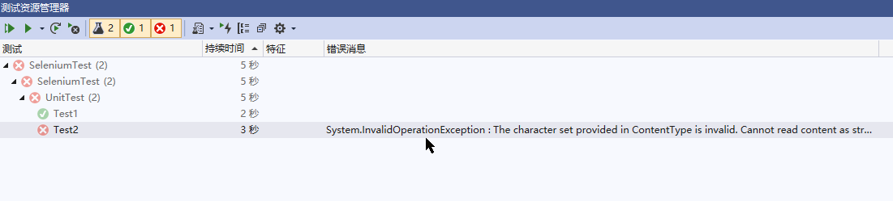

# Selenium Grid本地实现自动化UI测试


## Selenium Grid工作原理

Selenium Grid实际它是基于Selenium RC的，而所谓的分布式结构就是由一个hub节点和若干个node代理节点组成。Hub用来管理各个代理节点的注册信息和状态信息，并且接受远程客户端代码的请求调用，然后把请求的命令转发给代理节点来执行。下面结合环境部署来理解Hub与node节点的关系。

## 本地启动Selenium Grid

*docker-compose.yml*

```yml
version: "3"
services:
  selenium-hub:
    image: selenium/hub:3.141.59-bismuth
    container_name: selenium-hub
    ports:
      - "4444:4444"
  chrome:
    image: selenium/node-chrome:3.141.59-bismuth
    depends_on:
      - selenium-hub
    environment:
      - HUB_HOST=selenium-hub
      - HUB_PORT=4444
  firefox:
    image: selenium/node-firefox:3.141.59-bismuth
    depends_on:
      - selenium-hub
    environment:
      - HUB_HOST=selenium-hub
    - HUB_PORT=4444
```

*启动两个chrome、两个firefox 节点* 

```bash
 docker-compose up -d --scale chrome=2 --scale firefox=2
```


## 运行本地测试用例

*示例代码*

```c#
public abstract class BaseTest
{
    private IWebDriver _driver;

    public string Url => "http://52.187.72.74:5001/#/FoodCategory";

    public IWebDriver GetDriver(DriverOptions options)
    {
        //InternetExplorerOptions Options = new InternetExplorerOptions();
        if (_driver == null)
        {
            _driver = new RemoteWebDriver(new Uri("http://localhost:4444/wd/hub/"), options.ToCapabilities(), TimeSpan.FromSeconds(600));
        }

        return _driver;
    }
}

    
```

```c#
[Fact]
public void AddFoodCategory()
{

    using (var driver = GetDriver(new ChromeOptions()))
    {
        driver.Navigate().GoToUrl(Url);
        driver.FindElement(By.CssSelector(".btn-primary")).Click();

        driver.FindElement(By.Id("food-category-name")).Click();
        driver.FindElement(By.Id("food-category-name")).Click();

        driver.FindElement(By.Id("food-category-name")).SendKeys("蔬菜");
        driver.FindElement(By.Id("food-category-description")).Click();
        driver.FindElement(By.Id("food-category-description")).SendKeys("蔬菜");
        //var text = driver.FindElement(By.Id("food-category-description")).GetProperty("value");
        driver.FindElement(By.CssSelector("#add-modal .btn-outline-primary")).Click();
        var latsTitle = driver.FindElement(By.CssSelector(".el-table__fixed-body-wrapper .el-table__row:last-child .el-table_1_column_3 .cell")).GetProperty("innerHTML");
        Assert.Equal("蔬菜", latsTitle);
    }
}
```

*测试结果*

