# 使用标准化容器化开发环境，快速进行代码开发调试

**背景介绍** ：

> 目前很多团队已经公司都已经完成了运维端的容器化转型，通过Docker以及Kuberntes提供的能力，帮助团队快速完成应用的部署以及回滚。我们能体会到
容器给运维端带来的好处，包括标准化部署环境，应用之间的冲突隔离，弹性伸缩等能力。但是对于开发端我们仍然面临着同样的问题。比如团队成员之前开发环境不一致
导致的各种问题，个体环境各种SDK版本不兼容等问题。现在很多互联网厂商已经意识到此问题，并试图通过容器化/云原生的开发模式解决相关问题。
本章我们将通过开源容器化/云原生开发工具smartide，完成boathouse前端nodejs项目的开发，调试。以下是云原生开发模式带来的部分好处。

- 标准化开发环境（开发人员统一使用同样的的IDE，以及同样版本的SDK及其依赖，管理员会为开发人员提前配置好统一标准化开发模版，避免各个开发人员开发环境不一致导致的各类问题）
- 无需安装IDE（云原生模式的开发模式，开发人员无需在本地安装IDE以及SDK，只需要通过浏览器即可完成应用的开发调试，甚至是代码的托管以及开发状态的维护）
- 一键启动开发调试（开发人员不需要了解太多的应用开发所依赖的各种SDK，中间件，以及其他依赖。只需要执行一个命令就可以直接开始应用的开发，不管你是前端开发人员还是PHP，Nodejs，C，C++，甚至是JAVA，DOTNET都可以快速进入开发状态）

这里提供了两种模式学员可以根据自己的实际情况选择，如果本地没有安装Docker建议选择VM模式，如果本地已经安装Docker建议选择本地模式。

## 本地开发模式

### 01. SmartIDE开发客户端安装
-------------

请参考以下安装手册，完成smartide开发客户端的安装：

https://smartide.dev/zh/docs/quickstart/install/

 - Docker Desktop && Docker-Compose（已安装Docker用户可以跳过）
 - SmartIDE 命令行工具


### 02. 克隆代码到本地
-------------

打开小组成员已经Folk到自己团队的BoatHouse船屋餐厅前端的代码，参考下图复制代码仓库地址：

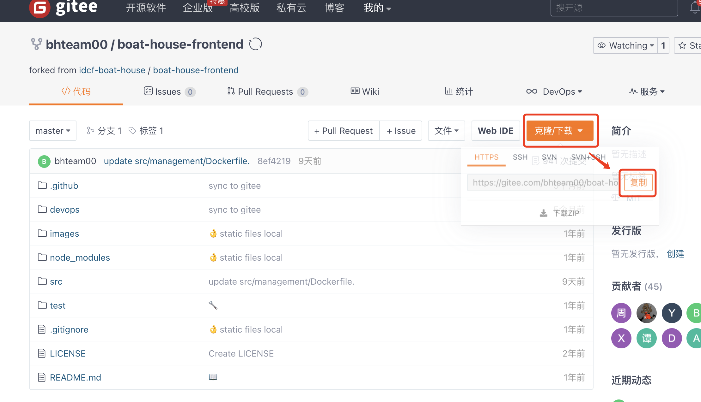

打开命令行工具，并输入以下命令完成代码克隆,并进入到代码目录：

```
git clone <BoatHouse前端代码仓库地址>
cd boat-house-frontend
```

### 03. 启动标准容器化开发环境
-------------

执行以下命令启动容器化开发环境

```
smartide start
```

执行完成后，输出如下：

> 注意：执行命令后会自动在云端拉取一个包含VSCode Web开发环境以及配置好的Nodejs开发环境。所以这个镜像会比较大，需要耐心等待一会。拉取完成后会自动将代码映射到容器内，并自动通过浏览器打开开发环境。接下来就可以进入开发调试了。

```
idcf@mac boat-house-frontend % smartide start
v0.1.6.992
2021-11-14 11:14:04.750 INFO  SmartIDE启动中......
2021-11-14 11:14:05.842 INFO  docker-compose 文件路径: /Users/zhouwenyang/idcf/boat-house-frontend/.ide/tmp/docker-compose-boathouse-frontend.yaml
2021-11-14 11:14:05.842 INFO  SSH转发端口：6822
Creating boat-house-frontend_boathouse-frontend_1 ... done
2021-11-14 11:14:06.548 INFO  打开浏览器......
2021-11-14 11:14:06.548 INFO  从浏览器中打开： http://localhost:6800/?folder=vscode-remote://localhost:6800/home/project
service            state   image                                                               ports
boathouse-frontend running registry.cn-hangzhou.aliyuncs.com/smartide/smartide-opvscode:latest 6822:22; 6800:3000; 8080:8080
2021-11-14 11:14:10.086 INFO  SmartIDE启动完毕
```

Visual Studio Code Web IDE打开后，效果如下图所示：

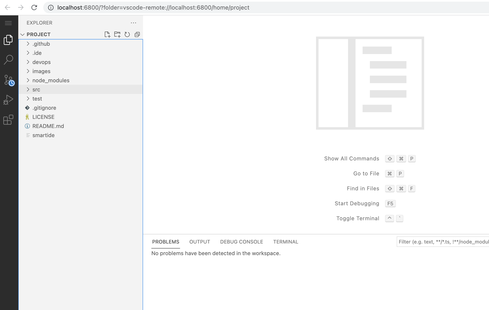


打开船屋餐厅客户端代码目录（src/client）：

> 点击File ｜ Open Folder ｜ 选择路径 /home/project/src/client/ ｜ 点击 OK，如下图所示：也可以直接通过更改URL的方式快速打开，连接如下：

http://localhost:6800/?folder=vscode-remote%3A%2F%2Flocalhost%3A6800%2Fhome%2Fproject%2Fsrc%2Fclient

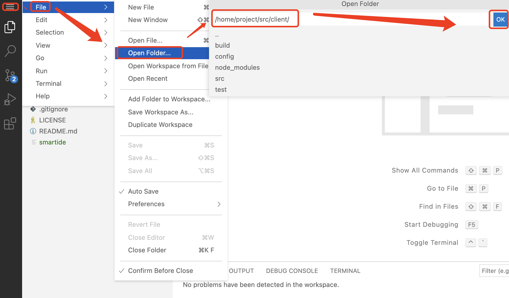


### 04. 开发BoatHouse船屋餐厅客户端 
-------------

点击 Terminal ｜ New Terminal，打开命令行工具，如下图所示：


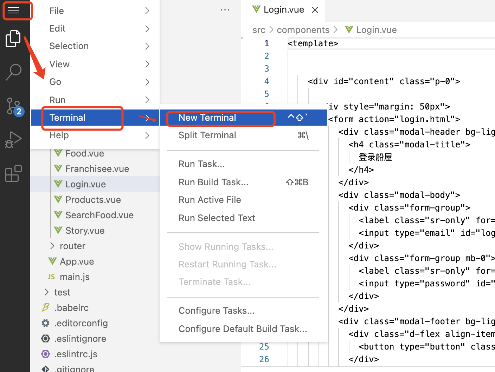

执行以下命令，完成npm依赖包的安装，如下图所示。

```
npm install
```

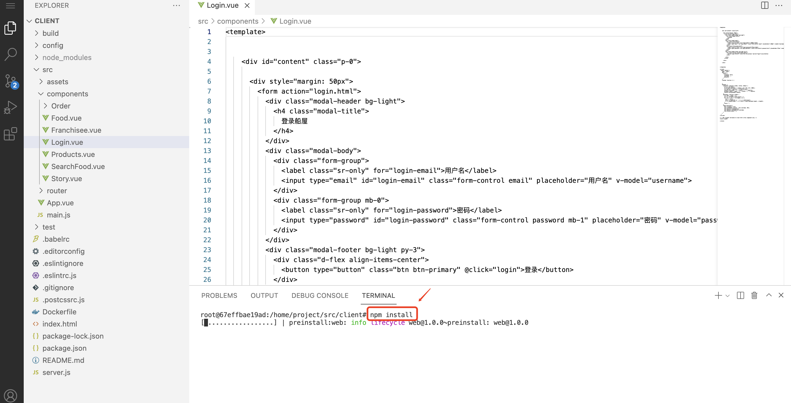

执行以下命令，完成船屋餐厅前端的启动。

```
npm start
```

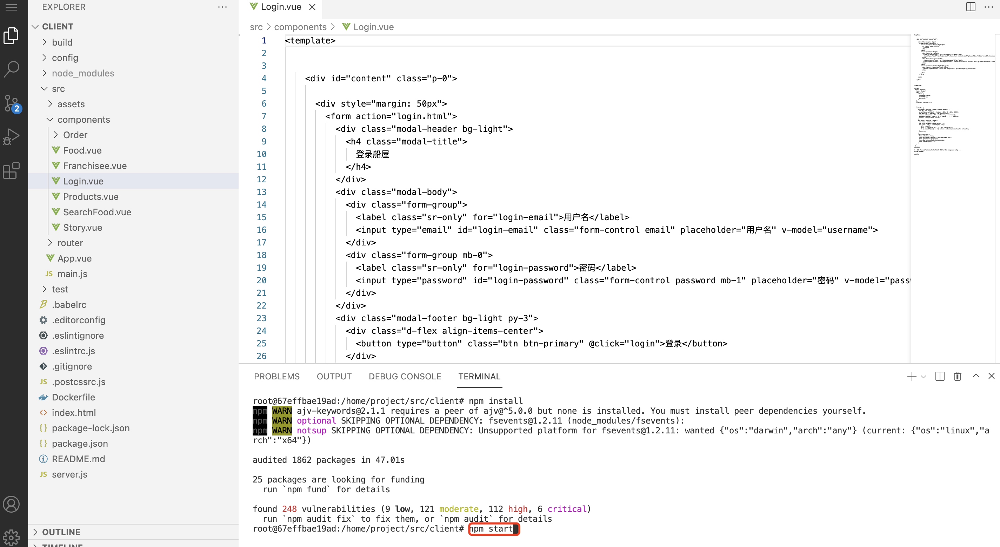

启动完成后，如下图所示：

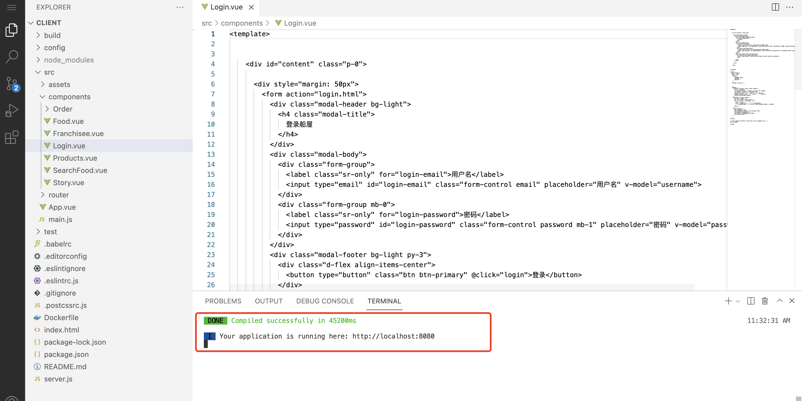

使用浏览器打开船屋应用：http://localhost:8080，打开后如下图所示：


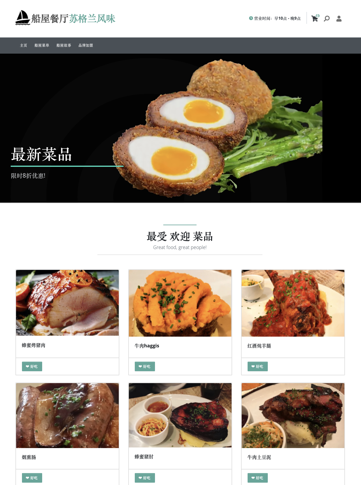


### 05. 修改并提交代码
-------------

这里我们演示下，如何添加一个自定义菜单，打开src/components/App.vue文件，如下图所示：

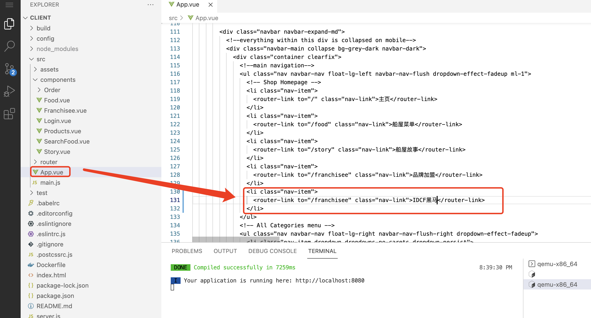

修改完成后，键盘使用control+s保存代码

> 注意：代码保存后，应用会自动重新编译，前端代码也会自动展示出对应的变更，无需重新启动调试，如下图所以：

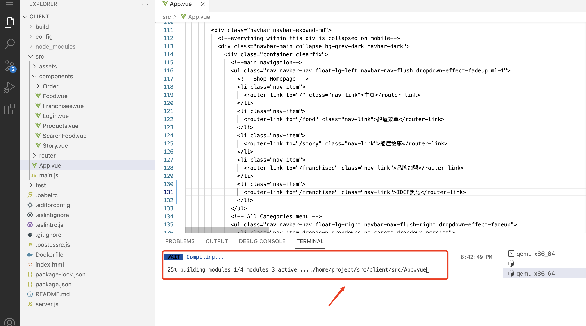

切换到船屋客户端网页，如下图所示，界面已经自动更新：


点击Source Control ｜ 查看并确认修改的文件内容，点击提交代码，如下图所示：

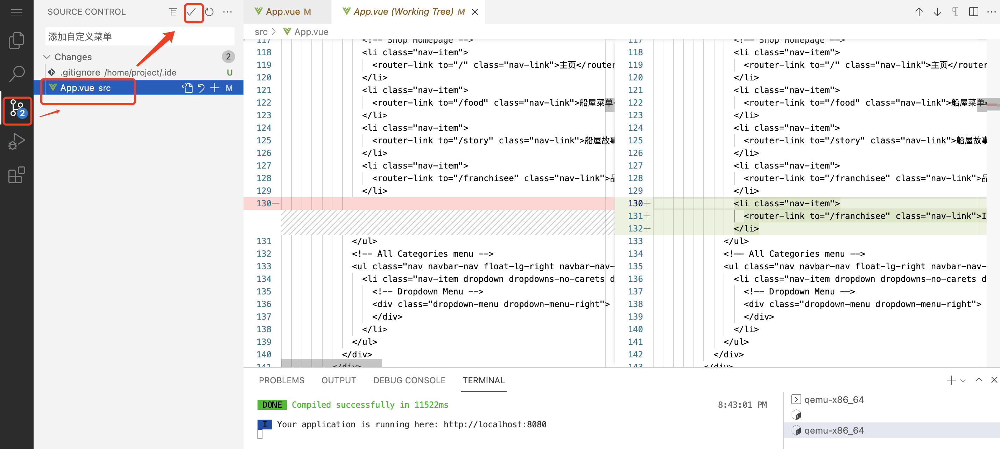

> 注意：如果修改的代码文件，没有自动加载出来，可以通过在Source Control中点击刷新，如下图所示：

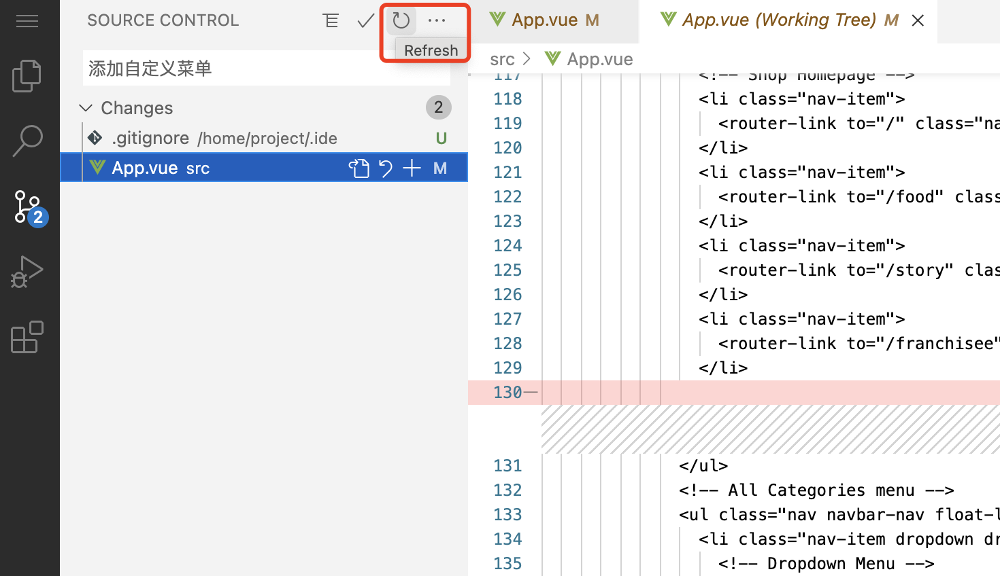


### 06. 修改船屋餐厅管理端（management端）
-------------

船屋餐厅管理端与客户端使用的同样的技术栈，都是Nodejs+Vue。所以操作方式是一样的。直接按照上面的方式打开对应的管理端目录进行开发调试即可。

打开船屋餐厅客户端代码目录（src/management）, 后面参考04以及05章节即可。：

> 点击File ｜ Open Folder ｜ 选择路径 /home/project/src/management/ ｜ 点击 OK，如下图所示，也可以使用URL的方式快速打开目录：

http://localhost:6800/?folder=vscode-remote%3A%2F%2Flocalhost%3A6800%2Fhome%2Fproject%2Fsrc%2Fmanagement


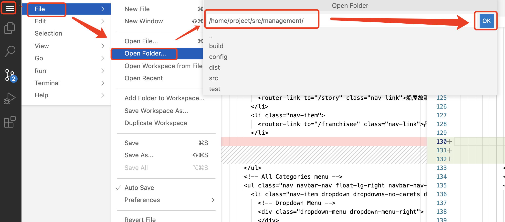


总结：本加分项我们使用了开源容器化开发工具smartide完成了船屋餐厅前端的开发与调试，开发人员无需安装配置IDE以及SDK即可快速进行开发状态。这其实也是DevOps的最后一公里，云原生开发环境也将是后续的主流趋势。

## 远程虚拟机开发模式

请参考以下安装手册，完成smartide开发客户端的安装（本地无需安装Docker环境）：

https://smartide.dev/zh/docs/quickstart/install/


### 01. 使用smartide vm start命令在远程虚拟机上启动开发环境，并克隆代码

```
smartide vm start --host <dev-vm-ip> --username  <dev-vm-username> --password <dev-vm-password> --branch master --repourl <boat-house-frontend-repo-url>
```

### 02. 开发BoatHouse船屋餐厅客户端 
-------------

点击 Terminal ｜ New Terminal，打开命令行工具，如下图所示：


执行以下命令，完成npm依赖包的安装，如下图所示。

```
npm install
```


执行以下命令，完成船屋餐厅前端的启动。

```
npm start
```


启动完成后，如下图所示：


使用浏览器打开船屋应用：http://localhost:8080，打开后如下图所示：


### 03. 修改并提交代码
-------------

> 远程虚拟机上默认没有配置git config所以需要执行以下命令完成git的初始化配置：

```
git config --global user.name "your name"
git config --global user.email "your email"
```


这里我们演示下，如何添加一个自定义菜单，打开src/components/App.vue文件，如下图所示：


修改完成后，键盘使用control+s保存代码

> 注意：代码保存后，应用会自动重新编译，前端代码也会自动展示出对应的变更，无需重新启动调试，如下图所以：


切换到船屋客户端网页，如下图所示，界面已经自动更新：


点击Source Control ｜ 查看并确认修改的文件内容，点击提交代码，如下图所示：


> 注意：如果修改的代码文件，没有自动加载出来，可以通过在Source Control中点击刷新，如下图所示：


### 04. 修改船屋餐厅管理端（management端）
-------------

船屋餐厅管理端与客户端使用的同样的技术栈，都是Nodejs+Vue。所以操作方式是一样的。直接按照上面的方式打开对应的管理端目录进行开发调试即可。

打开船屋餐厅客户端代码目录（src/management）, 后面参考04以及05章节即可。：

> 点击File ｜ Open Folder ｜ 选择路径 /home/project/src/management/ ｜ 点击 OK，如下图所示，也可以使用URL的方式快速打开目录：

http://localhost:6800/?folder=vscode-remote%3A%2F%2Flocalhost%3A6800%2Fhome%2Fproject%2Fsrc%2Fmanagement


总结：本加分项我们使用了开源容器化开发工具smartide完成了船屋餐厅前端的开发与调试，开发人员无需安装配置IDE以及SDK即可快速进行开发状态。这其实也是DevOps的最后一公里，云原生开发环境也将是后续的主流趋势。