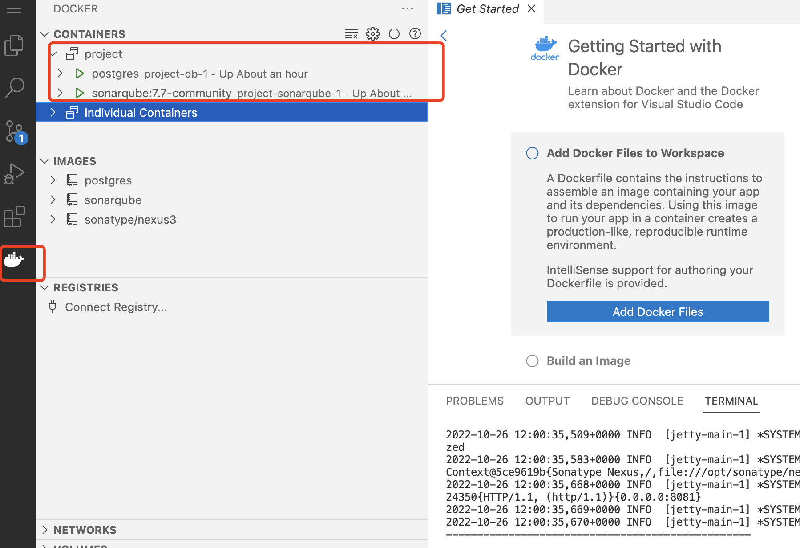
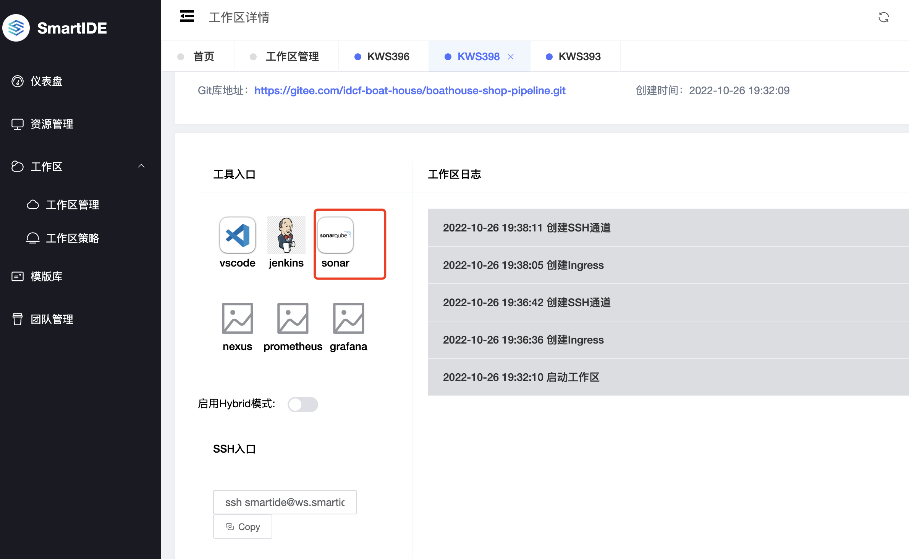
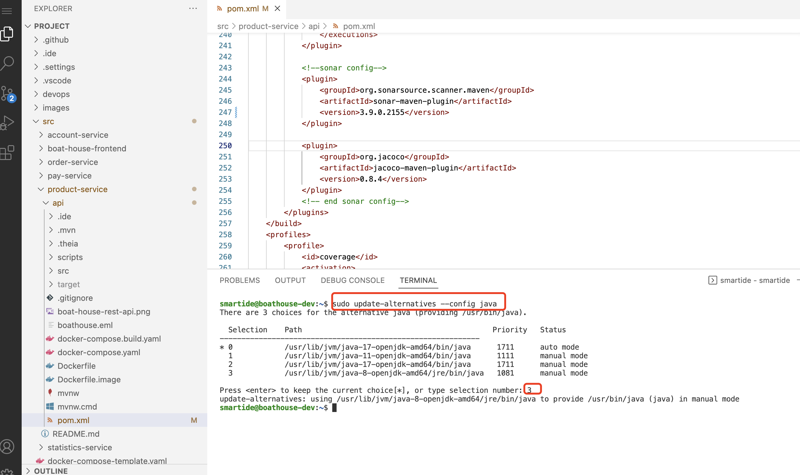
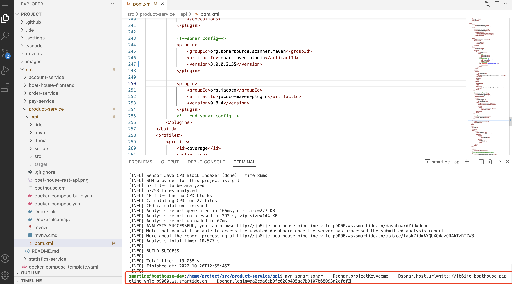
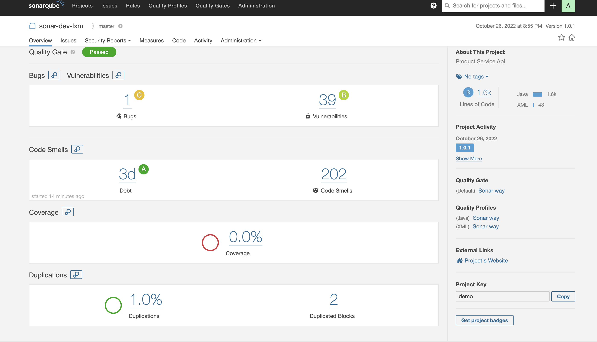

# Sonarqube配置指南

**本文档介绍了以下内容**，主要是Sonarqube docker的部署和各语言的代码分析配置（包括本地环境和Azure线上环境）：

- Sonarqube docker 版本的安装配置
- java Maven环境安装与代码分析（Windows）- 
- IntelliJ IDEA 集成Sonarqube代码分析
- 在Maven pom文件中集成Sonarqube代码分析，并在IntelliJ IDEA 构建时执行分析
- C# (或者VB.Net) 代码分析执行与配置（Windows，net core global dotnet-sonarscanner）
- Python (其他语言，如JS、TS、GO、PHP) 代码分析执行与配置（Windows）

**总体来说，Sonarqube代码分析执行方式分为三种**：

- 与IDE集成，通常需要IDE插件（如 IntelliJ IDEA的SonarLite），一般不会上传分析报告至Sonarqube服务器，适用于开发人员日常场景。
- 使用命令行执行，通常是用于与流水线集成，参数可以通过命令行传递，或者是通过xml配置文件（sonar-project.properties），适用于所有语言，这种方式需要结合Sonar提供的命令行工具使用
- 与构建工具集成，如Java Maven和Net中的msbuild/dotnet core, 可以结合IDE和命令行来触发，也可以通过命令行来触发，需要结合Sonar提供的命令行工具或插件使用。

**Sonarqube 使用流程**


**Sonarqube 结构**


## 安装和配置

- 在VSCode工作区创建以下yml脚本复制保存为文件：`docker-compose-sonarqube.yml`

```
version: "2"

services:
  sonarqube:
    image: sonarqube:7.7-community
    ports:
      - "9000:9000"
    networks:
      - sonarnet
    environment:
      - sonar.jdbc.username=sonar
      - sonar.jdbc.password=sonar
      - sonar.jdbc.url=jdbc:postgresql://db:5432/sonar
      - SONARQUBE_JDBC_USERNAME=sonar
      - SONARQUBE_JDBC_PASSWORD=sonar
      - SONARQUBE_JDBC_URL=jdbc:postgresql://db:5432/sonar
    volumes:
      - sonarqube_conf:/opt/sonarqube/conf
      - sonarqube_data:/opt/sonarqube/data
      - sonarqube_extensions:/opt/sonarqube/extensions
      - sonarqube_bundled-plugins:/opt/sonarqube/lib/bundled-plugins

  db:
    image: postgres
    networks:
      - sonarnet
    environment:
      - POSTGRES_USER=sonar
      - POSTGRES_PASSWORD=sonar
    volumes:
      - postgresql:/var/lib/postgresql
      - postgresql_data:/var/lib/postgresql/data

networks:
  sonarnet:
    driver: bridge

volumes:
  sonarqube_conf:
  sonarqube_data:
  sonarqube_extensions:
  sonarqube_bundled-plugins:
  postgresql:
  postgresql_data:
```

运行命令 ` docker-compose -f docker-compose-sonarqube.yml up -d`

命令运行成功后，使用容器插件查看容器的运行状态，如下图所示：

  

使用SmartIDE工作区，打开SonarQube，如下图所示：

  

使用`admin/admin`登陆


创建分析项目（以Java为示例）


接下来需要配置Maven环境，执行代码分析

## 在SmartIDE中完成代码的扫描

在使用代码扫描之间，需要先将开发环境的JDK版本进行变更，执行以下命令,并输入3，如下图所示：

```
sudo update-alternatives --config java
```

  


开发人员打开自己的SmartIDE工作区，使用如下命令，进入到product-service代码目录

```
/home/project/src/product-service/api
```

执行Sonar上提供的命令，如下图所示：

  

回到SonarQube平台，查看代码检查情况，如下图所示：

  

## 在Maven pom文件中集成Sonarqube代码分析

- 打开pom文件，在build.plugins添加以下子节点

```
<plugin>
	<groupId>org.sonarsource.scanner.maven</groupId>
	<artifactId>sonar-maven-plugin</artifactId>
	<version>3.6.0.1398</version>
</plugin>

<plugin>
	<groupId>org.jacoco</groupId>
	<artifactId>jacoco-maven-plugin</artifactId>
	<version>0.8.4</version>
</plugin>
```

- 打开pom文件，在根节点project中添加以下子节点

```
    <profiles>
        <profile>
            <id>coverage</id>
            <activation>
                <activeByDefault>true</activeByDefault>
            </activation>
            <build>
                <plugins>
                    <plugin>
                        <groupId>org.jacoco</groupId>
                        <artifactId>jacoco-maven-plugin</artifactId>
                        <executions>
                            <execution>
                                <id>prepare-agent</id>
                                <goals>
                                    <goal>prepare-agent</goal>
                                </goals>
                            </execution>
                            <execution>
                                <id>report</id>
                                <goals>
                                    <goal>report</goal>
                                </goals>
                            </execution>
                        </executions>
                    </plugin>
                </plugins>
            </build>
        </profile>

        <profile>
            <id>sonar</id>
            <activation>
                <activeByDefault>true</activeByDefault>
            </activation>

            <!--以下属性请根据Sonarqube环境信息和maven项目修改-->
            <properties>
                <sonar.host.url>http://localhost:9000</sonar.host.url>
                <sonar.login>8f30470aedb60a542d69302e6628a2e7e4d8862d</sonar.login>
                <sonar.projectKey>BoatHouse-product-service</sonar.projectKey>
                <sonar.projectName>BoatHouse-product-service</sonar.projectName>
                <sonar.projectVersion>1.0.2</sonar.projectVersion>
                <sonar.sources>src/main</sonar.sources>
                <sonar.tests>src/test</sonar.tests>
                <sonar.language>java</sonar.language>
                <sonar.java.binaries>.</sonar.java.binaries>
                <sonar.sourceEncodin>UTF-8</sonar.sourceEncodin>
            </properties>
        </profile>
    </profiles>
```


## 与流水线集成

可参考这个PR的文件变更：

https://github.com/idcf-boat-house/boat-house-frontend/pull/76/files


