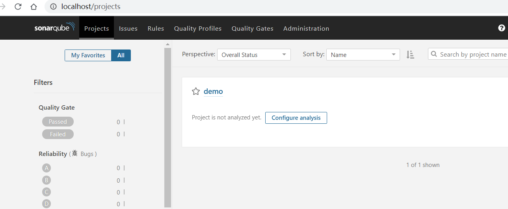
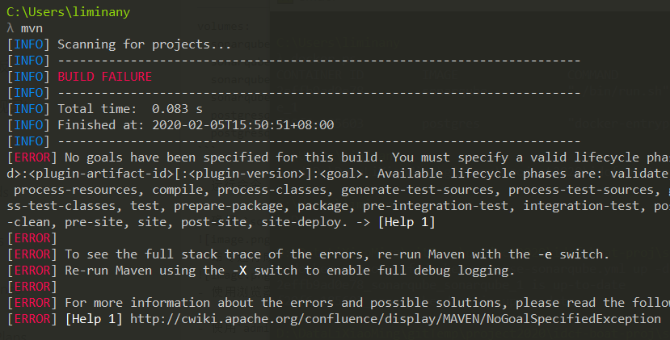
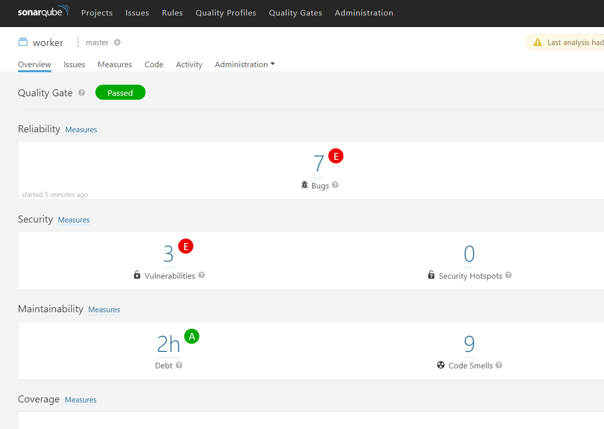
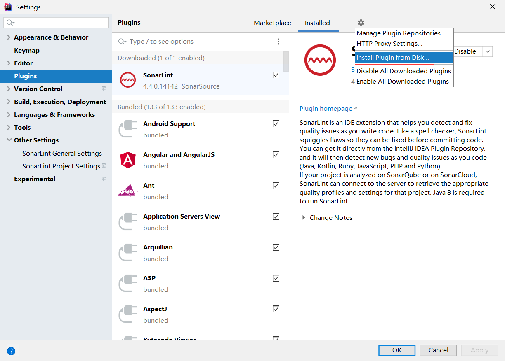
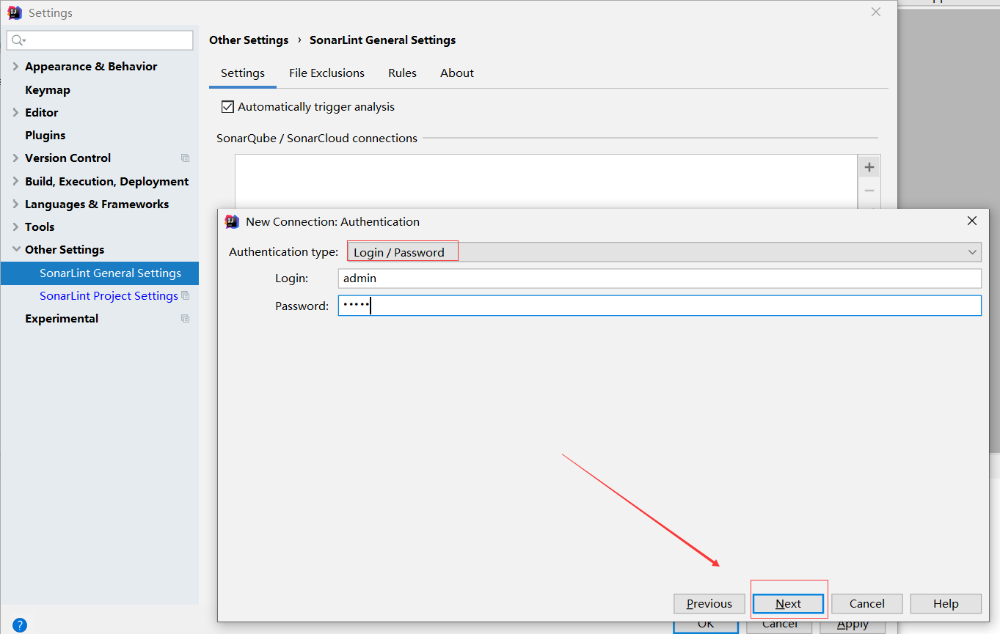
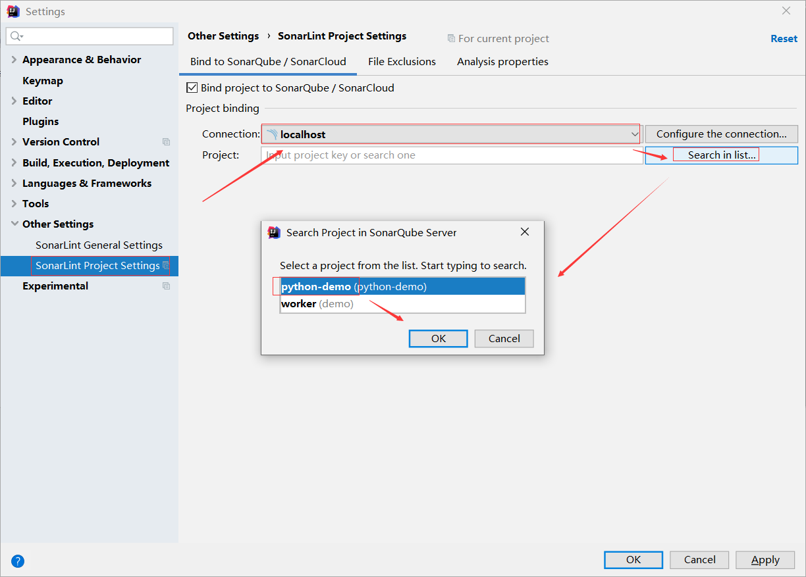
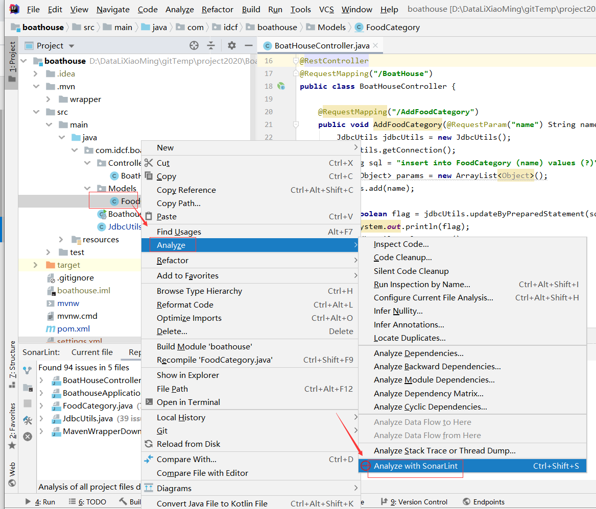

# Sonarqube配置指南

**本文档介绍了以下内容**，主要是Sonarqube docker的部署和各语言的代码分析配置（包括本地环境和Azure线上环境）：

- Sonarqube docker 版本的安装配置
- java Maven环境安装与代码分析（Windows）- 
- IntelliJ IDEA 集成Sonarqube代码分析
- 在Maven pom文件中集成Sonarqube代码分析，并在IntelliJ IDEA 构建时执行分析
- C# (或者VB.Net) 代码分析执行与配置（Windows，net core global dotnet-sonarscanner）
- Python (其他语言，如JS、TS、GO、PHP) 代码分析执行与配置（Windows）

**总体来说，Sonarqube代码分析执行方式分为三种**：

- 与IDE集成，通常需要IDE插件（如 IntelliJ IDEA的SonarLite），一般不会上传分析报告至Sonarqube服务器，适用于开发人员日常场景。
- 使用命令行执行，通常是用于与流水线集成，参数可以通过命令行传递，或者是通过xml配置文件（sonar-project.properties），适用于所有语言，这种方式需要结合Sonar提供的命令行工具使用
- 与构建工具集成，如Java Maven和Net中的msbuild/dotnet core, 可以结合IDE和命令行来触发，也可以通过命令行来触发，需要结合Sonar提供的命令行工具或插件使用。

**Sonarqube 使用流程**


**Sonarqube 结构**


## 安装和配置

- 将以下yml脚本复制保存为文件：`docker-compose-sonarqube.yml`

```
version: "2"

services:
  sonarqube:
    image: sonarqube
    ports:
      - "9000:9000"
    networks:
      - sonarnet
    environment:
      - SONARQUBE_JDBC_URL=jdbc:postgresql://db:5432/sonar
    volumes:
      - sonarqube_conf:/opt/sonarqube/conf
      - sonarqube_data:/opt/sonarqube/data
      - sonarqube_extensions:/opt/sonarqube/extensions
      - sonarqube_bundled-plugins:/opt/sonarqube/lib/bundled-plugins

  db:
    image: postgres
    networks:
      - sonarnet
    environment:
      - POSTGRES_USER=sonar
      - POSTGRES_PASSWORD=sonar
    volumes:
      - postgresql:/var/lib/postgresql
      - postgresql_data:/var/lib/postgresql/data

networks:
  sonarnet:
    driver: bridge

volumes:
  sonarqube_conf:
  sonarqube_data:
  sonarqube_extensions:
  sonarqube_bundled-plugins:
  postgresql:
  postgresql_data:
```

- 运行命令 ` docker-compose -f docker-compose-sonarqube.yml up -d`

- 确保 `sonarqube镜像和postgres镜像` 拉取成功，如果在国内环境有可能需要挂代理或VPN。

- 命令运行成功后，运行`docker ps`查看容器，确保容器处于运行状态

- 使用浏览器打开地址：`http://localhost:9000/`,访问SonarQube站点

- 使用`admin/admin`登陆

- 添加中文语言支持

- 创建分析项目（以Java为示例）

- 接下来需要配置Maven环境，执行代码分析

## java Maven环境安装与代码分析（Windows）

- 安装JDK，需1.7以上
- 下载 [Maven](https://maven.apache.org/download.cgi)

- 添加 MAVEN_HOME 环境变量，添加值 `%MAVEN_HOME %\bin` 到Path 环境变量
- 运行 `mvn`以测试mvn安装是否成功


- 运行cmd,进入java项目目录，根据上一章节中创建的Sonarqube 项目后显示的mvm命令，执行代码分析,类似如下命令：

```
mvn sonar:sonar -Dsonar.projectKey=demo -Dsonar.host.url=http://localhost:9000 -Dsonar.login=2c505c949f51b0a00f05fdcae8419600cadf97e8
```

- 执行以上命令后，会自动下载jar,等待下载完成

- 如果是国内的网络环境，下载过程中可能会失败，失败时，重新执行上面的命令即可

- 正常执行代码分析时，如下图：

······

- 分析完成，打开Sonarqube站点，可以看到扫瞄结果


## C# (或者VB.Net) 代码分析执行与配置（Windows，net core global dotnet-sonarscanner）

- 在Sonarqube中创建一个项目


- 根据上面的提示，下载和配置 `SonarScanner.MSBuild`,并添加执行程序所在目录到系统环境变量Path中。

- 安装 执行命令 `dotnet tool install --global dotnet-sonarscanner --version 4.8.0` ，global dotnet-sonarscanner


- 打开源码目录执行以下命令：
`dotnet-sonarscanner begin /k:"csharp-demo" /d:sonar.host.url="http://localhost:9000" /d:sonar.login="fd4bc37aeb5d851fef9585e0edbefb236b832935"`


- 然后执行以下命令

`dotnet build /t:Rebuild`


- 最后执行以下命令：

`dotnet-sonarscanner end /d:sonar.login="fd4bc37aeb5d851fef9585e0edbefb236b832935"`


## Python (其他语言，如JS、TS、GO、PHP) 代码分析执行与配置（Windows）

- 创建Sonarqube项目，选择Python语言，根据向导[下载配置](http://redirect.sonarsource.com/doc/install-configure-scanner.html)扫描器


- 确保添加好分析器所在路径到环境变量Path后，运行命令进行测试


- 运行命令执行分析(命令来自于上一步创建的项目向导)：

`sonar-scanner.bat -D"sonar.projectKey=python-demo" -D"sonar.sources=." -D"sonar.host.url=http://localhost:9000" -D"sonar.login=e2a3a351ed96f3dd643ae9ff0a96de304bb96928"`

- 还可以通过使用配置文件：`sonar-project.properties`，保存上面命令行参数的方式来触发代码分析。

进入源码 目录，执行 `sonar-scanner` 命令即可

```
#host url
sonar.host.url=http://localhost:9000

#login key
sonar.login=e2a3a351ed96f3dd643ae9ff0a96de304bb96928

#project key
sonar.projectKey=python-demo

#project name
sonar.projectName=python-demo

#project version
sonar.projectVersion=1.0.0

#analysis dir
sonar.sources=.

# Language
sonar.language=python

sonar.java.binaries=.
sonar.sourceEncoding=UTF-8
```

## IntelliJ IDEA 集成Sonarqube代码分析

- 打开 IntelliJ IDEA File -> Setting 插件设置页面,搜索 SonarLint ，安装 此插件


- 如果无法在线安装可从[这里下载](https://plugins.jetbrains.com/plugin/7973-sonarlint/update/75642/)，再手动安装


- IntelliJ IDEA SonarLint 插件 配置






- 配置好插件，打开 SonarLint,可以对当前打开的文件进行时时分析，并显示结果，如下图

- 也可针对 整个项目进行分析


- 也可以右键某个代码文件或某一个目录，从上下文菜单中触发此文件的分析，分析结果可在Report Tab窗口查看。



## 在Maven pom文件中集成Sonarqube代码分析，并在IntelliJ IDEA 构建时执行分析

- 打开pom文件，在build.plugins添加以下子节点

```
<plugin>
	<groupId>org.sonarsource.scanner.maven</groupId>
	<artifactId>sonar-maven-plugin</artifactId>
	<version>3.6.0.1398</version>
</plugin>

<plugin>
	<groupId>org.jacoco</groupId>
	<artifactId>jacoco-maven-plugin</artifactId>
	<version>0.8.4</version>
</plugin>
```

- 打开pom文件，在根节点project中添加以下子节点

```
    <profiles>
        <profile>
            <id>coverage</id>
            <activation>
                <activeByDefault>true</activeByDefault>
            </activation>
            <build>
                <plugins>
                    <plugin>
                        <groupId>org.jacoco</groupId>
                        <artifactId>jacoco-maven-plugin</artifactId>
                        <executions>
                            <execution>
                                <id>prepare-agent</id>
                                <goals>
                                    <goal>prepare-agent</goal>
                                </goals>
                            </execution>
                            <execution>
                                <id>report</id>
                                <goals>
                                    <goal>report</goal>
                                </goals>
                            </execution>
                        </executions>
                    </plugin>
                </plugins>
            </build>
        </profile>

        <profile>
            <id>sonar</id>
            <activation>
                <activeByDefault>true</activeByDefault>
            </activation>

            <!--以下属性请根据Sonarqube环境信息和maven项目修改-->
            <properties>
                <sonar.host.url>http://localhost:9000</sonar.host.url>
                <sonar.login>8f30470aedb60a542d69302e6628a2e7e4d8862d</sonar.login>
                <sonar.projectKey>BoatHouse-product-service</sonar.projectKey>
                <sonar.projectName>BoatHouse-product-service</sonar.projectName>
                <sonar.projectVersion>1.0.2</sonar.projectVersion>
                <sonar.sources>src/main</sonar.sources>
                <sonar.tests>src/test</sonar.tests>
                <sonar.language>java</sonar.language>
                <sonar.java.binaries>.</sonar.java.binaries>
                <sonar.sourceEncodin>UTF-8</sonar.sourceEncodin>
            </properties>
        </profile>
    </profiles>
```

- 确保 IntelliJ IDEA 中Maven项目能编译成功，编译期间会自动下载依赖包，如果 因网络问题，失败后，再执行一次编译即可


- 双击maven 的 sonar 插件（或者点击图片中所示绿色三角形的运行按扭），执行代码分析，分析完成后，会把分析报告自动上传至上前面配置的sonarqube项目中。打开右下角窗口中的第一个链接，即可查看报告


- 也可以通过命令 `mvn sonar:sonar` 在IntelliJ IDEA 的Terminal窗口中执行


## Sonarqube线上环境配置
- 通过ssh连接上linux服务器，确保已经安装 docker/docker compose
- clone 代码库到本地：

```
mkdir source
git clone https://github.com/icdps/boat-house-devops.git
```
- 进入`tools/sonarqube`目录，直接运行命令：`docker-compose -f docker-compose-sonarqube.yml up -d`
- 确保 postgres 和 sonarqube 两个容器能运行起来

- 如果未运行起来，运行`docker-compose -f docker-compose-sonarqube.yml logs -d -ft`查看日志，分析问题
- 目前发现azure中的linux会有一个配置问题，在日志中会查到以下错误
```
sonarqube_1  | 2020-02-11T01:28:21.354836464Z 2020.02.11 01:28:21 ERROR es[][o.e.b.Bootstrap] node validation exception
sonarqube_1  | 2020-02-11T01:28:21.354839364Z [1] bootstrap checks failed
sonarqube_1  | 2020-02-11T01:28:21.354841964Z [1]: max virtual memory areas vm.max_map_count [65530] is too low, increase to at least [262144]
```
- 如果出现以上错误，按下面的方法修复

临时解决办法：
```
修改参数：
sudo sysctl -w vm.max_map_count=262144
查看修改好的参数：
sudo sysctl -a|grep vm.max_map_count
```

永远生效的办法
```
1 切换到root用户修改配置sysctl.conf
2 执行：vi /etc/sysctl.conf 
3 添加下面配置：vm.max_map_count=655360
4 并执行命令：sysctl -p
```

- 成功运行后，运行 `curl http://localhost:9000/` 以验证是否正常运行.

## 与流水线集成

可参考这个PR的文件变更：

https://github.com/idcf-boat-house/boat-house-frontend/pull/76/files


