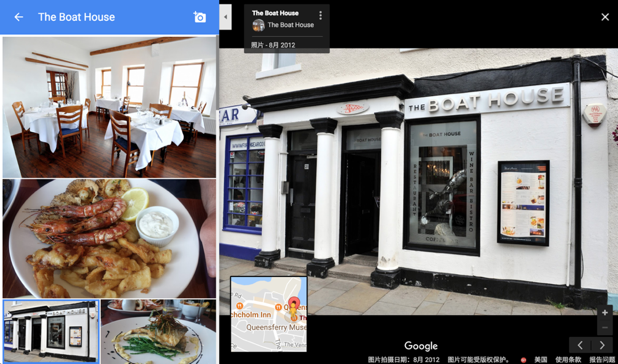

# IDCF Boat House 社区共创

>开源，开放，社区驱动，来自社区，回馈社区。

这就是IDCF社区共创计划

## Boat House 船屋餐厅的故事

>阿捷揣着好奇心，来到了这家名叫 Boat House 的餐厅门口，从三三两两聊天的圈子看，应该都是当地人！阿捷探着脑袋从餐厅的窗户看进去，餐馆里面居然还有一些空位的，而排队的人仿佛没有看到这些空位，让阿捷更觉得难以理解。难不成排队的人只是为了聊天而不是来吃饭的？

>看着饭店门口来了一个“外国人”，餐馆服务生善意地提醒阿捷，大概要等待40-50分钟。鉴于对这家特立独行的餐厅的深度好奇，阿捷就排在队伍的最后面，一边向服务生表示自己会耐心等待，一边思考着怎么解决美国帕洛阿尔托要迁移到SQF和北京的24个研发项目。
>阿捷刚刚落座，一位五十多岁，高高壮壮满脸花白胡子的男士走了过来。他一手拿着一瓶威士忌酒，一手拿了两个加过冰的被子，用标准的美国口音向阿捷说到：“你-好！我是Gordon，这里的老板！很抱歉，让你等了这么久，为了表示歉意，这瓶苏格兰本地产单麦芽威士忌送给你，先喝一杯开开胃吧！”

以上文字来自《敏捷无敌之DevOps时代》的第23章 餐馆排队与多项目管理。

**Gordon** | Boat House餐厅老板

IDCF社区共创项目得到了Boat House餐馆老板Gordon的邀约，为Boat House提供IT技术服务，也因此有了以下真实的Boat House项目出现在GitHub之上。

## Boat House 共创项目导师团队

Boat House社区共创项目由四位敏捷DevOps业界大咖作为导师，四位老师将全程参与社区共创项目，为共创团队提供理论和实践的贴身指导。

**王立杰** | 《敏捷无敌之DevOps时代》作者 | 共创项目PO

- 资深敏捷创新专家、小米敏捷转型战略教练
- 曾任京东首席敏捷创新教练、IBM客户技术专家，多年研发管理与敏捷实施经验；中国DevOps社区核心组织者、PMI-ACP认证讲师、规模化敏捷认证咨询师(SPC5)

**许舟平** |《敏捷无敌之DevOps时代》作者 | 共创项目PO

- 微服务与云计算技术专家、敏捷与DevOps实践者
- 推崇知行合一的敏捷开发和DevOps实践，曾作为IBM敏捷专家为华为研发管理转型提供技术服务；专注于中国企业的数字化转型与互联网业务创新落地

**姚冬** |《敏捷无敌之DevOps时代》作者 | 共创项目PO

- 华为云DevCloud首席技术布道师、资深DevOps与精益/敏捷专家
- 软件工程专家，中国DevOps社区核心组织者，中国DevOpsDays大会核心组织者，曾任IBM DevOps产品线大中华区技术总监

**徐磊** |《敏捷无敌之DevOps时代》序作者 | 共创项目产品经理

- 英捷创软 (LEANSOFT) 创始人兼首席架构师
- 超过 10 年的软件研发项目管理经验，曾任外企中国研发中心总经理，资深 ALM 顾问和解决方案专家、微软最有价值专家MVP和微软大中华区域社区技术总监

## Boat House 采用全开源社区模式运作

Boat House 的全套代码以及DevOps工具链适配文档和配置文件全部采用**MIT协议**向社区开源，任何人均可以参与我们的项目，欢迎大家进入以下代码库提交issue以及pull request。

- 主代码库 <https://github.com/idcf-boat-house/boat-house>
- DevOps实践库 <https://github.com/idcf-boat-house/boat-house-devops>

同时，Boat House项目也为自己定了一个宏大的蓝图：**我们希望适配所有的DevOps实践以及工具，让Boat House成为任何希望进行敏捷转型和DevOps的个人，团队和组织在这里都能找到可落地的实操帮助。**

为了实现这个蓝图，我们现在向社区招募【Boat House共创团队】

### 社区运作方式

Boat House的全部产品创意，功能设计，开发计划，代码，DevOps工具链搭建，流水线配置以及全部环境（Dev/Test/Production）全部向社区开放。

同时，关键项目事件的视频资料，采用【IDCF冬哥有话说】栏目的方式公开直播，这些活动包括

- 产品计划会议
- 迭代计划会议
- 迭代评审会议/demo
- 回顾会议
- 需求整理会议
- 团队技术分享，代码评审等交流活动（部分公开）

【Boat House共创团队】成员将通过zoom参与会议，直接与三位作者导师以及产品经理进行对话，完成产品功能的交付演示，听取导师的意见反馈并规划后续的迭代计划。

【IDCF冬哥有话说】栏目对任何人免费开放，欢迎大家围观提供反馈。

### 共创团队招募和权益

共创团队招募由IDCF发起，面向整个社区进行招募，任何人均可以报名参与：

团队结构和招募方式

- 考虑到社区共创将占用参与者的业余时间，我们规划采用每2个月一期（两周一个迭代）的方式持续更新和重组共创团队
- 每一期招募24名小伙伴组成4个团队，每个团队相对独立的完成不同领域的共创任务
- 每个共创团队的人员组织结构如下
  - 1名Scrum Master（组长）
  - 5-6名成员组成的跨职能混合团队，成员满足以上所列成员条件，共同承担产品规划，任务分配和跟踪，代码开发，流水线搭建和维护，DevOps实践调研实施和文档交付，测试和质量保障工作。
- Maintainer 团队: 为了确保社区共创的交付质量，将有专业DevOps工程师团队作为此项目的maintainer，负责审核共创团队提交的Pull Request，维护master分支的代码和文档质量。
- 导师团队：参与主要团队会议，为团队提供反馈和实践指导。

成员责任和技能要求：

- 具备一定的研发管理，开发，测试，运维经验；可以实际参与项目的日常运作，而不仅仅是观摩
- 愿意深度参与，能够承诺一定的业余时间参与项目的日常运作，每周不少于5小时
- 具备一定的编码开发能力，并掌握以下技术栈的部分或全部：Java, C# (.net core), JavaScript, Node.js, Python

参与共创的团队成员享有以下特权：

- Boat House项目贡献者署名
- 优惠参与IDCF DevOps黑客马拉松
- 免费获取IDCF训练营一期的访问权限
- 社区共创团队云环境使用配额（参与项目期间）
- 专业导师/DevOps顾问/工程师团队技术支持
- 参与共创团队内部技术分享
- 通过DevOps公众号发表共创项目相关技术文章并获取稿费

## Boat House 产品架构

当前的船屋餐饮系统采用微服务架构设计，包含三条业务条线（统计服务、产品服务、账户服务），每一个业务条线可以独立的开发以及部署。我们将在社区共创项目中持续演进产品架构。

## Boat House DevOps工具链架构

本项目使用Github进行项目管理和代码管理、Jenkins持续集成、Nexus进行包管理以及容器镜像管理、Jemeter进行接口测试以及压力测试、Selenium进行自动化UI测试。

下图是本项目的持续交付流水线架构：

本项目将支持ChatOps && AIOps，让开发、测试、客户可以在IM即时通讯工具里以聊天的方式完成相应的工作。

下图是本项目的ChatOps && AIOps架构：

## Boat House Backlog

以下是Boat House当前的Backlog规划，随着社区共创的推进，我们将持续更新此列表

### 产品创意

- [ ] 一套支撑应用程序开发的创意，需求和原型，这部分内容包括：
  - [ ] 精益画布
  - [ ] 用户画像
  - [ ] 故事地图
  - [ ] 影响地图
  - [ ] 用户故事列表

### 产品特性

- [ ] 产品基础特性
  - [ ] 用户管理
  - [x] 菜品管理
  - [x] 统计信息收集和反馈
  - [ ] 订单系统
  - [ ] 结算系统

### DevOps和AIOps工具链

- [x] 基础工具链搭建和文档
- [x] 流水线配置和贯通，包括Dev/Test/Production环境部署
- [ ] 云环境管理，包括Dev/Test/Production环境的基础设施即代码配置
- [ ] DevOps实践场景设计和文档输出
  - [ ] 主流开发语言和SDK, 如：Java, C#, javascript, Python, Node.js, Go, PHP等
  - [ ] 开发IDE配置，如：Eclipse, IDEA, Visual Studio, Visual Studio Code
  - [ ] 单元测试工具，如：Junit, Nunit, XUnit 等
  - [ ] 静态代码检查，如：Sonaqube
  - [ ] 接口开发和测试，如：各类接口mock工具，Swagger, Postman, Jmeter等
  - [ ] 自动化功能测试，如：Selenium
  - [ ] 制品库管理，如：artifactory, nexus
  - [ ] 数据库持续交付，如：Flyway, Liquibase, Redgate, Datical
  - [ ] 容器化开发和运维，如：docker, kubernetes, openshift
  - [ ] 基础设施即代码，如：Terraform, Azure Resource Manager, AWS Cloudformation

## 厂商招募

DevOps社区共创接收厂商参与。由于DevOps工具链非常复杂，其中涉及多种商用，开源产品。我们欢迎任何的开源和商用产品厂商参与此项目。厂商招募后续将启动。

## 关于IDCF

>“亲爱的阿捷，
>
>好久没联系了，你还好吗？
>
>经常从Twitter、LinkedIn上看到你的消息，那些关于Scrum、Kanban、XP、SAFe、DevOps、Lean、Agile、Coaching（教练）、Design Thinking（设计思维）、Lean Startup（精益创业）、Growth Hacker（增长黑客）等相关主题文章或实践心得，非常棒，受益良多。看得出，这些年来，你在这些领域耕耘很深，虽然也摔过很多跤，爬过很多坑，但最终取得的成就却非常惊人，只能用Incredible Amazing（难以置信）来形容。
>
>在这个知识爆炸的时代，人们变得更加焦虑，因为有太多的‘不知道不知道’，而你却心无旁骛，专注于这个领域，不断学习与实践。或许你还没意识到，你持续积累的多年经验已经是一笔巨大的财富，你应该把这些经验分享出来，帮助更多的组织实现转型，提高产品研发与创新的效率。
>
>我已经老了，除了开个小餐馆，跟朋友们谈谈天，聊聊家常外，也想把经验传承下来。我期望你能勇敢地走出舒适区，咱们一起开办一个学院，把知识与经验分享出去。名字我都想好了，就叫‘International DevOps Coach Federation ’（国际DevOps教练联合会）！
>
>怎么样？这名字霸气吧。我想你一定会喜欢的。你的朋友们、你的客户也会喜欢的！
>
>加油！加油！！加油！！！
>
>一直支持你的Gordon”

欢迎关注IDCF服务号，获取更多知识服务。

