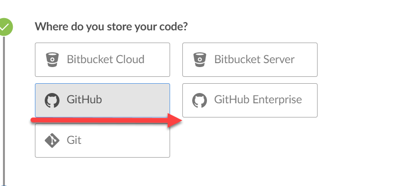
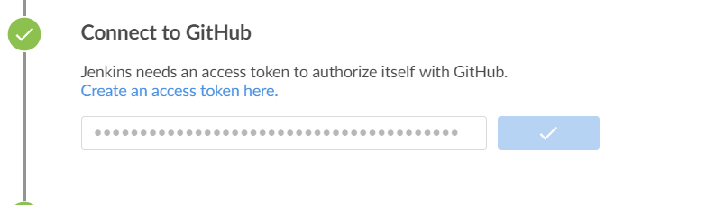

### Github集成Jenkins搭建流水线
#### 前置说明：
**配置Github之前，团队需要选定一个Github账号跟Jenkins环境集成，后续开发过程中团队的所有改动需要先PR到此Github账号的Repo上来做团队集成环境的测试，然后再统一将此账号下的变更合并到BoatHouse主库。**
****
#### 集成步骤：
##### Github配置
1. 进入github仓库，点击右上角个人账户页，找到开发者选项，然后找到access token，点击创建个人账户的token

2. token权限勾选所有，确认生成，将token保存下来。

3. 进入github仓库，点击上方的setting配置

4. 在左侧列表找到webhooks 选项，点击，并点击右侧的添加webhook

5. 注册webhook的url，填写格式：<jenkins实例地址>/github-webhook/

****

##### 添加全局变量

1. 进入Jenkins | 点击 Manage Jenkins | 点击Config System | 找到 Global properties | 选中 Environment variables | 点击 ADD

添加如下两个环境变量：

| 变量名称 | 值 | 说明  |
| ------------ | --------- | --------- |
| BOATHOUSE_CONTAINER_REGISTRY  | bhacr.azurecr.cn | 容器镜像仓库地址,可以是github pkg url 或 azure container reg url（acr），目前使用后者  |
| BOATHOUSE_DEV_HOST  | 请使用实际 | ev环境内部IP地址（jenkins通过内网IP部署dev环境）  |
| BOATHOUSE_ORG_NAME | idcf-boat-house  | 团队镜像仓库组织名称(即boathouse 在github上的组织名称) |
| DEPLOY_K8S_NAMESPACE_TEST | boathouse-test | k8s命名空间，即boathouse测试环境部署的命名空间 |
| DEPLOY_K8S_NAMESPACE_PROD | boathouse-prod | k8s命名空间，即boathouse生产环境部署的命名空间 |

添加完成后如下图所示：

##### Jenkins配置
1. 进入jenkins首页，点击进入左侧菜单栏中 **open blue ocean** 的菜单

1. 进入后，根据提示，点击下方的按钮，创建流水线

1. 仓库类型选择 github

1. 回到jenkins页面，在流水线创建页面，将上一步的token输入后点击下一步

1. 选择需要对应的github仓库并点击创建流水线

1. 进入流水线主页，可以看到基于Repo中Jenkins File成功创建出流水线。

1. 点击当前流水线进入流水线活动页面

1. 点击分支 Tab，点击某个分支后的修改button可以查看流水线的具体设置及任务

