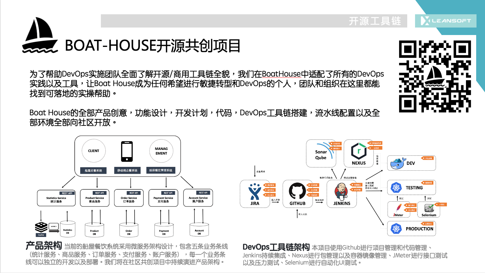

# BoatHouse开源共创训练营(Azure DevOps版)

本次培训采用线上授课形式，利用工作日晚间时间，每周2次课程，帮助你全面掌握DevOps的理论和实践，并且提供动手实验环境和资源；培训时长为2周，如果在培训结束时通过讲师的考核，即可入职成为DevOps工程师。

## 示例应用

本次培训培训采用 BoatHouse 开源共创项目作为示例应用。BoatHouse开源共创项目是IDCF在2020年2月底启动的社区驱动的全开源DevOps示例应用，产品采用《敏捷无敌之DevOps时代》书中所述位于苏格兰的THE BOATHOUSE船屋餐厅的线上服务平台作为背景，采用基于Java SpringBoot作为开发框架Spring Cloud作为微服务治理框架，由50多名来自全国DevOps社区的小伙伴参与，一同完成一套完整的示例应用代码。

除了代码本身以外，BoatHoue 开源共创项目还适配了全套的DevOps工具链平台，包括：GitHub, GitHub Action流水线, Azure DevOps全流程，微软Azure云平台，Jenkins流水线, Nexus制品库，SonaQube代码门禁, Jmeter接口和压力测试, Postman接口测试, Seleiumn自动化测试, Junit单元测试, Flyway结构化数据库持续发布， Docker容器化, Kubernetes容器集群管理, Helm容器发布, MatterMost ChatOps等。

BoatHouse的全部内容，包括代码和文档全部通过GitHub开源给社区，大家可以扫描以上二维码或者点击链接访问

<https://github.com/idcf-boat-house>

## 培训形式

本次培训将采用“反向场景化学习模式”，也就是学员先预习并根据讲师提出的场景思考解决方案，讲师再讲解和答疑，最后再通过考核巩固知识点的方式。

## 课程结构

- 预习（小组 2天）：讲师将在课程开始前2天提供下次课程所涉及内容的操作手册以及部分课堂小作业的问题，参训成员讲按小组组织进行课程预习，自行按照操作手册完成相关配置和环境搭建，同时收集问题供课程上提出进行讨论。
- 讲解（40分钟）：讲师将在课程上针对本讲内容进行讲解和演示，针对课前提出的课堂小作业进行解答，同时讲师会针对本讲内容提出更加高阶的客户场景并要求学员现场完成解决方案的制作。
- 讨论（小组 30分钟）：参训学员对讲师提出的问题进行分组讨论，现场制作解决方案汇报材料（PPT）以及演示环境。
- 反馈（10分钟/组）：每个小组派出代表针对讲师提出的问题给出解决方案，现场展示结果。如果小组太多，将随机选出3个小组完成讲解
- 考核（个人）：讲师将在课程结束时给学员发送课后小测验习题，参训学员需要独立完成小测验并在24小时内提交测试结果。

## 场景化

- 课程主题内容关注具体业务场景的实现
- 课前预习，课堂讨论和课后小测验也都采用场景化解决方案的方式完成，也就是讲师提出实际的业务需求，由学员根据所掌握的知识点完成解决方案的设计

## 课程目录

### 1. 使用Azure DevOps管理BoatHouse开源共创项目的端到端持续交付

> - **课程时间：2020.10.28（周三）晚8-10点**
	
课程整体介绍，我们将使用BoatHouse开源共创项目作为本次培训的端到端流水线示例。第一讲的内容将向大家展示已经配置好的端到端流水线，为参训学员设置培训的总体目标，即通过6次课程，自己动手同样一条流水线的搭建。
	
第一讲的内容还将引导各位学员创建所需要的Azure DevOps账号，分配Azure云环境账号，以及学员分组，课程工具环境操作指导，比如：zoom，miro，github的环境介绍。

### 2. 使用 Azure Board 电子看板配合Scrum和Kanban方法管理产品需求和迭代开发过程

> - **预习内容发放时间：2020.11.1（周日）晚8点**
> - **课程时间：2020.11.3（周二）晚8-10点**
> - **小测验截止时间：2020.11.4（周三）晚8点**

第二讲将完成产品需求管理和迭代开发过程管理过程在Azure Board电子看板上的工具落地操作指导，讲师讲为大家展示Azure Board如何支持product backlog, sprint backlog的日常管理，以及使用kanban, wiki, query以及dashboard支撑日常项目管理需求。我们还将关注如何支持多团队，层级化团队结构的支撑，以及使用delievery plan管理大规模项目或者产品的日常开发过程。

#### 预习内容

请大家按照以下顺序完成任务，任务分为个人任务和团队任务，个人任务需要个人自行完成，团队任务需要小组在miro内完成。

- 2.1 动手实验 - 创建Azure DevOps个人账号

    **个人任务** 请在个人Azure DevOps账号中完成此任务

    请导航到 <https://azure.com/devops>，请点击"免费开始使用”按钮注册个人Azure DevOps账号。你在后续的操作中可能需要将此账号给到小组组长，加入小组项目内进行操作。
    **注意：** Azure DevOps允许5人以下团队的免费额度，如果您的团队超过了5个人，可以考虑自行划分为多个小组或者共用几个账号进行操作。

- 2.2 动手实验 - 使用Azure DevOps Demo Generator创建 PartsUnlimited (配置零件无限团队项目) 示例项目

    **个人任务** 请在个人Azure DevOps账号中完成此任务

    请按照以下链接完成示例项目的创建

    - [配置零件无限团队项目](https://almvm.devopshub.cn/labs/azuredevops/prereq/#%E4%BB%BB%E5%8A%A11%E9%85%8D%E7%BD%AE%E9%9B%B6%E4%BB%B6%E6%97%A0%E9%99%90%E5%9B%A2%E9%98%9F%E9%A1%B9%E7%9B%AE)

- 2.3 动手实验 - 使用Azure Boards进行敏捷规划和项目组合管理

    **个人任务** 请在个人Azure DevOps账号中完成此任务

    请按照以下文档完成动手实验

    - [使用Azure Boards进行敏捷规划和项目组合管理](https://almvm.devopshub.cn/labs/azuredevops/agile/)

- 2.4 小组讨论 

    **团队任务** 请将以下问题的讨论结果发布在小组miro上

    - 问题1：什么是工作项？
    - 问题2: Scrum的几个关键活动是什么？Azure DevOps分别提供了哪些功能支撑这些敏捷实践？
    - 问题3: Kanban的几个关键活动是什么？Azure DevOps分别提供了哪些功能支撑这些敏捷实践？

### 3. 使用 Azure Repo实现基于Git特性分支的开发流程

> - **预习内容：2020.11.3（周二）晚8点**
> - **课程时间：2020.11.5（周四）晚8-10点**
> - **小测验截止时间：2020.11.6（周五）晚8点**

第三讲将针对基于Git的配置管理流程进行讲解，并现场演示拉取分支，提交和推送代码，分支合并，分支锁定，创建Tag，分支保护，分支策略，拉去请求相关配置，代码评审等操作内容。

### 4. 使用 Azure Pipeline 实现持续集成和持续部署

> - **预习内容：2020.11.8（周日）晚10点**
> - **课程时间：2020.11.10（周二）晚8-10点**
> - **小测验截止时间：2020.11.11（周三）晚8点**
	
第四讲内容将带领学员搭建BoatHouse开源共创项目的前后端代码流水线，完成自动化构建，docker镜像打包/推送，并在单机docker环境上用docker-compose完成部署。

### 5. Azure Pipeline 构建代理集群环境管理
	
> - **预习内容：2020.11.10（周二）晚10点**
> - **课程时间：2020.11.12（周四）晚8-10点**
> - **小测验截止时间：2020.11.13（周五）晚8点**

第四讲内容将对构建代理集群架构进行讨论，并现场完成构建代理集群的搭建，并讨论集群调度策略和集群管理中所需要的常见问题，比如：构建机和构建代理的关系，构建代理调度机制，构建池管理等。

### 6. 使用 Azure Test Plan 完成测试流程管理
	
> - **预习内容：2020.11.15（周日）晚8点**
> - **课程时间：2020.11.17（周二）晚8-10点**
> - **小测验截止时间：2020.11.18（周三）晚8点**
	
第五讲内容将涵盖测试计划，测试套件，测试用例，测试执行，测试结果以及缺陷管理流程在Azure Test Plan上的落地相关场景。

## 版权说明

本课程由LEANSOFT和IDCF共同出品并拥有版权，内容通过开源方式提供给社区作为非营利性学习资料，任何人不得将此内容用于商业用途。

LEANSOFT和IDCF保留对此内容的最终解释权。
