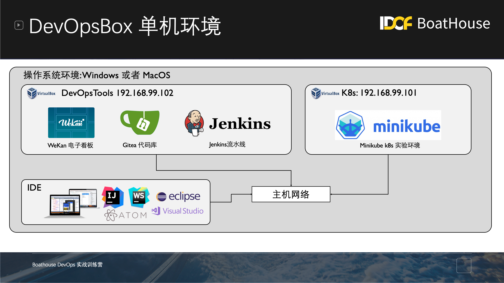

# IDCF Boathouse DevOps 实战训练营 (开源版)

本文档包括 IDCF Boathouse DevOps 实战训练营（开源）所提供的公开文档

## 培训准备

所有参训学员均需要按照以下文档完成培训准备，本培训包含大量实操内容，对于所使用的环境有标准化要求，如果你在实操过程中遇到操作性问题，请首先检查自己的环境是否满足以下环境要求：

### 环境要求

个人环境要求

请按照以下要求下载所需软件，并按照【DevOpsBox安装说明】完成安装配置

- 硬件要求
  - 最低配置：4核CPU，8G内存，500G硬盘，
  - 推荐配置：8核CPU，16G内存，500G SSD 硬盘
  - 支持硬件虚拟化，并且已经再BIOS中启用，具体操作请参考[这篇文章](https://blog.csdn.net/Blueberry521/article/details/104240762)
- 操作系统要求
  - 支持使用Windows或者MacOS操作系统
  - Windows 10 64位，家庭版/专业版/企业版/教育版，版本 1903、内部版本 18362 或更高版本
  - MacOS 10.14以上，Majave, catalina或者Big Sur
- 软件环境要求
  - Docker Desktop [下载地址](https://www.docker.com/products/docker-desktop)
    - 如果使用Windows，请使用WSL2模式运行Docker Desktop，这样可以避免安装HyperV (安装HyperV之后就无法使用MiniKube)
    - WSL2 [安装说明](https://docs.microsoft.com/zh-cn/windows/wsl/install-win10)
  - Virtual Box [下载地址](https://www.virtualbox.org/wiki/Downloads)
  - Git [下载地址](http://git-scm.com/) 
  - Visual Studio Code [下载地址](https://code.visualstudio.com/)
  - 终端程序
    - Windows 推荐使用 Windows Terminal [安装说明](https://docs.microsoft.com/zh-cn/windows/terminal/get-started)
    - MacOS 推荐使用 iTerm2 [下载地址](https://iterm2.com/)
- 个人云资源
  - 1 个 容器镜像仓库 （此资源由讲师通过【DevOps实验室】环境提供）

团队环境

团队实验环境会在培训结束前通过【DevOps实验室】环境提供提供给各参训小组，每组1套，包括以下资源

- 2 台 Linux 虚拟机 Ubuntu 16.04 LTS
- 1 个 容器镜像仓库
- 1 个 Kubernetes 集群 （包括 2 个虚拟机节点）

## DevOpsBox 安装配置说明

DevOpsBox是由IDCF/LEANSOFT的专业工程师团队设计的单机版全流程DevOps工具实验环境，设计目的是为了可以占用最少的资源提供一套全开源免费的DevOps工具链实验环境，让任何人可以在任何地点完成各类DevOps实践的学习和验证，以及定制化工具的开发。

### Boathouse 资源网盘

Boathouse资源网盘提供了一系列的资源文件，简化或者加速大家的配置操作，请大家提前下载

获取方式：扫描二维码，关注DevOps公众号，输入：boathouse训练营 即可获取网盘连接和密码

### 安装步骤

以下安装步骤除特别说明为特定环境之外，均同时适用与Windows和MacOS两种环境

1. [安装并配置 Virutal Box](devopsbox/README.md?id=_01-安装并配置-virutal-box)
2. [安装并配置 Docker Desktop](devopsbox/README.md?id=_02-安装并配置-docker-for-desktop)
3. [安装并配置阿里云版MiniKube](devopsbox/README.md?id=_03-安装并配置阿里云版minikube)
4. [在 Virutal Box 上安装Linux虚拟机](devopsbox/README.md?id=_04-在-virutal-box-上安装linux虚拟机)
5. [配置 Visual Studio Code 通过 SSH Remote 访问 DevOpsBox 环境](devopsbox/README.md?id=_05-配置-visual-studio-code-通过-ssh-remote-访问-devopsbox-环境)
6. [在 DevOpsBox 上启动 Boathouse DevOpsBox 工具链环境](devopsbox/README.md?id=_05-在-devopsbox-上启动-boathouse-devopsbox-工具链环境)

## 实验列表

**BHOL**：Boathouse on Open Source Hans On Labs

- [BHOL01 - Docker 基本操作](labs/bhol01.md)
- [BHOL02 - 应用的容器化开发全流程实践](labs/bhol02.md)
- BHOL03 - Docker数据持久化和网络
- BHOL04 - 使用docker-compose进行容器编排

## 版权说明

本文档以及相关内容版权归 IDCF 和 LEANSOFT 所有，我们授权任何人将此文档用于任何非商业用途，但我们保留因不当使用本文档内容而引发的追责权利。

本文档及版权最终解释权归 IDCF & LEANSOFT。
