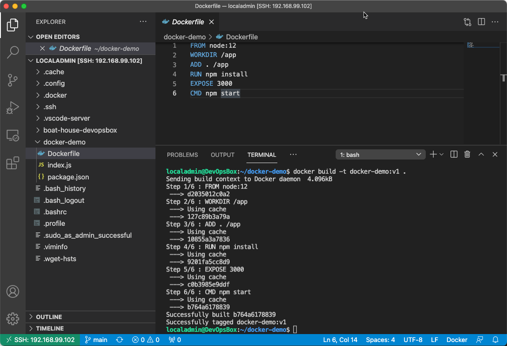
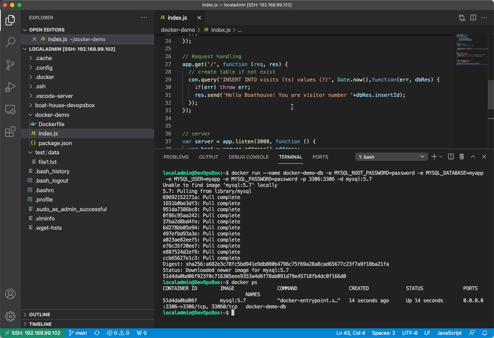
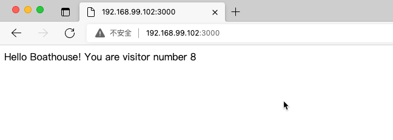

# BHOL04 - 使用docker-compose进行容器编排

本实验中，我们将使用docker-compose工具对docker脚本提供配置管理能力。Docker 使用起来虽然方便，但是如果全部通过脚本运行仍然不可靠，因为脚本本身无法有效的配置化，比如：对脚本中某个参数的变更会造成整个脚本的变更，这对于我们管理环境变更非常不方便。

Docker Compose就是为了解决这个问题而出现，它通过将docker脚本转换成yaml格式的配置文件，将所有命令参数进行配置化管理，并可以与代码一起保存，为我们提供了docker的 Iac (Infrastructure as Code) 能力支持。

## 01 - 为 docker-demo 添加后台数据库

使用vscode打开我们在 BHOL03 中使用的 docker-demo 代码库




使用以下代码更新其中的 index.js

```javascript
var express = require('express');
var app = express();
var mysql = require("mysql");
var con = mysql.createConnection(
    { 
        host: process.env.MYSQL_HOST, 
        user: process.env.MYSQL_USER, 
        password: process.env.MYSQL_PASSWORD, 
        database: process.env.MYSQL_DATABASE
    });

// mysql code

con.connect(function(err){
  if(err){
    console.log('Error connecting to db: ', err);
    return;
  }
  
  console.log('Connection to db established');
  con.query('CREATE TABLE IF NOT EXISTS visits (id INT NOT NULL PRIMARY KEY AUTO_INCREMENT, ts BIGINT)',function(err) {
    if(err) throw err;
  });
});

// Request handling
app.get('/', function (req, res) {
  // create table if not exist
  con.query('INSERT INTO visits (ts) values (?)', Date.now(),function(err, dbRes) {
    if(err) throw err;
    res.send('Hello Boathouse! You are visitor number '+dbRes.insertId);
  });
});


// server
var server = app.listen(3000, function () {
  var host = server.address().address;
  var port = server.address().port;

  console.log('Example app listening at http://%s:%s', host, port);
  console.log('process.env.MYSQL_HOST:',process.env.MYSQL_HOST);
});
```

以上代码中增加了访问mysql数据库的逻辑

- 在应用启动的时候创建一个visit表
- 每次用户请求都会在这个表中写入一条数据，同时输出当前的请求数量

现在我们必须有一个mysql数据库才能启动这个应用。

## 02 - 使用docker运行mysql容器

运行以下脚本启动一个mysql容器

```shell
# 启动mysql容器
docker run --name docker-demo-db -e MYSQL_ROOT_PASSWORD=password -e MYSQL_DATABASE=myapp -e MYSQL_USER=myapp -e MYSQL_PASSWORD=password -p 3306:3306 -d mysql:5.7
# 检查容器正常运行中
docker ps
# 检查 bridge 网络，并获取 docker-demo-db 的内网IP地址
docker inspect -f '{{range.NetworkSettings.Networks}}{{.IPAddress}}{{end}}' docker-demo-db
{docker-demo-db 内网IP地址}
```

运行效果如下



我们现在就有一个可以连接的mysql服务器，并且在其中创建了叫做myapp的数据库。

## 03 - 重新打包docker-demo并连接到mysql数据库

我们现在需要对docker-demo重新编译打包，并且在启动容器的时候按照代码中的要求添加环境变量，以便新的docker-demo容器可以连接到mysql服务器。

```shell
# 执行以下命令完成编译打包，同时tag新镜像为 docker-demo:v2-mysql
docker build -t docker-demo:v2-mysql .
# 添加环境变量运行 v2-mysql 容器
docker run --name docker-demo-web -e MYSQL_DATABASE=myapp -e MYSQL_USER=myapp -e MYSQL_PASSWORD=password -e MYSQL_HOST={docker-demo-db 内网IP地址} -itd -p 3000:3000 docker-demo:v2-mysql
```

打开浏览器导航到 http://192.168.99.102:3000 



## 04 - 使用一个 docker-compose 配置文件完成以上操作

使用vscode在docker-demo目录中创建 docker-compose.yml 文件，并添加以下内容

```shell
version: "2.1"
services:
    web:
        build: .
        ports:
            - "3000:3000"
        links:
            - db
        environment:
            MYSQL_DATABASE: myapp
            MYSQL_USER: myapp
            MYSQL_PASSWORD: password
            MYSQL_HOST: db
        depends_on:
            db:
                condition: service_healthy
    db:
        image: mysql:5.7
        ports:
            - "3306:3306"
        environment:
            MYSQL_DATABASE: myapp
            MYSQL_USER: myapp
            MYSQL_PASSWORD: password
            MYSQL_ROOT_PASSWORD: password
        healthcheck:
            test: ["CMD", 'mysqladmin', 'ping', '-h', 'localhost', '-u', 'root', '-p$$MYSQL_ROOT_PASSWORD' ]
            timeout: 5s
            retries: 3
```

清理镜像并使用docker-compose启动应用

```shell
## 清理正在运行的容器
docker rm -f $(docker ps -qa)
## 一键启动
docker-compose up
```

你会看到terminal中所输出的容器日志，等待日志输出 Example app listening at http://:::3000 以后，在主机上打开浏览器导航到 

http://192.168.99.102:3000 

即可看到如下应用


## 小结

docker-compose实在单机docker环境中进行多容器编排的非常有效的工具，可以把复杂纷乱的命令行参数转换成容易管理的yaml格式，便于我们与代码一同存储，同时也方便我们对环境配置变更进行审核。确保环境部署的可靠性。


