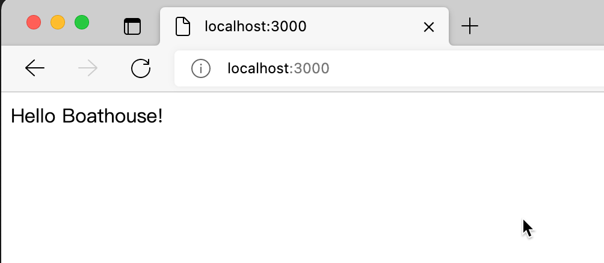
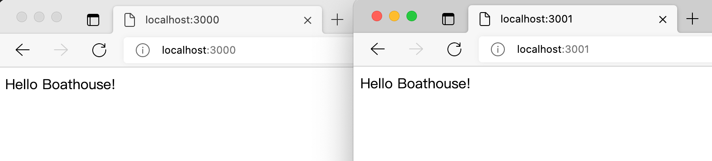

# BHOL301 - Docker 基本操作

本节动手实验带你完成最基本的docker操作，理解容器化应用运行的基本特点。

请在安装了 Docker Desktop 的主机上运行以下实验内容，因为实验内容包含了清理操作，如果在DevOpsBox运行会造成环境被删除。

注意：以下操作中使用了Docker Hub提供的公开镜像仓库，请确保你的实验环境可以链接互联网。

## 01 - 使用容器运行 Hello Boathouse

使用命令行运行以下命令，此命令通过 busybox 容器输出 Hello Boathouse 文本，执行完毕后，容器自动退出。

```shell
## 运行容器
docker run busybox /bin/echo 'Hello Boathouse'
Hello Boathouse
## 查看正在运行的容器
docker ps
CONTAINER ID   IMAGE     COMMAND   CREATED   STATUS    PORTS     NAMES
## 查看正在运行和已经退出的容器
docker ps -a
CONTAINER ID   IMAGE     COMMAND                  CREATED         STATUS                     PORTS     NAMES
13f29240c769   busybox   "/bin/echo 'Hello Bo…"   3 seconds ago   Exited (0) 2 seconds ago             sleepy_burnell
```

实验要点：

- 以上第二步的docker ps中未输出任何容器示例，这是因为我们的容器在完成输出 'Hello World' 的任务之后已经退出了 
- 查看第三部的STATUS字段可以看到已经退出的字样
- 这说明容器和虚拟机的本质区别，容器就是一个进程，如果我们不要求容器持续运行，它完成任务后就会直接退出。

## 02 - 使用容器持续运行 Hello Boathouse

使用以下命令启动一个会持久化运行的 busybox 容器，并在其中持续输出 'Hello Boathouse' 文本

```shell
## 使用 -d 参数持久化运行容器，docker会返回容器ID
### 注意你的容器所输出的ID会和我的不同
docker run -d busybox /bin/sh -c "while true; do echo Hello Boathouse; sleep 1; done"
bfd6cc5fc3869a034582c4572323143e84a7fd89de0d0e0fa438c42351b928ad
## 使用 docker ps 查看正在运行的容器
docker ps 
CONTAINER ID   IMAGE    COMMAND                  CREATED         STATUS         PORTS     NAMES
bfd6cc5fc386   busybox   "/bin/sh -c 'while t…"   3 seconds ago   Up 2 seconds             elated_faraday
## 复制你的 CONTAINER ID 并查看容器日志
docker logs -f {CONTAINER ID}
## 停止容器运行
docker stop {CONTAINER ID}
```

实验要点：

- 使用 -d 参数可以让容器进入后台运行
- 使用 while 循环让容器置于持续运行状态
- 通过 docker logs 可以查看容器内日志

## 03 - 和容器进行交互（在容器内运行命令）

使用命令行运行以下命令，此命令将启动一个 busybox 容器并在其中运行 sh 交互命令行界面，你可以尝试运行pwd，ls，ps等命令查看容器内环境。

```shell
## 使用 -i -t 参数，我们会将容器的交互功能启动，允许我们进入容器进行操作
docker run -i -t busybox /bin/sh
/ # ls
bin   dev   etc   home  proc  root  sys   tmp   usr   var
/ # pwd
/
/ # ls -la
total 44
drwxr-xr-x    1 root     root          4096 Jun  9 00:36 .
drwxr-xr-x    1 root     root          4096 Jun  9 00:36 ..
-rwxr-xr-x    1 root     root             0 Jun  9 00:36 .dockerenv
drwxr-xr-x    2 root     root         12288 Oct  1  2018 bin
drwxr-xr-x    5 root     root           360 Jun  9 00:36 dev
drwxr-xr-x    1 root     root          4096 Jun  9 00:36 etc
drwxr-xr-x    2 nobody   nogroup       4096 Oct  1  2018 home
dr-xr-xr-x  204 root     root             0 Jun  9 00:36 proc
drwx------    1 root     root          4096 Jun  9 00:36 root
dr-xr-xr-x   13 root     root             0 Jun  9 00:36 sys
drwxrwxrwt    2 root     root          4096 Oct  1  2018 tmp
drwxr-xr-x    3 root     root          4096 Oct  1  2018 usr
drwxr-xr-x    4 root     root          4096 Oct  1  2018 var
/ # exit

## 添加 -d 参数，我们可以将容器置于后台运行，同时允许交互操作
docker run -i -t -d busybox /bin/sh
d66297ef608b97ca2a98122f681b92dff4933055597aebeafcc44a2b548bd66e
## 使用 docker ps 获取 CONTAINER ID 
docker ps
CONTAINER ID   IMAGE     COMMAND     CREATED         STATUS         PORTS     NAMES
d66297ef608b   busybox   "/bin/sh"   6 seconds ago   Up 5 seconds             magical_mendeleev
## 使用 docker exec 进入容器执行 /bin/sh
docker exec -it {CONTAINER ID} /bin/sh
/ # ls
bin   dev   etc   home  proc  root  sys   tmp   usr   var
/ # exit

```

## 04 - 运行带有WebUI的容器并通过浏览器访问

docker-demo 是Boathouse训练营提供的演示程序，带有简单的WebUI，通过以下命令运行此容器。

```shell
docker run -itd -p 3000:3000 boathousex/docker-demo 
5c2ca9520b7f43a40cd594fd887abce51eb86081c4246ce59a719de164536138
```

打开浏览器并访问 http://localhost:3000 可以看到以下界面



再运行一个同样的 docker-demo 容器，使用另外一个端口（3001）

```shell
docker run -itd -p 3001:3000 boathousex/docker-demo 
29c8d086350977f4628b10d80cb0a2fe797fa46e14a32e90dddd6df8fcdd9e7a
```

打开另外一个浏览器并访问 http://localhost:3001 我们现在通过容器同时运行了一个应用的两个实例



## 05 - 清理容器

运行容器一段时候，我们的环境中会遗留大量已经退出的容器，会占用我们的磁盘资源，使用以下命令可以清理。

```shell
## 使用 docker ps -a 获取所有正在运行和已经退出的容器
docker ps -a
CONTAINER ID   IMAGE     COMMAND                  CREATED          STATUS                        PORTS     NAMES
d66297ef608b   busybox   "/bin/sh"                9 minutes ago    Up 9 minutes                            magical_mendeleev
f21ff0357755   busybox   "/bin/sh"                12 minutes ago   Exited (0) 9 minutes ago                youthful_hermann
5c31d491b2f3   busybox   "/bin/sh"                13 minutes ago   Exited (0) 13 minutes ago               peaceful_bohr
4338f1bb6a19   busybox   "/bin/bash"              13 minutes ago   Created                                 quizzical_payne
bfd6cc5fc386   busybox   "/bin/sh -c 'while t…"   22 minutes ago   Exited (137) 16 minutes ago             elated_faraday
13f29240c769   busybox   "/bin/echo 'Hello Bo…"   26 minutes ago   Exited (0) 26 minutes ago               sleepy_burnell

## 使用 docker rm 可以清理容器
### 你可以使用容器id的前几位作为容器标识，只要不重复就可以
docker rm 13f bfd
13f
bfd
## 使用以下命令组合可以一键清理所有已经退出的容器
### 注意最后一行提示我们还有一个容器正在运行，无法清理
docker rm $(docker ps -qa)
f21ff0357755
5c31d491b2f3
4338f1bb6a19
Error response from daemon: You cannot remove a running container d66297ef608b97ca2a98122f681b92dff4933055597aebeafcc44a2b548bd66e. Stop the container before attempting removal or force remove
## 添加 -f 强制清理，无论是否正在运行
docker rm -f $(docker ps -qa)
d66297ef608b
```

常用命令

```shell
## Windows 环境
### 一键停止所有容器
FOR /f "tokens=*" %i IN ('docker ps -a -q') DO docker stop %i
### 一键删除所有容器
FOR /f "tokens=*" %i IN ('docker ps -a -q') DO docker rm %i
### 一键强制删除所有容器
FOR /f "tokens=*" %i IN ('docker ps -a -q') DO docker rm -f %i

## Mac/Linux 环境
### 一键停止所有容器
docker stop $(docker ps -qa)
### 一键删除所有容器
docker rm $(docker ps -qa)
### 一键强制删除所有容器
docker rm -f $(docker ps -qa)
```


## 小结

本节内容我们熟悉了docker的基本操作，对容器就是一个进程的本质了理解。


