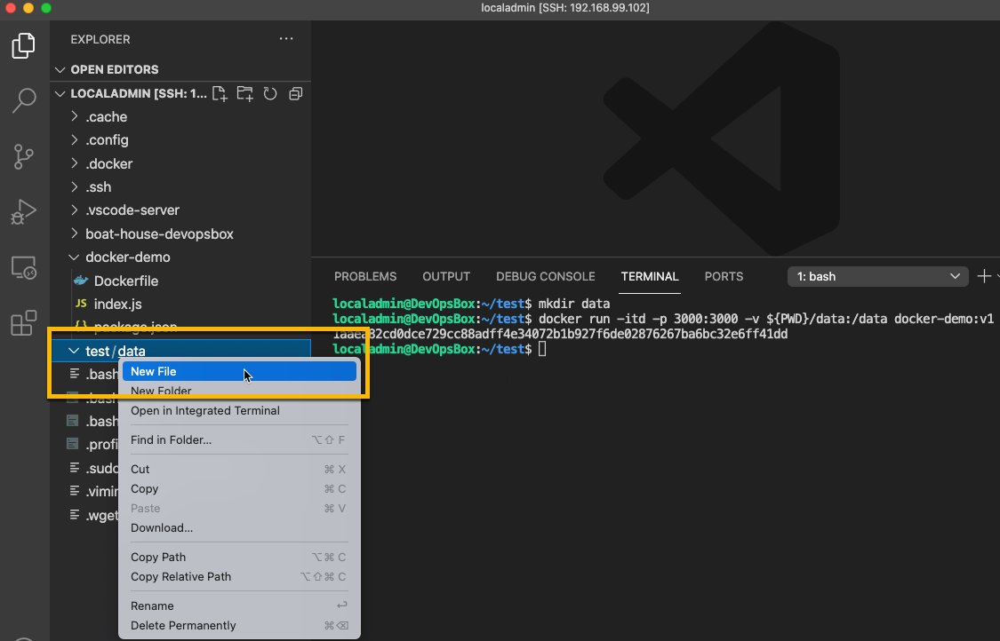
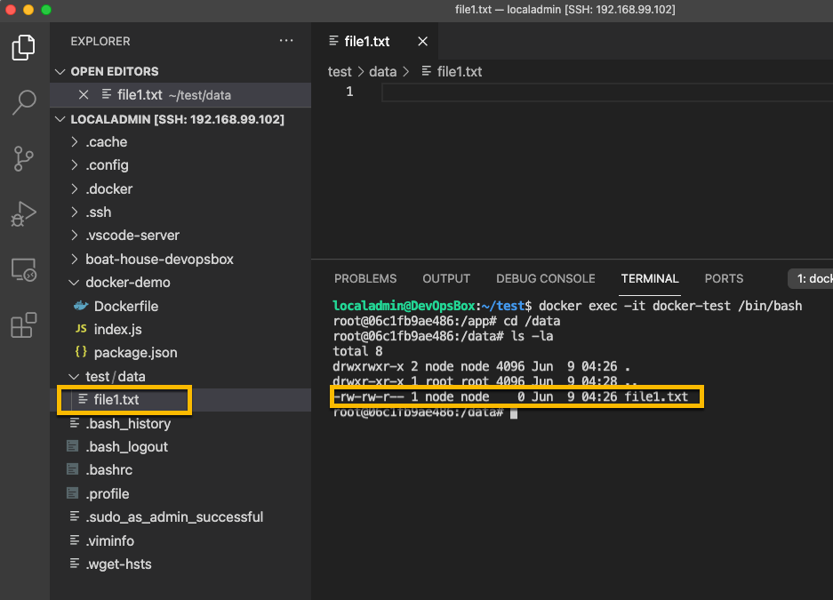
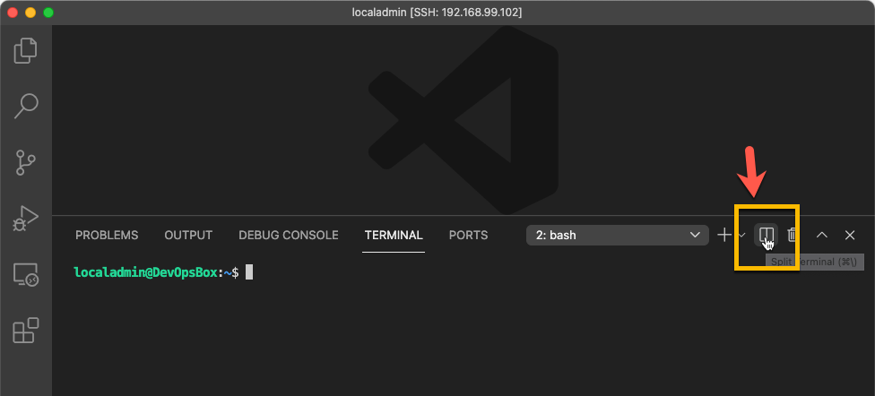
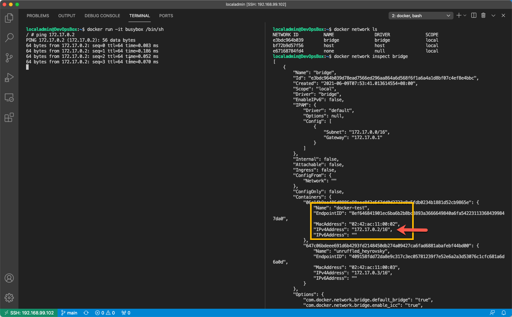
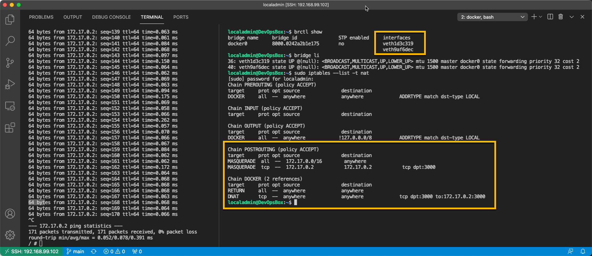

BHOL303 - Docker数据持久化和网络

本节实验中，我们将对docker volume和docker network进行演练，这个过程我们会使用 DevOpsBox，请先按照说明停止DevOpsBox中工具链的运行。

## 01 - 在DevOpsBox中编译打包docker-demo应用

使用 VScode Remote 连接到 DevOpsBox，并将docker-demo代码复制进来，然后运行 

```shell
cd docker-demo
docker build -t docker-demo:v1 .
```


现在我们在 DevOpsBox 中就有了一个 docker-demo:v1 的可运行的镜像

## 02 - 创建带有volume映射的容器实例

在 DevOpsBox中，创建test目录并使用一下命令启动容器

```shell
mkdir test
cd test
mkdir data
docker run  -itd -p 3000:3000 -v ${PWD}/data:/data --name docker-test docker-demo:v1
```

以上命令成功后，用vscode在 test/data 目录中创建 file1.txt



使用以下命令进入容器内的 /data 目录，并查看目录内容

```shell
docker exec -it docker-test /bin/bash
cd /data
ls -la
```



注意同样的文件在容器内也存在，实际上他们就是同一个文件，我们通过 -v (--volume) 参数将本级的 /test/data 目录映射到了容器内的 /data 目录中。

现在你可以尝试通过vscode直接修改文件，在容器内通过 cat file1.txt 就可以实时看到所修改的内容。

## 03 - 查看docker网络设置

注意：进行此实验前请保持以上实验的环境状态，不要清理正在运行的docker-test容器。

现在我们来看看docker是如何管理网络的

首先我们将vscode的Terminal分成左右两个，以便我们同时运行一些命令；点击Terminal控制栏上的 Split terminal 按钮



分别在左右窗口中运行以下命令

```shell
## 左侧：启动 busybox 容器并进入容器
docker run -it busybox /bin/sh
## 右侧：查看docker网络列表
docker network ls
## 右侧：检视 bridge 网络详情，并记录 docker-test 容器ip
docker network inspect bridge
## 左侧：ping docker-test 容器ip
ping {docker test 容器ip}
```

效果如下：默认情况下，docker会将容器放入bridge网络，因此所有为特别指定--network参数的容器都会放置于bridge网络，他们之间可以通过内部ip子网（172.XX.XX.XX/16）联通。



```shell
## 右侧：查看网卡设置
brctl show
bridge li
## 右侧：iptable 配置
sudo iptables --list -t nat
```

效果如下：可以看到我们的两个容器均通过虚拟网卡连接到docker0的bridge网络，并且主机的3000端口被转发到了docker-test容器(172.17.0.2)的3000端口上



## 小结

通过本节实验，我们了解了docker中两个重要的概念，volume和network。使用volume我们可以将主机文件系统和容器内文件系统打通，实现目录的映射，这对我们与容器进行文件交互非常有用（比如：配置文件）。docker的网络设置允许我们在一台主机上虚拟处多个子网，并对多个子网进行灵活设置，方便我们在一台主机上运行多个应用，并进行网络隔离。
