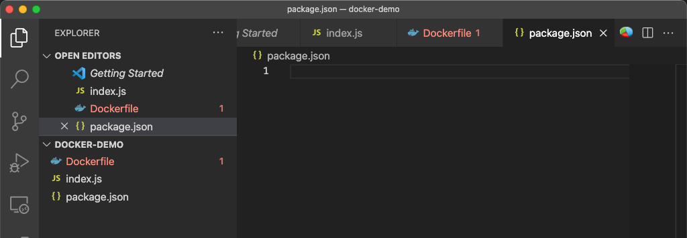
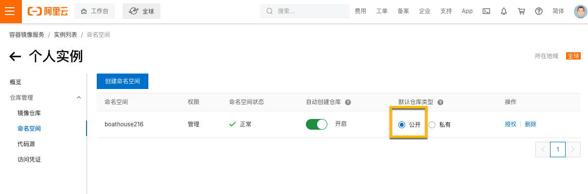
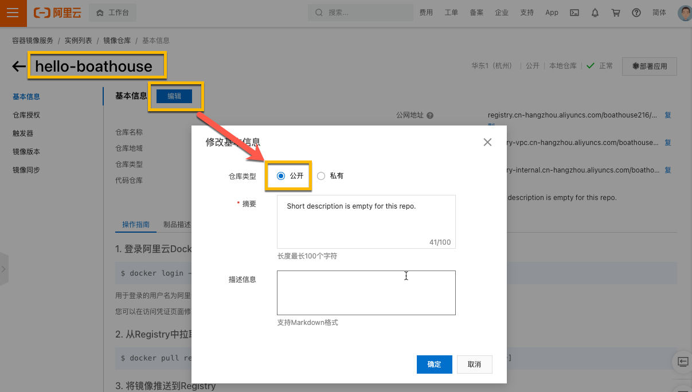
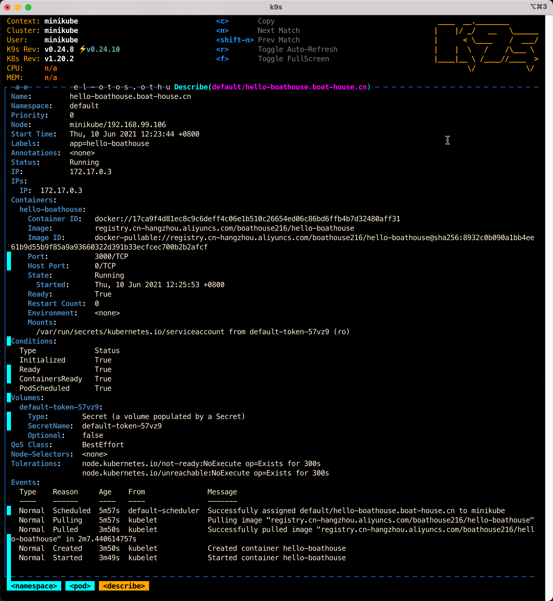
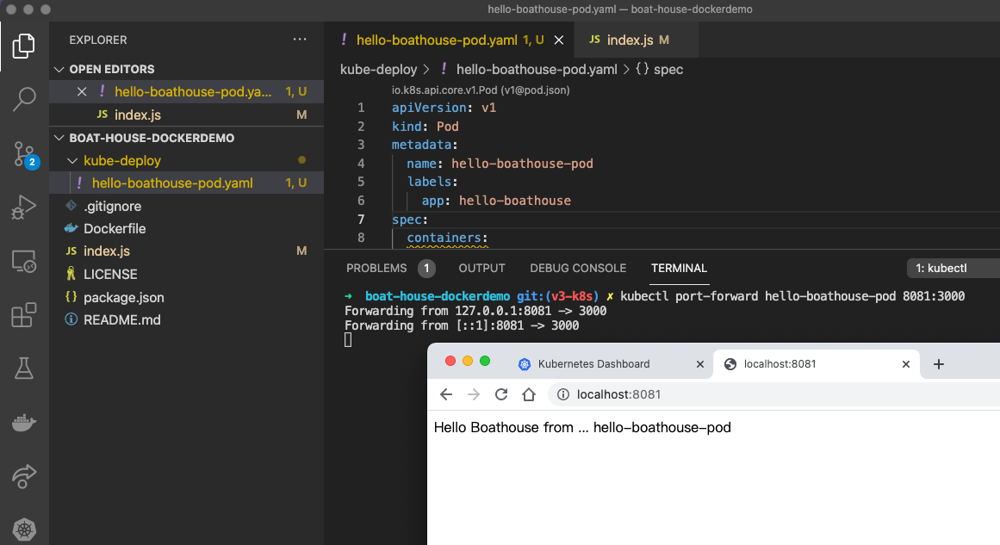
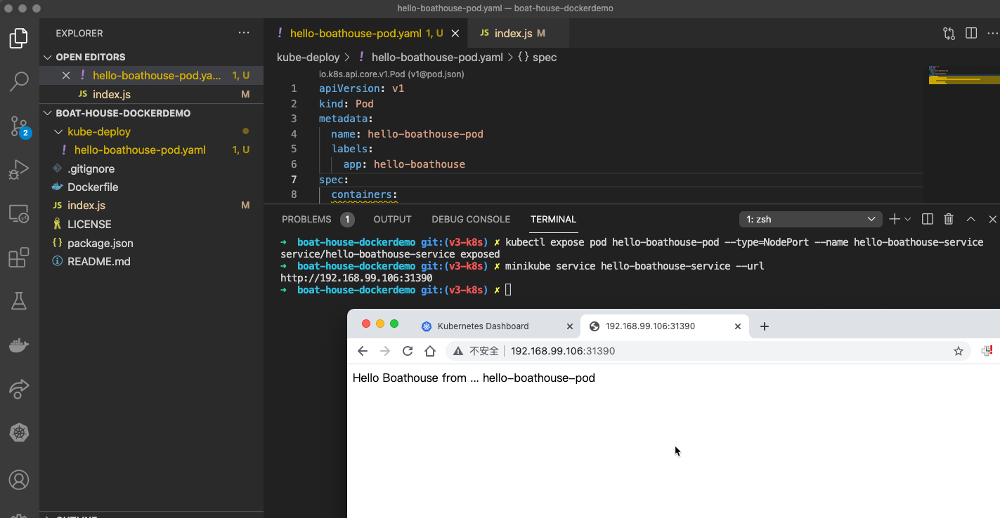
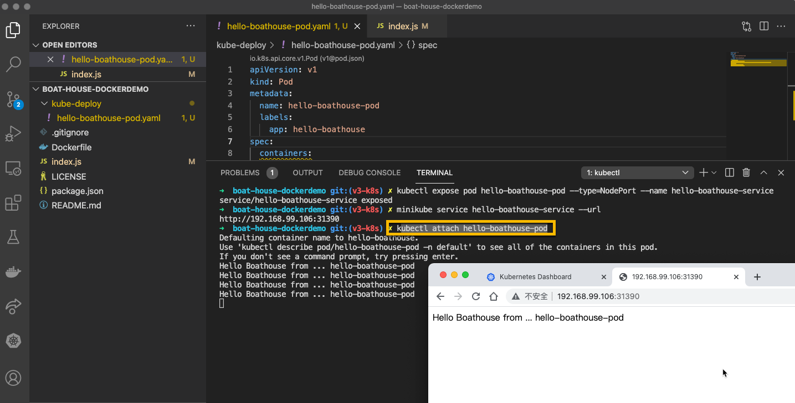
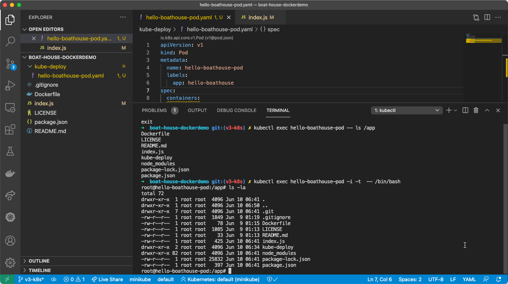
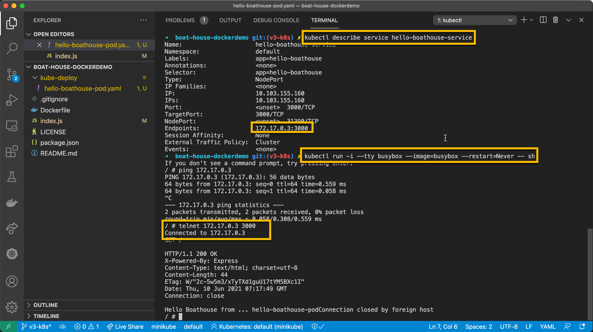

# BHOL402 - k8s应用开发部署 - 使用pod进行部署

在这几节实验中，我们将完成我们的 Hello Boathouse 应用的k8s部署过程，其中会涉及到一下k8s中的对象

- * Pod
- Deployment
- Service
- Secret
- Namespace

这些内容基本上覆盖了我们k8s集群进行应用开发部署的主要对象。

## 01 - 创建 Hello Boathouse 应用并打包成 docker 镜像

使用以下命令创建代码目录并用vscode打开

```shell
mkdir hello-boathouse
cd hello-boathouse
code .
```

使用vscode分别创建以下文件

- index.js
- Dockerfile
- package.json



将以下内容分别复制到对应的文件中

index.js - 这是我们的应用入口，其功能就是在网页中直接输出 Hello Boathouse！的字样

```javascript
var express = require('express');
var os = require('os');
var app = express();

app.get('/', function (req, res) {
  console.log('Hello Boathouse v1 from ... %s', os.hostname );
  res.send('Hello Boathouse v1 from ... '+ os.hostname);
});

var server = app.listen(3000, function () {
  var host = server.address().address;
  var port = server.address().port;

  console.log('Example app listening at http://%s:%s', host, port);
});
```

package.json - 这是 node.js 项目的配置文件，描述了本项目的依赖以及入口

```json
{
    "name": "myapp",
    "version": "0.0.1",
    "private": true,
    "scripts": {
      "start": "node index.js"
    },
    "engines": {
      "node": "^4.6.1"
    },
    "dependencies": {
      "express": "^4.14.0",
      "http-errors": "^1.7.0",
      "mysql": "^2.10.2"
    },
    "devDependencies": {
      "inherits": "^2.0.3",
      "mocha": "^5.2.0",
      "ms": "^2.1.1"
    }
}
```

Dockerfile - 用于 docker build 的打包脚本文件，我们基于node:12基础镜像，将应用代码复制到 /app 目录后执行 npm install，然后执行 package.json 中定义的应用入口 npm start 启动应用。

```Dockerfile
FROM node:12
WORKDIR /app
ADD . /app
RUN npm install
EXPOSE 3000
CMD npm start
```

使用一下命令将 hello-boathouse 应用打包成docker镜像并上传到个人镜像仓库

```shell
cd hello-boathouse
## docker 打包
docker build -t hello-boathouse .
## 推送到个人镜像仓库
docker tag hello-boathouse registry.cn-hangzhou.aliyuncs.com/{命名空间}/hello-boathouse
docker push registry.cn-hangzhou.aliyuncs.com/{命名空间}/hello-boathouse
## 同样的镜像，tag成v1
docker tag hello-boathouse registry.cn-hangzhou.aliyuncs.com/{命名空间}/hello-boathouse:v1
docker push registry.cn-hangzhou.aliyuncs.com/{命名空间}/hello-boathouse:v1
```

将boat-house仓库设置为公开仓库，需要同时对命名空间和仓库本身进行“公开”设置

注意：这个设置是为了简化我们后续的操作，可以在无需授权的情况下直接拉取镜像。实际应用中一般我们不会将镜像设置为公开。





## 02 - 为 Hello Boathouse 应用添加 k8s 部署文件并创建 Pod

在 hello-boathouse 目录中创建 kube-deploy 目录，并添加 hello-boathouse-pod.yaml 文件，文件内容如下：

```yaml
apiVersion: v1
kind: Pod
metadata:
  name: hello-boathouse-pod
  labels:
    app: hello-boathouse
spec:
  containers:
  - name: hello-boathouse
    image: registry.cn-hangzhou.aliyuncs.com/boathouse216/hello-boathouse
    ports:
    - name: nodejs-port
      containerPort: 3000
```

运行一下命令，完成 Pod 部署

```shell
## 创建 Pod
kubectl create -f kube-deploy/hello-boathouse-pod.yaml

## 获取 pod 状态
### 这里需要等待一会儿，因为k8s需要先拉取镜像
### 可以通过 BHOL401 中所介绍的工具实时监控 Pod 创建状态
kubectl get pods

NAME                            READY   STATUS    RESTARTS   AGE
hello-boathouse-pod   1/1     Running   0          2m29s

## 获取 pod 状态详情
### 同样的信息也可以通过 BHOL401 中所介绍的工具获取
kubectl describe pod hello-boathouse-pod

Name:         hello-boathouse-pod
Namespace:    default
Priority:     0
Node:         minikube/192.168.99.106
Start Time:   Thu, 10 Jun 2021 12:23:44 +0800
Labels:       app=hello-boathouse
Annotations:  <none>
Status:       Running
IP:           172.17.0.3
IPs:
  IP:  172.17.0.3
Containers:
  hello-boathouse:
    Container ID:   docker://17ca9f4d81ec8c9c6deff4c06e1b510c26654ed06c86bd6ffb4b7d32480aff31
    Image:          registry.cn-hangzhou.aliyuncs.com/boathouse216/hello-boathouse
    Image ID:       docker-pullable://registry.cn-hangzhou.aliyuncs.com/boathouse216/hello-boathouse@sha256:8932c0b090a1bb4ee61b9d55b9f85a9a93660322d391b33ecfcec700b2b2afcf
    Port:           3000/TCP
    Host Port:      0/TCP
    State:          Running
      Started:      Thu, 10 Jun 2021 12:25:53 +0800
    Ready:          True
    Restart Count:  0
    Environment:    <none>
    Mounts:
      /var/run/secrets/kubernetes.io/serviceaccount from default-token-57vz9 (ro)
Conditions:
  Type              Status
  Initialized       True 
  Ready             True 
  ContainersReady   True 
  PodScheduled      True 
Volumes:
  default-token-57vz9:
    Type:        Secret (a volume populated by a Secret)
    SecretName:  default-token-57vz9
    Optional:    false
QoS Class:       BestEffort
Node-Selectors:  <none>
Tolerations:     node.kubernetes.io/not-ready:NoExecute op=Exists for 300s
                 node.kubernetes.io/unreachable:NoExecute op=Exists for 300s
Events:
  Type    Reason     Age    From               Message
  ----    ------     ----   ----               -------
  Normal  Scheduled  4m16s  default-scheduler  Successfully assigned default/hhello-boathouse-pod to minikube
  Normal  Pulling    4m15s  kubelet            Pulling image "registry.cn-hangzhou.aliyuncs.com/boathouse216/hello-boathouse"
  Normal  Pulled     2m8s   kubelet            Successfully pulled image "registry.cn-hangzhou.aliyuncs.com/boathouse216/hello-boathouse" in 2m7.440614757s
  Normal  Created    2m8s   kubelet            Created container hello-boathouse
  Normal  Started    2m7s   kubelet            Started container hello-boathouse
```

通过k9s获取pod详情



## 03 - 获取 hello-boathouse 应用的外部访问

### 使用端口转发方式

kubectl 可以将k8s集群中的应用端口转发到我们本机上，方便我们对应用进行快速调试，运行一下命令即可启动端口转发

```shell
kubectl port-forward hello-boathouse-pod 8081:3000
Forwarding from 127.0.0.1:8081 -> 3000
Forwarding from [::1]:8081 -> 3000
```

这时打开浏览器，通过 http://localhost:8081 即可访问我们的应用，效果如下：



按 Ctrl+C 结束端口转发

### 使用节点端口(NodePort)方式直接在节点上开放端口

```shell
## 为 Pod 创建 Service 并使用 NodePort 模式
kubectl expose pod hello-boathouse-pod --type=NodePort --name hello-boathouse-service
service/hello-boathouse-service exposed
## 从 minikube 获取对外暴露的端口号
minikube service hello-boathouse-service --url
http://192.168.99.106:31359
## 获取 Service 列表
kubectl get services
NAME                      TYPE        CLUSTER-IP     EXTERNAL-IP   PORT(S)          AGE
hello-boathouse-service   NodePort    10.96.202.41   <none>        3000:31359/TCP   5m8s
kubernetes                ClusterIP   10.96.0.1      <none>        443/TCP          30h
```

这时打开浏览器，通过 http://192.168.99.106:31359 (具体要参考你自己的输出) 即可访问我们的应用，效果如下：




## 04 - 常用kubectl命令

### kubectl attach 

连接 pod 日志输出

```shell
kubectl attach hello-boathouse-pod
```



### kubectl exec

在 pod 中执行指令

```shell
## 列出 /app 目录内容
kubectl exec hello-boathouse-pod -- ls /app
## 在 Pod 中运行 bash 
kubectl exec hello-boathouse-pod -i -t  -- /bin/bash
```



### kubectl run 

使用 busybox 在 k8s 集群中调试应用

```shell
## 使用 describe 获取 Service 详情，记录Endpoint信息
kubectl describe service hello-boathouse-service
## 使用 busybox 启动临时 pod，对服务进行测试
kubectl run -i --tty busybox --image=busybox --restart=Never -- sh
ping {EndPoint IP 地址}
telnet {EndPoint IP 地址} {EndPoint 端口}
```



使用这种方式我们可以进入k8s进群内部定位问题，确定我们启动的pod是否工作正常。