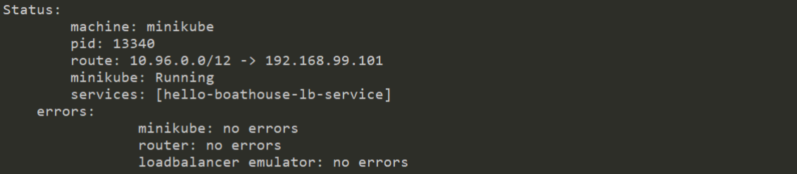

# BHOL404 - k8s应用开发部署 - 使用Service对外提供服务

在这几节实验中，我们将完成我们的 Hello Boathouse 应用的k8s部署过程，其中会涉及到一下k8s中的对象

- Pod
- Deployment
- * Service
- Secret
- Namespace

这些内容基本上覆盖了我们k8s集群进行应用开发部署的主要对象。

## 01 - 实验准备

刚才我们都在使用kubectl命令的方式来完成service的创建，其实我们也可以使用yaml文件对service进行配置。

首先清理我们刚才用kubectl方式创建的service

```shell
kubectl delete service hello-boathouse-service
```

## 02 - 使用 NodePort 方式

使用vscode创建 hello-boathouse-nodeport-service.yaml

```yaml
apiVersion: v1
kind: Service
metadata:
  name: hello-boathouse-service
spec:
  ports:
  - port: 31001
    nodePort: 31001
    targetPort: nodejs-port
    protocol: TCP
  selector:
    app: hello-boathouse
  type: NodePort
```

使用以下命令提交部署

```shell
kubectl apply -f kube-deploy/hello-boathouse-nodeport-service.yaml
kubectl get services
```

## 03 - 使用 Load Balancer 方式

使用vscode创建 hello-boathouse-lb-service.yaml

```yaml
apiVersion: v1
kind: Service
metadata:
  labels:
    app: hello-boathouse
  name: hello-boathouse-lb-service
spec:
  type: LoadBalancer
  ports:
  - port: 80
    targetPort: 3000
  selector:
    app: hello-boathouse
status:
  loadBalancer: {}
```

如果使用minikube运行，需要先启动 tunnel 服务，tunnel服务是在minikube上模拟 Load Balancer 服务的扩展。另外打开一个terminal窗口运行：

```shell
minikube tunnel
```
ps：该命令在window10上需要使用管理员权限执行

使用以下命令提交部署

```shell
kubectl apply -f kube-deploy/hello-boathouse-lb-service.yaml
kubectl get services
```
观察tunnel服务状态：


最后通过如下命令获取访问地址：
```shell
minikube service hello-boathouse-lb-service --url 
```