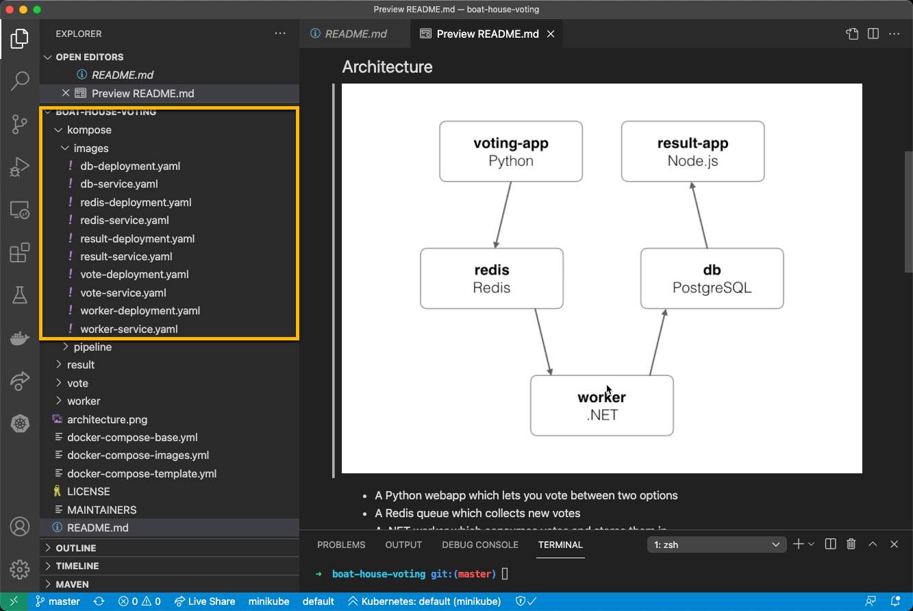
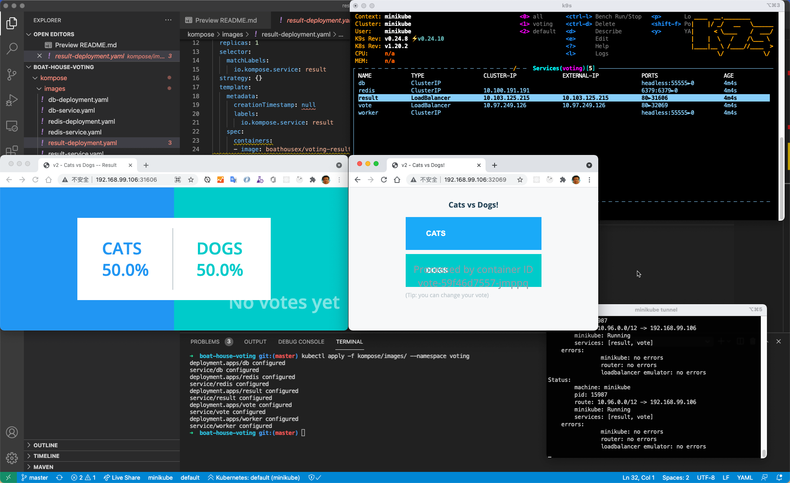

# BHOL406 - k8s应用开发部署 - 使用Namespace隔离应用

在这几节实验中，我们将完成我们的 Hello Boathouse 应用的k8s部署过程，其中会涉及到一下k8s中的对象

- Pod
- Deployment
- Service
- Secret
- * Namespace

这些内容基本上覆盖了我们k8s集群进行应用开发部署的主要对象。

## 01 - 使用 Namespace 在一个集群上提供多租户环境

我们之前的部署没有指定任何 namespace，默认使用 default namespace。下面创建一个新的 namespace，并将应用部署到这个 namespace 中。

```shell
kubectl create namespace voting
kubectl get namespaces
NAME                   STATUS   AGE
default                Active   33h
kube-node-lease        Active   33h
kube-public            Active   33h
kube-system            Active   33h
kubernetes-dashboard   Active   5h57m
voting                 Active   13s
```

现在我们有个一个独立的 namespace，让我们在这个namespace中来启动一个更加复杂的应用 boat-house-voting。

通过git获取应用代码，并用vscode打开

```shell
git clone https://github.com/idcf-boat-house/boat-house-voting.git
cd boat-house-voting
code .
```

查看应用架构图我们可以看到这个应用使用了5个容器，并同时使用了 python, node.js, c#/java 四种开发语言和 Redis以及PostreSQL 两种数据持久化方案。



左侧的 kompose/images 目录中，已经准备好了这个应用的部署配置文件，我们可以使用以下命令一件部署。

注意：此应用使用Load Balancer作为Service类型，如果使用minikube请先运行 minikube tunnel。

```shell
kubectl apply -f kompose/images/ --namespace voting
```

启动后，通过k9s监控应用运行状态，获取服务地址，浏览器分别打开 result 和 vote 两个应用的地址即可运行应用。




## 02 - 一键清理

使用 namespace 以后，我们可以一键清理整个 namespace

```shell
kubectl delete namespace voting
``

