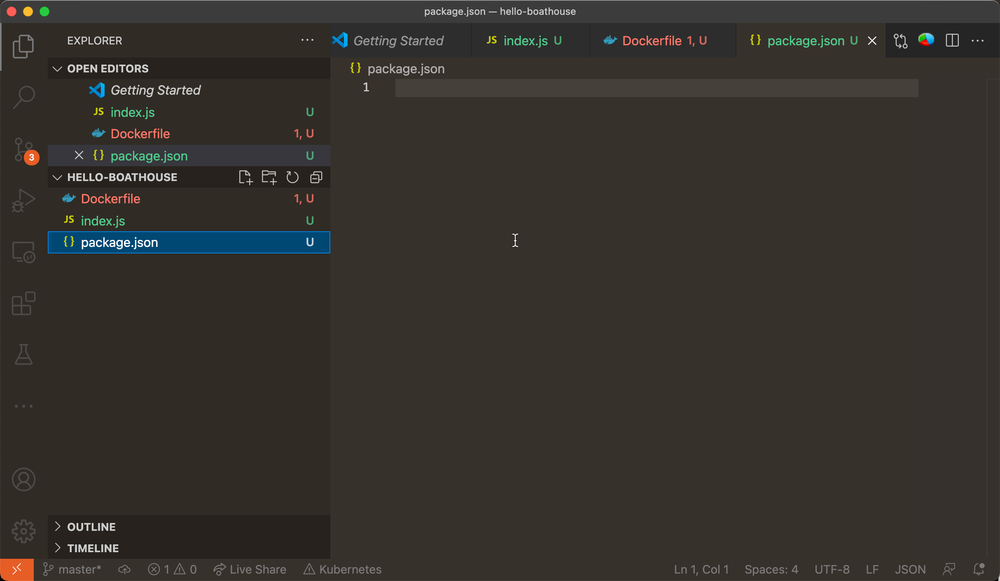
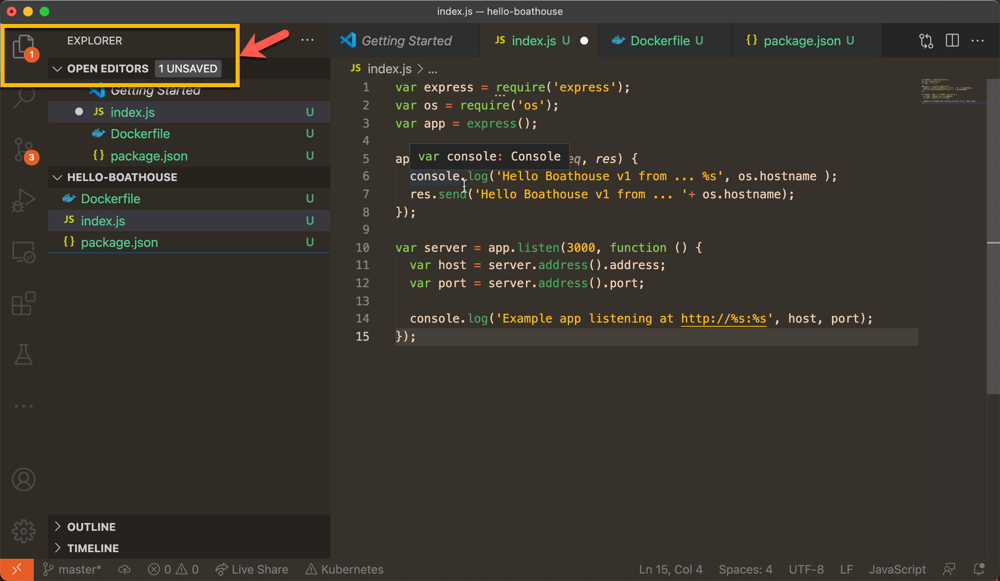
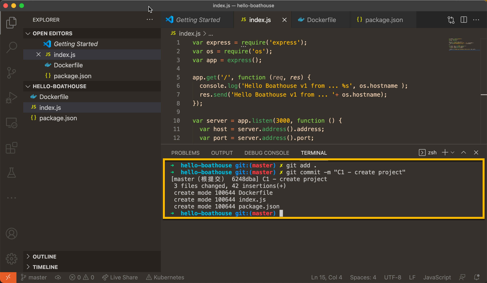
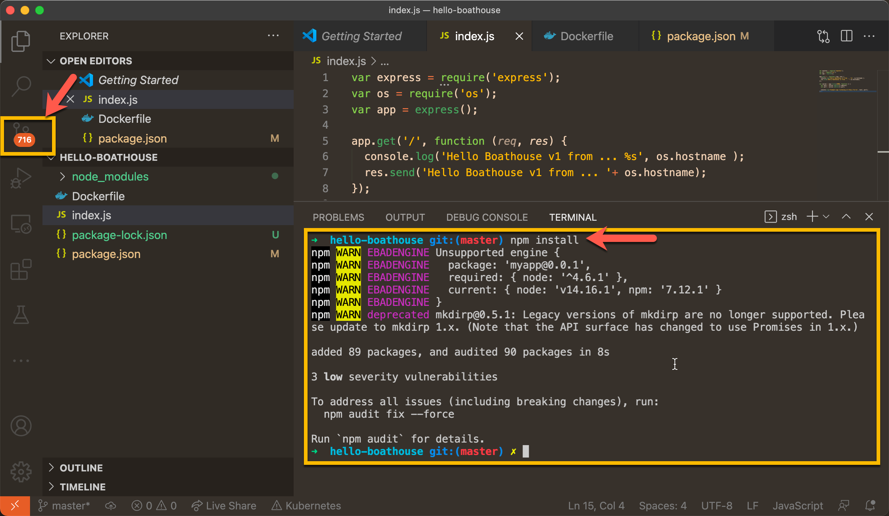
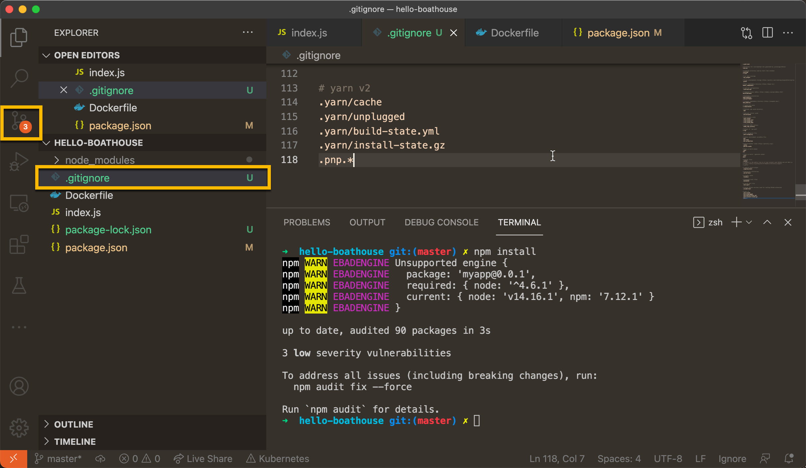
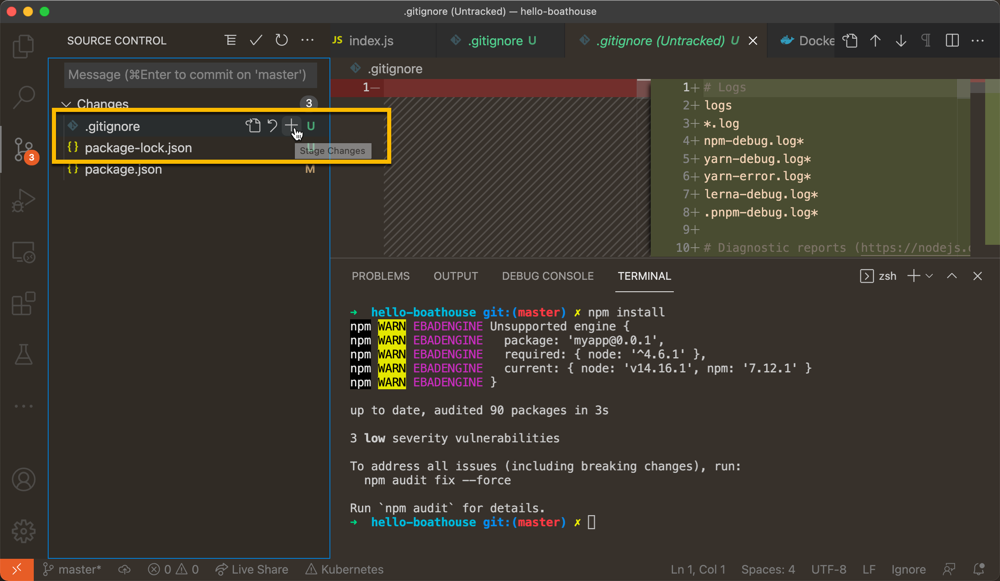
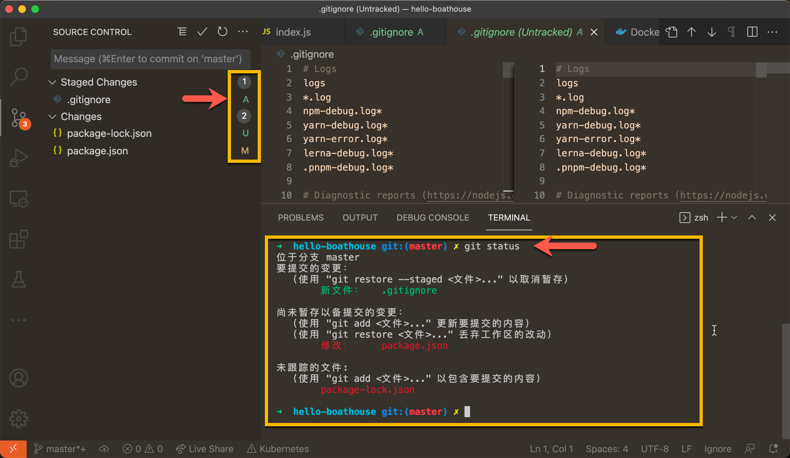
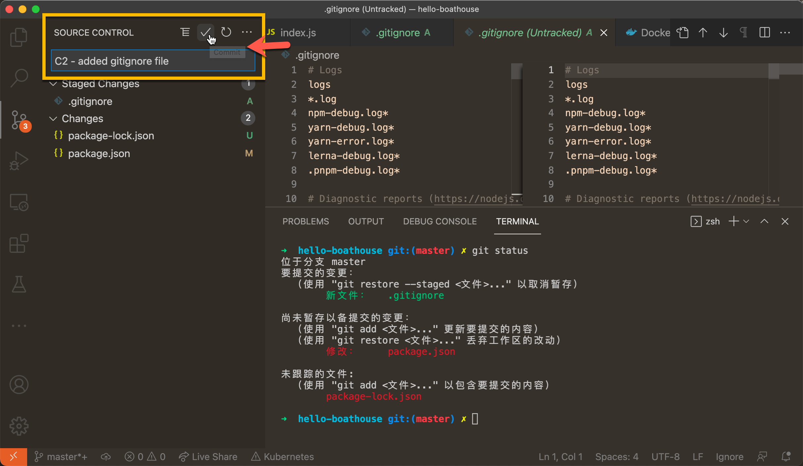

# BHOL501 - 创建Git代码库，并推送至Gitea服务器

本节实验中我们将从头创建一个git代码库，并将其发布至DevOpsBox的Gitea服务器中。

## 01 - 创建 Hello Boathouse 代码库

使用以下命令创建代码目录，初始化git repo，并用vscode打开

```shell
## 创建代码文件夹
mkdir hello-boathouse
cd hello-boathouse
## 初始化 git 代码库
git init
code .
```

使用vscode分别创建以下文件

- index.js
- Dockerfile
- package.json

注意：下图中左侧工具链上的Git工具图标上已经显示了3个未提交更改文件，这是因为我们执行了git init命令，这个hello-boathouse文件夹现在已经是一个本地git repo，git已经在跟踪其中的文件修改。



将以下内容分别复制到对应的文件中

index.js - 这是我们的应用入口，其功能就是在网页中直接输出 Hello Boathouse！的字样

```javascript
var express = require('express');
var os = require('os');
var app = express();

app.get('/', function (req, res) {
  console.log('Hello Boathouse v1 from ... %s', os.hostname );
  res.send('Hello Boathouse v1 from ... '+ os.hostname);
});

var server = app.listen(3000, function () {
  var host = server.address().address;
  var port = server.address().port;

  console.log('Example app listening at http://%s:%s', host, port);
});
```

package.json - 这是 node.js 项目的配置文件，描述了本项目的依赖以及入口

```json
{
    "name": "myapp",
    "version": "0.0.1",
    "private": true,
    "scripts": {
      "start": "node index.js"
    },
    "engines": {
      "node": "^4.6.1"
    },
    "dependencies": {
      "express": "^4.14.0",
      "http-errors": "^1.7.0",
      "mysql": "^2.10.2"
    },
    "devDependencies": {
      "inherits": "^2.0.3",
      "mocha": "^5.2.0",
      "ms": "^2.1.1"
    }
}
```

Dockerfile - 用于 docker build 的打包脚本文件，我们基于node:12基础镜像，将应用代码复制到 /app 目录后执行 npm install，然后执行 package.json 中定义的应用入口 npm start 启动应用。

```Dockerfile
FROM node:12
WORKDIR /app
ADD . /app
RUN npm install
EXPOSE 3000
CMD npm start
```

注意：下图左侧文件图标上提示有一个未保存文件，vscode默认不会自动保存文件，你需要按 Ctrl/Command + S 来取保文件已经保存到磁盘上才能进行后续的的git操作。




## 02 - 提交代码改动到本地 git repo

git 是分布式代码管理工具，我们刚才执行的git init命令已经在hello-boathouse目录中创建了 .git 的子目录，这个目录是git用来保存本地代码历史记录的数据目录。有了这样一个目录后我们在hello-boathouse目录中所进行的修改就可以被git进行跟踪了。

现在打开vscode的terminal，执行以下命令:

```shell
# 将所有修改加入git跟踪文件列表，进入stage状态
git add .
# 创建我们的第一个 commit，并添加 commit说明
git commit -m "C1 - create project"
```

注意：完成以上操作后，左侧的git图标上不再显示有未提交的改动。后续你可以通过这个图标跟踪你所修改的文件列表。



## 03 - 添加.gitignore

以下操作需要你本地安装了node.js的sdk，可以从以下地址下载最新的LTS版本，安装即可。

https://nodejs.org/zh-cn/download/

在vscode的集成terminal中执行以下命令，并观察git图标上的变化

```shell
npm install
```

注意：以上命名是用来进行node.js的依赖包恢复的，虽然我们的应用很简单，但是仍然自动下载了7百多文件。大多数文件位于node_modules这个目录中。



对于不同的开发语言，都有自己不同的方式管理和组织依赖包，比如：java一般使用maven/ant，c#使用nuget，javascript使用npm/bower，python使用pip，golang甚至会之际使用git。

如果使用语言自身的包管理进行依赖恢复就会自动从包管理服务器上下载大量的文件放入你的项目文件夹中，因为这些文件非常大而且并非你自己的代码，一般情况下我们都不应该将这些文件提交到自己的代码库，而是应该由使用这个代码库的其他开人员/或者自动化自动自行执行包恢复命令（比如：npm install）来自行安装。

为了能够将这些文件排除在git的跟踪范围之外，我们需要创建一个 .gitignore 文件，通过这个配置文件我们可以告诉git你的代码库中应该包含哪些文件。

在GitHub上已经提供了非常完整的.gitignore模版，大家直接根据自己的开发语言使用即可。

https://github.com/github/gitignore

在以上repo中找到Node.gitignore文件，复制其中的内容，并在你的代码库库中创建 .gitignore 文件，将内容粘贴进去并保存。

注意：保存这个 .gitignore文件后，git图标上的变更数量一下子减少到3个。



## 04 - 单独提交.gitignore文件

提交git修改时我们不一定非要一次将所有的改动都提交上去，我们应该根据实际情况创建更容器理解的commit log，帮助其他开发人员了解我们的代码库。

对于以上改动，我希望添加 .gitignore 文件的动作是一个独立的 commit 并且不包含其他任何文件。我们可以通过两种方式完成这个操作。

命令

```shell
## 使用命令仅添加 .gitignore文件Stage状态
git add .gitignore
```

vscode 内置git工具

在 .gitignore 文件上点击 "Stage Change" 按钮



以上两种方式均会形成以下git库状态，使用 git status 命令也可以查看



注意3种文件状态的标识：

- U: Untracked 未跟踪
- M: Modifiied 已经跟踪，并检测到修改
- A: Staged 已经跟踪，并已经放入待提交状态（Staged）

现在我们可以在vscode中添加提交说明：C2 - added gitignore file 并点击提交按钮，完成第二次提交。注意，这次只有 .gitignore 这一个文件会被提交到 git repo 中。




