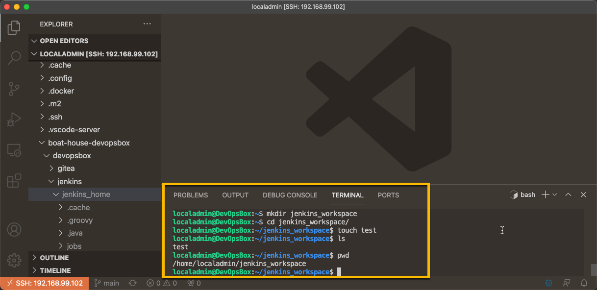
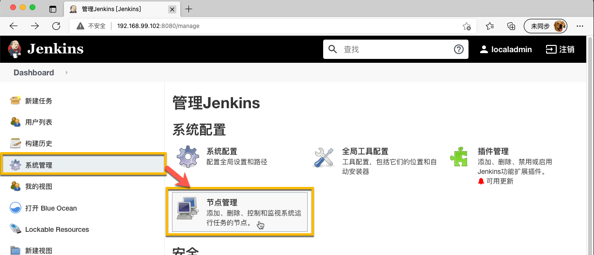
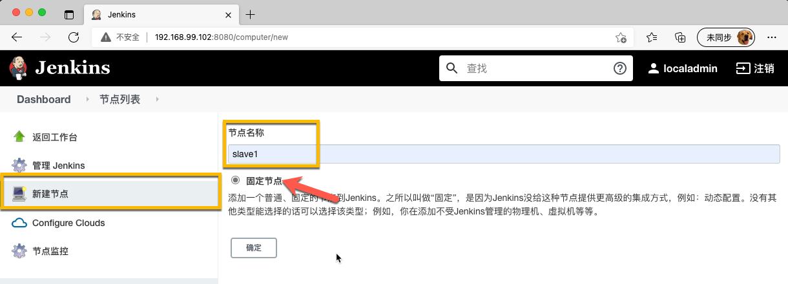
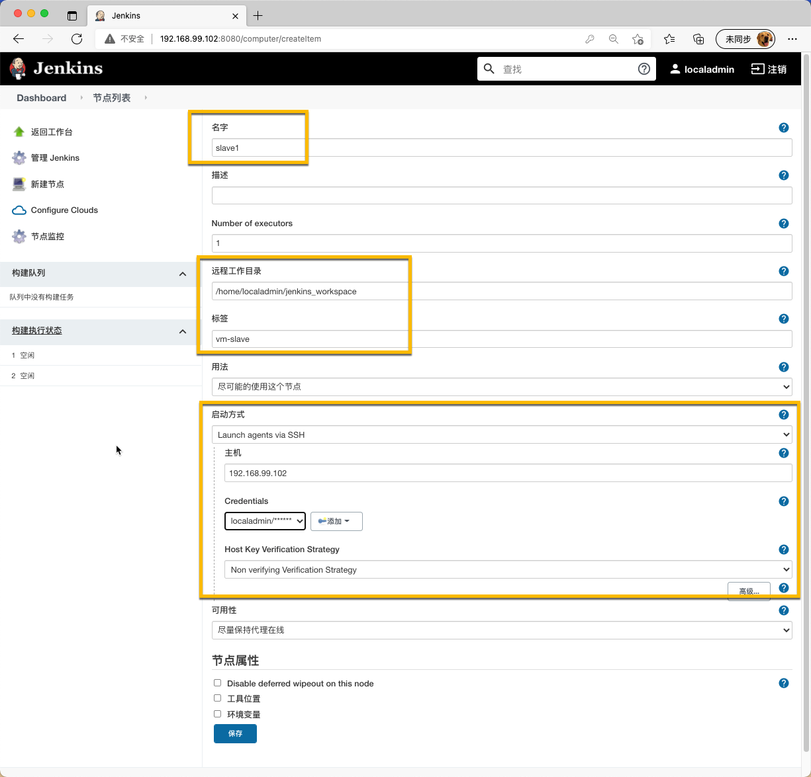
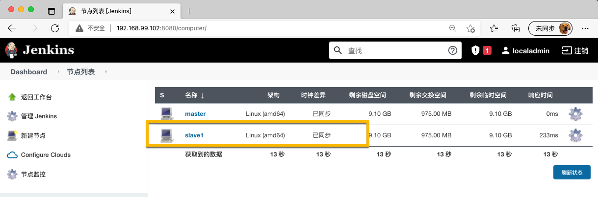
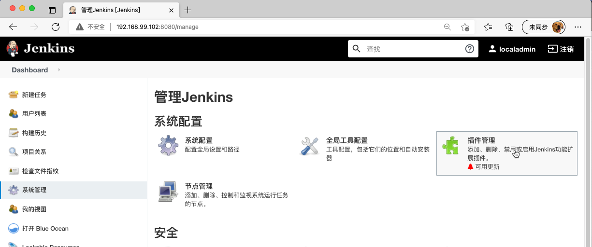
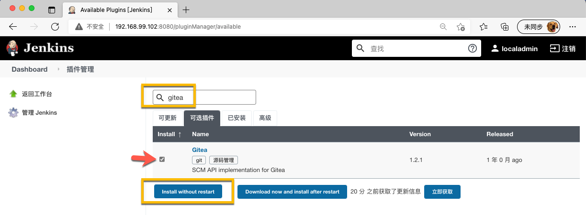

# BHOL601 - 初始化Jenkins服务器

本实验中，我们将对Jenkins服务器进行基本设置以便开始使用。

## 01 - 为Jenkins服务器添加worker节点

Jenkins依赖worker节点进行实际的自动化操作，本实验中我们将给我们的DevOpsBox中的Jenkins服务器添加一个worker节点。为了简化实验环境，我们将使用DevOpsBox虚拟机本身作为Jenkins的Worker节点，这种配置本身并不是最优化的，只是为了节省实验资源的设定。

准备工作目录，使用ssh进入DevOpsBox的lcoaladmin用户目录，执行以下命令

```shell
mkdir jenkins_workspace
cd jenkins_workspace
touch test
ls
pwd
```

确保目录处于 /home/localadmin/jenkins_workspace 位置



进入 系统管理 ｜ 节点管理



点击 新建节点，命名为 slave1，并勾选 ”固定节点“，点击 确定



在下面的页面中设置以下参数：

- 名字：slave1
- 远程工作目录：/home/localadmin/jenkins_workspace
- 标签：vm-slave
- 启动方式：lanuch agents via SSH
  - 主机：192.168.99.102 （你的devopsbox的IP地址）
  - Credentails: 需要将我们的登录DevOpsBox的账号 localadmin 添加到 Jenkins 的 Credentials 里面
  - Host Key Verification Strategy: 选择 No verifying Verification Strategy

然后点击 保存



保存后等待几秒钟，然后刷新页面，确保 slave1 处于 已同步 状态



至此，我们就有了一个运行在DevOpsBox的Jenkins工作节点。

## 02 - 为Jenkins服务器添加Gitea插件

因为我们使用Gitea作为代码管理工具，需要给Jenkins添加对应的插件以便可以更简便的完成后续的配置工作。

进入 系统管理 ｜ 插件管理



在 可选插件 中输入 gitea，然后选中 Gitea 插件并点击 Install without Restart



在安装页面选中 安装完成后重启Jenkins(空闲时)，等待Jenkins重启完毕。

## 小结

至此，我们已经准备好我们的Jenkins服务器，可以开始搭建流水线了。


