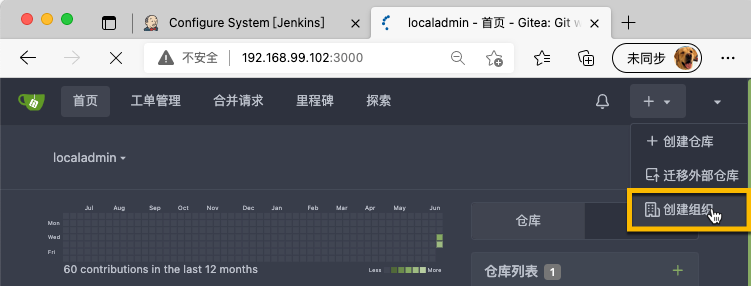
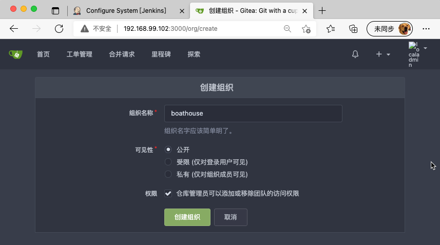
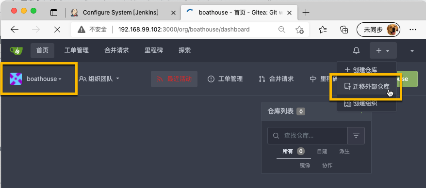
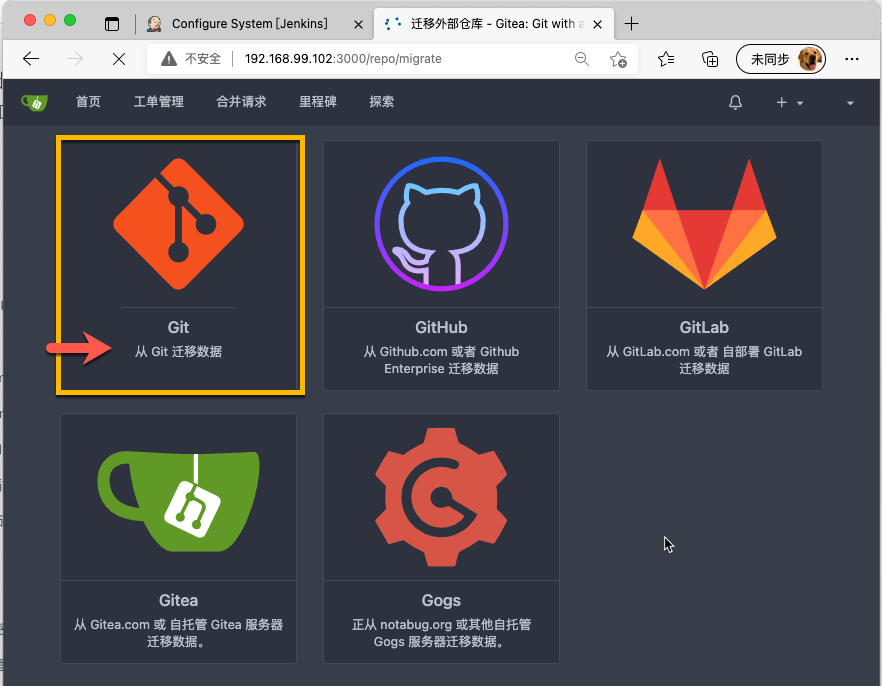
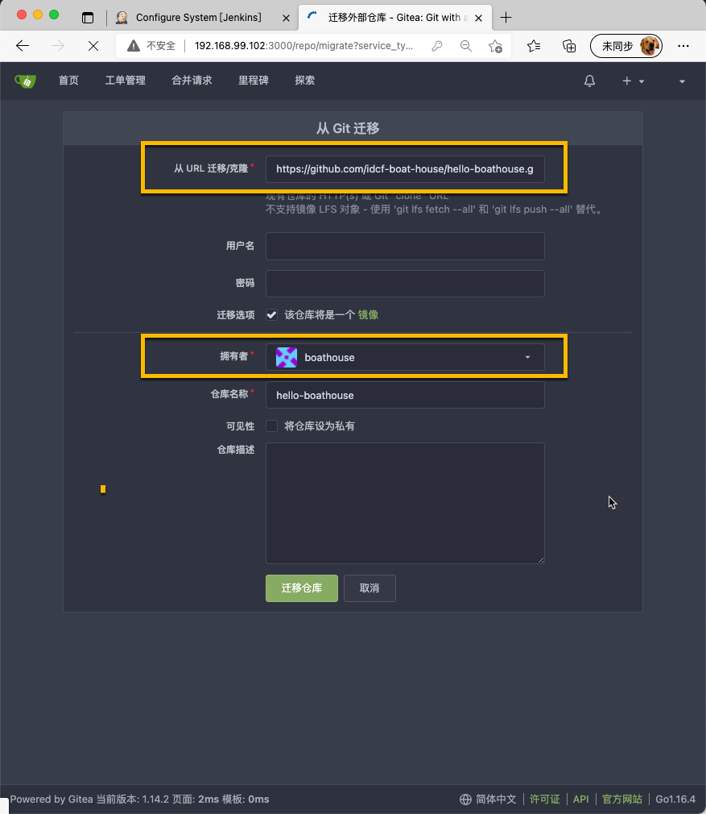
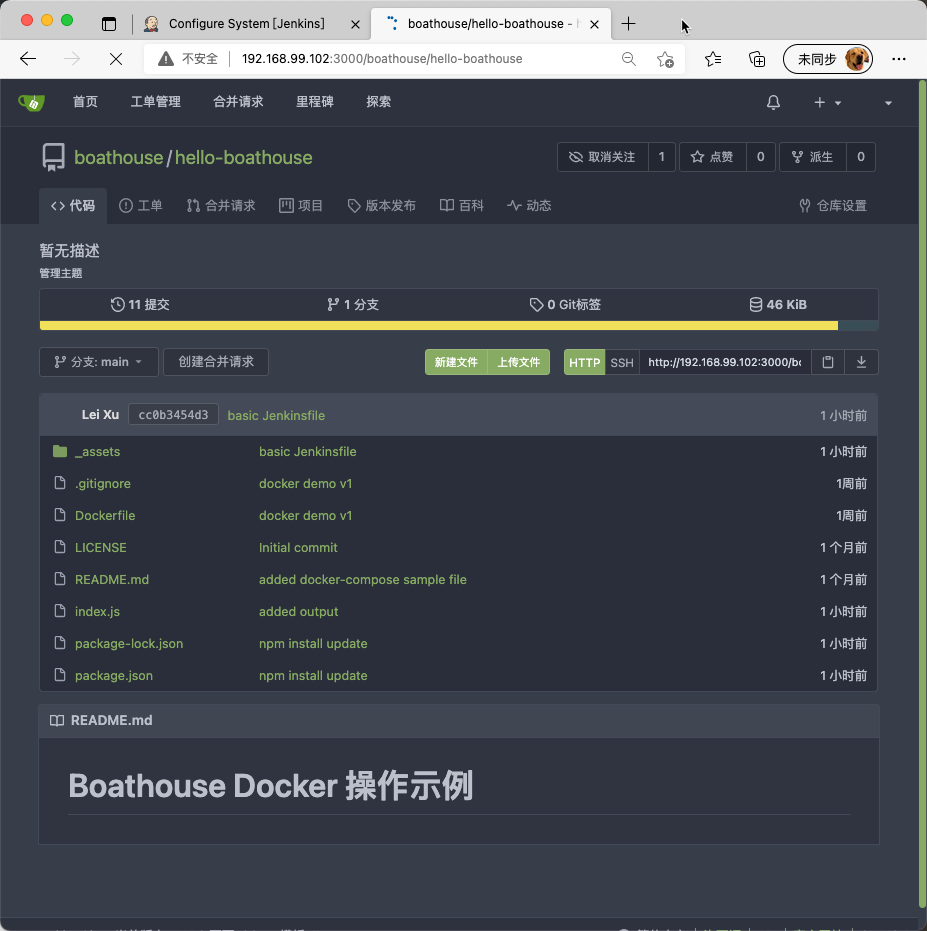
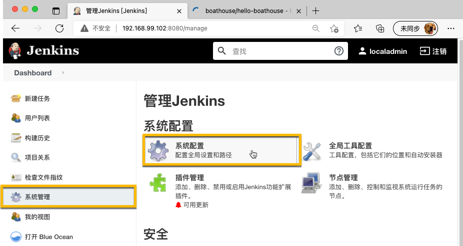
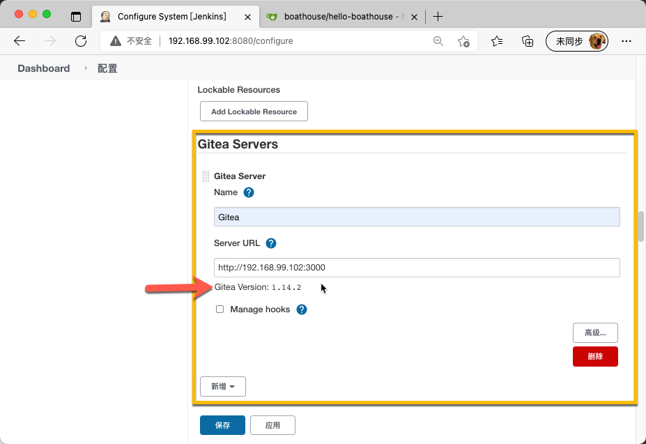
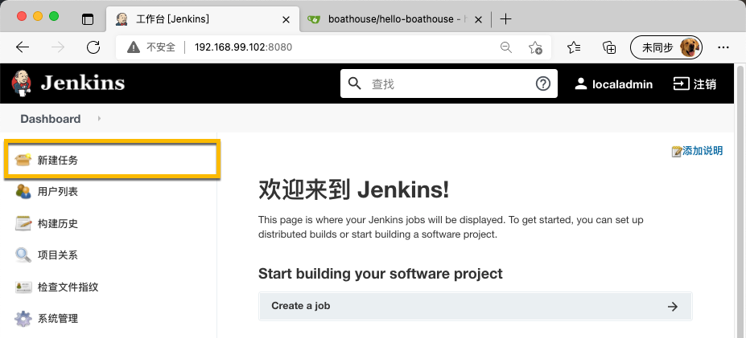
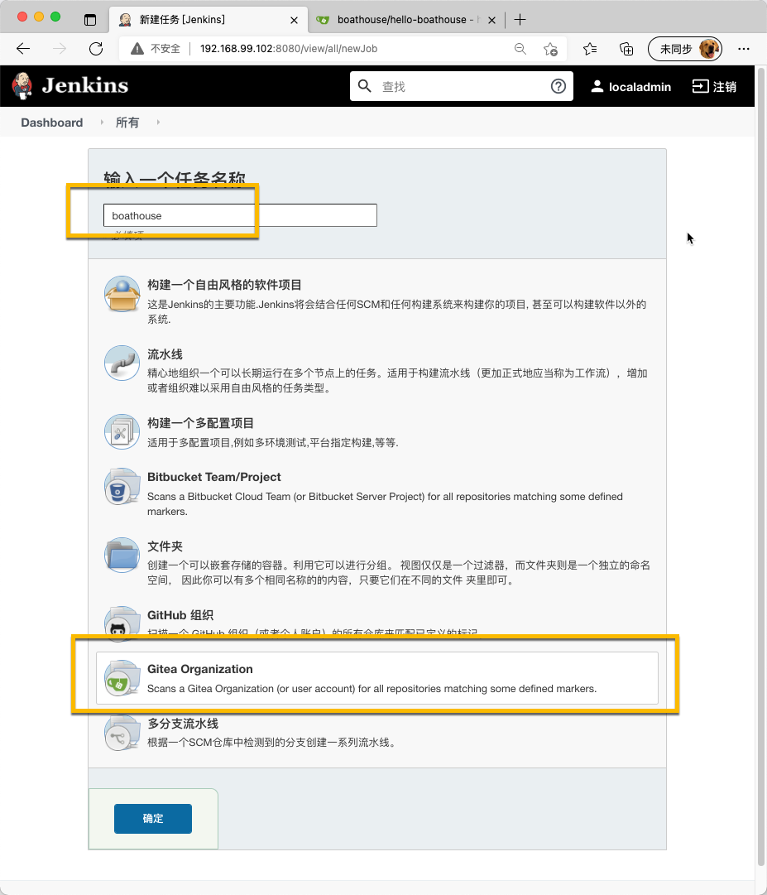

# BHOL602 - 创建Gitea组织配置

按章了Gitea插件以后，我们可以将Gitea的组织直接配置到Jenkins上，这样Jenkins会自动检测Gitea中这个组织中的所有代码库的变更，并按照其中的Jenkinsfile自动完成流水线的运行。

## 01 - 在Gitea中创建boathouse组织

在Gitea的右上角菜单中点击 创建组织

输入 boathouse 作为组织名称，点击 创建组织

## 02 - 在boathouse组织中导入 hello-boathouse代码库

确保你处于boathouse组织，并点击 迁移外部仓库

选择 Git 作为仓库类型

输入以下仓库地址，确保拥有者为 boathouse，保持所有默认参数并点击 迁移仓库

https://github.com/idcf-boat-house/hello-boathouse.git

导入完成 

## 03 - 在Jenkins中添加Gitea服务器配置

进入 系统管理 ｜ 系统配置

添加我们的Gitea服务器配置，完成后点击 保存

- Name: Gitea
- Server URL: http://192.168.99.102:3000

注意：如果输入正确，Jenkins会自动检测出Gitea服务器的版本。

## 04 - 创建Gitea组织配置

在Jenkins首页中点击 新建任务

在 新建任务 页面中，输入 boathouse 作为任务名称，并选择 Gitea Orangization 作为类型，点击 确定

在 配置页面 中，完成以下配置，并点击保存

- Project | Credentials: 为 boathouse 添加 localadmin 用户名和密码
- Owner: boathouse
- Behaviours | Discover pull requests from origin: 选择 The current pull request revision
- Gitea Organization 触发器: 设置为 1 分钟
- Child Scan Triggers: 设置为 1 分钟

完成后Jenkins会扫描 boathouse 组织，发现其中的代码仓库以及配置了Jenkinsfile的分支。因为我们还没有给我们的代码仓库添加任何Jenkinsfile，因此不会有任何流水线启动。

## 小结

至此，我们完成了Jenkins上的Gitea组织设置，后续只要在boathouse组织中添加了带有Jenkinsfile的代码库，Jenkins就会自动识别并启动流水线。

