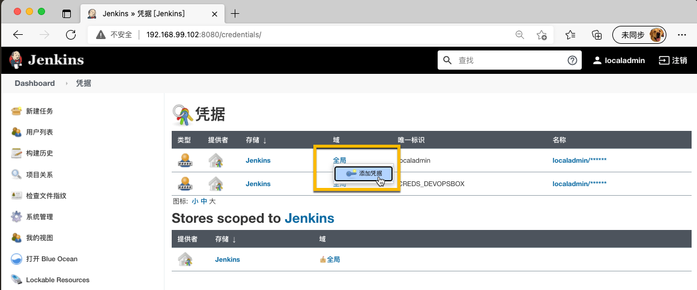
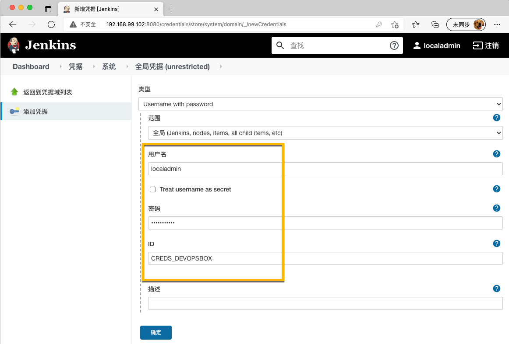
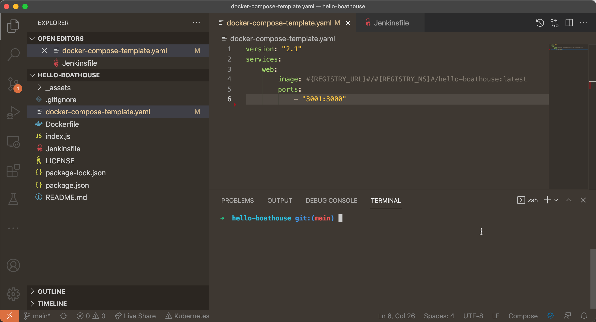
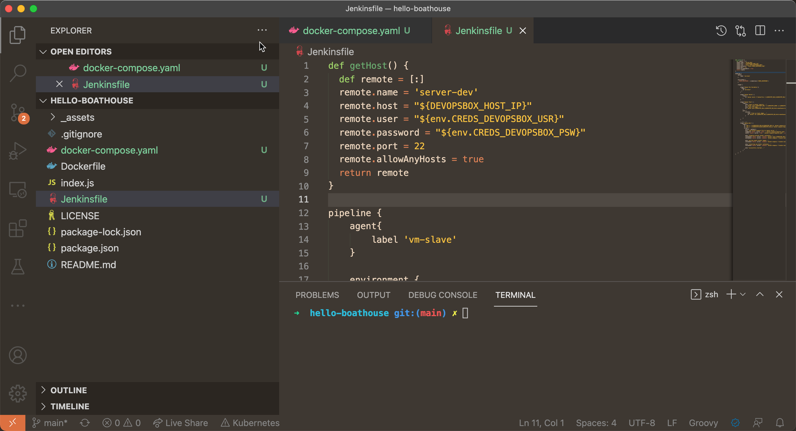
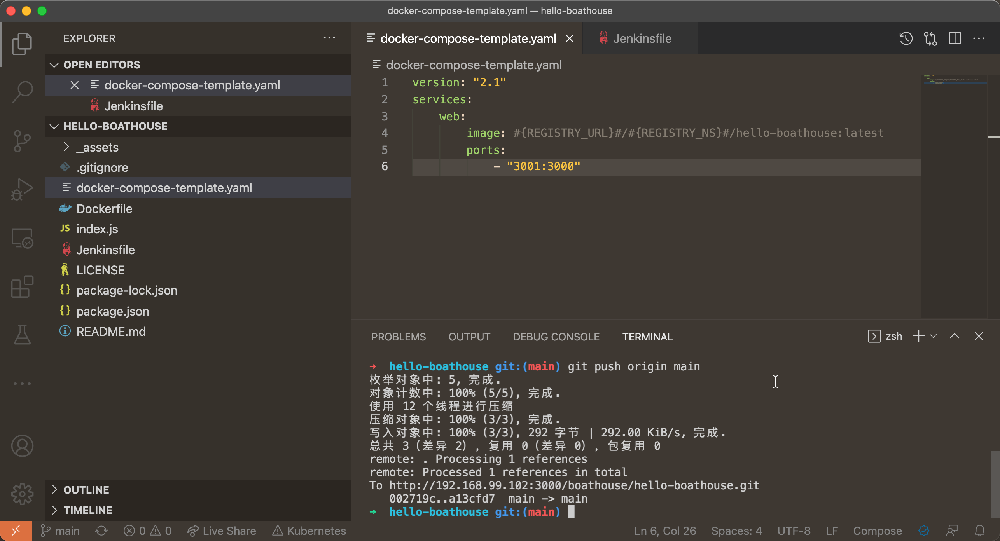
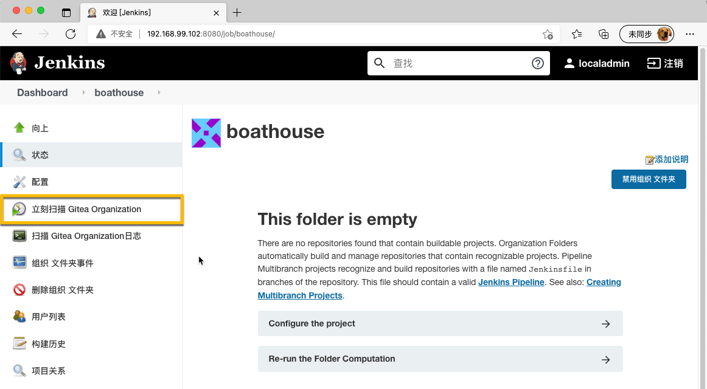
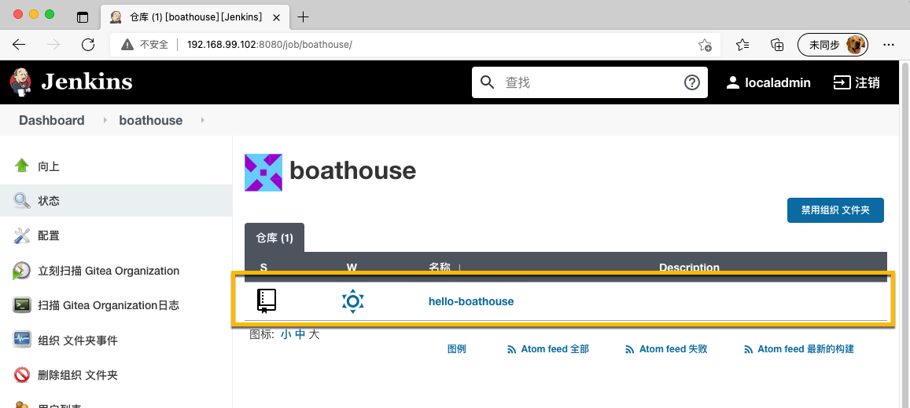
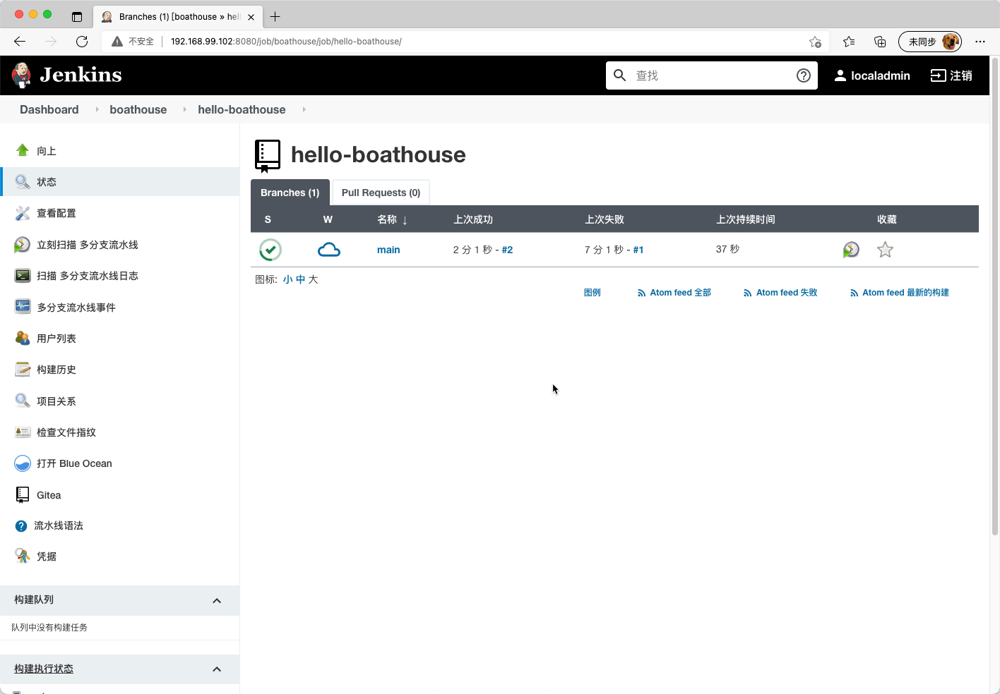
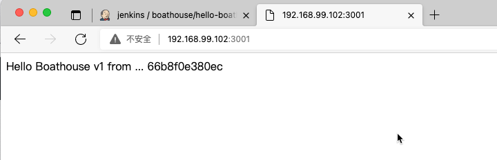

# BHOL603 - 为hello-boathouse添加Jenkinsfile并完成基础流水线配置

Jenkinsfile是Jenkins中对于Pipeline as code的实现，可以通过一个配置文件告诉Jenkins该如何运行流水线。同时允许我们将流水线配置和代码一起保存在代码库中，确保流水线的设置也可以被版本管理。

## 01 - 添加环境变量和密钥配置

进入 系统管理 ｜ 系统配置，在 全局属性 ｜ 环境变量 中添加如下变量和值，点击保存。

- REGISTRY_URL: 你的私有镜像仓库服务器地址，如果使用阿里云镜像服务则直接填写 registry.cn-hangzhou.aliyuncs.com
- REGISTRY_NS: 你所创建的镜像仓库命名空间名称
- REGISTRY_USER: 你用来登录镜像仓库的用户名
- REGISTRY_PWD: 你用例登录镜像仓库的密码
- DEVOPSBOX_HOST_IP: DevOpsBox的IP地址，应该为：192.168.99.102


进入 系统管理 ｜ Manage Credentials 中，添加密钥信息


在 凭据 | Jenkins | 全局 上点击 添加凭据



添加如下凭据，并点击 确定

- 用户名和密码：我们的标准用户名 localadmin 和密码
- ID: CREDS_DEVOPSBOX



## 02 - 添加用于环境部署的docker-compose-template文件

使用vscode在hello-boathouse中添加 docker-compose-template.yaml 文件

```yaml
version: "2.1"
services:
    web:
        image: #{REGISTRY_URL}#/#{REGISTRY_NS}#/hello-boathouse:latest
        ports:
            - "3001:3000"

```



## 03 - 添加Jenkinsfile文件

使用vscode在hello-boathouse中添加 Jenkinsfile 文件

```Jenkinsfile
def getHost() {
  def remote = [:]
  remote.name = 'server-dev'
  remote.host = "${DEVOPSBOX_HOST_IP}"
  remote.user = "${env.CREDS_DEVOPSBOX_USR}"
  remote.password = "${env.CREDS_DEVOPSBOX_PSW}"
  remote.port = 22
  remote.allowAnyHosts = true
  return remote
}

pipeline {
    agent{
        label 'vm-slave'
    }

    environment {
      CREDS_DEVOPSBOX = credentials('CREDS_DEVOPSBOX')
    }

    stages {

        stage('Output Env Variables'){
          steps {
            sh "printenv"
          }
        }

        stage('Docker Build') {
            steps {
                sh 'docker build -f Dockerfile -t ${REGISTRY_URL}/${REGISTRY_NS}/hello-boathouse:latest .'
            }
        }

        stage('Docker Push') {
            steps {
                echo "login to docker registry ..."
                sh 'docker login ${REGISTRY_URL} -u ${REGISTRY_USER} -p ${REGISTRY_PWD}'
                echo "push the image ..."
                sh 'docker push ${REGISTRY_URL}/${REGISTRY_NS}/hello-boathouse:latest'
            }
            post {
                success{
                    echo "clean up local image ..."
                    sh "docker rmi ${REGISTRY_URL}/${REGISTRY_NS}/hello-boathouse:latest"
                }
                
            }
        }

        // dev 环境
        stage('deploy-dev') { 
            steps {
              sh "sed -i 's/#{REGISTRY_URL}#/${REGISTRY_URL}/g' docker-compose-template.yaml"
              sh "sed -i 's/#{REGISTRY_NS}#/${REGISTRY_NS}/g' docker-compose-template.yaml"
              script {
                server = getHost()
                echo "copy docker-compose file to remote server..."       
                sshRemove remote: server, path: "./docker-compose-template.yaml"   // 先删除远程服务器上的文件，已确保是最新的文件
                sshPut remote: server, from: './docker-compose-template.yaml', into: '.'
                
                echo "stopping previous docker containers..."       
                sshCommand remote: server, command: "docker login ${REGISTRY_URL} -u ${REGISTRY_USER} -p ${REGISTRY_PWD}"
                sshCommand remote: server, command: "docker-compose -f docker-compose-template.yaml -p hello-boathouse down"
                
                echo "pulling newest docker images..."
                sshCommand remote: server, command: "docker-compose -f docker-compose-template.yaml -p hello-boathouse pull"
                
                echo "restarting new docker containers..."
                sshCommand remote: server, command: "docker-compose -f docker-compose-template.yaml -p hello-boathouse up -d"
                
                echo "successfully started!..."
              }
            }
        }
    }
}
```



## 04 - 提交配置文件并触发流水线

运行以下命令提交文件到Gitea

```shell
git add .
git commit -m "adde pipeline configurations"
git push origin main
```



在 Jenkins 上进入我们创建的 boathouse 任务页面，并点击 立即扫描 Gitea Oraganziation



刷新页面，Jenkins已经将hello-boathouse添加到流水线列表中



进入 hello-boathouse 任务界面，查看任务进展



如果任务已经成功完成，打开 http://192.168.99.102:3001 即可访问 hello-boathouse 应用




