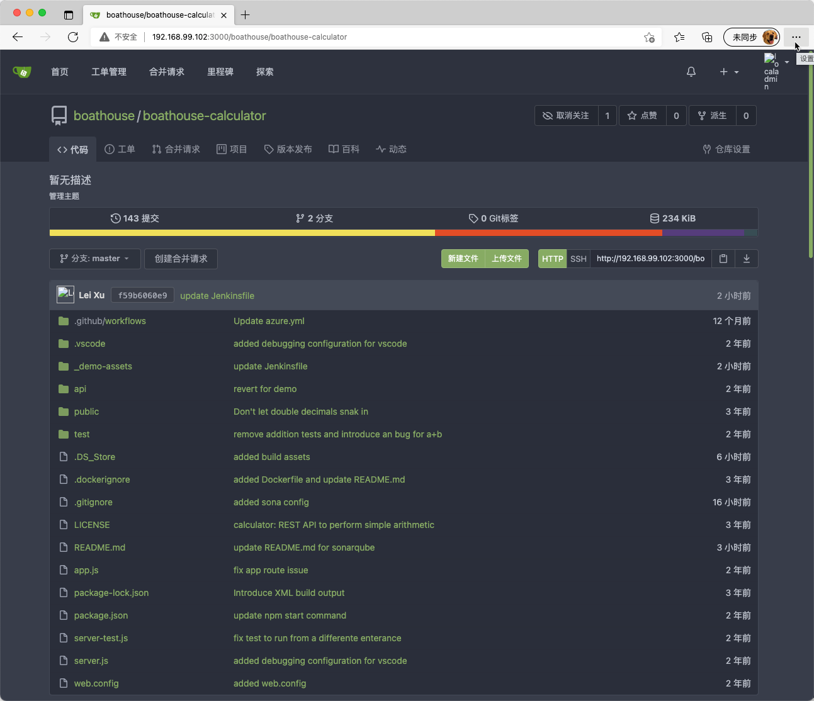
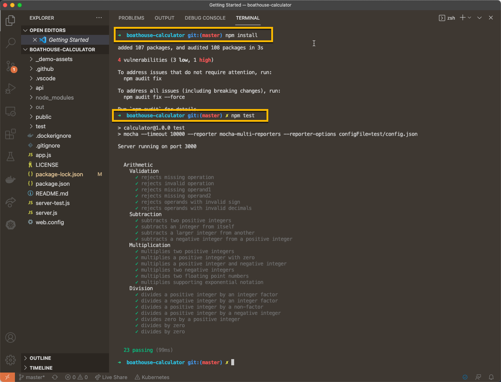
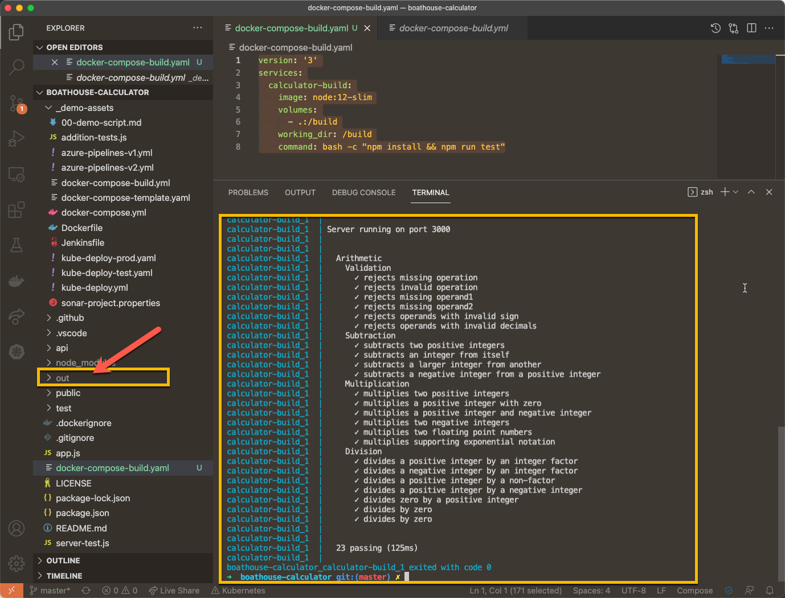
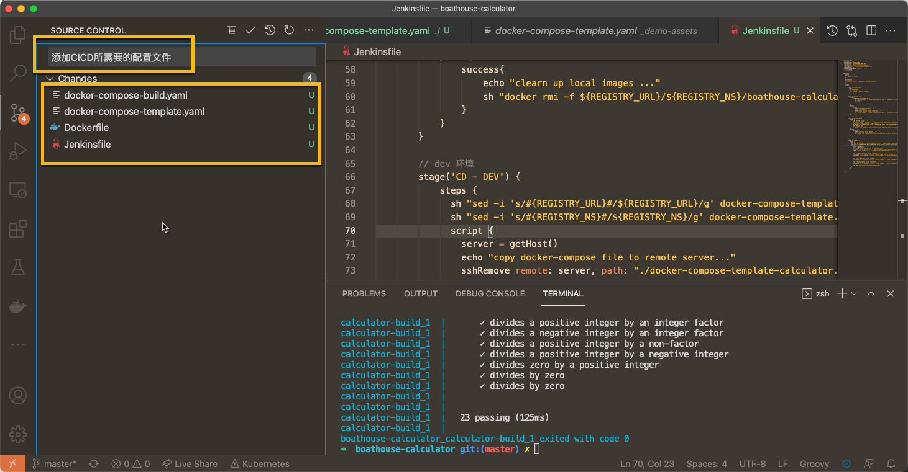
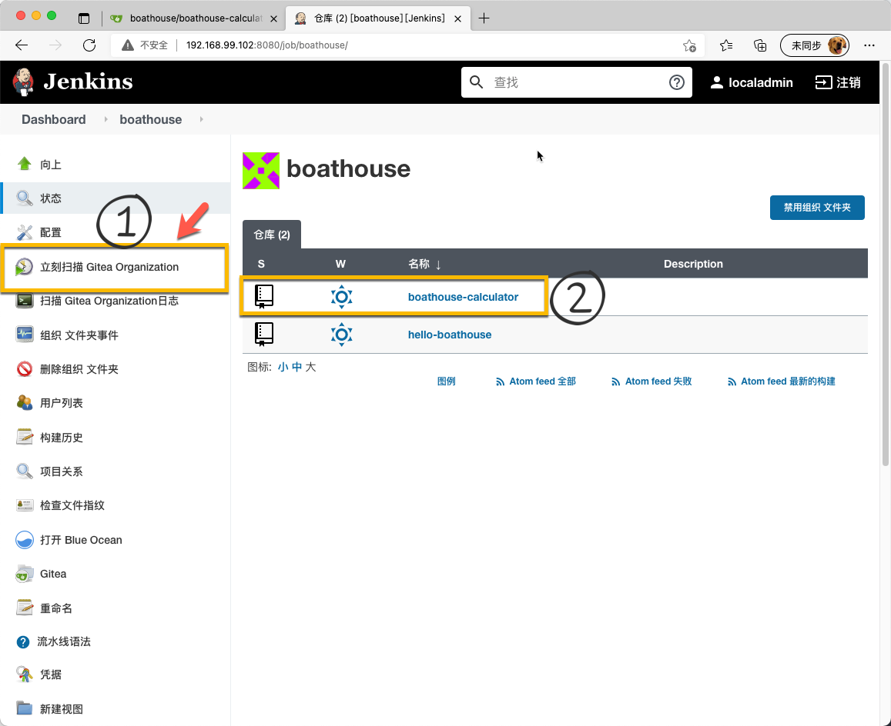
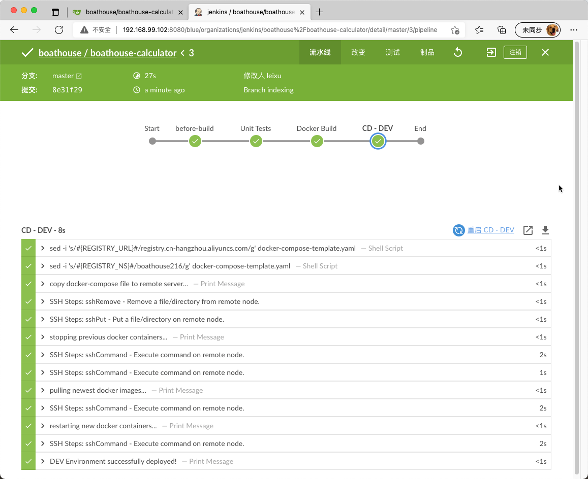
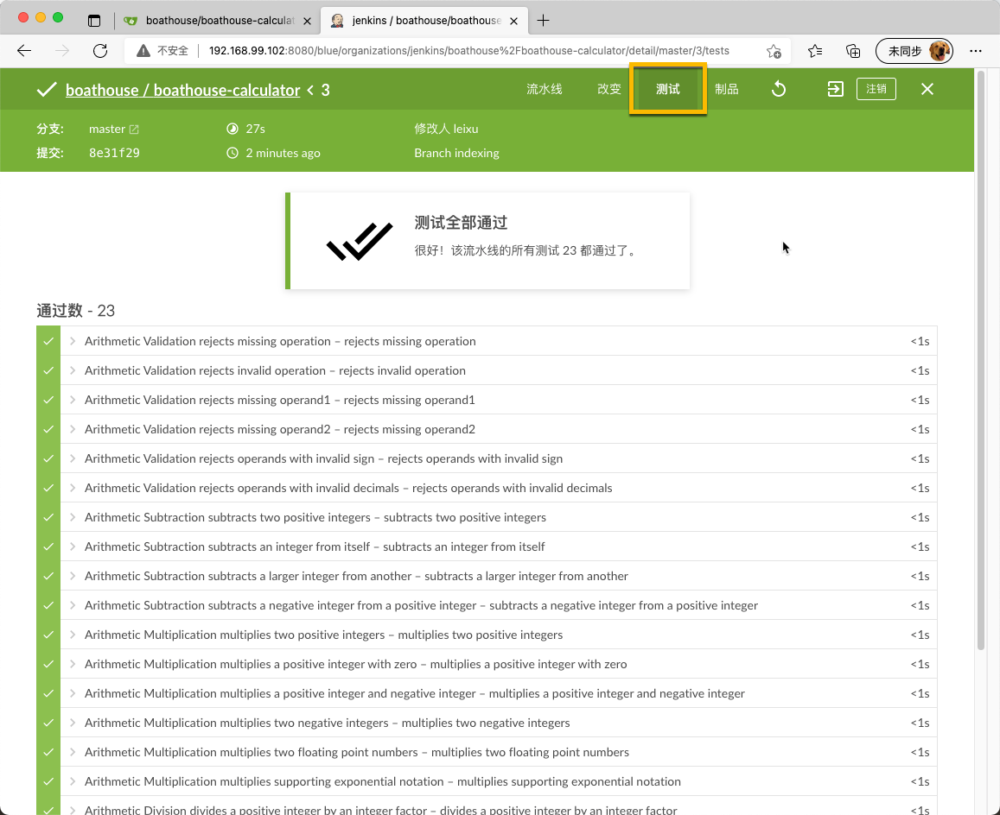
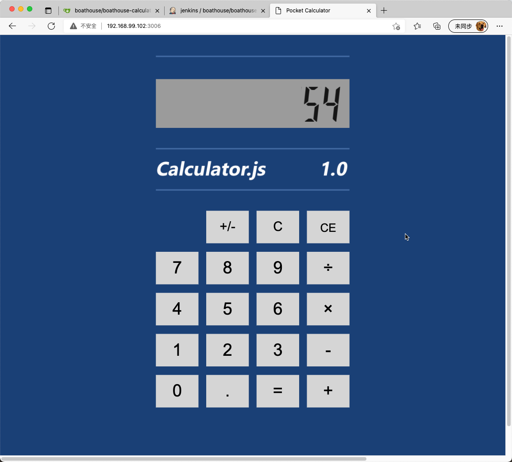

# BHOL701 - 在流水线中增加单元测试环节

在本节实验中，我们将增加单元测试执行能力并将单元测试结果发布到流水线中，以便团队可以对代码质量有更加细致的控制能力。

## 01 - 导入 boathouse-calculator 代码库

请参考 [BHOL602 | 02 节](bhol602?id=_02-在boathouse组织中导入-hello-boathouse代码库) 中所描述的方法，将以下代码库导入 Gitea 服务器的 boathouse 组织中。

boathouse-calculator 代码库地址：https://github.com/idcf-boat-house/boathouse-calculator

导入之后效果如下，注意核对你的组织信息



## 02 - 本地单元测试

boathouse-calculator 是一个简化版的计算器程序，已经内置了一些单元测试，你可以通过以下命令运行这些测试

```shell
## 使用npm完成 node.js 应用依赖包回复
npm install
## 运行内置的单元测试
npm test
```



注意：你在自己的环境中很可能无法正确执行以上命令，因为这2个命名需要你本地正确安装了node.js的SDK环境，如果你不做node.js应用的开发，你就无法运行这些测试。同样的问题对我们的CICD环境也是一样，CICD环境中无可能为所有技术栈安装所有的环境，因此我们需要将单元测试的运行容器化，利用容器来解决这个环境问题。

在你的代码中创建 docker-compose-build.yaml 文件，并添加如下代码：

```yaml
version: '3'
services:
  calculator-build:
    image: node:12-slim
    volumes:
      - .:/build
    working_dir: /build
    command: bash -c "npm install && npm run test"
```

然后运行以下命令：

```shell
docker-compose -f docker-compose-build.yaml up
```

注意：这一次，无论是本地是否安装了node.js的环境，你都可以正确的运行单元测试了。这是因为我们将运行环境放入了一个node:12-slim的容器中执行。同时注意左侧的文件树中出现了 out 这个文件夹，虽然我们的测试是在容器中运行，但是利用 volume 机制我们仍然可以将测试结果输出到本地文件系统中。



## 03 - 增加CICD所需要的配置文件

为了能够在Jenkins上进行流水线运行，我们需要再添加3个文件到 boathouse-calculator 中

- Dockerfile
- docker-compose-template.yaml
- Jenkinsfile

Dockerfile

```shell
FROM node:12-slim

# Create app directory
WORKDIR /usr/src/app

# Install app dependencies
# A wildcard is used to ensure both package.json and package-lock.json are copied
# where available (npm@5+)

COPY package*.json ./

RUN npm install
# if youa re building your code for production
# RUN npm install --only=production

# Bundle app source
COPY . .

# Expose 3000 port on container
EXPOSE 3000

# Start up your application
CMD ["npm", "start"]
```

docker-compose-template.yaml

```yaml
version: "2.1"
services:
    web:
        image: #{REGISTRY_URL}#/#{REGISTRY_NS}#/boathouse-calculator:latest
        ports:
            - "3006:3000"
```

Jenkinsfile

注意：本节实验中的Jenkinsfile中使用了与 [BHOL603](bhol603.md) 实验中一致的环境变量和密钥，请确保你的 BHOL603 已经运行成功，否则这个Jenkinsfile无法运行。

```shell
def getHost() {
  def remote = [:]
  remote.name = 'server-dev'
  remote.host = "${DEVOPSBOX_HOST_IP}"
  remote.user = "${env.CREDS_DEVOPSBOX_USR}"
  remote.password = "${env.CREDS_DEVOPSBOX_PSW}"
  remote.port = 22
  remote.allowAnyHosts = true
  return remote
}

pipeline {
    agent{
        label 'vm-slave'
    }

    environment {
      CREDS_DEVOPSBOX = credentials('CREDS_DEVOPSBOX')
    }

    stages {

        stage('before-build'){
          steps {
            sh "printenv"
            sh "git log --oneline --graph"
          }
        }

        stage('Unit Tests') {
            steps {
                warnError('Testing Failed'){
                    sh "docker-compose -f docker-compose-build.yaml -p boathouse-calculator-testrun up"
                }
                
            }
            post {
                always{
                    echo "upload test results ..."
                    junit 'out/*.xml'
                    echo "clean up test runner container ..."
                    sh "docker-compose -f docker-compose-build.yaml -p boathouse-calculator-testrun down -v --rmi all --remove-orphans"
                }                
            }
        }

        stage('Docker Build') {
            steps {
                echo "Docker Build ... "
                sh "docker build -f Dockerfile -t ${REGISTRY_URL}/${REGISTRY_NS}/boathouse-calculator:latest ."
                echo "Docker Login to docker registry ..."
                sh 'docker login ${REGISTRY_URL} -u ${REGISTRY_USER} -p ${REGISTRY_PWD}'
                echo "Docker Push ..."
                sh "docker push ${REGISTRY_URL}/${REGISTRY_NS}/boathouse-calculator:latest"
            }
            post {
                success{
                    echo "clearn up local images ..."
                    sh "docker rmi -f ${REGISTRY_URL}/${REGISTRY_NS}/boathouse-calculator:latest"
                }
            }
        }        

        // dev 环境
        stage('CD - DEV') { 
            steps {
              sh "sed -i 's/#{REGISTRY_URL}#/${REGISTRY_URL}/g' docker-compose-template.yaml"
              sh "sed -i 's/#{REGISTRY_NS}#/${REGISTRY_NS}/g' docker-compose-template.yaml"
              script {
                server = getHost()
                echo "copy docker-compose file to remote server..."       
                sshRemove remote: server, path: "./docker-compose-template-calculator.yaml"   // 先删除远程服务器上的文件，已确保是最新的文件
                sshPut remote: server, from: './docker-compose-template.yaml', into: './docker-compose-calculator.yaml'
                
                echo "stopping previous docker containers..."       
                sshCommand remote: server, command: "docker login ${REGISTRY_URL} -u ${REGISTRY_USER} -p ${REGISTRY_PWD}"
                sshCommand remote: server, command: "docker-compose -f docker-compose-calculator.yaml -p boathouse-calculator down"
                
                echo "pulling newest docker images..."
                sshCommand remote: server, command: "docker-compose -f docker-compose-calculator.yaml -p boathouse-calculator pull"
                
                echo "restarting new docker containers..."
                sshCommand remote: server, command: "docker-compose -f docker-compose-calculator.yaml -p boathouse-calculator up -d"
                
                echo "DEV Environment successfully deployed!"
              }
            }
        }
        
    }
}
```

将以上文件全部提交到Gitea服务器



## 04 - 在Jenkins上运行boathouse-calculator流水线

在Jenkins的boathouse组织中，点击 立即扫描 Gitea Organization 这样Jenkins会立即发现我们新添加的代码库，并将其加入到流水线任务列表中



打开 Blue Ocean 视图，并检查流水线运行状态



点击右上角的 测试 菜单，查看测试运行结果

注意：我们已经将本地的单元测试在流水线中自动执行，并将结果发布到流水线中，方便开发人员查看。



我们的应用也已经部署到了 DevOpsBox 虚拟机上，打开 http://192.168.99.102:3006 即可访问如下页面



## 小结

本节实现我们完成了单元测试在流水线中的自动化执行以及发布测试结果到Jenkins中，单元测试可以为开发人员提供非常直接的功能正确性验证，并且执行速度快，对环境依赖性低。在流水线中自动执行这些测试可以确保开发人员的逻辑问题在第一时间得到发现。

本节实验是增强型流水线的第一节，我们已经在原来的基础流水线上添加了单元测试作为质量控制手段。


