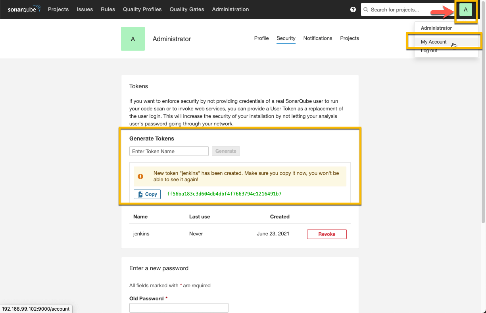
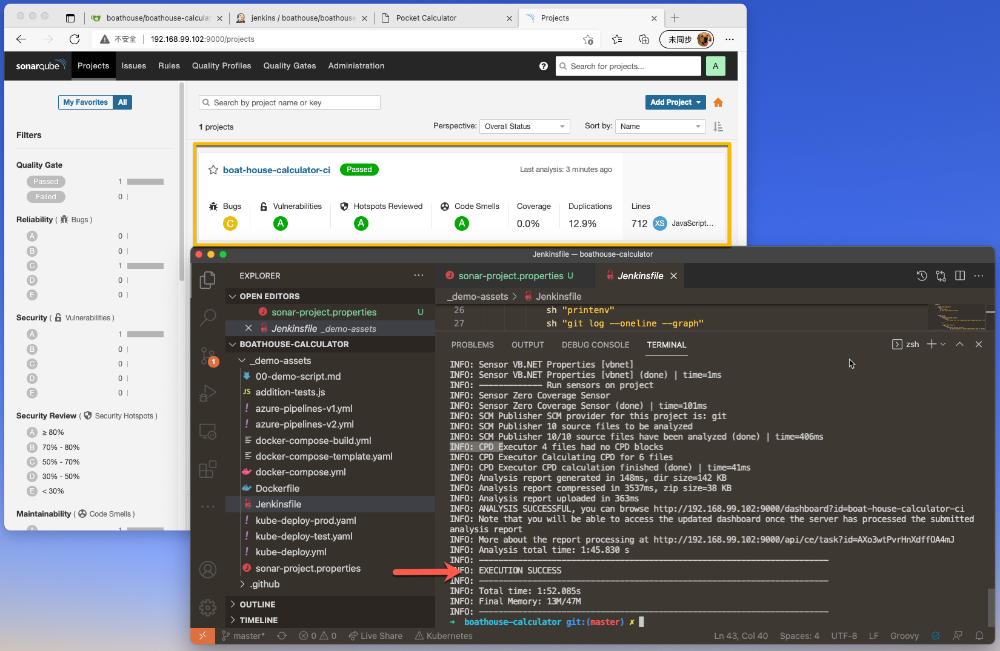
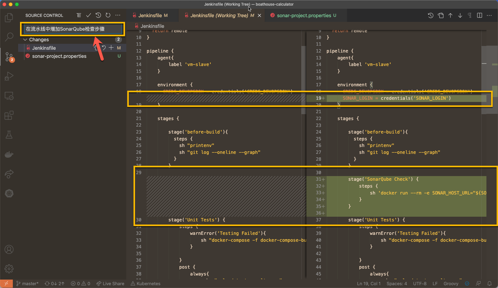
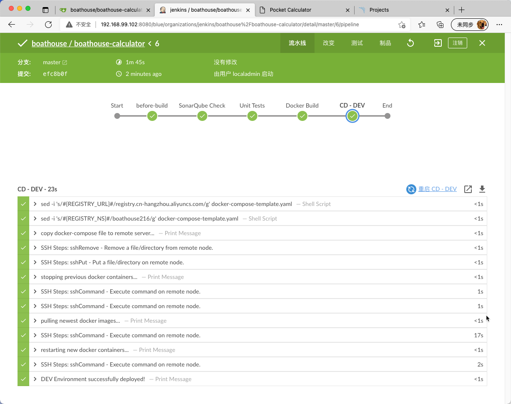

# BHOL702 - 在流水线中增加SonarQube代码扫描环节

本节实验中，我们将在流水线中增加 SonarQube 的代码检查环节。

提示，如果还没有在 DevOpsBox 中启用 SonarQube 服务器，请参考 [DevOpsBox 安装指南](../devopsbox/README?id=_05-在-devopsbox-上启动-boathouse-devopsbox-工具链环境)。

## 01 - 配置SonarQube，获取认证Token

进入SonarQube | 当前账号的MyAccount菜单 ｜ Security 页面 中

在 Enter Token Name 中输入 Jenkins ，然后点击 Generate



记录这个 token 字符串，后续需要用到。

## 02 - 添加 sonarqube 项目配置文件并在本地运行检查

在boathouse-calculator中增加 sonar-project.properties 文件，内容如下

```properties
# must be unique in a given SonarQube instance
sonar.projectKey=boat-house-calculator-ci

# --- optional properties ---

# defaults to project key
#sonar.projectName=My project
# defaults to 'not provided'
#sonar.projectVersion=1.0
 
# Path is relative to the sonar-project.properties file. Defaults to .
#sonar.sources=.
 
# Encoding of the source code. Default is default system encoding
#sonar.sourceEncoding=UTF-8
```

然后运行如下命令

注意：我们这里同样使用了容器的方式来运行sonar-scanner工具，这样可以避免安装对应的工具。请替换以下脚本中的

- ${SONAR_HOST_URL} 为你的sonar服务器地址，应该是 http://192.168.99.102:9000
- ${SONAR_LOGIN} 为你在上面步骤获取的sonar token值

```shell
docker run --rm -e SONAR_HOST_URL="${SONAR_HOST_URL}" -e SONAR_LOGIN="${SONAR_LOGIN}" -v "${PWD}:/usr/src" sonarsource/sonar-scanner-cli
```

执行成功后即可在服务器上看到检查结果



## 03 - 添加SonarQube检查到流水线中

在 Jenkinsfile 中的 environment 配置节中增加以下参数

```shell
    SONAR_LOGIN = credentials('SONAR_LOGIN')
```

在 Jenkinsfile 中的 before-build 步骤后增加一个 SonarQube Check 的 stage

```shell
        stage('SonarQube Check') {
            steps {
                sh 'docker run --rm -e SONAR_HOST_URL="${SONAR_HOST_URL}" -e SONAR_LOGIN="${SONAR_LOGIN}" -v "${PWD}:/usr/src" sonarsource/sonar-scanner-cli'
            }
        }
```



提交以上代码到Gitea服务器

## 04 - 在Jenkins中配置参数

我们在以上脚本中增加了2个参数，需要按照 [BHOL06 | 01 节](bhol603.md?id=_01-添加环境变量和密钥配置) 中的方法分别创建为环境变量和Credential

- SONAR_HOST_URL: 环境变量
- SONAR_LOGIN: 密钥，请使用 Secret text 密钥类型

完成上述配置后，再次触发流水线，即可看到如下效果



同时查看 SonarQube 中的记录，会发现记录会被更新。

## 小结

本节实验中，我们在基础流水线上引入了SonarQube的质量检查步骤。


