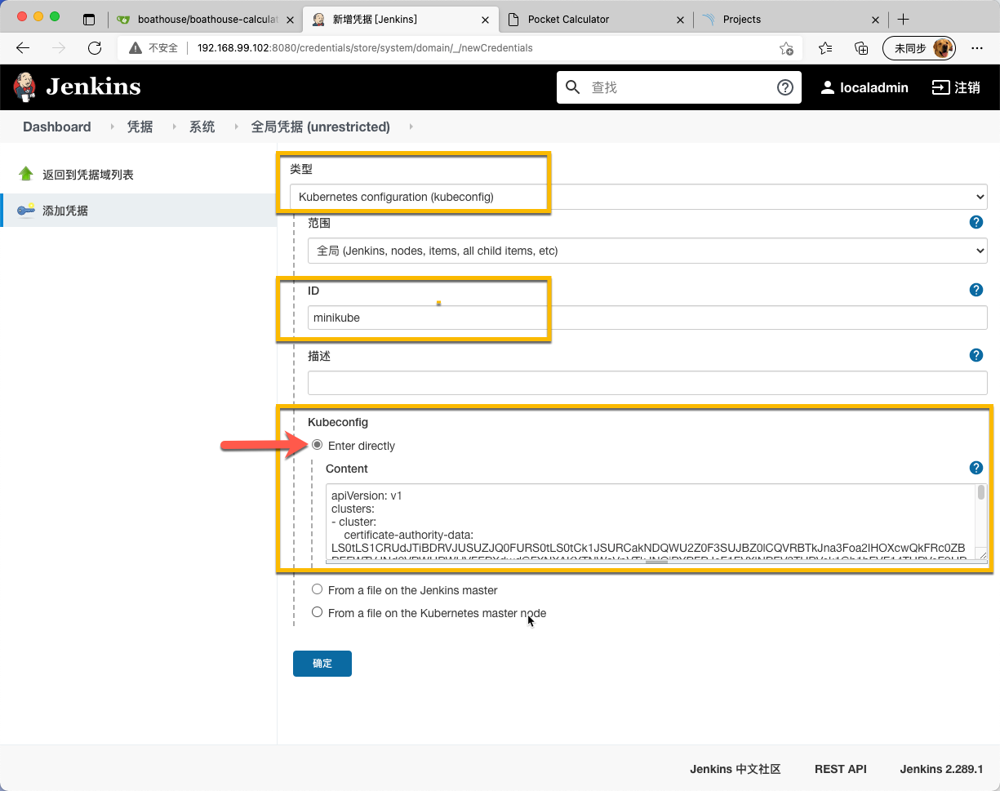
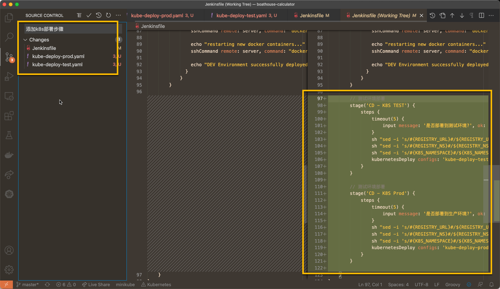
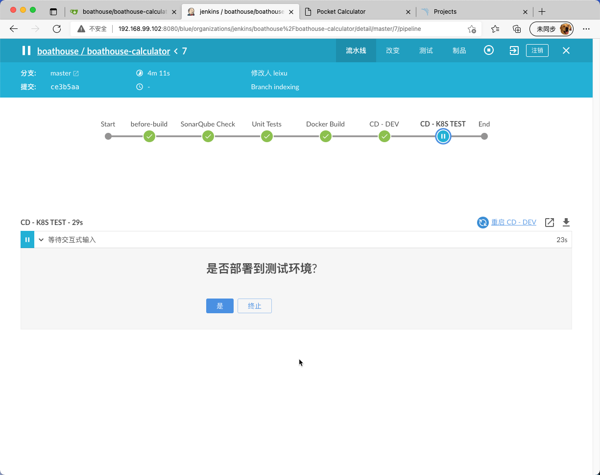
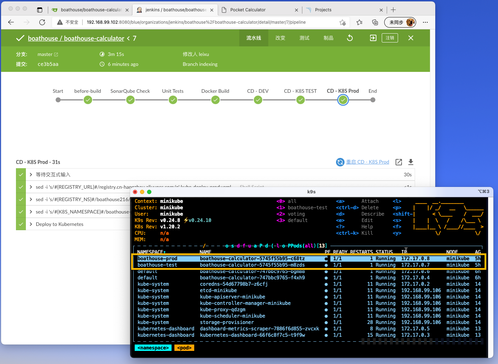

# BHOL703 - 在流水线中增加Kubernetes环境部署并进行人工审批

本节实验中，我们将延续之前的流水线配置，将 boathouse-calculator 部署到 minikube 的 k8s 环境中，并在部署之前添加人工审核步骤。

## 01 - 获取 minikube 的 kubeconfig 文件

执行以下命令获取完整的minikube kubeconfig文件

```shell
# 启动 minikube 并确保当前的 kubectl context 被指向 minikube
minikube start
# 获取 kubeconfig 内容并采用单一文件（--flatten=true）方式输出
kubectl config view --flatten=true > minikube.kubeconfig
# 使用vscode打开生成的文件
code minikube.kubeconfig
```

文件内容如下，注意：此文件中的 certificate-authority， client-certificate 和 client-key 都采用了 -data 的方式输出，方便我们添加到Jenkins的密钥管理中。


## 02 - 在 Jenkins 中添加 Kubernetes 密钥配置

在 Jenkins 中导航到 凭据 ｜ 系统 ｜ 全局凭据 中添加一个 Kubernetes configuration (kubeconfig), 并采用 Enter directly 的方式，将以上的kubeconfig内容粘贴进去，将此密钥命名为 minikube 



## 03 - 准备k8s集群

运行以下命令创建 命名空间

```shell
kubectl create namespace boathouse-test
kubectl create namespace boathouse-prod
```

运行以下命令，分别在 boathouse-test 和 boathouse-prod 命名空间中创建名为regcred的密钥，用于保存容器镜像仓库的账号。

```shell
kubectl create secret docker-registry regcred --docker-server=[docker registry url] --docker-username=[username] --docker-password=[password] --docker-email=info@idcf.io -n boathouse-test
kubectl create secret docker-registry regcred --docker-server=[docker registry url] --docker-username=[username] --docker-password=[password] --docker-email=info@idcf.io -n boathouse-prod
```

## 04 - 添加k8s部署步骤

在 boathouse-calculator 项目中添加两个文件

- kube-deploy-test.yaml
- kube-deploy-prod.yaml

两个文件使用同样的内容

```yaml
apiVersion: apps/v1
kind: Deployment
metadata:
  name: boathouse-calculator
  namespace: #{K8S_NAMESPACE}#
spec:
  replicas: 1
  selector:
    matchLabels:
      app: boathouse-calculator
  strategy:
    rollingUpdate:
      maxSurge: 1
      maxUnavailable: 1
  minReadySeconds: 5 
  template:
    metadata:
      labels:
        app: boathouse-calculator
    spec:
      nodeSelector:
        "beta.kubernetes.io/os": linux
      containers:
      - name: boathouse-calculator
        image: #{REGISTRY_URL}#/#{REGISTRY_NS}#/boathouse-calculator:latest
        ports:
        - containerPort: 3000
        resources:
          requests:
            cpu: 250m
          limits:
            cpu: 500m
      imagePullSecrets:
      - name: regcred
      restartPolicy: Always
---
apiVersion: v1
kind: Service
metadata:
  name: boathouse-calculator
  namespace: #{K8S_NAMESPACE}#
spec:
  type: LoadBalancer
  ports:
  - port: 80
    targetPort: 3000
  selector:
    app: boathouse-calculator

```

修改 Jenkinsfile，在底部添加以下步骤

注意：以下文件中增加了2个环境变量需要添加到Jenkins中

- K8S_NAMESPACE_TEST: 设置为 boathouse-test
- K8S_NAMESPACE_PROD: 设置为 boathouse-prod

```shell
        // 测试环境部署
        stage('CD - K8S TEST') {
            steps {
                timeout(5) {
                    input message: '是否部署到测试环境?', ok: '是', submitter: 'admin'
                }
                sh "sed -i 's/#{REGISTRY_URL}#/${REGISTRY_URL}/g' kube-deploy-test.yaml"
                sh "sed -i 's/#{REGISTRY_NS}#/${REGISTRY_NS}/g' kube-deploy-test.yaml"
                sh "sed -i 's/#{K8S_NAMESPACE}#/${K8S_NAMESPACE_TEST}/g' kube-deploy-test.yaml"
                kubernetesDeploy configs: 'kube-deploy-test.yaml', deleteResource: false, kubeconfigId: 'minikube', secretName: 'regcred', secretNamespace: 'boathouse-test'
            }
        }

        // 测试环境部署
        stage('CD - K8S Prod') {
            steps {
                timeout(5) {
                    input message: '是否部署到生产环境?', ok: '是', submitter: 'admin'
                }
                sh "sed -i 's/#{REGISTRY_URL}#/${REGISTRY_URL}/g' kube-deploy-prod.yaml"
                sh "sed -i 's/#{REGISTRY_NS}#/${REGISTRY_NS}/g' kube-deploy-prod.yaml"
                sh "sed -i 's/#{K8S_NAMESPACE}#/${K8S_NAMESPACE_PROD}/g' kube-deploy-prod.yaml"
                kubernetesDeploy configs: 'kube-deploy-prod.yaml', deleteResource: false, kubeconfigId: 'minikube', secretName: 'regcred', secretNamespace: 'boathouse-prod'
            }
        }
```

提交以上文件到Gitea服务器



## 05 - 查看流水线运行状态并进行人工审批

我们在以上的Jenkinsfile中增加了人工介入的步骤，流水线在进行k8s部署动作之前会停下来询问是否继续，见下图：



点击 是 以后，流水线会继续运行完成对应的部署动作，全部完成后可以通过k8s查看对应的 命名空间 中已经运行中的 calculator pod。



## 小结

本节实验中我们对基础流水线进行扩展，完成了k8s环境的自动化部署并且加入了人工审批动作。人工审批动作对于流水线非常重要，当我们需要根据应用的运行情况决定是否继续运行流水线时就需要让流水线暂停等待人工输入。

