# IDCF Boat House 快速开发指南（SmartIDE）
## IDCF Boat House 项目架构：

## 指南概要
如上方Boat House项目架构图所示:
* 基于 Spring Boot 框架开发的 **Product Service** 将为Boat House提供 REST API 数据支持；
* 基于Node Js + Vue 框架开发的后端管理平台 **Management Web** 将为Boat House提供后台数据管理功能。

本指南以 Product Service 和 Boat House 后端管理平台 Management Web 为例，在接下来的内容中介绍如何快速上手进行 管理网站 和 后台服务 的开发，以及跨技术栈的前后端的调试。

## 使用说明

本实验中，将使用[SmartIDE](https://smartide.cn)来完成实验过程。通过使用SmartIDE，无须在本地安装任何开发工具，仅使用浏览器即可打开一个完整的前后端开发环境。

在启动的环境中，已为开发者完成了依赖环境（对应的SDK以及docker）、插件等的初始化和预配置，打开浏览器即可快速开始动手开发！

那么下面，我们先在SmartIDE中进行一些基本设置，用以完成实现中git代码的拉取、提交的基础设置，并创建开发工作区。

## 通过SmartIDE创建开发工作区

1. 访问SmartIDE网站，完成登录（支持团队会为每组分配登录账号）
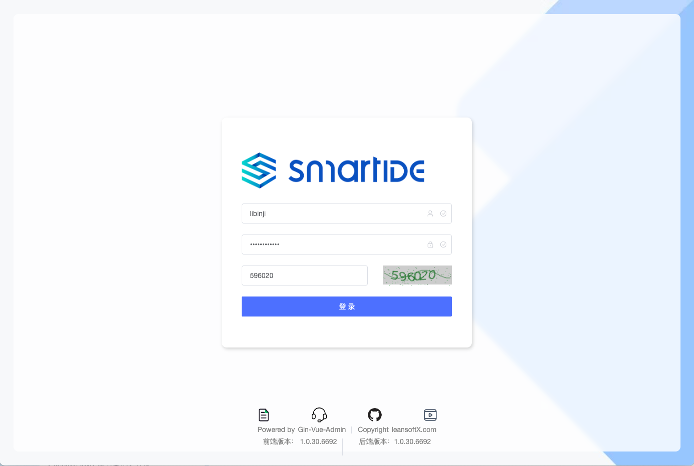

2. 配置工作区策略

    通过配置工作区策略，设置工作区的git config、ssh key、工作区密码、工作区用户密码。

    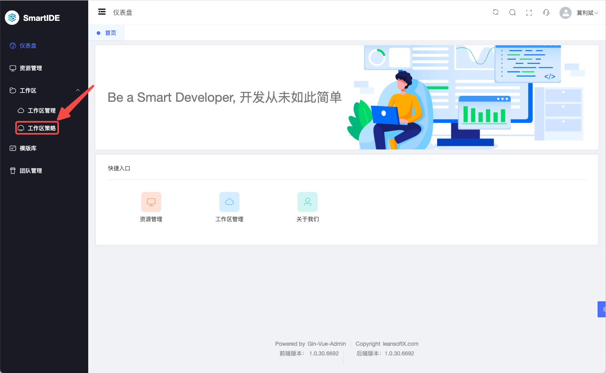

    点击[新增]创建工作区策略：

    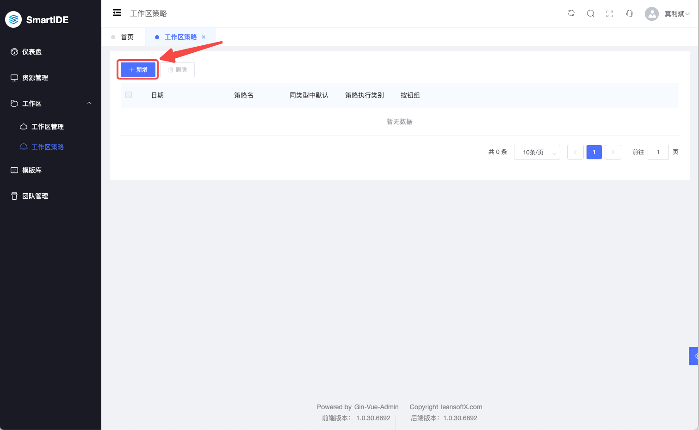

    - git-config：该配置为工作区git提交时的用户信息设置，系统会根据登录用户信息自动设置

    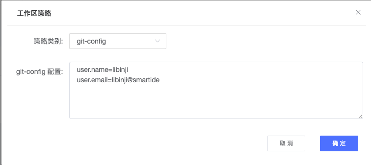

    - ssh-key：该配置为工作区中生成的ssh秘钥信息，其中的公钥信息可配置到任意仓库ssh公钥中，从而实现通过ssh方式拉取代码创建工作区.系统会自动生成秘钥对，用户也可以将本地秘钥进行粘贴修改。

    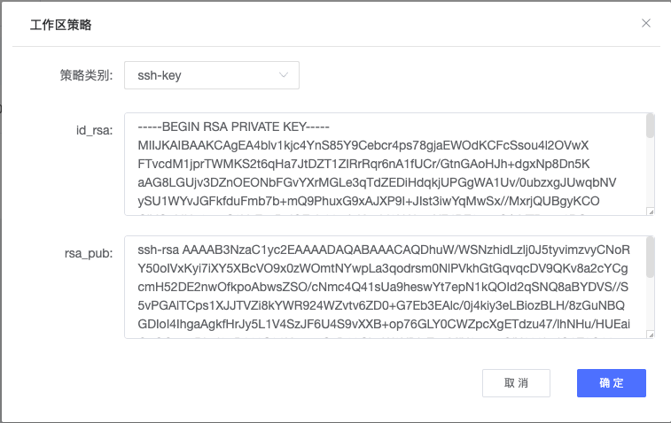

    - credentials：密码将作为访问工作区的密码或工作区smartide用户密码

    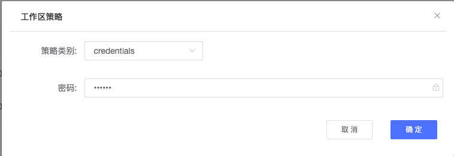

    下面，我们复制刚刚配置好的ssh-key中的rsa-pub信息到源代码仓库服务中，

    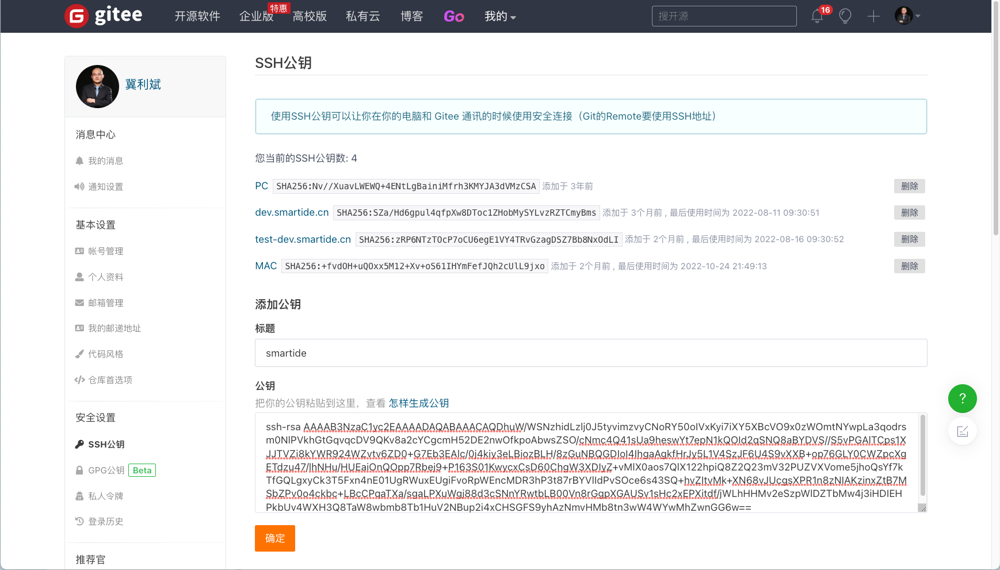

    完成以上的基础配置后，下面我们来创建开发环境。

3. 创建开发工作区

    下面，我们来创建实验的开发工作区环境，点击左侧[ 工作区管理 ]，然后点击 [ 新增工作区 ]

    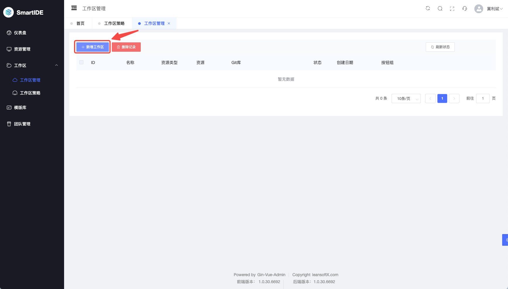

    进入新增工作区页面后，选择资源以及添加代码库地址：

    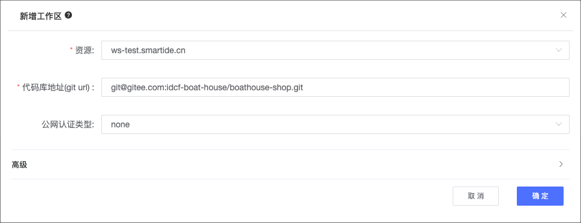

    ***注意：***
    - 资源为已为大家分配好的K8S集群
    - 代码库地址为fork的boathouse-shop代码库的**SSH URL**

    工作区创建以后，进入到工作区详情页面，工作区启动完毕后，页面如下：

    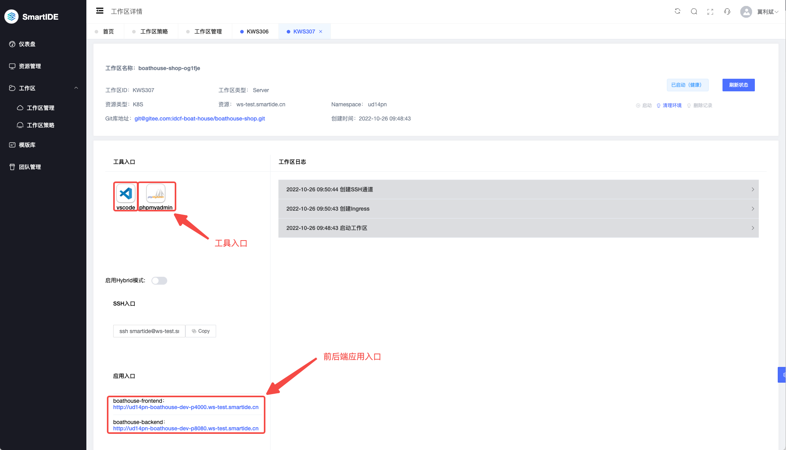

4. 打开工作区，完成开发环境自动初始化

    点击工作区详情页中的VSCode图标，打开WebIDE：

    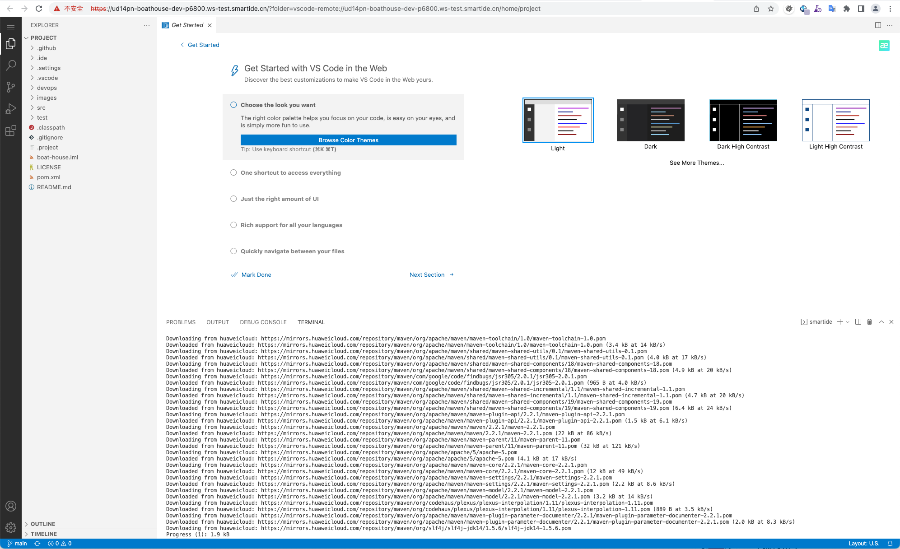

    WebIDE启动后，工具将自动触发以下动作：
    - 执行后端代码的mvn package构建
    - 安装需要的java扩展包以及docker扩展
    - 执行前端代码的npm install以及build
    - 启动项目依赖的mysql数据库，并完成初始化。并且，建立网页版的mysql客户端工具phpmyadmin

    至此，我们完成了工作区的创建，并在打开的工作区中，系统自动为我们完成了环境的初始化。

5. 环境检查

    通过SmartIDE建立的工作区初始化动作执行完毕后，会识别出JAVA PROJECTS以及MAVEN项目情况：

    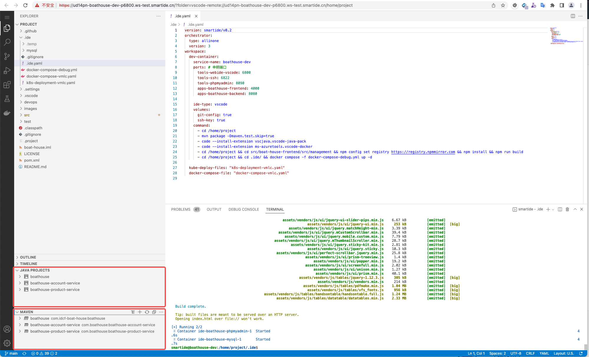

    通过查看Docker扩展，也可以看到已经启动了mysql及phpmyadmin容器：

    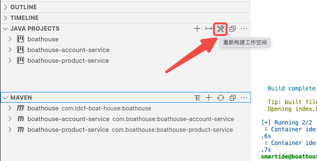

    点击工作区详情页面中的phpmyadmin图标，打开phpmyadmin进行查看：

    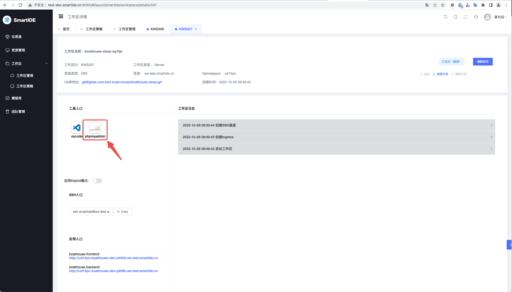

    在打开的phpmyadmin页面中，完成登录：

    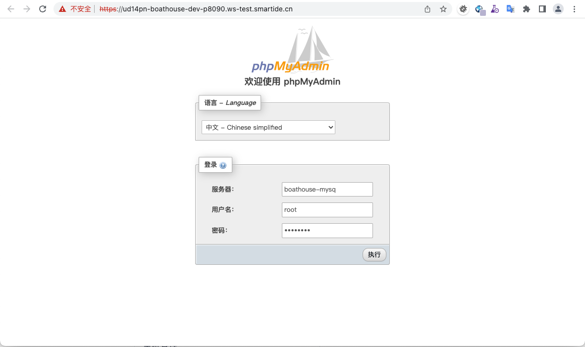

    其中填写信息来源于配置文件.ide/docker-compose-debug.yml，如图所示：

    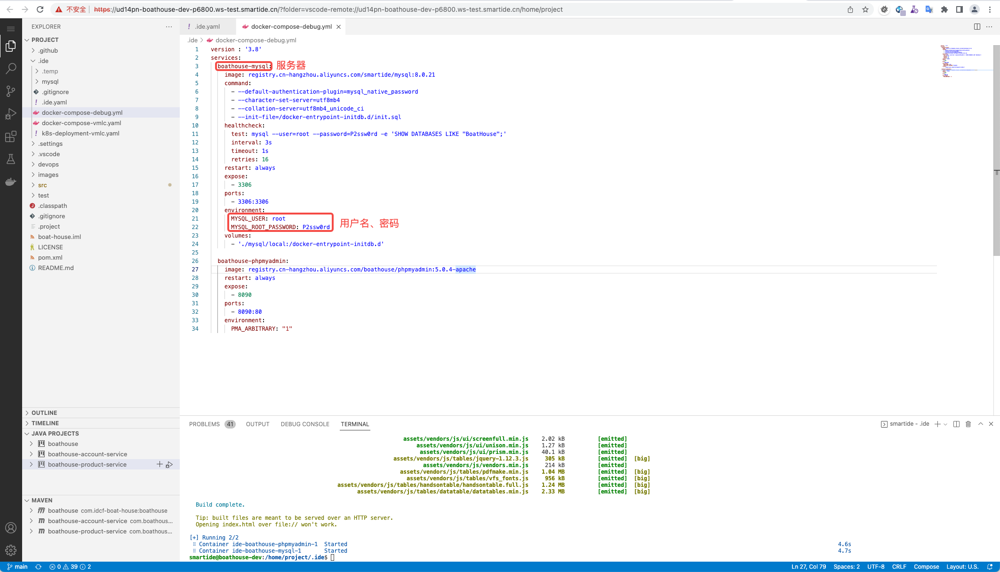

    这里可以看到BoatHouse数据库已经建立，并已经完成数据库初始化：

    

    经过查看，开发环境已准备就绪，下面我们来进行开发调试。

## Product Service 快速上手指南

### 简介

Boat House Product Service 是 ：
* Boat House 的产品后台数据服务
* 基于Spring Boot 框架开发的 RESTFUL API
* 对 Boat House 各网站提供产品数据接口，使用MySql数据库进行数据存储


### 开发环境

SmartIDE中已内置了JDK、MySQL、PhpMyAdmin等环境依赖或工具，并完成了初始化操作，无须进行任何安装配置，打开VSCode，浏览器中使用即可。

### 快速开始

首先，进行后端访问的数据库host配置：
```
## 设置root用户密码，自行设置即可，请记住此密码，建议设置为 root123
sudo passwd root
## 切换到root用户
su
## 在root用户下执行
## 添加product-service-db 映射到 127.0.0.1
echo "127.0.0.1 product-service-db" >> /etc/hosts
## 检查是否添加成功
cat /etc/hosts
## 退出 root 用户模式
exit
```
***注：后端访问数据库，引用了product-service-db的名称，通过配置host指向已初始化的本地mysql数据库***

其次，修改后端Boat House Product Service的启动配置，修改profile为dev。

***注：配置文件路径为：src/product-service/api/src/main/resources/application.properties***

***注：后端代码所在路径为：product-service***

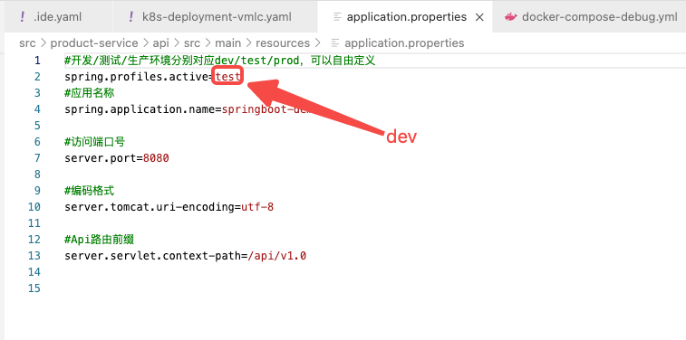

然后，点击[JAVA PROJECTS]中的[重新构建工作空间]按钮，完成工作空间的构建


运行后端Product Service，打开后端调试模式

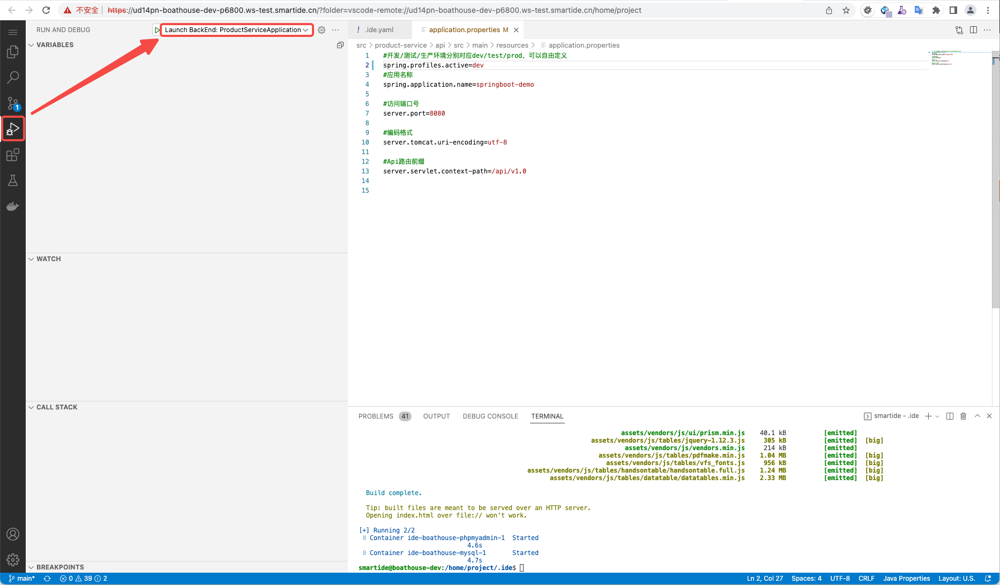

返回工作区详情页面，点击后端访问地址：

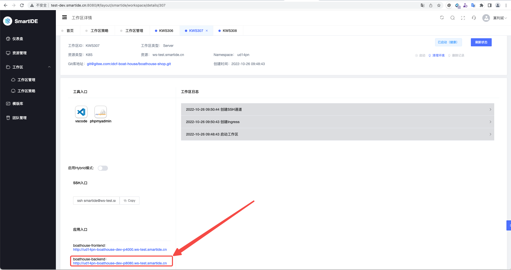

这时，可以查看到后端服务的Swagger UI（需要在打开的链接地址后输入：{boathouse-backend url}/api/v1.0/swagger-ui.html）：

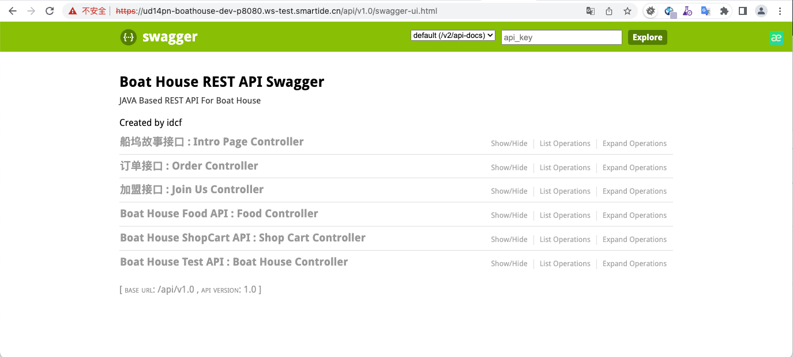

## Management Web 快速上手指南

### 简介

Boat House Management Web 是：
* Boat House 的后台管理网站
* 基于 Node JS + Express + Vue 框架开发的网站应用
* 给 Boat House 管理者提供管理整个餐厅的功能，调用 REST API 使用 统计服务/产品服务/账户服务


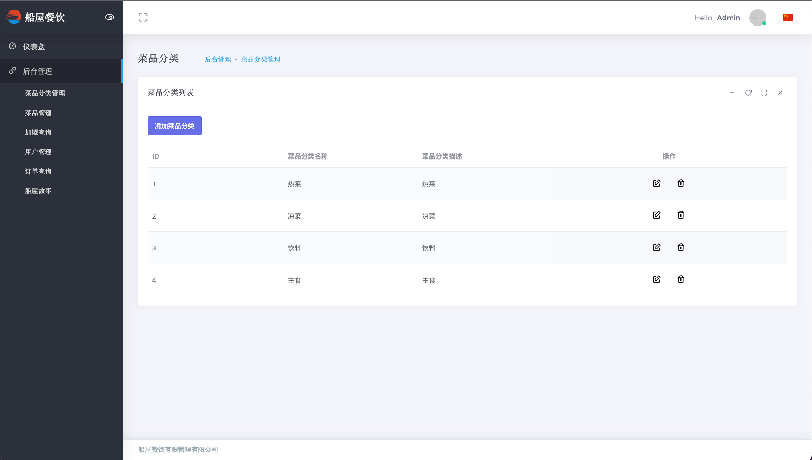

### 开发环境

SmartIDE中已内置了nodeJs，npm等工具，前端的代码调试开发也无须进行任何安装配置，在之前打开的浏览器中使用即可。

### 快速开始

工作区环境启动后，前端的npm install 及 build应用打包 操作已自动执行，现在，我们无须任何配置，只需要点击调试，即可打开前端工程的开发调试。

***注：前端代码所在路径为：src/boat-house-frontend***

点击左侧Debug工具栏，启动Debug：

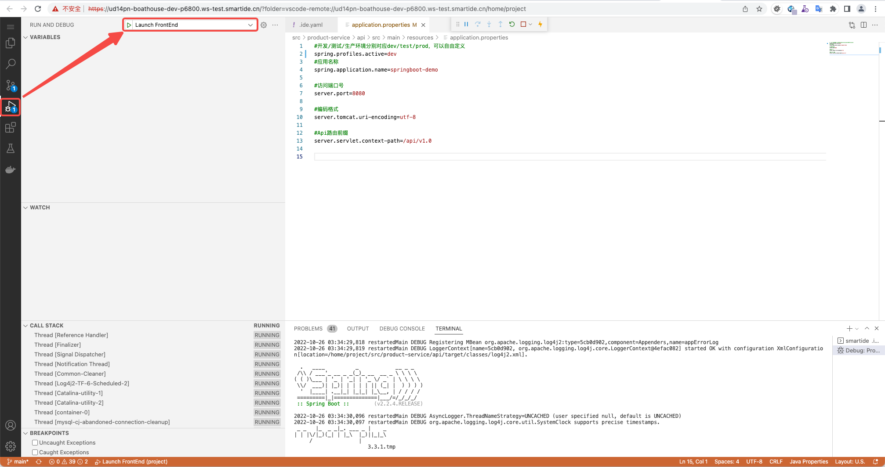

点击工作区详情页面中的前端访问地址：

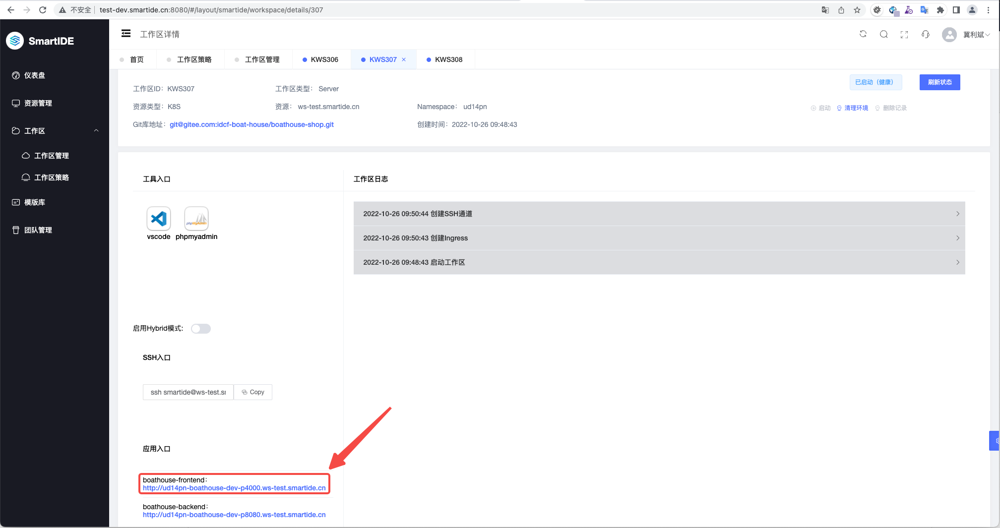

这时，可以查看到前端页面已经可以访问了：

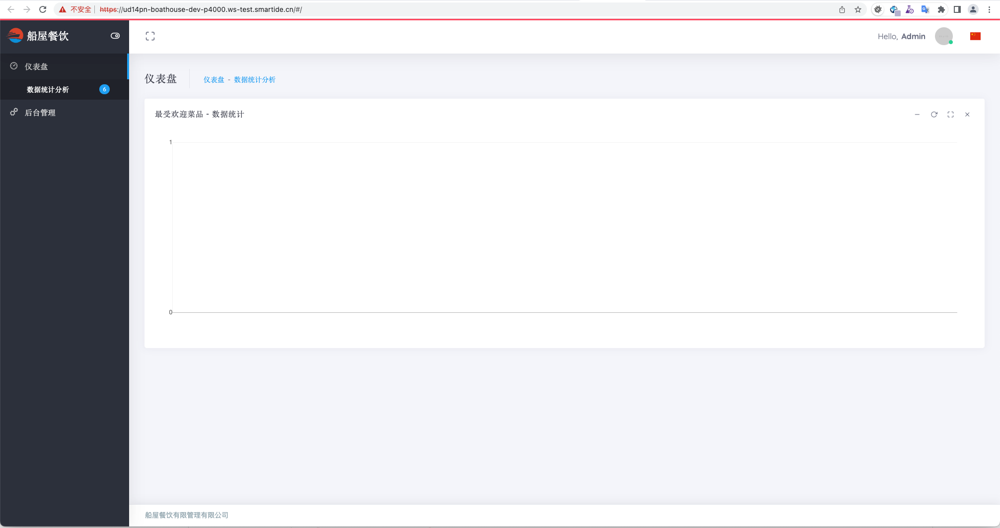

至此，我们将前后端项目都打开了调试模式：

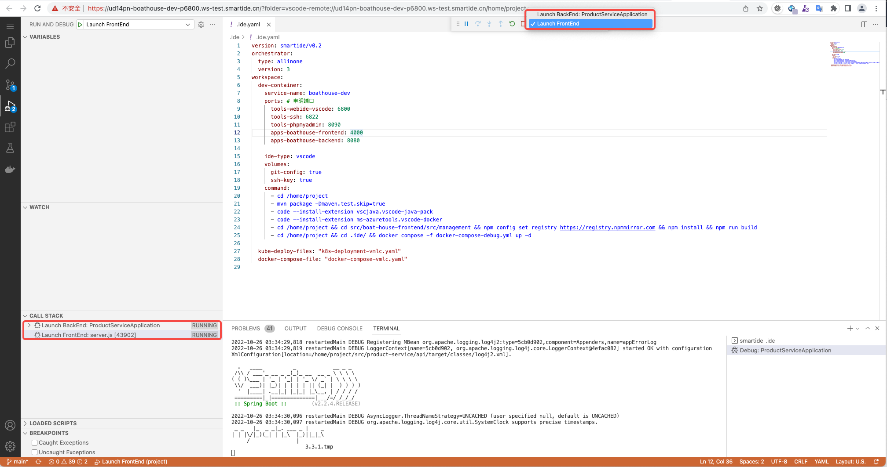

## Product Service & Management Web 跨技术栈联调指南

### 整体架构图：
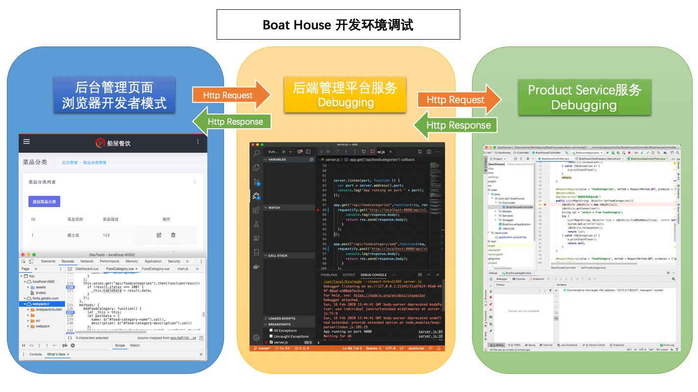

### 具体步骤
* **Product Service ：Debugging Mode**
在要调试的方法BoatHouseController.AddFoodCategory()上打断点

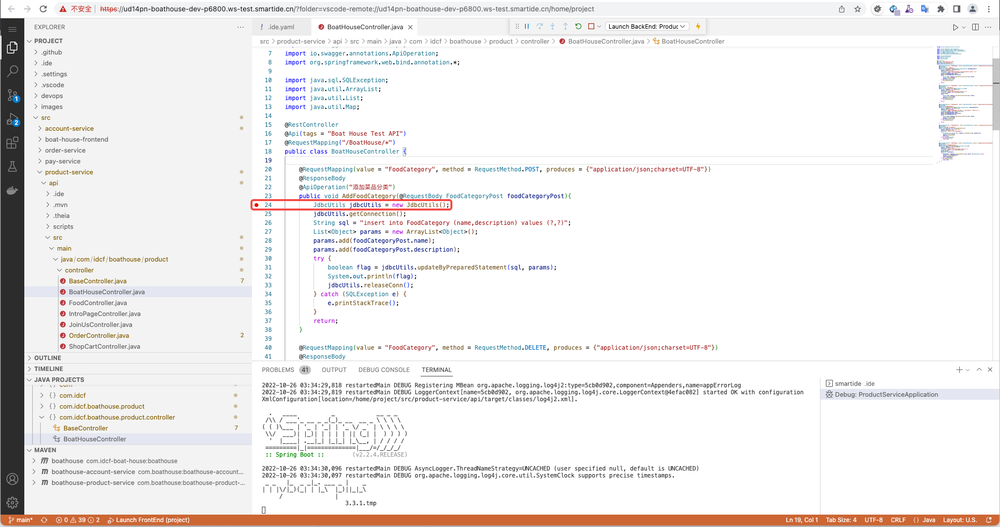

***注：文件路径：src/product-service/api/src/main/java/com/idcf/boathouse/product/controller/BoatHouseController.java***

* **Management Web 后端：Debugging Mode**
在 server.js 要调试的后台函数中打断点

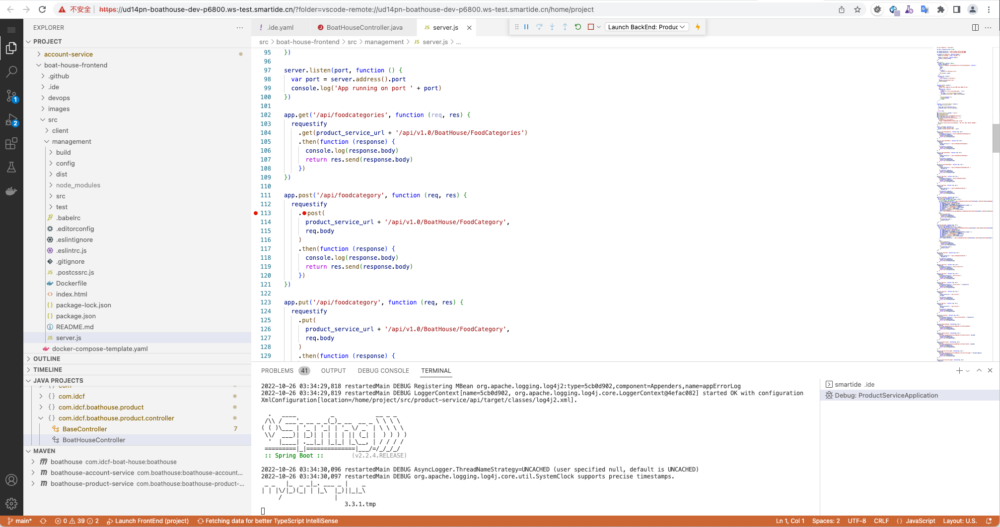

***注：文件路径：src/boat-house-frontend/src/management/server.js***

* **Management Web 前端：浏览器触发调试**

1. 打开 Boat House 后台管理网站，并打开[ 菜品分类管理 ]，点击[ 添加菜品分类 ]：

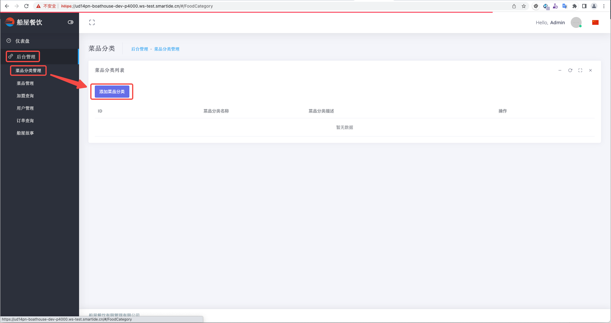

2. 添加菜品内容后，点击确定，触发调试

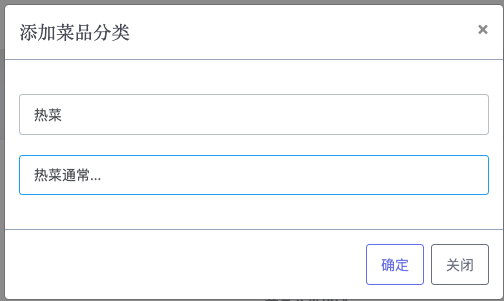

3. 首先，调试会先进入我们的前端调试断点，这时我们可以查看堆栈信息以及变量信息：

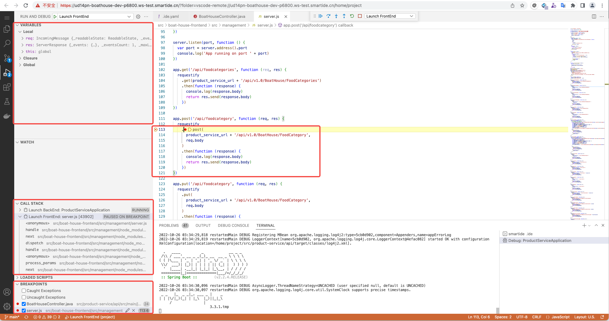

4. 点击继续运行：

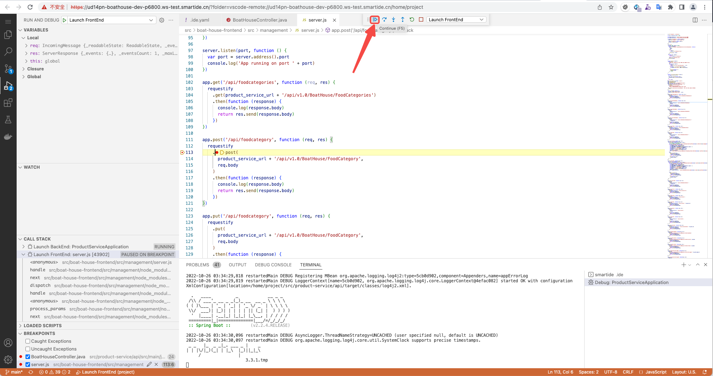

5. 调试会进入我们的后端调试断点，同时我们依然可以查看堆栈信息以及变量信息

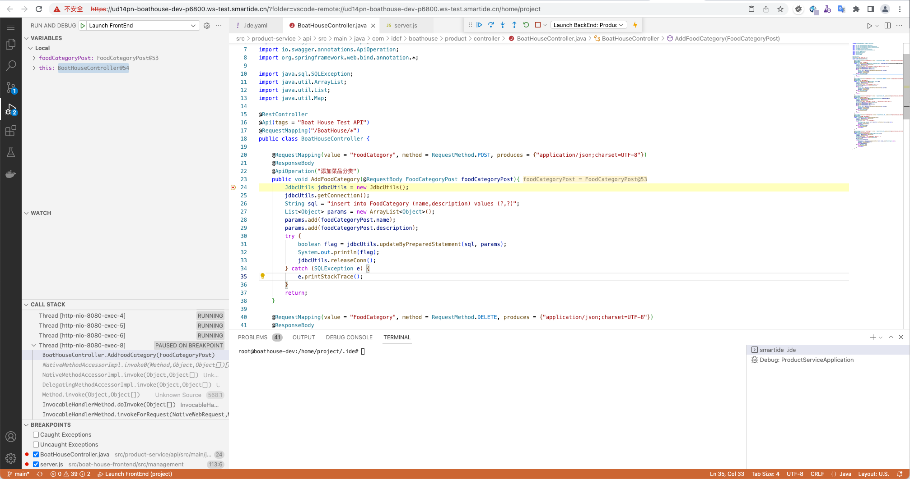

6. 再次点击继续运行，数据添加成功：

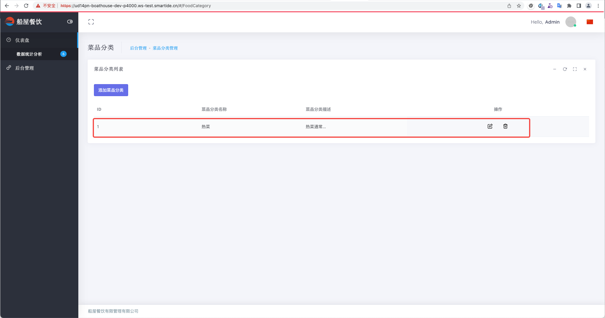

7. 至此，我们完成了前后端联调测试。

**下面，任由您继续创造发挥吧！**

**SmartIDE Up**


