# 完成Boathouse流水线搭建并部署到DEV环境

在前面的文档中，我们已经部署好Jenkins的流水线，接下来将部署Boathouse的Dev环境所使用的工作空间。
我们将会在boathouse-pipeline-vmlc资源上部署团队自己的Dev环境：

## 导入Boathouse前后端代码流水线配置

进入jenkins首页，点击进入左侧菜单栏中 **open blue ocean** 的菜单

进入后，根据提示，点击下方的按钮，创建流水线

仓库类型选择 git,如下图所示：

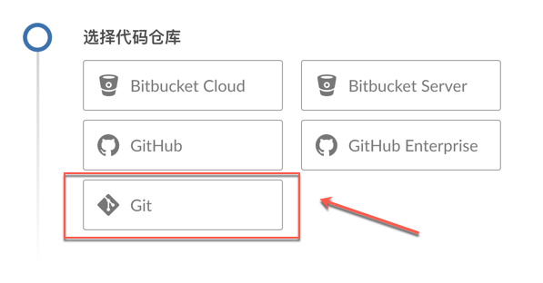

获取仓库地址，如下图所示：

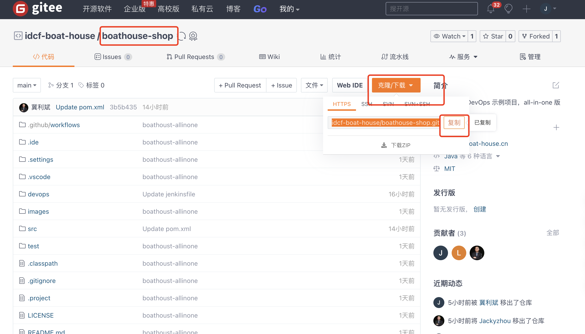  

输入boathouse-shop仓库地址，并点击创建流水线，如下图所示：

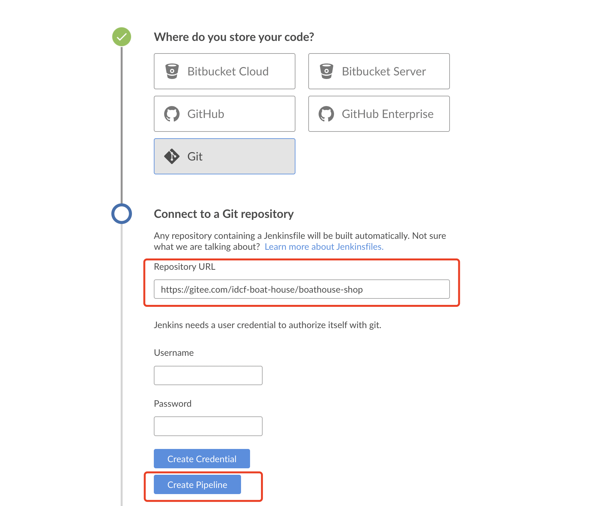  

流水线创建中

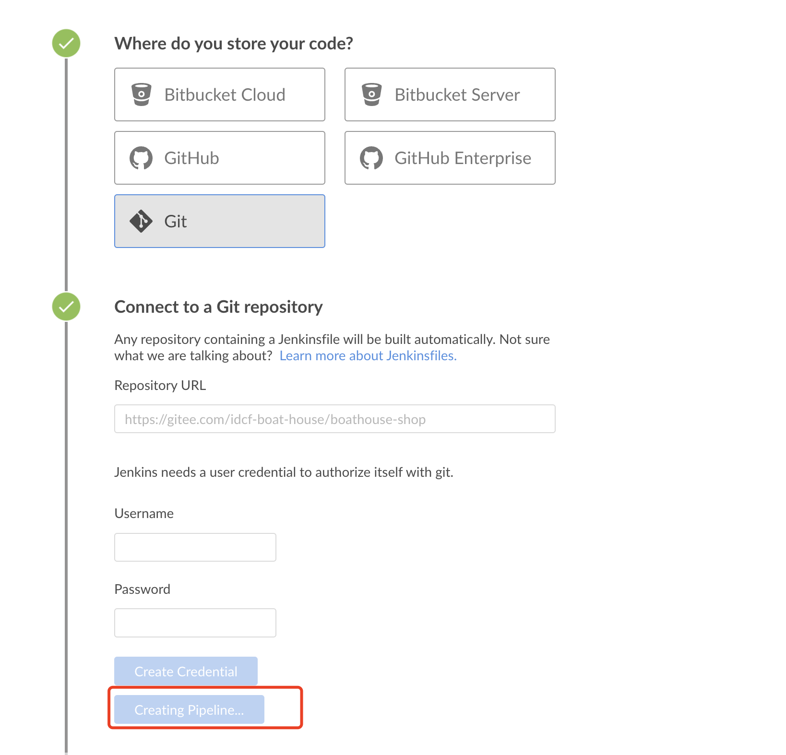  

流水线创建成功，但是会提示找不到Jenkinsfile

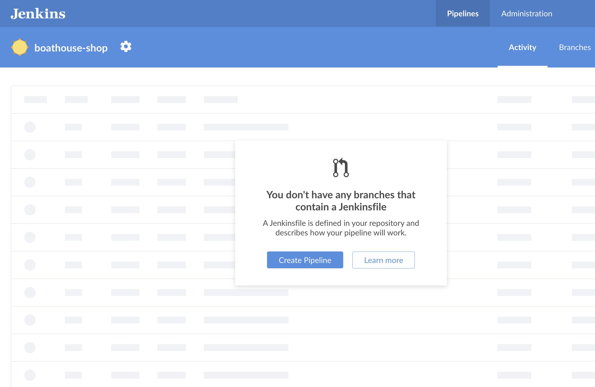  

点击配置按钮，修改jenkinsfile默认地址：

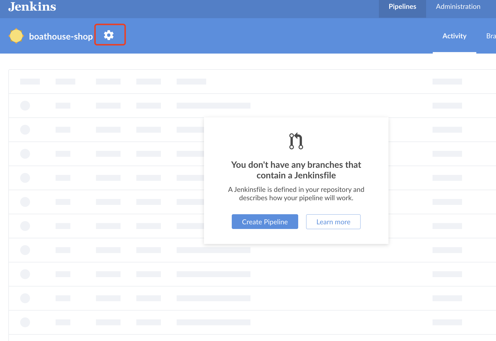  

脚本路径改为：devops/jenkins/jenkinsfile

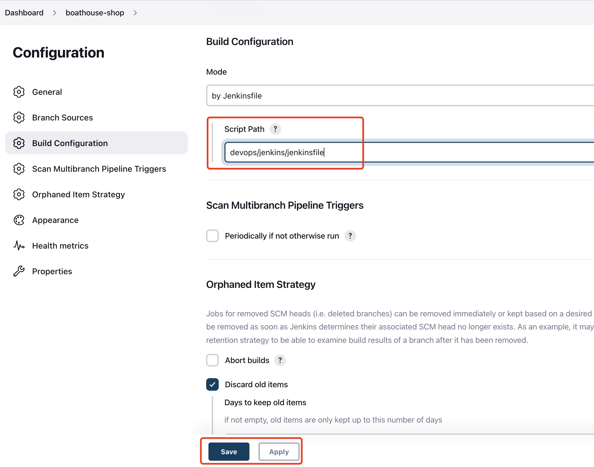  

保存后流水线自动启动，等待构建完成后查看结果

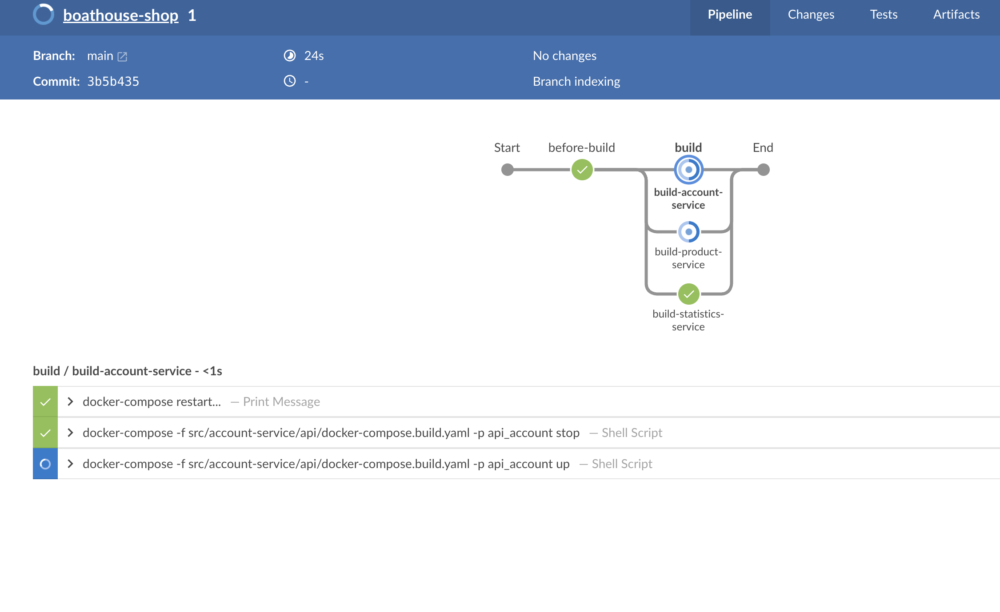  

开发环境部署完成，如下图所示：

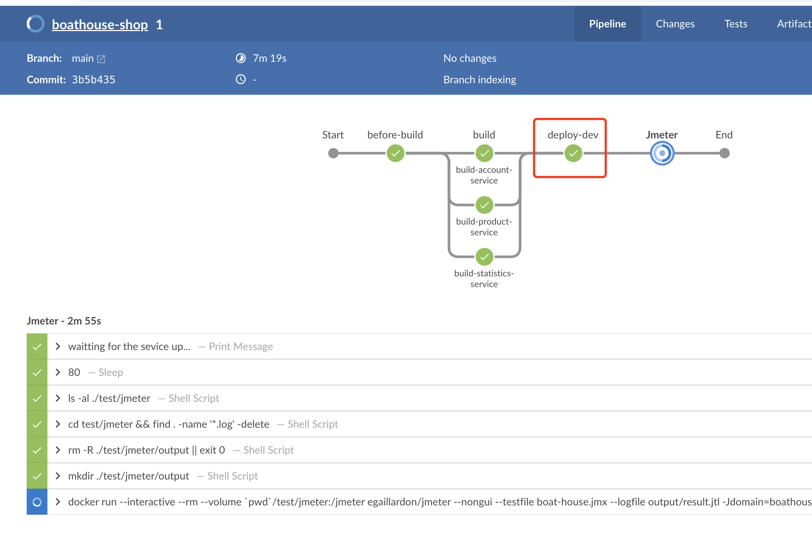  

按照同样的方式完成boathouse前端代码的流水线创建（前端代码以及后端代码都在boathouse-shop仓库，是通过不同的文件夹目录区分的）。

点击 New Pipeline

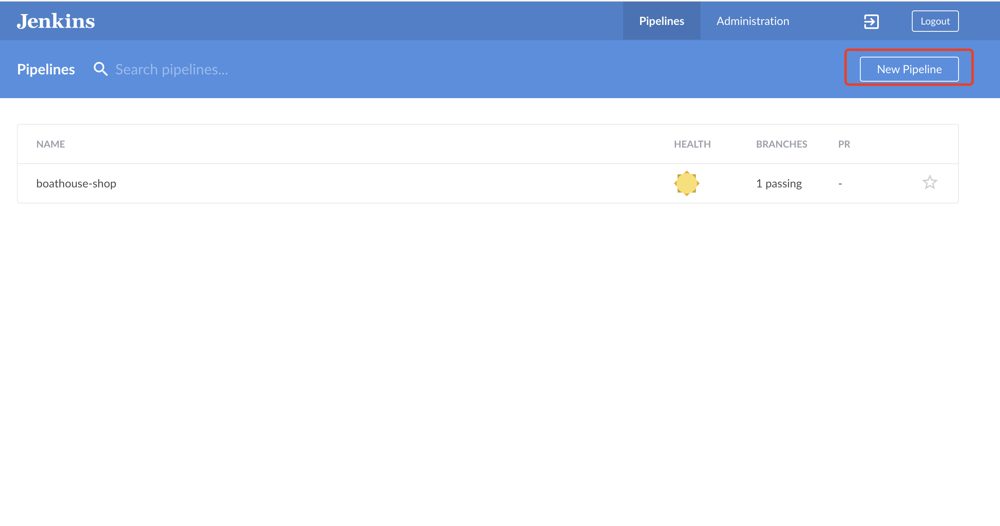  

输入同样的仓库地址，系统会自动提示流水线名称冲突，我们这里将名字改为 “boathouse-shop-frontend”，如下图所示：

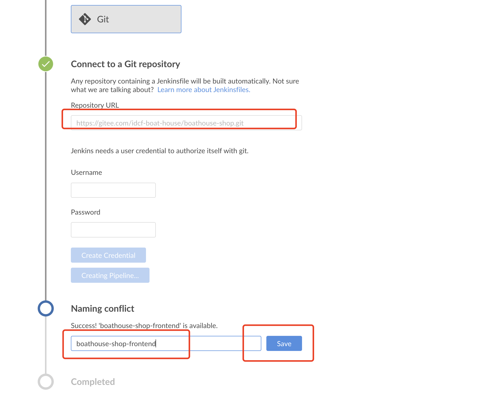  

按照同样的方式，配置前端Jenkinsfile的路径（src/boat-house-frontend/devops/jenkins/jenkinsfile），如下图所示：

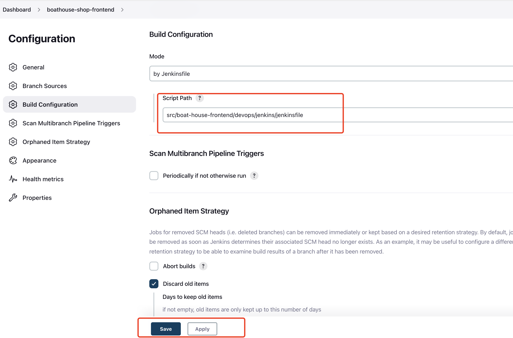  

### 查看部署结果

Dev环境部署完毕，打开以下链接，查看部署结果：
1. Client Web 
http://{vm-dev ip address}:5000

1. Management Web
http://{vm-dev ip address}:5001

1. Product Service AP Swagger UI
http://{vm-dev ip address}:7001/api/v1.0/swagger-ui.html

**注意：暂时没有提供k8s集群环境，所以大家暂时不要部署测试以及生产环境**
