# Jenkins服务器搭建

Jenkins作为Boathouse流水线的底层工具，需要通过容器来托管环境。本文档描述了如何通过SmartIDE快速搭建一套Jenkins的运行环境。


## 1. 创建Boathouse流水线工作区

登录到 SmartIDE Sever - http://dev.smartide.cn

点击工作区 ｜ 工作区管理 ｜ 新增工作区，并输入Fork的boathouse-shop-pipeline代码库地址，如下图所示：

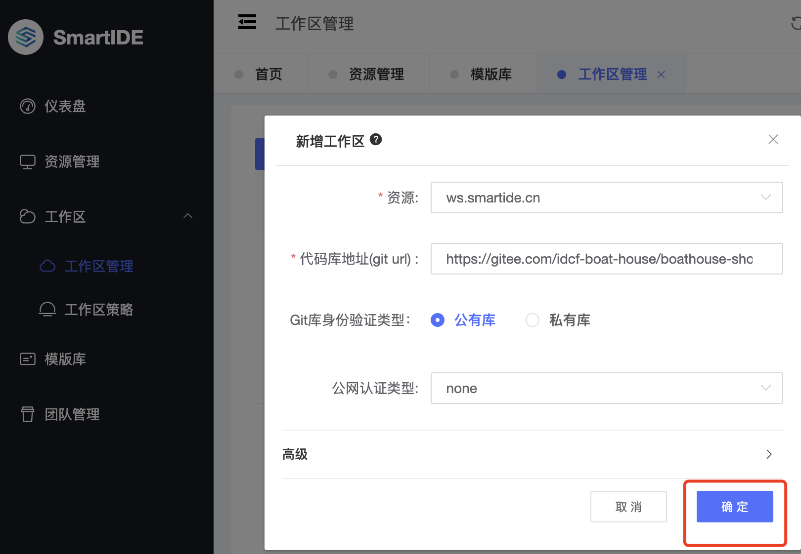  

点击 确定 后，SmartIDE 会开始自动创建流水线环境，等待工作区详情页显示出以下状态，即可点击 VSCode 图标进入工作区操作。

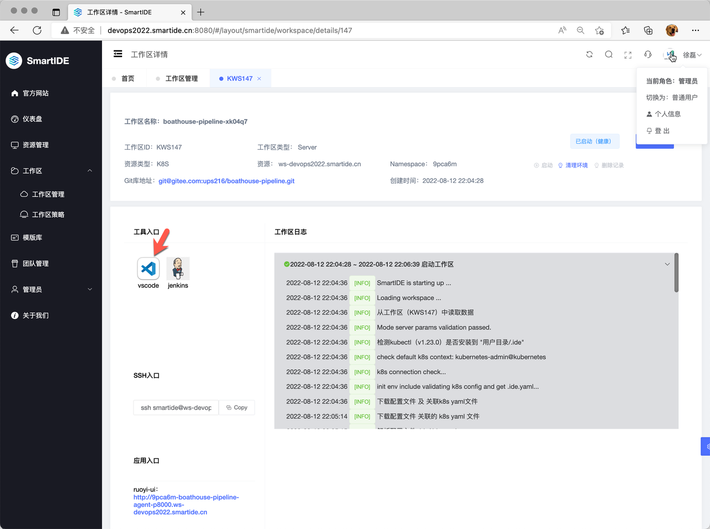  


## 2. 创建Jenkins服务器

进入 VSCode WebIDE 后，系统会自动安装docker插件，然后你可以展开左侧的 文件列表，找到 /jenkins/docker-compose.yml 文件，右键点击选择 Compose Up 选项，即可启动 Jenkins 服务器。

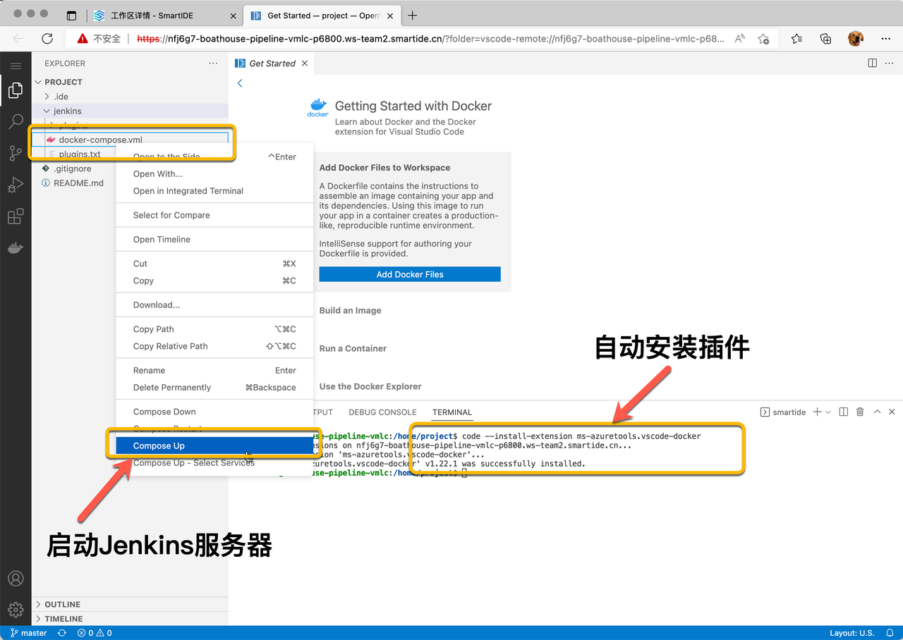  

Compose Up 启动完毕

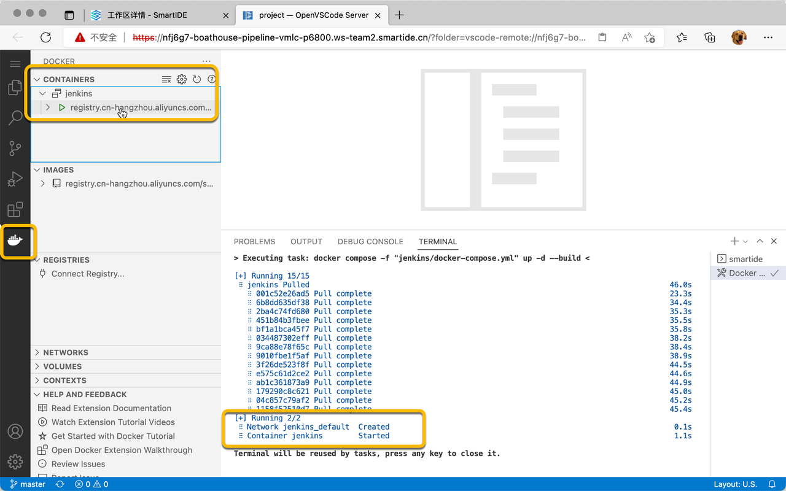  

现在可以通过点击 工作区详情页 上的 Jenkins 图标打开 Jenkins服务器。

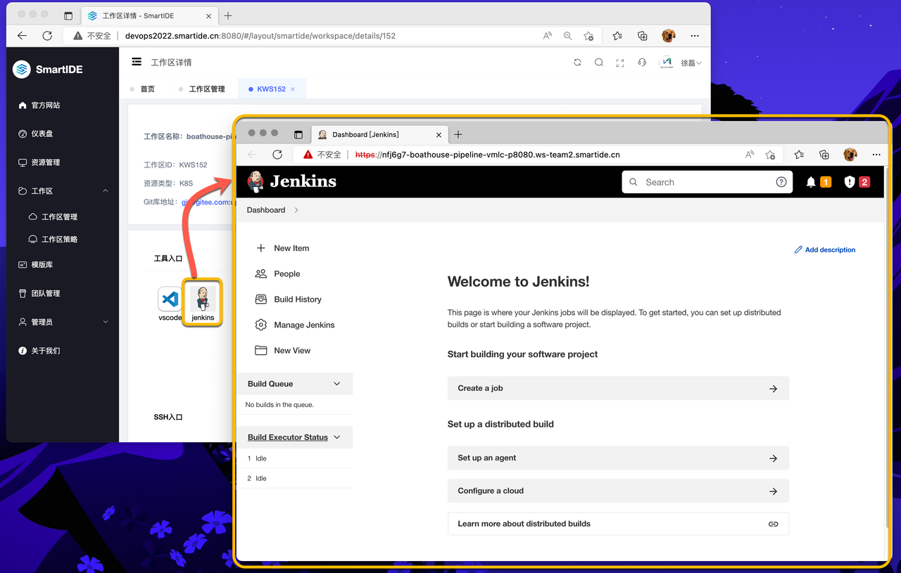  

### 3. 为Jenkins服务器导入所需插件

Jenkins依赖各种插件完成操作，因为网络原因直接下载插件并不稳定，因此我们在 Boathouse-Pipeline 代码仓中直接提供了下载好的插件，请使用以下脚本导入插件。

```
## 复制 插件到 Jenkins 服务器运行目录
sudo cp -r /home/project/jenkins/plugins /home/smartide/jenkins/jenkins_home/
```

完成以上操作后，通过 Docker 控制台重新启动 Jenkins 服务器。

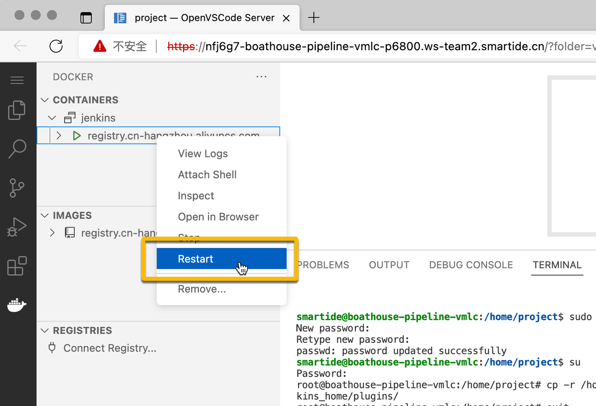  

Jenkins 重新启动中

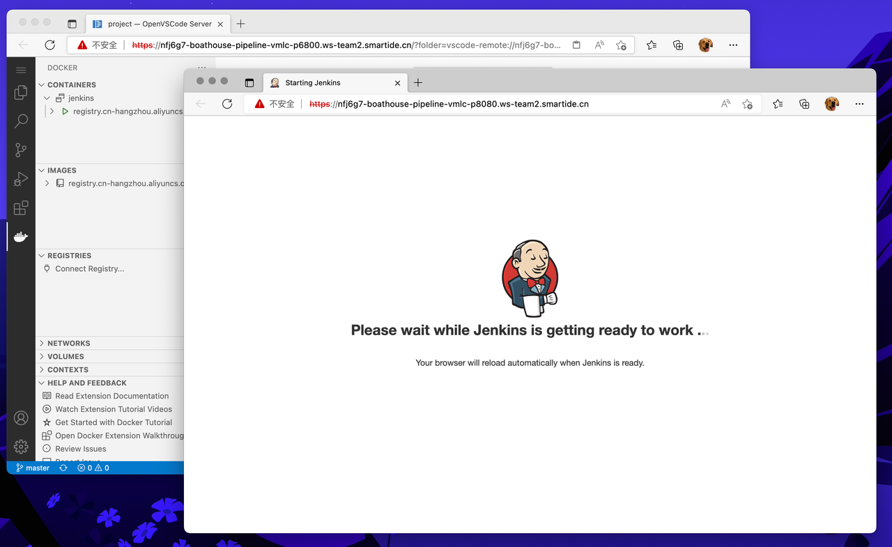  


### 4. Jenkins初始化配置

点击 Manage Jenkins | configureSecurity，如下图所示：

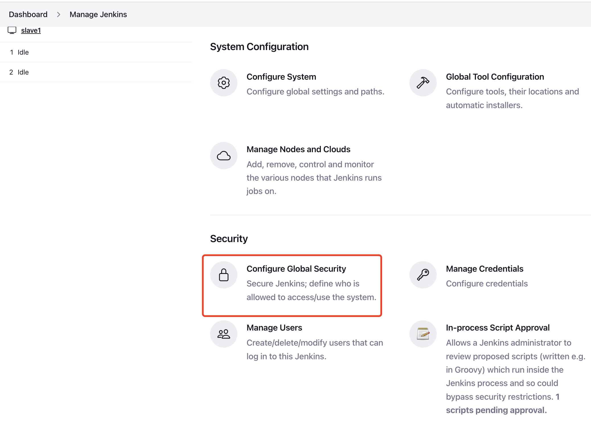  

选择 Agent，点击Disable，以及CSPF Protection ｜ Enable proxy compatibility，如下图所示：

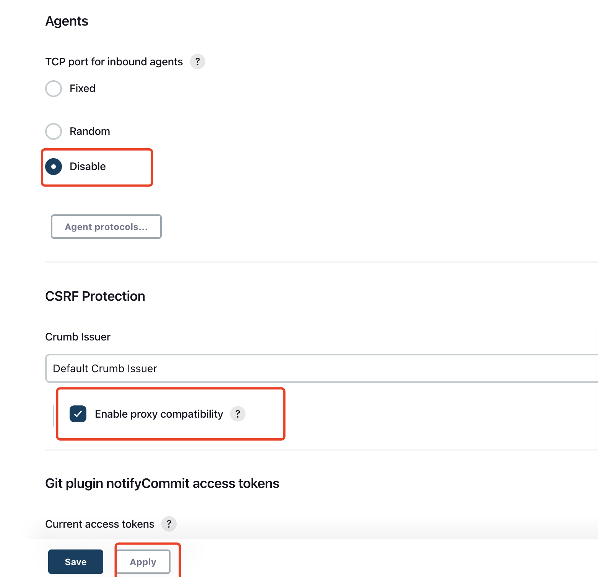  

打开Jenkins认证，Security Realm 选择 Jenkins's own user database, Authorization 选择Anyone can do anything, 最后点击Apply && Save

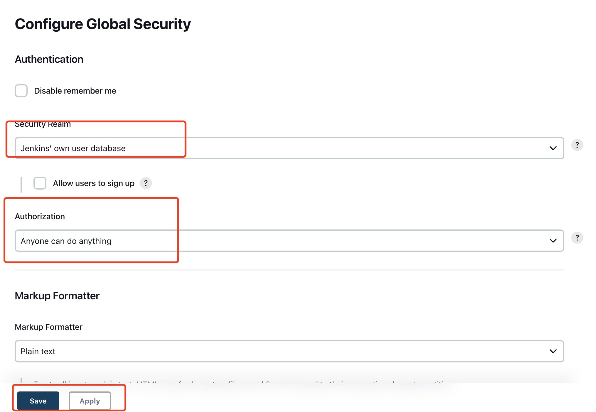  


### 5. 为Jenkins服务器添加代理节点

我们的工作区中存在另外一个叫做 boathouse-pipeline-agent 的环境，我们将使用这个环境作为 Jenkins 服务器的工作节点，为了操作这个环境，我们可以使用以下ssh指令远程进入:

```
ssh smartide@boathouse-pipeline-agent -p 6822
```

注意：登录之后的terminal状态切换为：smartide@boathouse-pipeline-agent 

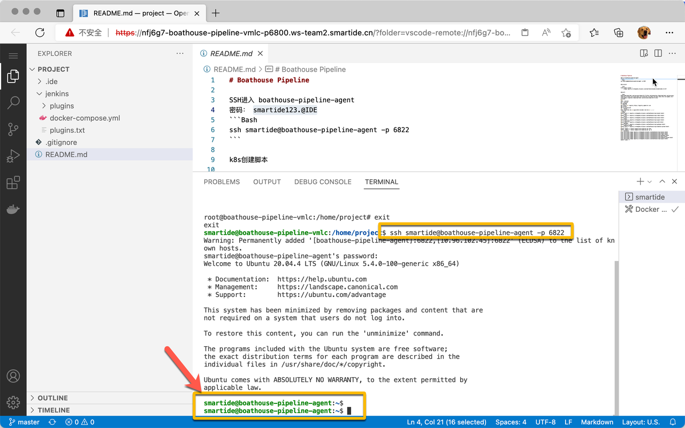  

进入到 boathouse-pipeline-agent 后，我们创建一个 Jenkins的工作目录，/home/smartide/jenkins_workspace

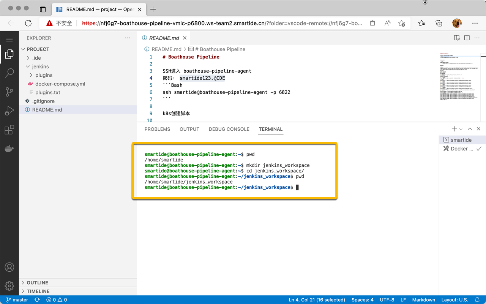  


### Jenkins 配置
Jenkins流水线中的各个任务的运行需要跑在一台代理机上，因此我们需要给Jenkins添加构建节点。
在本示例中将使用本机同时作为 Jenkins VM 作为代理机。


### 代理机安装JDK
```
sudo apt-get install openjdk-8-jdk
java -version
```

### 安装Maven

```
sudo apt install maven
```


### 代理机创建Jenkins工作目录, 并创建文件确保目录在非sudo下可写
  ```
  mkdir jenkins_workspace
  cd jenkins_workspace
  touch test
  ls
  ```


### Jenkins添加构建节点
1. 在jenkins管理界面进行节点管理，**Manage Jenkins**


1. 点击 **Manage Nodes** 

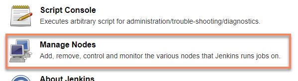

1. 点击  ** New Node**


1. 按照下图输入代理名称并勾选**Permanent Agent**，然后点击 **OK**


1. 在创建节点界面输入参数:
    | 参数名 | 参数值 |
    |--|--|
    | # of executors | 1 |
    | Remote root directory	 | /home/smartide/jenkins_workspace |
    | Labels | vm-slave (此处很关键，后面JenkinFile流水线文件中会根据此label选取代理机) |
    | Launch method | Launch agents via SSH |
    | Host | boathouse-pipeline-agent |
    | Host Key Verification Strategy | Non verifying Verification Strategy |

1. 创建链接到salve的认证


1. 在认证编辑界面输入参数：
    | 参数名 | 参数值 |
    |--|--|
    | Username | smartide |
    | Password | root123 |
    | ID | vm-slave |
    | Description | vm-slave |

1. 然后点击 **Add**


1. 返回节点编辑界面后，选择刚才新建的认证


1. 完成节点编辑，点击**Sava**

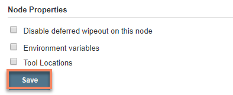

1. 回到列表页面后启动节点


1. 按照下图手动点击启动节点


1. slave正常启动


1. 回到节点列表


1. 节点显示正常


