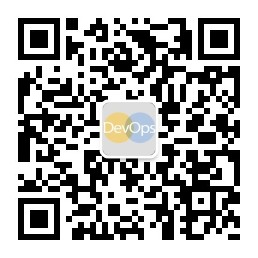
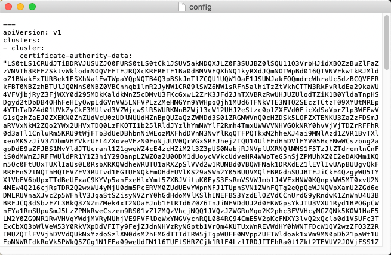

# Boathouse K8S (Test & Prod) 环境部署

在前面的文档中，我们已经部署好 Jenkins 的流水线，并成功的部署了 Boathouse 的 Dev 环境。
接下来，我们会使用已分配给团队的K8S环境部署 Boathouse 的 Test & Prod 环境.

## 配置 K8s 集群 & Jenkins 凭据

前提条件：安装Kubectl工具：

- 官网下载下载地址: https://kubernetes.io/docs/tasks/tools/install-kubectl/
- Windows kubectl.exe 下载地址: https://dl.k8s.io/release/v1.21.0/bin/windows/amd64/kubectl.exe
- MacOS/Linux: 下载并解压，执行以下命令完成配置

    ```shell
    curl -LO "https://dl.k8s.io/release/$(curl -L -s https://dl.k8s.io/release/stable.txt)/bin/linux/amd64/kubectl"
    chmod +x ./kubectl
    sudo mv ./kubectl /usr/local/bin/kubectl
    ```

注意：如果以上安装地址出现无法访问的情况，请通过【Boathouse资源网盘】下载kubectl工具，下载方式如下

获取方式：扫描二维码，关注DevOps公众号，输入：boathouse训练营 即可获取网盘连接和密码



1. 获取k8s密钥文件

此文件包含连接k8s集群的密钥信息，一般讲师会通过 teamXXX.kubeconfig 文件形式发送给各个团队。此文件需要被放置于当前登录用户默认文件夹下面的.kube目录中，如果此目录不存在，可以自行创建

进入 .kube 文件夹中，创建或者使用现有的config文件，默认情况下kubectl工具会读取这个目录下的config文件作为自己的配置文件。

我们需要替换此文件的内容为 teamXXX.kubeconfig 文件的内容


2. 如果需要使用以上K8s Config登陆集群，可以在安装kubectl的环境中当前用户目录中创建 .kube 文件夹，并在此文件夹下创建 Config 文件，并将以上复制的内容保存到这个文件中



使用替换文件或修改文件内容的方式修改.kube下的config。

3. 保存完毕后运行命令，查看连接情况：

```shell
kubectl get pods -n kube-system
```


4. 创建 test & prod 命名空间

- 用于Jenkins流水线部署的命令空间：

```shell
kubectl create namespace boathouse-test
kubectl create namespace boathouse-prod
```


    
   
5. 为命名空间创建 docker-registry-secrets

> 镜像仓库的用户名和密钥可以通过 [DevOps实验室](https://labs.devcloudx.com) 中的环境信息页面获取，或者讲师直接提供。

- 用于Jenkins流水线部署

```shell
## [docker registry url] 是容器镜像服务ACR的地址
## [username] 是容器镜像服务ACR的用户名
## [password] 是容器镜像服务ACR的密码
kubectl create secret docker-registry regcred --docker-server=[docker registry url] --docker-username=[username] --docker-password=[password] --docker-email=info@idcf.io -n boathouse-test
kubectl create secret docker-registry regcred --docker-server=[docker registry url] --docker-username=[username] --docker-password=[password] --docker-email=info@idcf.io -n boathouse-prod
```
    
6. Jenkins 添加 Kubeconfig 凭据,ID需为'creds-test-k8s'，找到kube config文件，将里面的所有内容复制到content中

Jenkins流水线使用 Kubernetes Continues Deploy 插件完成k8s部署，此插件需要一个叫做 creds-test-k8s 的凭据以便可以获取k8s的访问密钥。
    


注意：ID 字段同我们的 K8s 部署 yaml 对应，以此默认需要写为 creds-test-k8s

**重要提示：** 当前的k8s环境部署脚本存在一个缺陷，在部署完成后端系统后不会自动创建所需要的数据库实例，这会造成后台api工作不正常。请参考一下 issue 中的说明暂时性修复此问题 https://github.com/idcf-boat-house/boat-house-backend/issues/1

如果无法访问github.com请参考一下截图


至此，Jenkins 和 K8s 的集群配置就完毕了。

## 触发流水线完成测试环境和生产环境部署

### 部署测试环境

代码仓库的yaml文件提交完毕，接下来我们开始进行Jenkins流水线的部署。

1. 打开Jenkins流水线，点击分支重新启动流水线


2. Dev环境部署完毕后，点击同意部署到测试环境


3. 等待测试环境部署完毕，可以看到该步骤执行成功


4. 回到命令行，查看测试环境命名空间下的 pods
    ```
    kubectl get pods -n boathouse-test
    ```
    可以看到测试环境已经部署成功

    

6. 运行以下命令，查看测试环境的 services 列表
    
    ```
    kubectl get services -n boathouse-test
    ```

    
    
    上图中，我们可以看到 client, management, product-service-api 服务均已经启动，外部 IP 地址和端口号也已经可以看到

7. 访问各服务的 IP地址和端口号对应的网站，可以看到环境已经成功在运行中

Client: http://[client-serivce-ip]:[port]


Management: http://[management-serivce-ip]:[port]


Product Service Swagger API: http://[product-serivce-api-ip]:[port]/api/v1.0/swagger-ui.html


### 部署生产环境

1. 打开Jenkins流水线，点击同意部署到生产环境

1. 等待生产环境部署完毕，可以看到该步骤执行成功

1. 回到命令行，查看生产环境命名空间下的 pods
    ```
    kubectl get pods -n boathouse-prod
    ```
    可以看到生产环境已经部署成功
    
1. 查看生产环境 Services
    ```
    kubectl get services -n boathouse-prod
    ```
    
1. 访问生产环境网站


